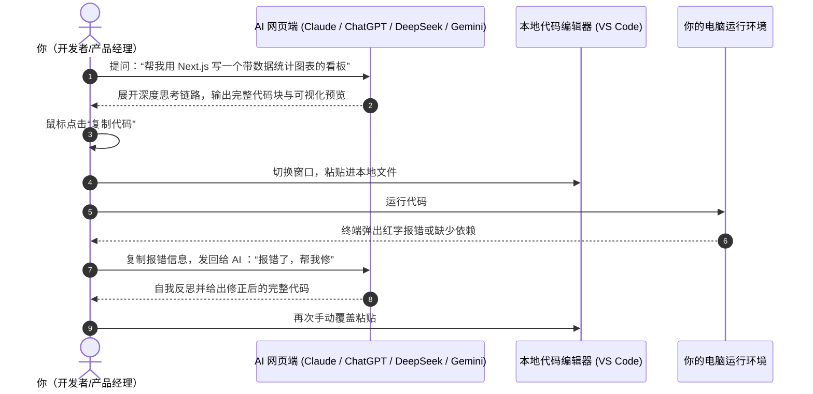

# 1.2 AI 网页对话时代：人肉搬运工与上下文割裂

> 就像找了个顶尖的线上外包技术顾问，你用人话提需求，它秒出完整代码；但你得自己充当“人肉搬运工”，在网页和代码编辑器之间不停复制、粘贴、查报错。

---

## 💬 网页对话是怎么写代码的？

从 OpenAI 开启大模型时代起，大语言模型（LLM）的智商和写代码能力经历了指数级狂飙。

现在的网页端 AI（如 [Anthropic Claude](https://claude.ai)、[OpenAI ChatGPT](https://chatgpt.com)、[DeepSeek](https://www.deepseek.com)、[Google Gemini](https://gemini.google.com)）不仅能写出规范的代码，还普遍配备了**自主深度思考（Extended Thinking / Reasoning）**与**实时可视化预览**功能。

在这个阶段，最经典的写代码工作流是这样的：

---

## 🌟 2026 前沿主流大模型战力盘点与官网

现在的网页端大模型写代码能力已经全面进入**“推理思考时代（Reasoning Era）”**：

| 平台与模型家族 | 官网链接 | 核心杀手锏与开发特色 |
| :--- | :--- | :--- |
| **Anthropic Claude** *(Claude 5 系列 )* | [https://claude.ai](https://claude.ai) | **编程实力全球公认天花板**。首创“混合可控思考（Hybrid Thinking）”，写复杂算法和系统架构极度严谨；自带 Artifacts 可以在右侧直接实时渲染前端网页与 SVG 动效。 |
| **OpenAI ChatGPT** *(GPT-5.6 )* | [https://chatgpt.com](https://chatgpt.com) | **生态最成熟、多模态全能**。支持 Canvas 交互式代码画布，可以直接在网页上针对局部代码划线修改，具备极强的逻辑推理与端到端 Agent 规划能力。 |
| **DeepSeek (深度求索)** *(DeepSeek V4)* | [https://www.deepseek.com](https://www.deepseek.com) | **高性价比与开源推理标杆**。新一代 V4-Flash/Pro 在终端编程基准测试中表现极其强悍，原生长链逻辑思考，极少出现低级语法失误，且对开发者完全友好开放。 |
| **Google Gemini** *(Gemini 3.7 Flash)* | [https://gemini.google.com](https://gemini.google.com) | **超长上下文与极致速度**。支持高达 100 万~200 万 Token 上下文，支持动态调节思考深度（Tunable Thinking Levels），能一口气吃下整个项目的所有历史文档或几十万行代码库。 |

---

## 🎉 为什么网页端 AI 让人大呼“真香”？

1. **不需要死记任何语法**：
   - 哪怕零基础，只要能用自然语言把逻辑说清楚（“如果金额大于 1000 就打八折，否则原价”），AI 就能写出地道的代码。
2. **深度推理把关复杂逻辑**：
   - 开启思考模式后，AI 在下笔写代码前会先在后台“打草稿”，推导边界用例、考虑并发和异常处理，大幅减少了低级 Bug。
3. **极速学习与答疑**：
   - 看到看不懂的技术名词，直接问：“用小学生能听懂的话解释一下这段代码”，它能秒出通俗易懂的解答。

---

## 😩 为什么纯靠网页写项目依然不够过瘾？（核心痛点）

虽然网页端模型智商极高，但在处理中大型真实项目时，依然存在天然局限：

### 1. “人肉搬运工”的切屏疲劳（Copy-Paste Fatigue）
- 当项目有 5~10 个关联文件时，你需要在浏览器和 VS Code 之间来回切屏几十次，全选、复制、粘贴、保存，手指和眼睛非常疲劳。

### 2. 上下文割裂（看不见你的本地全局工程）
- 网页 AI **无法实时读取你的本地整个目录树**。它不知道你昨天在另一个文件里写的全局变量叫什么，容易写出命名冲突或版本不兼容的代码。
- 经常为了节约篇幅，在代码中间留下 `// ... 其余代码保持不变 ...`，新手一不小心粘错位置就会破坏整个文件。

### 3. 没有“手和脚”，无法替你跑命令
- 网页端 AI 只能把代码吐在屏幕上，它**没办法直接替你打开终端跑 `npm install`、跑单元测试**，更没办法在报错时当场自己修复。

---

正是为了彻底消灭“复制粘贴搬运工”的烦恼，把 AI 的手脚直接延伸进代码仓库，**AI 插件**与 **自主 Agent** 时代应运而生！
