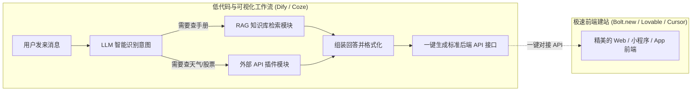

# 1.5 低代码与 AI 建站平台：搭积木与动动嘴出 App

> 不是所有功能都必须打开编辑器一行行写。低代码平台把 AI 逻辑变成了“可视化拖拽积木”，而新一代 AI 建站神器更是让你只要在浏览器里描述一句话，几分钟内一个带数据库、带登录界面的完整网站就直接跑起来了！

---

## 🧩 为什么“搭积木”和“全自动建站”是 Vibe Coding 的秘密武器？

很多人觉得：“我是来学编程的，为什么还要了解低代码？”

在真实的现代开发中，**真正聪明的高手从不盲目死磕手写所有底层代码**：
1. **复杂的后台 AI 逻辑（比如搜索公司内部知识库、调用天气 API、根据情绪分流）**：用 [Dify](https://dify.ai) 画布拖几块积木 5 分钟就配好了，如果自己用 Python 从头写，可能要折腾一整周；
2. **快速验证一个产品点子（比如做一个账单管理 App）**：用 [Bolt.new](https://bolt.new) 或 [Lovable.dev](https://lovable.dev) 输入几句话，浏览器当场就能把可点击交互的完整全栈网页生成出来！

---

## 🌟 2025/2026 最火的两大派系神器与官网

### 第一派系：可视化工作流与 Agent 编排平台（擅长搞定复杂后端业务）

#### 1. [Dify.ai](https://dify.ai)
- **官网**: [https://dify.ai](https://dify.ai) | **GitHub**: [https://github.com/langgenius/dify](https://github.com/langgenius/dify)
- **大白话介绍**: 目前全球最火的开源大模型应用开发底座。
- **能帮你做什么**:
  - 用类似脑图的连线画布，把大模型、知识库文档、条件判断、代码片段串联成完整工作流；
  - 配套了极强的“知识库（RAG）”功能，把几十份 PDF 丢进去，自动解析并精准检索；
  - 编排好之后，一键点亮就能生成一个对外的标准 API 接口供前端调用。

#### 2. [Coze (扣子)](https://www.coze.com)
- **海外官网**: [https://www.coze.com](https://www.coze.com) | **国内官网**: [https://www.coze.cn](https://www.coze.cn)
- **开发商**: 字节跳动（ByteDance）
- **大白话介绍**: 零门槛的 AI Bot 与智能体开发平台。
- **能帮你做什么**:
  - 内置了海量的官方现成插件（高德地图、必应搜索、飞书办公、小红书等）；
  - 拖拽做好的机器人，一键就能发布到微信公众号、飞书、Discord、Telegram。

#### 3. [Langflow](https://www.langflow.org) & [Flowise](https://flowiseai.com)
- **Langflow 官网**: [https://www.langflow.org](https://www.langflow.org)
- **Flowise 官网**: [https://flowiseai.com](https://flowiseai.com)
- **特点**: 面向开发者的开源连线工具，画布上的每个节点都可以直接导出为 Python 或 TypeScript 代码，自由度极高。

---

### 第二派系：浏览器内即时生成全栈 App（小白与独立开发者神物）

#### 1. [Bolt.new](https://bolt.new)
- **官网**: [https://bolt.new](https://bolt.new)
- **大白话介绍**: 由 StackBlitz 打造的“浏览器内即时全栈开发神仙工具”。
- **杀手锏**: 甚至不需要在电脑上安装 Node.js 和环境，在网页聊天框里打字：“帮我做一个类似 Notion 的看板任务管理软件”，它会在几分钟内全自动装依赖、写代码，并在右侧实时渲染出可点击、可交互的完整 Web 页面！

#### 2. [Lovable.dev](https://lovable.dev)
- **官网**: [https://lovable.dev](https://lovable.dev)
- **大白话介绍**: 专为快速做出可上线赚钱的 MVP（最小可行性产品）设计的 AI App Builder。
- **杀手锏**: 动嘴描述需求，它能直接帮你把前端界面、Supabase 数据库存储、用户登录注册逻辑全部打通，支持一键导出到 GitHub。

#### 3. [v0.dev (by Vercel)](https://v0.dev)
- **官网**: [https://v0.dev](https://v0.dev)
- **大白话介绍**: 全球顶级前端平台 Vercel 推出的 UI 生成神器。
- **杀手锏**: 专门生成颜值极高、像素级精美的 React + Tailwind CSS 现代前端组件。

---

## ⚡ 现代 Vibe Coder 的“开挂混搭打法”

1. **第一步（极速打样）**：用 [Bolt.new](https://bolt.new) 或 [Lovable.dev](https://lovable.dev) 几分钟内生成产品的前端原型并跑起来；
2. **第二步（后端 AI 赋能）**：用 [Dify.ai](https://dify.ai) 拖拽搭好知识库检索和业务工作流，导出 API；
3. **第三步（专业精细化打磨）**：把代码拉到本地的 [Cursor](https://www.cursor.com) 或 [Windsurf](https://codeium.com/windsurf) 中，让 Agent 帮你微调复杂业务逻辑。

这样一套组合拳打下来，**一个人半天时间完成的系统，足以匹敌过去传统小团队开发一个月的成果！**
