# 🚀 第一章：发展之路 —— 编程进化的五部曲与 Vibe Coding

欢迎来到 **《Vibe Coding 极速通关》第一章：发展之路**！

如果你是一个零基础新手，或者过去被繁琐的代码语法劝退过，那么请放心：**这一章将为你彻底打开一扇全新的大门**。我们不用任何晦涩的专业黑话，全部用最接地气的大白话和生动比喻，带你搞懂编程到底是怎么从“纯手工搬砖”一路进化到今天的“动动嘴皮子出 App”！

---

## 🧭 编程进化五代全景图

从人类必须迁就机器，到今天机器完全理解人类的灵感意图：

<!-- 图表源文件：img/diagrams/overview-diagram-01.mmd；视觉风格：Macaron 马卡龙 -->

  

---

## 📑 本章章节索引

点击下方链接即可阅读各小节的通俗讲解与官网链接：

1. **[1.1 传统手写代码时代：纯手工搬砖与让人秃头的规则](./01_传统手写代码时代.md)**
   - 以前写代码有多痛苦？为什么少个分号网页就白屏？
   - 为什么 80% 的时间都在写枯燥的套话代码和大海捞针找 Bug？

2. **[1.2 AI 网页对话时代：人肉搬运工与上下文割裂](./02_AI网页对话时代.md)**
   - Claude 5、GPT-5.6、DeepSeek V4 怎么帮我们秒出代码？
   - 为什么来回复制粘贴久了会把人逼疯？AI 为什么会胡说八道？

3. **[1.3 AI 插件辅助时代：住在编辑器里的“超级智能联想输入法”](./03_AI插件辅助时代.md)**
   - GitHub Copilot 与 Continue 的秘密：光标在哪，灰色建议就跟到哪。
   - 为什么按 Tab 很爽，但依然解决不了跨文件改代码的难题？

4. **[1.4 Agent 自主编程时代：招了个自带手脚、能跑腿排错的“实习生”](./04_Agent自主编程时代.md)**
   - 什么是 Agent（智能体）？不仅能思考，还能自己翻文件、跑终端、修 Bug！
   - Cursor、Windsurf、Claude Code 以及万能扩展接口 MCP 协议深度扫盲。

5. **[1.5 低代码与 AI 建站平台：搭积木与动动嘴出 App](./05_低代码与工作流平台.md)**
   - Dify、Coze（拖拽搭积木做后台）与 Bolt.new、Lovable.dev（浏览器内一句话秒出完整全栈网页）。
   - 现代开发者的“降维打击”组合拳套路。

6. **[1.6 Vibe Coding 思维方式：从“苦力码农”到“交响乐指挥官”](./06_VibeCoding思维方式与终极演进.md)**
   - Andrej Karpathy 提出的 Vibe Coding 核心概念到底是什么？
   - 意图讲清楚、上下文喂饱、验证自动化，新手也能爽快开挂不翻车！

---

## 💡 读完本章你能收获什么？

你将彻底建立对现代 AI 编程工具链的宏观视野。以后无论看到多新的 AI 工具，你都能一秒看穿它的本质是属于“插件”、是“Agent 智能体”、还是“全自动建站神器”，并能像点菜一样精准挑出最适合你的开发组合！
