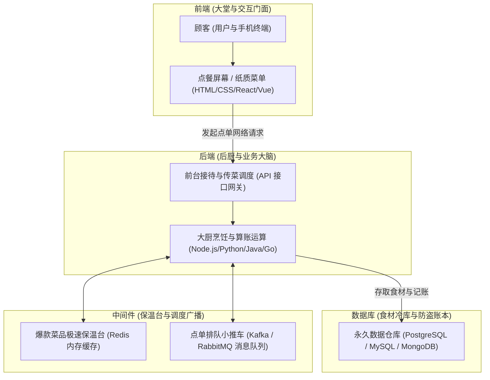
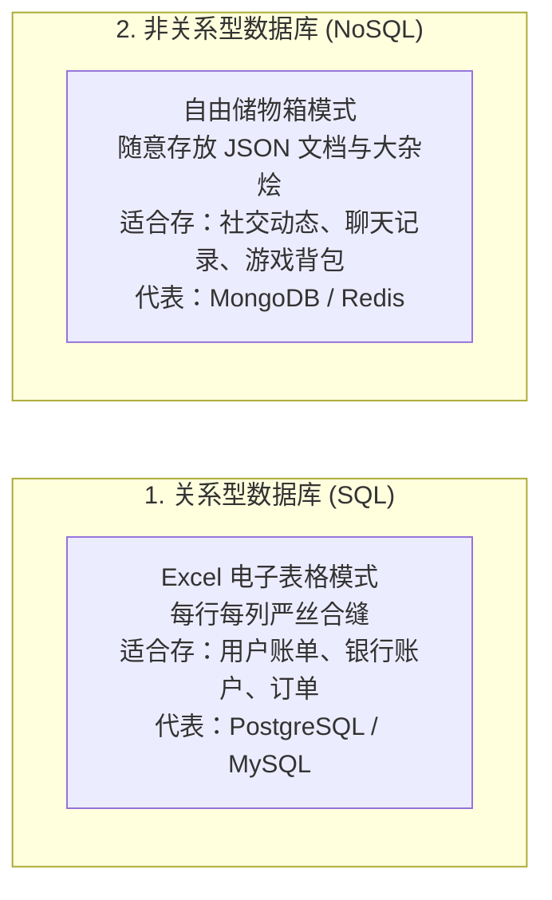
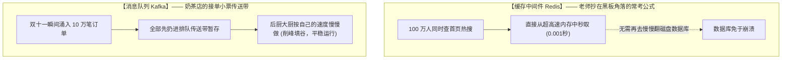
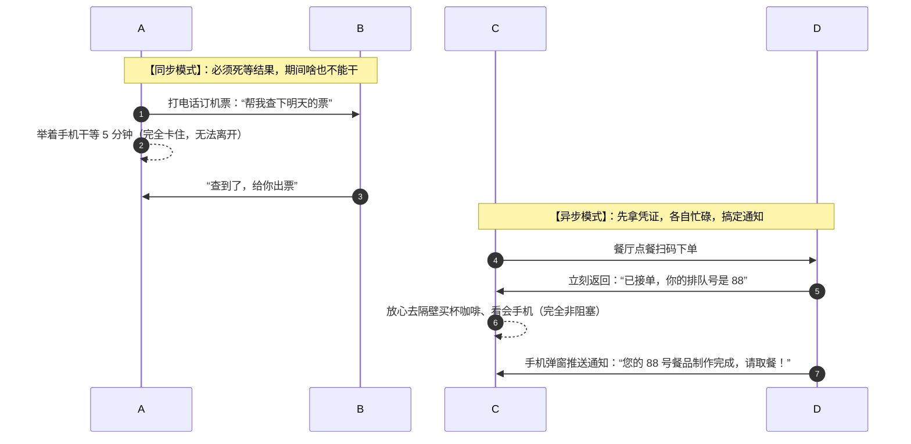
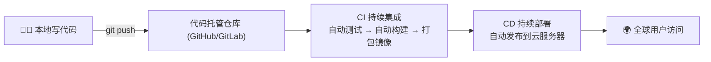

# 2.1 软件架构基础：前端、后端、数据库、中间件、微服务、同步与异步

> 开发软件就像开一家大型连锁餐厅——前端是漂亮的餐厅大堂，后端是忙碌的后厨大厨，数据库是锁着核心配方的食材冷库，中间件是传菜保温台与呼叫铃，微服务是独立分工的特色档口，而异步则是让你拿个震动小飞盘先去找座位的智能叫号！
>
> 别被“用 AI 写了个 HTML 网页，就号称自己 Coding 出了一个网站、程序员要失业了”的噱头带偏——那更多是哗众取宠的营销话术！
> 一个真正能上线的网站，远不止一张静态页面：高并发架构、数据一致性、安全防护、可观测性与持续交付，才是它的地基与承重墙。
> 所以，打算转行或刚入行的同学，请把注意力放在内功修炼上：以**架构设计**与**软件工程方法论**作为自己的护城河——AI 只是加速器，永远无法替代真正理解系统的人。

***

## 🍽️ 餐厅大比喻：一分钟看懂现代软件架构



***

## 🔍 核心概念通俗深度拆解（技术 + 日常双重比喻）

### 1. 什么是前端（Frontend / 客户端）？

- **日常生活比喻**：**一辆汽车的酷炫外壳、真皮座椅、方向盘与中控触摸大屏**。你坐在车里摸得到、按得着的所有按钮就是前端。
- **技术大白话**：运行在用户的浏览器、手机或电脑上的“交互界面”。它负责把数据漂亮地画在屏幕上，并捕捉用户的每一次点击、滑动和键盘输入。
- **核心三剑客与现代框架**：
  - **HTML**（骨架）：决定页面有哪些文字和按钮；
  - **CSS**（皮囊与装修）：决定按钮是什么颜色、排版多宽、是否有炫酷动效；
  - **JavaScript**（灵魂与肌肉）：决定点击按钮后弹窗还是跳转；
  - **主流全栈框架**：[React](https://react.dev)、[Vue](https://vuejs.org)、[Next.js](https://nextjs.org)、[Tailwind CSS](https://tailwindcss.com)。

***

### 2. 什么是后端（Backend / 服务端）？

- **日常生活比喻**：**汽车发动机舱里的引擎、变速箱与行车电脑（ECU）**。平时藏在引擎盖底下你看不到，但踩下油门能不能加速全靠它。
- **技术大白话**：运行在远端机房服务器上的业务处理核心。负责验证用户身份、计算复杂算法、保护商业机密并协调数据流转。
- **为什么前端不能直接连数据库？**：
  - 如果把数据库账号密码写在前端网页里，任何人只要“右键-检查源代码”就能把你的用户数据偷光，所以必须由后端这道“安全门神”负责把关！
- **主流开发语言与框架**：[FastAPI (Python)](https://fastapi.tiangolo.com)、[Node.js / Express / NestJS](https://nodejs.org)、[Spring Boot (Java)](https://spring.io)、[Go (Gin)](https://go.dev)。

***

### 3. 什么是数据库（Database / 数据持久化）？

- **日常生活比喻**：**银行的地下特种防盗金库与永久账本**。不论外面的营业厅停电还是装修，你的存款数字必须一分不差地锁在这里。
- **技术大白话**：专门用来安全存放和高效查询数据的软件系统。



- **数据库的核心底线（ACID 特性）**：比如 A 给 B 转账 100 元，A 账户扣钱和 B 账户加钱必须**同时成功或同时失败**，绝不能出现扣了 A 的钱却没加给 B 的半截子情况。

***

### 4. 什么是中间件（Middleware / 系统的润滑剂）？

- **日常生活比喻**：**大型商场里的自动扶梯、广播电台与快递寄存柜**。
- **技术大白话**：它不是具体的业务功能（不是做登录，也不是做支付），而是连接各个系统、让数据跑得更快更稳的底层辅助服务：



***

### 5. 什么是微服务（Microservices）vs 单体架构（Monolith）？

| 架构类型       | 单体架构（Monolith）                  | 微服务架构（Microservices）                                                                  |
| :--------- | :------------------------------ | :------------------------------------------------------------------------------------ |
| **日常生活比喻** | **夫妻档全能小餐馆**：老板一个人炒菜、收银、拖地、送外卖。 | **现代大型美食广场**：奶茶档口、烧烤档口、保洁团队、收银中心各自独立运营。                                               |
| **优点**     | 早期起步极快，代码都在一个文件夹里，部署调试简单。       | 各模块互不干扰！即使“外卖档口”停电了，堂食档口依然能正常营业。                                                      |
| **缺点**     | 规模变大后牵一发而动全身；一人摔倒整个餐馆关门。        | 维护成本高，需要通过网络进行跨服务远程调用（RPC）。                                                           |
| **技术基石**   | 单个二进制执行文件                       | [Docker 容器化](https://www.docker.com) 与 [Kubernetes (K8s) 编排调度](https://kubernetes.io) |

***

### 6. 什么是同步（Synchronous）与异步（Asynchronous）？

这是所有程序员和系统架构中最核心的心智模型：



- **日常生活例子**：
  - **同步（Sync）**：排队在银行柜台转账，柜员没把回执盖章给你之前，你绝不能走开；
  - **异步（Async）**：去医院做体检，抽完血后医生说“报告明天在手机 App 上推送查看”，你不用在化验室门口傻坐 24 小时。

***

### 7. 什么是 HTTP 与 REST API（前后端是怎么“对话”的）？

- **日常生活比喻**：**餐厅的点餐规矩**——HTTP 协议就是“服务生与后厨之间的沟通规范”：你递上菜单（请求），服务生把菜端上来（响应）；REST API 就是这份“标准菜单”，每道菜（资源）都有固定的写法。
- **技术大白话**：HTTP 是浏览器 / Agent 与后端服务器通信的“通用语言”。一次请求 = **方法（Method）+ 地址（URL）+ 请求头（Headers）+ 请求体（Body）**，后端处理后返回 **状态码 + 响应体**。

#### ① 请求方法 = 对资源做什么（增删改查）

| 方法 | 含义 | 生活比喻 | 例子 |
| :--- | :--- | :--- | :--- |
| GET | 查询 | 看菜单 | 获取用户列表 |
| POST | 新增 | 加一道新菜 | 创建新用户 |
| PUT | 整体更新 | 换掉整道菜 | 全量更新用户资料 |
| PATCH | 部分更新 | 只加个葱花 | 只改用户昵称 |
| DELETE | 删除 | 撤掉这道菜 | 删除用户 |

#### ② 状态码 = 后厨给你的“结果回执”

| 状态码 | 含义 | 生活比喻 |
| :--- | :--- | :--- |
| 200 / 201 | 成功 | 菜做好了，端上桌 |
| 400 | 请求写错 | 点了菜单上没有的字 |
| 401 | 未登录 | 没报会员号 |
| 403 | 无权限 | 会员等级不够，包厢进不去 |
| 404 | 资源不存在 | 菜已下架 |
| 429 | 请求太频繁 | 一分钟点 100 次餐，被限流 |
| 500 | 服务器出 bug | 后厨灶台炸了 |

> 💡 写 Agent 时天天和这些打交道：调 API 返回 **401** 说明 Key 错了；返回 **429** 说明请求太频繁，需要加等待重试。

```bash
# 用 curl 发请求，就像手动点一次餐
curl https://api.example.com/users            # GET：查看用户列表

curl -X POST https://api.example.com/users \
  -H "Authorization: Bearer sk-xxx" \
  -H "Content-Type: application/json" \
  -d '{"name": "Alex", "age": 25}'            # POST：创建新用户
```

***

### 8. 部署上线与 DevOps（把代码真正“开张营业”）

- **日常生活比喻**：**新餐厅开业全流程**——开发是在后厨试菜，部署上线就是“正式开张”，DevOps 则是把“备菜、炒菜、端盘”全部流水线自动化，还配上自动洗碗机。
- **技术大白话**：写完代码 ≠ 用户能用。要经历 **域名 + DNS + HTTPS + 服务器 + CI/CD** 一整套流程，才能让全世界访问到你的网站。



| 环节 | 生活比喻 | 大白话解释 |
| :--- | :--- | :--- |
| **域名 + DNS** | 餐厅的招牌与导航 | 把 `your-site.com` 翻译成服务器的真实 IP 地址 |
| **HTTPS** | 店门口加装防盗门 | 数据加密传输，浏览器地址栏的小锁头 |
| **云服务器** | 租来的后厨门店 | 阿里云 / 腾讯云 / AWS 上的一台远程电脑 |
| **Docker** | 标准化的打包餐盒 | 把“代码 + 环境”打包成镜像，在哪都能一键跑 |
| **CI/CD** | 全自动备菜流水线 | 代码一推送，自动测试、自动构建、自动上线 |

> 💡 这条是**转行同学的加分护城河**：很多人只会“写完代码就完事”；而能把项目真正**发布上线、让朋友打开访问**，你会立刻甩开 90% 的新手。

***

### 9. 软件工程完整流程（从“想法”到“上线”的流水线）

- **日常生活比喻**：**盖一栋楼**——需求是“和业主确认要几室几厅”，设计是“请设计师出蓝图”，开发是“砌墙铺水电”，测试是“质检员验收”，发布是“交房入住”，运维是“物业保修”。
- **技术大白话**：软件不是一拍脑袋写出来的，而是有标准流程，每一步都有明确的**产出物**：

| 阶段 | 生活比喻 | 主要做什么 | 产出物 |
| :--- | :--- | :--- | :--- |
| 需求分析 | 和业主确认户型 | 搞清楚“到底要解决什么问题” | 需求文档 (PRD) |
| 架构设计 | 设计师出蓝图 | 技术选型、模块划分、接口设计 | 架构图 / 设计文档 |
| 编码开发 | 砌墙铺水电 | 写代码实现功能 | 可运行的代码 |
| 测试 | 质检员验收 | 单元测试、联调、回归测试 | 测试报告 |
| 代码评审 | 监理把关 | Code Review，找隐藏 bug | 评审意见 |
| 发布上线 | 交房入住 | 部署到生产环境 | 线上可访问的服务 |
| 运维监控 | 物业保修 | 监控报警、修 Bug、持续迭代 | 稳定性指标 |

> 💡 转行者常犯的误区：只盯着“写代码”这一环。真正专业的工作流是**前有需求设计、后有测试运维**——会用 AI 帮你快速产出中间环节，正是 Vibe Coder 的独特优势。

***

## 🔗 相关官方权威技术站点直达

- **前端标准与框架**: [React 官方中文文档](https://react.dev) | [Vue.js 官网](https://vuejs.org) | [Tailwind CSS 官网](https://tailwindcss.com)
- **后端高性能引擎**: [FastAPI 官方文档](https://fastapi.tiangolo.com) | [Node.js 官网](https://nodejs.org) | [Spring 官方平台](https://spring.io)
- **数据与缓存系统**: [PostgreSQL 官方数据库](https://www.postgresql.org) | [Redis 官方平台](https://redis.io) | [MongoDB 官网](https://www.mongodb.com)
- **容器与微服务**: [Docker 官方社区](https://www.docker.com) | [Kubernetes 官网](https://kubernetes.io) | [Apache Kafka 官网](https://kafka.apache.org)
- **网络与接口基础**: [MDN HTTP 权威文档](https://developer.mozilla.org/zh-CN/docs/Web/HTTP) | [REST API 设计指南](https://restfulapi.net/)
- **部署与 DevOps**: [GitHub Actions 官方文档](https://docs.github.com/actions) | [GitLab CI/CD 文档](https://docs.gitlab.com/ci/)

