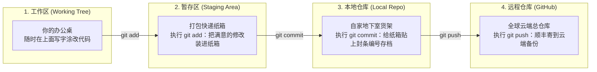

# 2.2 Git 与 GitHub 极速入门：时光机、代码云盘、注册与代理配置

> **大白话一句话概括**：Git 是安装在你电脑上的“单机游戏随时存档时光机”；而 GitHub 则是“全球程序员的代码云端网盘与开源社交工坊”，不仅能帮你异地备份，还能让你一键复用全世界顶尖大佬的现成杰作！

---

## 🎮 Git 的“四层空间”大白话拆解（快递打包大比喻）

很多新手被 `git add`、`git commit`、`git push` 搞得晕头转向，其实它的过程和**日常网购退货打包**一模一样：



---

## 🌪️ 核心概念与生活化实战场景

### 1. 分支（Branch）与合并冲突（Merge Conflict）
- **日常生活比喻**：
  - 你和小明要共同策划一份《日本旅游攻略》。为了不互相打扰，你俩各自复印了一份草稿（拉出各自的 **分支**）。
  - 你在第 10 行写上了“住东京希尔顿酒店”，小明在第 10 行写上了“住新宿民宿”。
  - 当你们要把两份草稿合并（**Merge**）成终稿时，Git 就会亮起红灯报警：**“发生冲突（Conflict）了！第 10 行你俩写的不一样，请人类自己商量决定留哪一个！”**
- **Git 冲突解决大白话**：
  - 打开冲突文件，你会看到这样的标记：
    ```markdown
    <<<<<<< HEAD (你的分支)
    住东京希尔顿酒店
    =======
    住新宿民宿
    >>>>>>> xiaoming-branch (小明的分支)
    ```
  - 你只要删掉不想要的文字和尖括号标记，保留正确的那个，保存并重新提交，冲突就完美化解了！

---

### 2. GitHub 社交三剑客：Fork、PR 与 Issue

```mermaid
graph TD
    Original["全球官方开源仓库 (比如 Dify 官方项目)"] -->|1. Fork (复印一份到我自己的云端账号)| MyFork["我的专属副本仓库 (随便魔改不影响官方)"]
    MyFork -->|2. 我修改并添加了支持微信扫码的新功能| LocalCode["本地写代码并测试成功"]
    LocalCode -->|3. Pull Request / PR (向官方提交改良提案)| Original
    Author["官方维护团队审核代码无误后，一键 Merge 合并进主干，向全球发布！"]
```

- **Fork（复印抄底）**：看到别人做了一个很酷的开源贪吃蛇游戏，点击右上角 `Fork`，瞬间把这套代码完整复印一份到你的个人主页里，你在里面怎么改都不会弄坏别人的原版。
- **Pull Request（PR / 合并申请）**：你给这套贪吃蛇游戏增加了一个“双人对战模式”，觉得特别棒，向作者发起 PR：“嘿作者，我帮你开发了个新功能，请审查一下合并到官方版本里吧！”
- **Issue（意见与求助信箱）**：在玩游戏时发现了一个 Bug，或者想要提个新功能建议，直接在项目的 Issue 专区发帖反馈。

---

## 📝 GitHub 零基础注册保姆级教程

1. **打开入口**：在浏览器输入官方地址 [https://github.com](https://github.com)；
2. **填写信息**：
   - 点击右上角 **“Sign up”**；
   - 依次输入你的常用邮箱（QQ/163/Gmail 均可）、设置包含字母+数字的高强度密码、输入唯一的用户名（Username）；
3. **真人拼图校验**：根据屏幕提示旋转动物或匹配数量完成验证；
4. **邮件验证码激活**：打开邮箱将 8 位数字验证码填入，直接进入 GitHub 控制台！

---

## 🚀 国内顺畅访问与 Git 代理加速（海外转运比喻）

- **为什么有时候连不上 GitHub？**：因为 GitHub 服务器在海外，直连就像跨国平邮，容易出现拥堵或丢包。
- **代理的原理**：就像找了一家“海外代收转运公司”，你的电脑把请求发给本地代理中转，再由代理极速取回代码。

### 常用极速配置命令

```bash
# 1. 开启 Git 全局代理 (以常见的本地 7890 端口为例)
git config --global http.proxy http://127.0.0.1:7890
git config --global https.proxy http://127.0.0.1:7890

# 2. 验证代理是否配置成功
git config --global --get http.proxy

# 3. 以后不需要走代理时，一键彻底移除：
git config --global --unset http.proxy
git config --global --unset https.proxy
```

### 免敲命令的小白神器：[GitHub Desktop](https://desktop.github.com)
- 讨厌打字命令行的初学者，直接安装 GitHub 官方可视化客户端，全鼠标拖拽、点击按钮一秒完成 Commit 和 Push！

---

## 🔗 相关官方平台与权威手册

- [GitHub 官方首页与开源广场](https://github.com)
- [Git 官方中文手册 (Pro Git 电子书)](https://git-scm.com/book/zh/v2)
- [GitHub Desktop 官方可视化客户端下载](https://desktop.github.com)
- [GitHub Skills 官方互动式入门学习实验场](https://skills.github.com)
