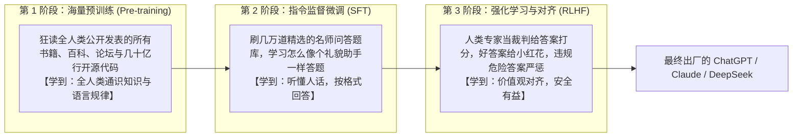
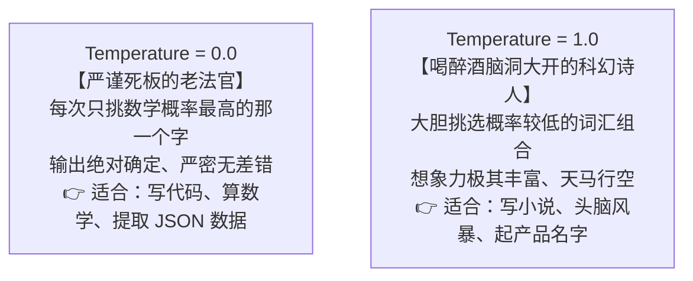
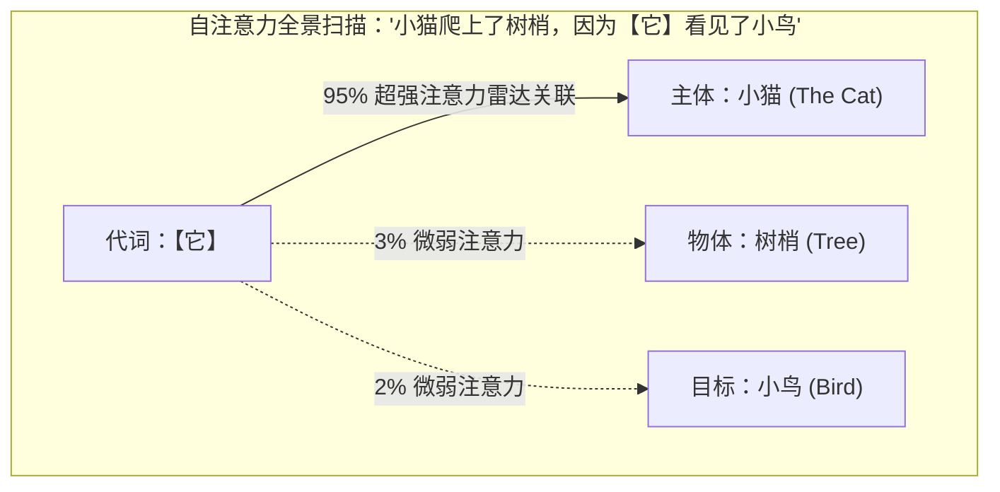

# 2.3 大模型本质与工作原理：超级文字接龙、高维压缩与 Transformer

> **大白话一句话概括**：大模型本质上是一个“读遍全人类互联网所有书和代码的超级文字接龙高手”。它通过精密计算几千亿个神经突触的数学概率，预测出下一个最合理的字词或代码符号！

---

## 🏭 一个万亿参数大模型是怎样“炼”成的？（三阶段大比喻）

很多初学者觉得大模型神乎其神，其实它的成长过程和一个人类专家的求学之路极其相似：

---

## 🧩 核心概念深度拆解

### 1. Token（词元 / 语言的乐高积木颗粒）
- **日常生活比喻**：大模型看文字不是一个字一个字看，也不是整句话看，而是像拼装**“乐高积木颗粒”**。
- **例如**：“人工智能”四个汉字可能被切成 `[人, 工, 智能]` 3 个积木块；
- **为什么重要？**：所有大模型的计费和记忆容量都是以 Token 为单位计算的（通常 1000 个汉字约等于 1300~1500 个 Token）。

---

### 2. 温度参数（Temperature）与 Top-P（控制 AI 的性格与脑洞）
你在调用 API 或在写提示词时经常会看到 `temperature` 参数：

---

### 3. 自注意力机制（Self-Attention）—— 嘈杂派对上的“鸡尾酒会效应”

2017 年 Google 发布的 [《Attention Is All You Need》](https://arxiv.org/abs/1706.03762) 论文之所以能颠覆整个 AI 界，核心全在“注意力机制”上：

- **日常生活比喻**：
  - 想象你正在一个 100 人的嘈杂酒吧派对上，周围所有人都在大声碰杯说话（背景噪音海量输入）；
  - 突然，远处的吧台有人轻声喊了一句：**“小明，你的外卖到了！”**
  - 虽然现场声浪震天，但小明的耳朵雷达瞬间把 99% 的注意力集中到了这几个字上，并立刻把“外卖”和“自己（小明）”关联在一起。

- **技术大白话**：在处理一万行代码时，Transformer 不会像旧算法那样读到后面忘前面，而是能瞬间计算出**当前这一行变量与 500 行之前定义的结构体之间的强关联**！

---

## 🏛️ Transformer 的架构分工：Encoder 与 Decoder

- **Encoder（编码器 / 倾听者）**：负责全神贯注把一大段文字彻底读懂，提炼成高维理解特征（代表：Google BERT）；
- **Decoder（解码器 / 表达者）**：负责根据脑海中的理解，一个字一个字向外吐出最优答案；
- **现代大模型的选择**：包括 Claude 5、GPT-5.6、DeepSeek V4 等在内的绝大多数前沿大模型，均采用**纯 Decoder（Decoder-only）架构**，将文字接龙预测的威力发挥到了极致！

---

## 🔗 相关权威官方与学术链接

- [《Attention Is All You Need》论文原文 (arXiv)](https://arxiv.org/abs/1706.03762)
- [Hugging Face 官方全球开源大模型库](https://huggingface.co)
- [OpenAI 官方研究与技术博客](https://openai.com/research)
- [Anthropic 官方研究与安全文档](https://www.anthropic.com/research)
