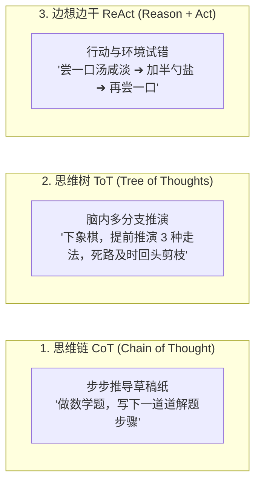

# 2.4 Agent 机制与运行原理：给大模型装上眼睛、双手与规划大脑

> **大白话一句话概括**：普通大模型就像一个“博学多才但瘫痪在床的军师”，你问它怎么做西餐，它能倒背如流写出菜谱，但它没办法去开冰箱；而 Agent 则是“带着钥匙和钱包、能自己去菜市场买菜、回厨房开火做饭、尝咸淡调整最后端上桌的智能管家”！

---

## 🍳 智能管家做大餐：一图看懂 Agent 运作机制


---

## 🧠 Agent 高级思考流派：CoT、ToT 与 ReAct

在 Agent 自主解决问题时，有三种最主流的思考架构：



### 1. 思维链 CoT（Chain of Thought / 草稿纸模式）
- **日常生活比喻**：做高考数学大题。如果直接心算容易出错，但在草稿纸上一行一行写下推导步骤 `因为 A=B，所以 C=D`，正确率就能提升 10 倍！

### 2. 思维树 ToT（Tree of Thoughts / 脑内沙盘推演）
- **日常生活比喻**：专业棋手下围棋。面对一个局面，脑海中同时模拟走法甲、走法乙、走法丙。推演到第 3 步发现走法乙会导致丢大子，立刻在脑中“剪枝放弃”，最终选择胜率最高的走法甲。

### 3. ReAct（Reason + Act / 试错自愈模式）
- **日常生活比喻**：炒菜调味。大厨不会只凭空推算放多少克盐，而是加一小勺盐（行动），用舌头尝一口（观察），发现还是偏淡（思考），再补加一小勺（自愈修复），直到咸淡刚好。

---

## 🏛️ Agent 的四大核心黄金支柱

```
                    ┌─────────────────────────┐
                    │      1. 核心大脑 (LLM)    │
                    │   (规划/推理/拆解目标)   │
                    └────────────┬────────────┘
                                 │
         ┌───────────────────────┼───────────────────────┐
         ▼                       ▼                       ▼
┌─────────────────┐     ┌─────────────────┐     ┌─────────────────┐
│  2. 记忆系统    │     │  3. 工具箱      │     │  4. 环境反馈    │
│  (短期/长期记忆) │     │  (终端/API/文件) │     │  (执行输出/报错) │
└─────────────────┘     └─────────────────┘     └─────────────────┘
```

1. **核心大脑（Planning）**：负责把“我要上线一个商城”这样的大目标，拆解成 20 个井井有条的执行步骤；
2. **记忆系统（Memory）**：记住主人喜欢吃几分熟、记住上次哪个步骤失败了；
3. **工具箱（Tools）**：拥有操作系统的权限，可以自己读写本地文件、执行命令行、调用网络 API；
4. **环境反馈（Observation）**：工具执行后的真实返回值（终端报错、网络返回代码），能让 Agent 当场看清现实，不做无头苍蝇。

---

## 🔗 相关权威学术与官方技术链接

- [ReAct: Synergizing Reasoning and Acting in Language Models (经典论文)](https://arxiv.org/abs/2210.03629)
- [Tree of Thoughts: Deliberate Problem Solving (ToT 论文)](https://arxiv.org/abs/2305.10601)
- [Anthropic Claude Code 官方文档](https://docs.anthropic.com/en/docs/agents-and-tools/claude-code)
- [Cursor 官方 Agent 开发手册](https://docs.cursor.com)
