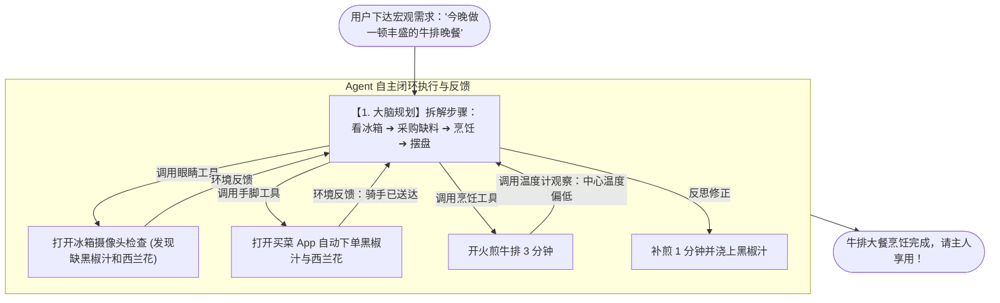
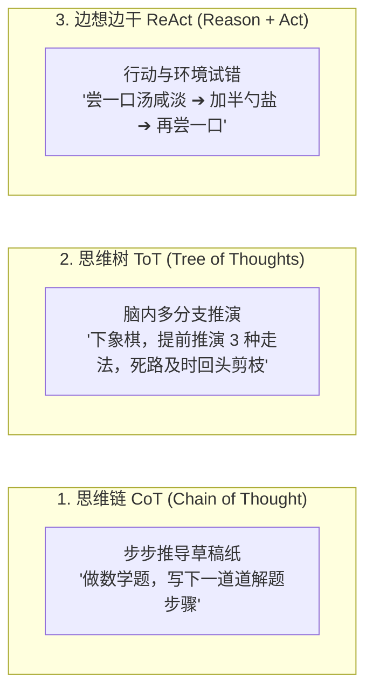

# 2.4 Agent 机制与运行原理：给大模型装上眼睛、双手与规划大脑

> 普通大模型就像一个“博学多才但瘫痪在床的军师”，你问它怎么做西餐，它能倒背如流写出菜谱，但它没办法去开冰箱；而 Agent 则是“带着钥匙和钱包、能自己去菜市场买菜、回厨房开火做饭、尝咸淡调整最后端上桌的智能管家”！

***

## 🍳 智能管家做大餐：一图看懂 Agent 运作机制



***

## ⚖️ 普通大模型 vs Agent：到底差在哪？

| 对比维度 | 普通大模型（LLM） | Agent（智能体） |
| :--- | :--- | :--- |
| **生活比喻** | 瘫痪在床的军师 | 自己动手的智能管家 |
| **能力边界** | 只能“说”（文字进、文字出） | 能“说”更能“做”（调工具、跑代码、改文件） |
| **是否联网** | 只靠训练时的记忆，不会实时查 | 可实时搜索、调用网络 API |
| **记忆能力** | 每次对话相对独立，容易“失忆” | 有短期 + 长期记忆，能记住上下文偏好 |
| **自我纠错** | 答错了就错了 | 能看反馈、反思、重试，直到做对 |
| **典型代表** | ChatGPT 网页版纯聊天 | Claude Code、Cursor Composer、Devin |

> 💡 一句话总结：**大模型是“军师”，Agent 是“军师 + 手脚 + 记忆 + 复盘”的完整作战单元。**

***

## 🧠 Agent 高级思考流派：CoT、ToT 与 ReAct

在 Agent 自主解决问题时，有三种最主流的思考架构：



### 1. 思维链 CoT（Chain of Thought / 草稿纸模式）

- **日常生活比喻**：做高考数学大题。如果直接心算容易出错，但在草稿纸上一行一行写下推导步骤 `因为 A=B，所以 C=D`，正确率就能提升 10 倍！

### 2. 思维树 ToT（Tree of Thoughts / 脑内沙盘推演）

- **日常生活比喻**：专业棋手下围棋。面对一个局面，脑海中同时模拟走法甲、走法乙、走法丙。推演到第 3 步发现走法乙会导致丢大子，立刻在脑中“剪枝放弃”，最终选择胜率最高的走法甲。

### 3. ReAct（Reason + Act / 试错自愈模式）

- **日常生活比喻**：炒菜调味。大厨不会只凭空推算放多少克盐，而是加一小勺盐（行动），用舌头尝一口（观察），发现还是偏淡（思考），再补加一小勺（自愈修复），直到咸淡刚好。

### ReAct 的运行细节：三步循环伪代码

几乎所有的 Agent（包括 Claude Code、Cursor）底层都在跑同一个三步循环：

```
# ReAct 循环伪代码：想想再动手，动手再想想
while 任务还没有完成:
    思考 Thought:    根据当前信息，决定下一步做什么
    行动 Action:     调用某个工具（或直接给出回答）
    观察 Observation: 拿到工具返回的真实结果（成功 / 报错）
```

**实战示例：让 Agent 修一个报错**

| 轮次 | 思考 Thought | 行动 Action | 观察 Observation |
| :--- | :--- | :--- | :--- |
| 第 1 轮 | 页面报 500，先看后端日志 | 运行 `tail -n 100 server.log` | 日志显示数据库连接超时 |
| 第 2 轮 | 可能是数据库没启动 | 运行 `systemctl status mysql` | 数据库进程确实未运行 |
| 第 3 轮 | 启动数据库并重测接口 | 运行 `systemctl start mysql && npm test` | 测试全部通过 ✅ |

> 💡 这就是 Agent 能“自我修复”的秘密：**它不是一次性背出答案，而是把“猜测 → 验证 → 修正”循环跑很多遍**，直到环境反馈说“成功”。

***

## 🏛️ Agent 的四大核心黄金支柱

```
                    ┌─────────────────────────┐
                    │      1. 核心大脑 (LLM)    │
                    │   (规划/推理/拆解目标)   │
                    └────────────┬────────────┘
                                 │
         ┌───────────────────────┼───────────────────────┐
         ▼                       ▼                       ▼
┌─────────────────┐     ┌─────────────────┐     ┌─────────────────┐
│  2. 记忆系统    │     │  3. 工具箱      │     │  4. 环境反馈    │
│  (短期/长期记忆) │     │  (终端/API/文件) │     │  (执行输出/报错) │
└─────────────────┘     └─────────────────┘     └─────────────────┘
```

1. **核心大脑（Planning）**：负责把“我要上线一个商城”这样的大目标，拆解成 20 个井井有条的执行步骤；
2. **记忆系统（Memory）**：记住主人喜欢吃几分熟、记住上次哪个步骤失败了；
3. **工具箱（Tools）**：拥有操作系统的权限，可以自己读写本地文件、执行命令行、调用网络 API；
4. **环境反馈（Observation）**：工具执行后的真实返回值（终端报错、网络返回代码），能让 Agent 当场看清现实，不做无头苍蝇。

***

## 🔧 工具调用（Function Calling）：Agent 怎么让“手脚”听话干活？

四大支柱里的“工具箱”具体是怎么工作的？靠的是 **Function Calling（函数调用 / 工具调用）**：

- **日常生活比喻**：**递小票**——大厨（模型）不亲自去仓库拿菜，而是写一张标准点单小票（工具名 + 参数），交给跑腿小哥（程序）去执行。
- **技术大白话**：模型并不能真的执行命令，它只负责“下指令”。当它决定要用工具时，会输出一段**结构化 JSON**（工具名 + 参数），由外围程序代为执行，再把真实结果回传给模型继续思考。

```json
// 模型决定要调用工具时，输出的结构化指令（点单小票）
{
  "tool_name": "run_command",
  "parameters": {
    "command": "npm test",
    "timeout": 60
  }
}
```

> 💡 流程：模型输出小票 → 程序执行 `npm test` → 把 stdout/stderr 作为“观察 Observation”喂回模型 → 模型看到结果继续规划下一步。**模型负责聪明，程序负责执行。**

***

## 🛡️ Agent 的翻车现场与三道安全护栏

Agent 能力越强，翻车的破坏力也越大，这些场景你迟早会遇到：

| 翻车现场 | 生活比喻 | 防护手段 |
| :--- | :--- | :--- |
| **死循环** | 扫地机器人原地转圈 | 设置**最大步数 / 超时熔断**，跑不完就强制停止 |
| **预算失控** | 出租车计价表狂跳 | 设置**预算上限 + 消耗告警**，超额自动暂停 |
| **越权操作** | 管家乱动你的银行卡 | **权限最小化**：只给需要的那几个工具，别给全部权限 |
| **幻觉放大** | 越自信越敢瞎编 | 关键信息走 **RAG 检索 + 工具核实**，别让模型凭空编造 |

> 🛠️ 这些防护手段，正是后续 2.11 章 **Harness 工程（赛车底盘）** 要重点解决的内容——给 Agent 装上“方向盘限位、刹车与保险杠”。

***

## 🔗 相关权威学术与官方技术链接

- [ReAct: Synergizing Reasoning and Acting in Language Models (经典论文)](https://arxiv.org/abs/2210.03629)
- [Tree of Thoughts: Deliberate Problem Solving (ToT 论文)](https://arxiv.org/abs/2305.10601)
- [Anthropic Claude Code 官方文档](https://docs.anthropic.com/en/docs/agents-and-tools/claude-code)
- [Cursor 官方 Agent 开发手册](https://docs.cursor.com)

