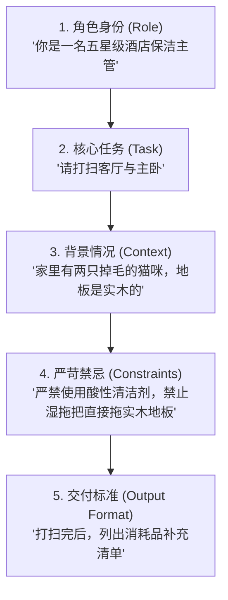
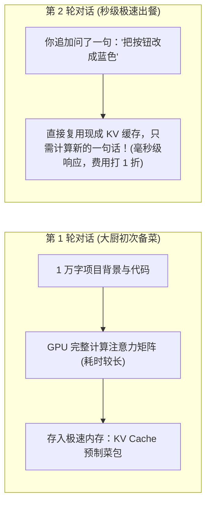

# 2.5 提示词与上下文工程：从写好一句 Prompt 到喂饱整个 Context

> **大白话一句话概括**：提示词工程是教你“怎么跟 AI 提要求它才听得最懂”，而上下文工程则是“在 AI 动笔之前，把图纸、说明书和现成资料精准塞进它的工位”，让它绝不靠脑补瞎猜！

---

## 🎯 结构化提示词的黄金法则（保姆交代任务大比喻）

如果你只对新来的家政阿姨说一句：“把家里打扫一下”，阿姨可能不知道该擦窗户还是拖地。

**高质量提示词（CRISP 结构）** 就好比一份条理分明的“家政任务清单”：

---

## ⚠️ 上下文陷阱：“迷失在中间（Lost in the Middle）”

很多新手把 10 万字的长文档一股脑全塞给大模型，结果发现 AI 经常看漏关键条款。

- **日常生活比喻**：
  - 想象你给老板提交了一份 200 页的年度总结报告。
  - 老板翻了翻第一页的摘要（开头印象深刻），又看了看最后一页的结论（结尾印象深刻），而夹在第 85 页的那个关键建议，老板**完全看漏了**！
- **工程避坑指南**：
  - **最核心的硬性指令、最关键的表结构定义，一定要放在上下文的最前面（System Prompt）或最后面（靠近提问处）**，避免放在海量资料的正中间！

---

## ⚡ 为什么现代 AI 对话越来越快？揭秘 KV Cache（预制菜大比喻）

在开发中你可能会发现：第一次向 AI 发送一个大项目时比较慢，但后续多轮对话时，AI 几乎瞬间就开始打字，而且费用大幅下降。

这就是现代大模型的核心技术 —— **KV Cache（键值缓存）**：

---

## ⚖️ 提示词工程 vs 上下文工程对比矩阵

| 维度 | 提示词工程 (Prompt Engineering) | 上下文工程 (Context Engineering) |
| :--- | :--- | :--- |
| **日常生活类比** | 思考“如何把需求说得动听清晰” | 思考“如何把施工现场的图纸和工具备齐” |
| **核心操作** | 调整句式、角色扮演（Role）、提供少样本（Few-shot） | 编写 `.cursorrules`、注入 RAG 知识库、挂载 MCP 实时数据库 |
| **解决的痛点** | 让 AI 听懂你的意图和输出格式 | 彻底根治 AI 编造不存在的假 API 与版本错乱问题 |
| **2026 年地位** | 基础基本功 | **决定 Agent 生产力上限的核心竞争力** |

---

## 🔗 官方权威指南与互动教程

- [Anthropic Claude 官方交互式 Prompt Engineering 教程](https://docs.anthropic.com/en/docs/build-with-claude/prompt-engineering/overview)
- [OpenAI 官方 Prompt Engineering 开发者文档](https://platform.openai.com/docs/guides/prompt-engineering)
- [Cursor Rules for AI 官方最佳实践](https://docs.cursor.com/context/rules-for-ai)
