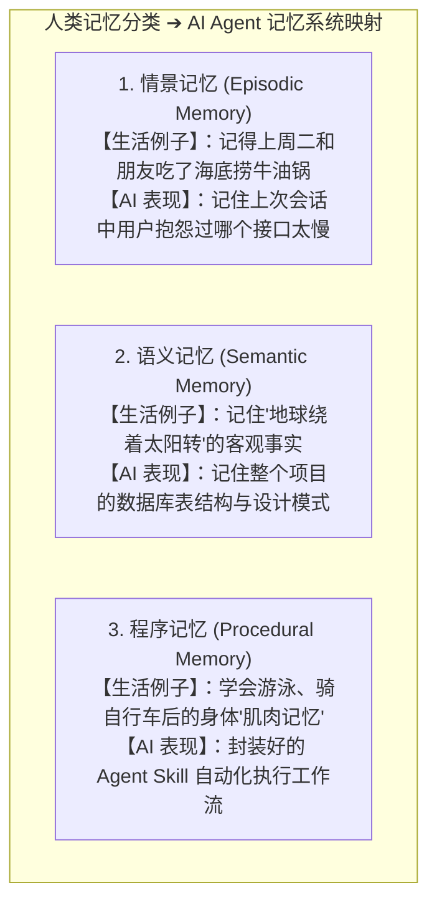
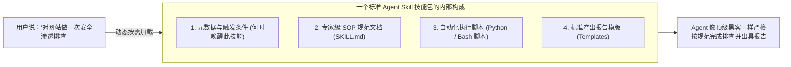

# 2.6 记忆管理与 Agent Skills：短期遗忘、长期记忆与技能包扩展

> **大白话一句话概括**：大模型天生像个“只能记住眼前这页纸的金鱼”，记忆管理就是给它配上“便签本”、“个人档案柜”与“肌肉记忆”；而 Agent Skills 则是给它下载一个个封装好的“技能安装包”，让它瞬间学会如何抓数据、如何跑测试、如何一键部署！

---

## 🧠 人类心理学三大记忆 vs AI Agent 记忆映射

AI Agent 的记忆架构完全借鉴了人类认知科学体系：

---

## 🗃️ 记忆管理的三大工程落地机制

### 1. 短期工作记忆与滑动窗口（便签本截断）
- 窗口大小有限（例如 128k Token）。随着对话不断进行，最早说的闲聊内容就像便签本写满了被撕掉一样，只保留最近几轮最新的关键对话。

### 2. 对话智能摘要压缩（Conversation Compaction）
- 当对话快要撑爆上下文时，系统会自动把前 30 轮复杂的来回讨论提炼成一段精炼的 200 字摘要存入上下文，既省下 90% 空间，又保证 Agent 绝不失忆。

### 3. 长期记忆持久化（个人档案袋）
- 将用户的个性化偏好（如“我不喜欢用驼峰命名”、“我的测试服务器 IP 是 xxx”）加密存入持久化数据库（如 [Letta / 原 MemGPT](https://www.letta.com)），下次哪怕开启全新对话，也能秒级唤醒！

---

## 🧰 什么是 Agent Skills（智能体技能包体系）？

**Agent Skill（技能）** 就是把某个特定专业任务的**规章制度、执行脚本、模版和工具打包成一个可插拔的模块**：

---

## 🔗 相关权威技术与官方平台

- [Letta (原 MemGPT) 官方开源仓库](https://github.com/letta-ai/letta) —— 专为 LLM 打造的持久化内存与状态操作系统
- [LangChain 官方 Memory 模块文档](https://python.langchain.com/docs/concepts/memory/)
- [Anthropic Building Effective Agents 研究报告](https://www.anthropic.com/research/building-effective-agents)
