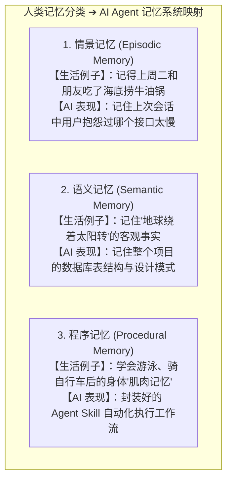
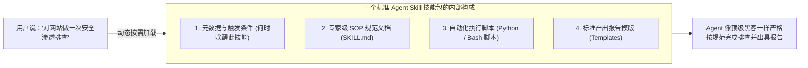

# 2.6 记忆管理与 Agent Skills：短期遗忘、长期记忆与技能包扩展

> 大模型天生像个“只能记住眼前这页纸的金鱼”，记忆管理就是给它配上“便签本”、“个人档案柜”与“肌肉记忆”；而 Agent Skills 则是给它下载一个个封装好的“技能安装包”，让它瞬间学会如何抓数据、如何跑测试、如何一键部署！

***

## 🧠 人类心理学三大记忆 vs AI Agent 记忆映射

AI Agent 的记忆架构完全借鉴了人类认知科学体系：



> 📖 上面是从“记什么类型”**的角度切分记忆（情景 / 语义 / 程序）；下面我们再从**“能记多久”的时间尺度切一刀，你会发现短期、中期、长期记忆在 Agent 里各司其职、缺一不可。

***

## 🕐 记多久？短期、中期、长期记忆（时间尺度大比较）

| 记忆层级     | 生活比喻        | 工程实现机制          | 特点               |
| :------- | :---------- | :-------------- | :--------------- |
| **短期记忆** | 随手记的便利贴     | 上下文窗口 + 滑动窗口    | 容量有限、响应最快、聊完即忘   |
| **中期记忆** | 项目会议纪要本     | 对话智能摘要压缩        | 跨会话保留关键结论，省空间不失忆 |
| **长期记忆** | 个人档案柜 / 户口本 | 持久化数据库 + RAG 检索 | 永久保存，靠“检索”唤醒     |

- **短期记忆（Short-term / 便利贴）**：就是当前这一轮对话的上下文窗口。它的容量有限（如 128K Token），写满后最早的内容会被“撕掉”，只留最近几轮的关键对话——**快，但易失**。
- **中期记忆（Mid-term / 会议纪要）**：当对话太长时，系统会把前面几十轮讨论**浓缩成一段摘要**存进上下文，相当于把便利贴整理成一份会议纪要——**既省空间，又不会彻底失忆**。
- **长期记忆（Long-term / 档案柜）**：用户的偏好、项目的表结构、历史踩坑记录，被加密存进数据库，开启全新对话也能**秒级唤醒**——这才是真正“过目不忘”的一层。

> 🔀 三者的关系就像人类整理笔记：**便利贴（短期）→ 整理成会议纪要（中期）→ 归档进档案柜（长期）**。工程落地上，正好一一对应下面三个核心机制：

***

## 🗃️ 记忆管理的三大工程落地机制

### 1. 短期工作记忆与滑动窗口（便签本截断）

- 窗口大小有限（例如 128k Token）。随着对话不断进行，最早说的闲聊内容就像便签本写满了被撕掉一样，只保留最近几轮最新的关键对话。

### 2. 对话智能摘要压缩（Conversation Compaction）

- 当对话快要撑爆上下文时，系统会自动把前 30 轮复杂的来回讨论提炼成一段精炼的 200 字摘要存入上下文，既省下 90% 空间，又保证 Agent 绝不失忆。

### 3. 长期记忆持久化（个人档案袋）

- 将用户的个性化偏好（如“我不喜欢用驼峰命名”、“我的测试服务器 IP 是 xxx”）加密存入持久化数据库（如 [Letta / 原 MemGPT](https://www.letta.com)），下次哪怕开启全新对话，也能秒级唤醒！

> 🔧 记忆解决的是“记性好不好”；而真正让 Agent “会干活”的，是下面要讲的 **Agent Skills**——相当于把“会游泳、会骑车”的肌肉记忆，打包成一个个可插拔的技能安装包。

***

## 🧰 什么是 Agent Skills（智能体技能包体系）？

**Agent Skill（技能）** 就是把某个特定专业任务的**规章制度、执行脚本、模版和工具打包成一个可插拔的模块**：



### Skills vs 普通 Prompt：为什么不用一大段提示词硬怼？

| 对比维度     | 普通提示词（Prompt）   | Agent Skill（技能包）  |
| :------- | :-------------- | :---------------- |
| **生活比喻** | 现场口头交代一遍流程      | 给一本《岗位操作手册》+ 配套工具 |
| **复用性**  | 每次都要重写 / 复制粘贴   | 一次写好，随时按需加载       |
| **规范性**  | 全凭这次写得够不够细      | 内置专家级 SOP，稳定不飘    |
| **扩展性**  | 提示词越长越容易“迷失在中间” | 模块化加载，只把需要的塞进上下文  |
| **可维护性** | 改一处要牵动一大段       | 独立更新，互不影响         |

### 一个真实的 SKILL.md 长什么样？（以“代码审查”技能为例）

```markdown
---
name: code-review
description: 对本次代码改动进行系统性审查，输出分级问题清单
---

# 代码审查 SOP
1. 读取 git diff，定位本次改动范围；
2. 逐文件检查：逻辑正确性、边界条件、安全隐患、性能问题；
3. 每个问题标注严重等级：🔴 阻断 / 🟡 建议 / 🟢 可选；
4. 输出 Markdown 审查报告，按严重程度排序。

# 审查清单
- [ ] 是否有未处理的 None / 空指针判断
- [ ] 是否硬编码了密钥或敏感信息
- [ ] 是否缺少异常捕获
```

> 💡 这份文件就是"**元数据（何时用）+ SOP（怎么干）+ 脚本/模板（用什么干）**"三位一体的技能包，Agent 一读就能照章办事。

### Skills 与 MCP：别搞混了！两者分工完全不同

| <br />   | Agent Skills            | MCP（2.7 章详解）           |
| :------- | :---------------------- | :--------------------- |
| **本质**   | 教 Agent “怎么做”（SOP + 脚本） | 给 Agent “能调什么”（外部工具接口） |
| **比喻**   | 岗位操作手册                  | 万能插座 / 外部设备接口          |
| **作用**   | 提升“做事规范性”               | 扩展“能力边界”               |
| **典型内容** | SKILL.md + 脚本 + 模板      | 服务器、工具、资源、提示词          |

> 🧩 两者互补：**Skills 决定“用什么姿势干活”，MCP 决定“能摸到哪些外部资源”**。

### 如何编写自己的第一个 Skill（4 步走）

1. **选任务**：找一件你反复让 AI 做、且步骤固定的活（如“写周报”“跑测试”“发布部署”）；
2. **写 SKILL.md**：按上面的模板写下“何时触发 + 怎么干 + 交付什么”；
3. **配脚本与模板**：把重复的执行脚本（Python / Bash）和输出模板一并放进去；
4. **挂载并验证**：放进 Agent 的技能目录（如 Claude Code 的 `.claude/skills/`），让 AI 调用，再根据效果迭代优化。

> 🎯 一句话总结：**Prompt 是一次性交代，Skill 是沉淀下来的“岗位说明书”**——技能包攒得越多，你的 Agent 就越像一位经验丰富的“老师傅”。

***

## 🔗 相关权威技术与官方平台

- [Letta (原 MemGPT) 官方开源仓库](https://github.com/letta-ai/letta) —— 专为 LLM 打造的持久化内存与状态操作系统
- [LangChain 官方 Memory 模块文档](https://python.langchain.com/docs/concepts/memory/)
- [Anthropic 官方 Agent Skills 文档](https://docs.anthropic.com/en/docs/agents-and-tools/agent-skills/overview) —— 技能包规范与最佳实践
- [Anthropic Building Effective Agents 研究报告](https://www.anthropic.com/research/building-effective-agents)

