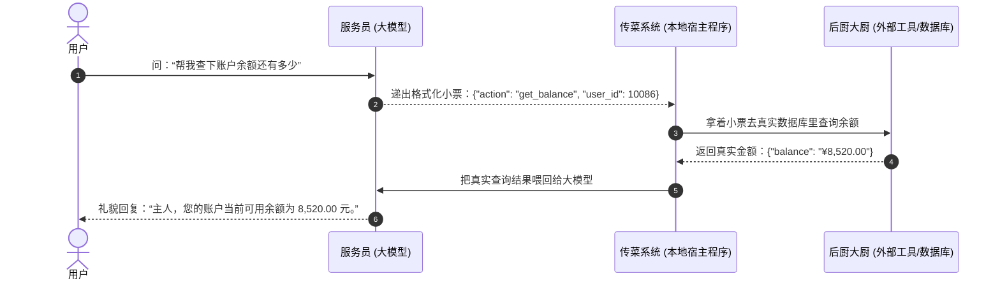
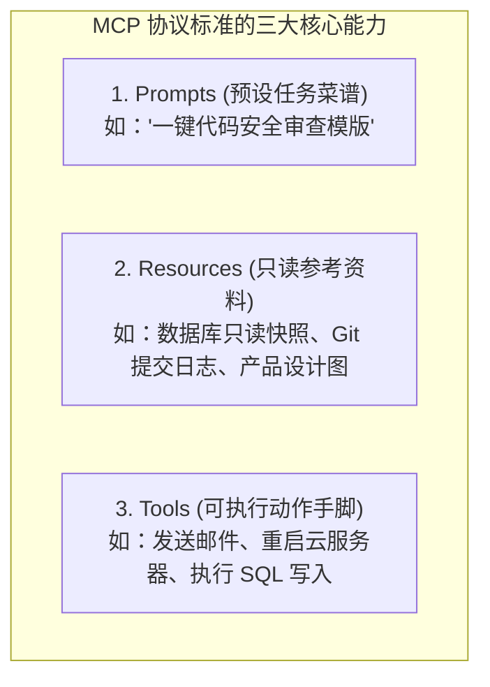
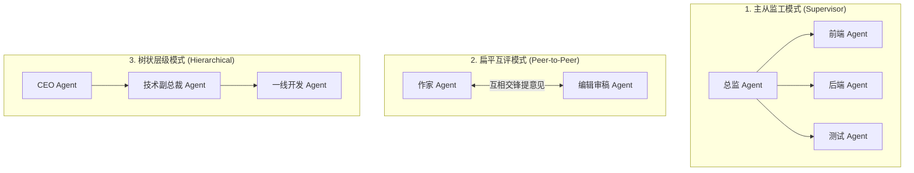

# 2.7 工具调用、MCP 协议与 A2A 协作：打通软硬件万能插头

> **大白话一句话概括**：函数调用（Function Calling）是大模型给真实世界程序递出的“标准格式小票”，MCP 是统一全世界所有 AI 工具的“万能 Type-C 接口”，而 A2A 则是让一群 AI 智能体聚在同一个会议室里分工开会、协同干活的通信协议！

---

## 🧾 函数调用（Function Calling）：大模型递出“点单小票”

很多新手以为大模型自己可以直接操作电脑硬件，**其实完全不是**！大模型本质只能输出文字。

- **日常生活比喻**：
  - 你去高档餐厅对服务员说：“给我来一份微辣的宫保鸡丁，顺便打包带走”。
  - 服务员（大模型）不会亲自去炒菜，而是立刻打印出一张**格式极其严谨的标准点单小票（JSON 数据）**：
    ```json
    {
      "dish_name": "宫保鸡丁",
      "spiciness": "微辣",
      "takeout": true
    }
    ```
  - 后厨大厨（真实 Python/Node 程序）接过小票，照着参数开火爆炒，炒好后把成品端给服务员，服务员再笑脸相迎地端给你！



---

## 🔌 深度拆解 MCP（Model Context Protocol）协议的三大支柱

- **官方网站**: [https://modelcontextprotocol.io](https://modelcontextprotocol.io)
- **发起方**: Anthropic（已被 Claude、Cursor、Cline、Windsurf 全面采纳）



### 为什么 MCP 是 AI 界的“万能 Type-C 接口”？
- 在 MCP 诞生前，为 Cursor 写的数据库工具，换到 Claude Desktop 里就必须重写一遍代码；
- MCP 制定了全世界通用的协议标准，现在**只需开发一次 MCP Server，全世界所有的 AI 编辑器和客户端都能即插即用！**

---

## 🤝 A2A（Agent-to-Agent）三大团队协作拓扑

当任务极其庞大时，单个 Agent 会出现注意力分散。通过 A2A 协议，可以组建不同形态的 AI 虚拟团队：



1. **主从监工模式（Supervisor）**：类似项目经理派单给各小组长，各小组长搞定后向经理汇总；
2. **扁平互评模式（Peer-to-Peer）**：类似辩论赛或双人结对编程，一个负责疯狂写，另一个专职找茬挑刺；
3. **树状层级模式（Hierarchical）**：大型企业化运营，高层定战略，中层拆解任务，底层执行。

---

## 🔗 官方文档与权威开源链接

- [Model Context Protocol (MCP) 官方标准文档](https://modelcontextprotocol.io)
- [官方开源 MCP Servers 仓库 (GitHub)](https://github.com/modelcontextprotocol/servers)
- [OpenAI 官方 Function Calling 开发手册](https://platform.openai.com/docs/guides/function-calling)
