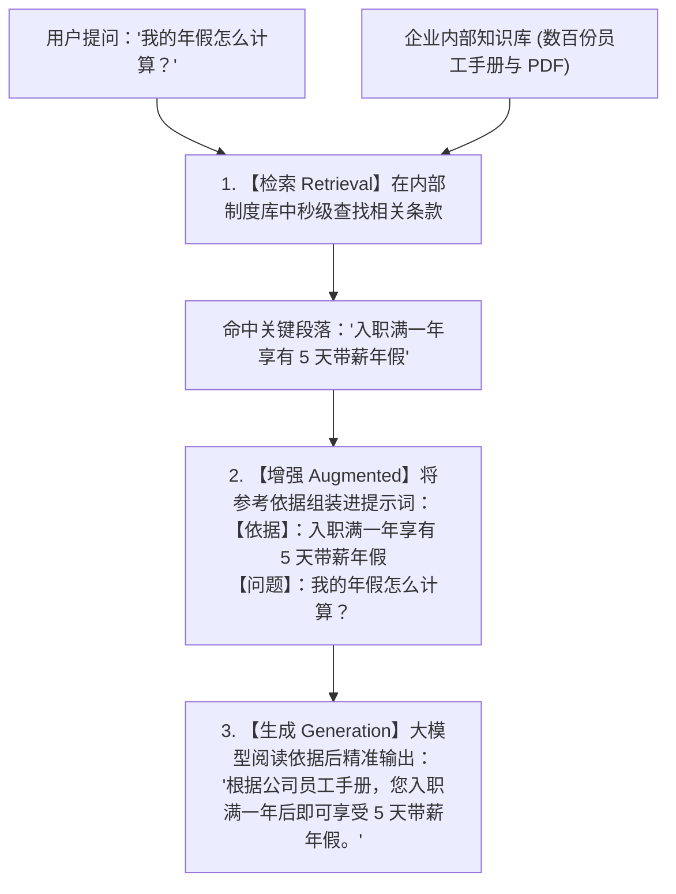
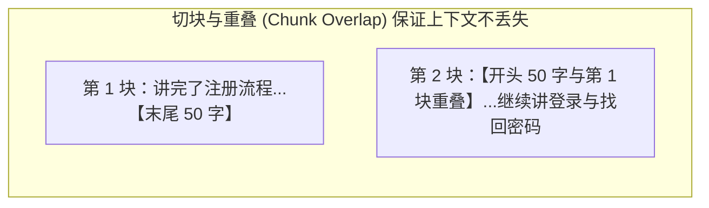
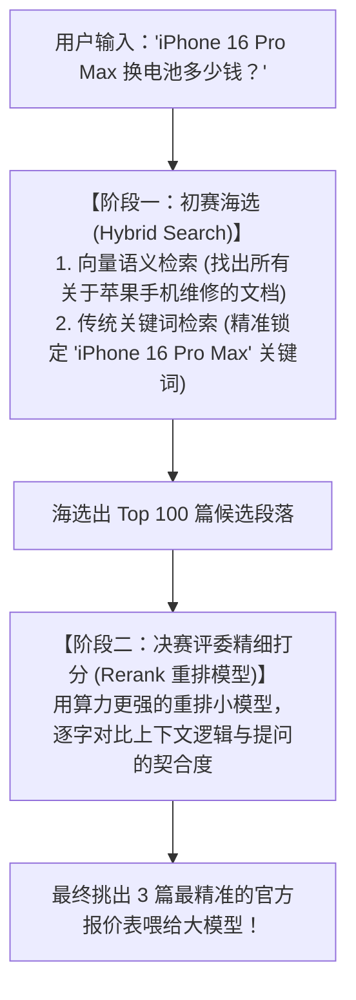

# 2.8 RAG 知识库与向量存储：给 AI 备一本随时可查的“开卷参考书”

> **大白话一句话概括**：没有 RAG 的大模型是在参加“闭卷考试”，只能凭脑子里的记忆瞎编；有了 RAG，大模型就变成了参加“开卷考试”，先去书架上秒级翻出最相关的两页参考书，照着书本一字不差地回答你！

---

## 📚 为什么 RAG 是解决 AI 幻觉的灵丹妙药？

大模型之所以会“一本正经胡说八道”，是因为它的训练数据有截止日期，且它完全不知道你公司的内部私有制度。

- **日常生活比喻**：
  - 如果你去问一个刚毕业的大学生：“我们公司今年出差住酒店每晚报销上限是多少？”
  - 学生就算再聪明也答不上来，只能瞎猜。
  - 但如果你把**《2026年公司最新差旅报销制度.pdf》**递到他手里说：“翻开第 5 页，念给我听”，他就能 100% 精准报出正确数字！这就是 **RAG（检索增强生成）** 的本质。



---

## 🧭 什么是 Embedding（向量化）？—— 相亲角红娘打分大比喻

计算机根本不认识汉字，它如何知道“西红柿”和“番茄”是同一个东西？

- **相亲角打分雷达图比喻**：
  - 红娘把每个人的条件量化成一串多维数字坐标：`[年龄, 身高, 年收入, 兴趣爱好倾向, ...]`；
  - 当两个人的多维坐标在几何空间里的**夹角极小（余弦相似度 Cosine Similarity 极高）**时，红娘就会把他们精准匹配在一起！

```
"西红柿炒蛋" ➔ [ 0.92, -0.31,  0.88, ... ]
"番茄炒鸡蛋" ➔ [ 0.91, -0.30,  0.87, ... ]  (空间距离极其贴近！相似度 99%)
"挖掘机修理" ➔ [-0.45,  0.82, -0.61, ... ]  (空间距离极其遥远！相似度 2%)
```

---

## 🍰 文档切块（Chunking）与重叠（Overlap）千层饼心法

把一本 500 页的《产品手册》存入向量数据库前，必须把它切成一段段 500 字左右的“小薄片（Chunks）”：



- **为什么必须有重叠（Overlap）？**：
  - 如果刚好一句话在正中间被切断（“前一半在第 1 块，后一半在第 2 块”），语义就支离破碎了。保留 50 字的重叠就像“做千层饼”，保证任何一段上下文都不会漏网！

---

## 🎯 混合检索（Hybrid Search）与重排（Rerank）—— 选秀大赛大比喻

工业级 RAG 之所以准，是因为它采用了**“海选 + 决赛精评”**的两阶段打法：



---

## 🗄️ 主流向量数据库全家桶与官网

| 向量数据库 | 官网链接 | 核心定位与特色 |
| :--- | :--- | :--- |
| **Qdrant** | [https://qdrant.tech](https://qdrant.tech) | 用 Rust 语言编写的高性能开源向量数据库，响应极快、内存占用极低 |
| **Pinecone** | [https://www.pinecone.io](https://www.pinecone.io) | 全球最火的云原生托管向量库，免除一切服务器运维烦恼 |
| **Milvus** | [https://milvus.io](https://milvus.io) | 专为百亿级超大规模数据检索打造的开源工业级分布式向量数据库 |
| **Chroma** | [https://www.trychroma.com](https://www.trychroma.com) | 最适合本地实验和小项目的轻量级开源嵌入式向量库，Python 几行代码跑通 |
| **pgvector** | [https://github.com/pgvector/pgvector](https://github.com/pgvector/pgvector) | PostgreSQL 官方向量插件，无需额外买新数据库，在已有 SQL 库里直接存向量 |
