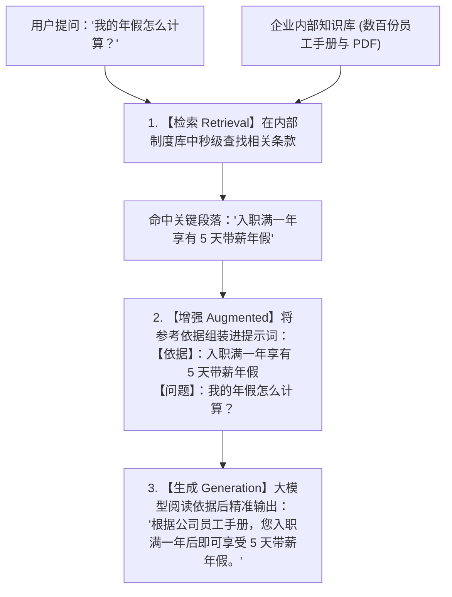
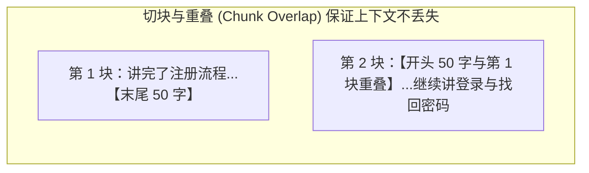
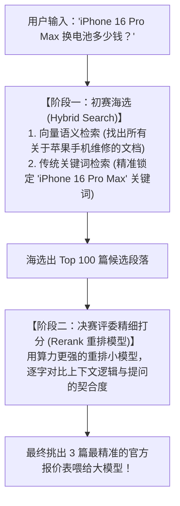
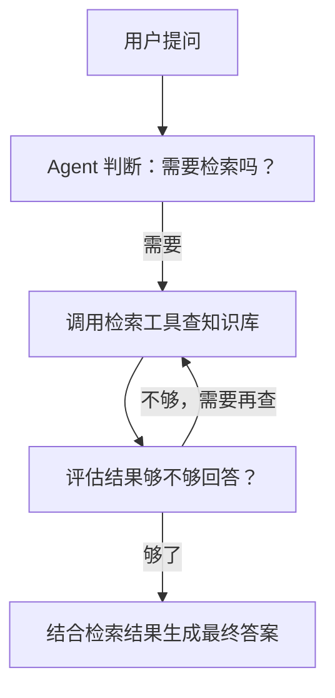

# 2.8 RAG 知识库与向量存储：给 AI 备一本随时可查的“开卷参考书”

> 没有 RAG 的大模型是在参加“闭卷考试”，只能凭脑子里的记忆瞎编；有了 RAG，大模型就变成了参加“开卷考试”，先去书架上秒级翻出最相关的两页参考书，照着书本一字不差地回答你！

***

## 📚 为什么 RAG 是解决 AI 幻觉的灵丹妙药？

大模型之所以会“一本正经胡说八道”，是因为它的训练数据有截止日期，且它完全不知道你公司的内部私有制度。

- **日常生活比喻**：
  - 如果你去问一个刚毕业的大学生：“我们公司今年出差住酒店每晚报销上限是多少？”
  - 学生就算再聪明也答不上来，只能瞎猜。
  - 但如果你把\*\*《2026年公司最新差旅报销制度.pdf》\*\*递到他手里说：“翻开第 5 页，念给我听”，他就能 100% 精准报出正确数字！这就是 **RAG（检索增强生成）** 的本质。



***

## 🧭 什么是 Embedding（向量化）？—— 相亲角红娘打分大比喻

计算机根本不认识汉字，它如何知道“西红柿”和“番茄”是同一个东西？

- **相亲角打分雷达图比喻**：
  - 红娘把每个人的条件量化成一串多维数字坐标：`[年龄, 身高, 年收入, 兴趣爱好倾向, ...]`；
  - 当两个人的多维坐标在几何空间里的\*\*夹角极小（余弦相似度 Cosine Similarity 极高）\*\*时，红娘就会把他们精准匹配在一起！

```
"西红柿炒蛋" ➔ [ 0.92, -0.31,  0.88, ... ]
"番茄炒鸡蛋" ➔ [ 0.91, -0.30,  0.87, ... ]  (空间距离极其贴近！相似度 99%)
"挖掘机修理" ➔ [-0.45,  0.82, -0.61, ... ]  (空间距离极其遥远！相似度 2%)
```

***

## 🍰 文档切块（Chunking）与重叠（Overlap）千层饼心法

把一本 500 页的《产品手册》存入向量数据库前，必须把它切成一段段 500 字左右的“小薄片（Chunks）”：



- **为什么必须有重叠（Overlap）？**：
  - 如果刚好一句话在正中间被切断（“前一半在第 1 块，后一半在第 2 块”），语义就支离破碎了。保留 50 字的重叠就像“做千层饼”，保证任何一段上下文都不会漏网！

***

## 🎯 混合检索（Hybrid Search）与重排（Rerank）—— 选秀大赛大比喻

工业级 RAG 之所以准，是因为它采用了\*\*“海选 + 决赛精评”\*\*的两阶段打法：



***

## 🗄️ 主流向量数据库全家桶与官网

| 向量数据库        | 官网链接                                   | 核心定位与特色                                     |
| :----------- | :------------------------------------- | :------------------------------------------ |
| **Qdrant**   | <https://qdrant.tech>                  | 用 Rust 语言编写的高性能开源向量数据库，响应极快、内存占用极低          |
| **Pinecone** | <https://www.pinecone.io>              | 全球最火的云原生托管向量库，免除一切服务器运维烦恼                   |
| **Milvus**   | <https://milvus.io>                    | 专为百亿级超大规模数据检索打造的开源工业级分布式向量数据库               |
| **Chroma**   | <https://www.trychroma.com>            | 最适合本地实验和小项目的轻量级开源嵌入式向量库，Python 几行代码跑通       |
| **pgvector** | <https://github.com/pgvector/pgvector> | PostgreSQL 官方向量插件，无需额外买新数据库，在已有 SQL 库里直接存向量 |

***

## 🧬 RAG 的进化：从标准 RAG 到 LLM Wiki

前面讲的“检索 → 增强 → 生成”是最基础的**标准 RAG（Naive RAG）**。随着应用越来越复杂，业界又进化出了更聪明的形态：

| 形态              | 核心思路                            | 生活比喻                | 适合场景             |
| :-------------- | :------------------------------ | :------------------ | :--------------- |
| **标准 RAG**      | 一次检索、一次生成，直接给答案                 | 翻一次书、照着念            | 简单问答、FAQ、私有制度查询  |
| **Agentic RAG** | 用 Agent 自主决定“查不查、查几次、怎么查”，可多轮迭代 | 有脑子的图书管理员，自己判断要不要再查 | 复杂多步问题、需要推理判断的场景 |
| **图 RAG**       | 把实体与关系建成知识图谱，支持全局 / 多跳推理        | 查“人物关系族谱图”，不只看单页    | 全局总结、实体关系、多跳问答   |

### 1. 标准 RAG（Naive RAG）：一把梭的“翻书—照念”

- **流程**：用户提问 → 向量检索最相关的 chunks → 拼进提示词 → 生成回答；
- **优点**：实现简单、速度快、成本低，覆盖大多数常见场景；
- **缺点**：只做一次检索，问题绕一点就答不准；对“全局性”问题（如“这整个项目到底讲了什么”）几乎无能为力。

### 2. Agentic RAG：有脑子的“图书管理员”

- **本质**：在 RAG 外面套一层 Agent，让模型**自己决定**要不要查、用什么工具查、查完是否还要再查；
- **生活比喻**：不再是机械地翻一次书，而是会追问的管理员——“您要 2026 年版本还是 2025 年版本？我再翻两本交叉验证一下再回答您。”



- **优点**：能处理多步、复杂的检索任务，答案更准；
- **缺点**：引入循环，更慢、更烧 Token（呼应 2.4 章的 Agent 机制）。

### 3. 图 RAG（GraphRAG）：能查“关系网”的知识图谱

- **本质**：先把文档抽成\*\*“实体 + 关系”的知识图谱\*\*（如“小明 —任职于→ 科技公司 —研发→ AI 系统”），再在图上做全局检索与多跳推理；
- **生活比喻**：标准 RAG 是“翻到某一页”，图 RAG 是“查一张人物关系族谱图”，能顺着关系一路推演；
- **典型能力**：
  - 全局总结：“这份 500 页报告的核心主题是什么？”（标准 RAG 很难答好）；
  - 多跳推理：“哪些员工同时参与过 A 和 B 两个项目？”
- **代表实现**：微软开源的 [GraphRAG](https://github.com/microsoft/graphrag)。

### 4. 进阶 RAG（Advanced RAG）与模块化 RAG（Modular RAG）

- **进阶 RAG**：在标准 RAG 的“检索前 + 检索后”两个环节做精细化优化：
  - 检索前（Pre-retrieval）：**查询改写 / 查询路由 / 切块优化**，让问题问得更准；
  - 检索后（Post-retrieval）：**重排（Rerank）/ 上下文压缩**，只把最精华的部分喂给模型（呼应前面“海选 + 决赛精评”）；
- **模块化 RAG**：业界最新分类法——把整个流程拆成**检索、记忆、融合、路由、预测**等独立模块，像搭积木一样自由组合，甚至可以"先调用工具再检索""生成后自我反思"。

### 5. 自我纠错类 RAG（Self-RAG / CRAG / Adaptive RAG）

- **Self-RAG**：模型生成答案时**给自己打分反思**，不满意就重写；
- **CRAG（Corrective RAG）**：先检索，若结果质量差就**自动修正、换路**（改走网络搜索或数据库查询）；
- **Adaptive RAG**：用一个“路由器”判断“这个问题要不要查库”——简单问题直接答，复杂问题才检索。

> 💡 这些都属“进阶 / 模块化”的衍生流派，理解思路即可；落地时大多由成熟的 Agentic RAG 框架替你封装好。

### 6. LLM Wiki：卡帕西提出的“编译器模式”新范式

- **是什么**：2026 年 4 月，Andrej Karpathy（OpenAI 联合创始人）提出的新型知识管理范式。核心思想是把传统 RAG 的“查询时做功”**整个反过来**——**知识只编译一次，之后持续维护更新**，而不是每次提问都重新检索拼接；
- **生活比喻**（卡帕西原话）：**Obsidian 是 IDE，大模型是程序员，维基就是代码库**——整个维基由大模型负责“编写”和“维护”，人只提供原始素材和维护规则；
- **三层架构**：
  1. **原始文档层**：论文、代码库、规章制度等事实源头（只读不改）；
  2. **维基内容层**：大模型编译出的结构化 Markdown 页面，带摘要、分类、语义内链，形成知识网络；
  3. **规则文件层**：AGENTS.md / CLAUDE.md 这类“运维手册”，约束模型如何分类、更新、处理矛盾。
- **vs 标准 RAG**：

| 对比维度     | 标准 RAG                   | LLM Wiki             |
| :------- | :----------------------- | :------------------- |
| **工作模式** | 解释器模式：每次查询临时检索拼接         | 编译器模式：导入时一次性编译成 Wiki |
| **依赖组件** | 向量库 + Embedding + Rerank | 仅需大模型 + Markdown 文件夹 |
| **知识积累** | 无沉淀，问 100 次都一样           | 复利效应，越用越“懂”，定期自检更新   |
| **擅长场景** | 快速、高频、碎片化问答              | 长期学习、知识沉淀、科研笔记       |

> 🔗 参考：Karpathy 原始 [GitHub Gist](https://gist.github.com/karpathy/442a6bf555914893e9891c11519de94f) 与开源实现 [llm\_wiki](https://github.com/nashsu/llm_wiki)。

> 💡 **选型建议**：快速碎片问答用标准 RAG；多轮推理用 Agentic RAG；全局 / 关系分析用 GraphRAG；长期知识沉淀、个人学习用 LLM Wiki——**别一上来就上重武器**。

***

## 🛠️ 主流 RAG 开发框架推荐

不用从零手搓 RAG，成熟框架已经把“切块、索引、检索、重排”全部封装好：

| 框架             | 官网                                      | 核心定位                               |
| :------------- | :-------------------------------------- | :--------------------------------- |
| **LlamaIndex** | <https://www.llamaindex.ai>             | 数据框架界的“瑞士军刀”，灵活组装任意数据源与检索策略        |
| **RAGFlow**    | <https://github.com/infiniflow/ragflow> | 中文友好、深度文档理解（PDF / 表格），开箱即用的 RAG 引擎 |
| **LangChain**  | <https://www.langchain.com>             | 最流行的大模型应用框架，内置 RAG 全套组件（详见 2.12 章） |
| **Haystack**   | <https://haystack.deepset.ai>           | 工业级 RAG 流水线，检索—重排—生成全流程编排          |
| **Dify**       | <https://dify.ai>                       | 可视化低代码搭建 RAG 应用，小白友好（后续章节实战）       |

### 重点推荐 1：LlamaIndex（数据框架“瑞士军刀”）

- **是什么**：专注“数据连接 + 索引 + 检索”的框架，特别适合**手搓定制化 RAG**；
- **核心概念**：`Document`（原始文档）→ `Node`（切块）→ `Index`（索引）→ `Retriever`（检索器）→ `QueryEngine`（问答引擎）；
- **最小代码示例**：

```python
from llama_index.core import VectorStoreIndex, SimpleDirectoryReader

# 1. 读取本地文档（PDF / Word / Markdown 等）
documents = SimpleDirectoryReader("./docs").load_data()

# 2. 自动切块 + 向量化 + 建索引
index = VectorStoreIndex.from_documents(documents)

# 3. 开箱即用：提问并得到带引用的回答
query_engine = index.as_query_engine()
response = query_engine.query("我们公司年假怎么算？")
print(response)
```

### 重点推荐 2：RAGFlow（中文友好、深度文档理解）

- **是什么**：开源 RAG 引擎，最擅长**读懂复杂 PDF / Word / 表格**（版面分析、OCR、表格抽取），中文效果一流；
- **核心优势**：内置“深度文档理解”、引用溯源、可视化知识库管理界面，部署后点点鼠标就能建知识库；
- **适合谁**：不想写太多代码，或文档以中文 PDF / 表格为主、需要精确引用的团队。

> 🎯 一句话选型：**想高度定制 → LlamaIndex；要开箱即用 + 中文文档理解 → RAGFlow；要可视化低代码 → Dify**。

