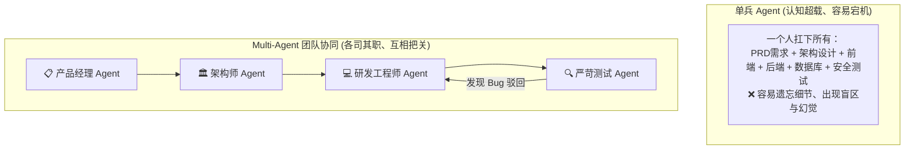
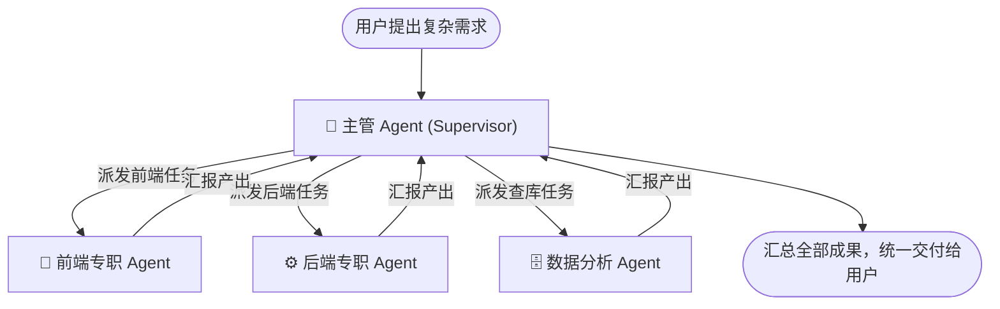
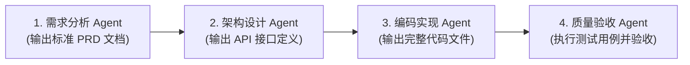
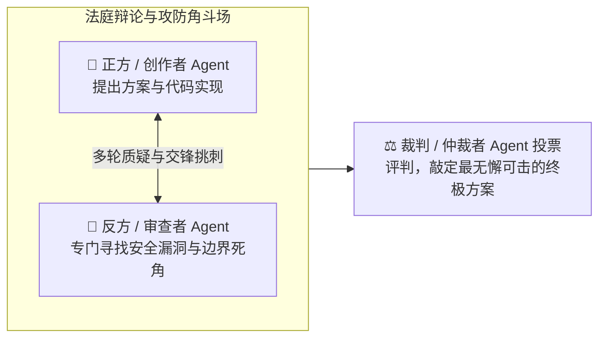
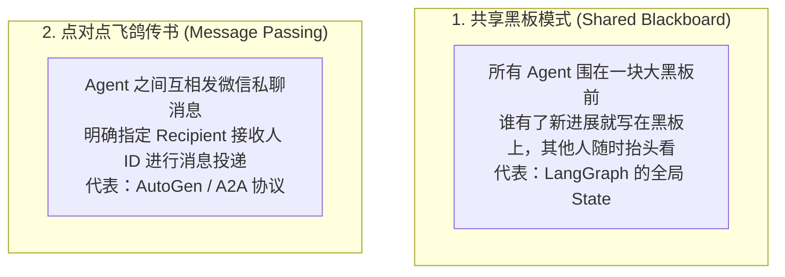

# 2.9 Multi-Agent（多智能体）：团队作战与七大核心协作范式

> 单个 Agent 就像一个“全能但精力有限的个人英雄”，事情一复杂就会顾此失彼、大脑宕机；而 Multi-Agent 则是“组建一个专业分工的数字化虚拟团队”——让懂设计的管 UI、懂数据库的管存储、专职找茬的当测试，几个人在会议室里分工协同，爆发出十倍于单兵的战斗力！

***

## 👥 为什么单兵 Agent 会“力不从心”？（痛点拆解）

很多人问：“既然大模型已经这么聪明了，为什么不直接让一个 Agent 把整个大项目写完？”

- **上下文窗口被塞爆**：单兵 Agent 又要读设计图、又要查数据库表、又要改代码、又要看报错日志，很快就会把有限的上下文塞满，导致“顾头不顾尾”；
- **角色混乱（Role Confusion）**：让同一个 AI “既当运动员（写代码），又当裁判员（找 Bug）”，它往往很难发现自己潜意识里的逻辑漏洞；
- **专业深度不够**：现实世界里没有人能同时是顶级全栈、顶级安全黑客和顶级产品经理，**专精分工才是工业化生产的唯一解法！**

***

## 🏛️ Multi-Agent 七大核心协作范式大白话精讲

在现代多智能体系统（如 MetaGPT、ChatDev、LangGraph、OpenAI Swarm）中，有五种最经典的基础协作范式；随着 Agent 生态爆发，又演化出两种更前沿的高级范式，共七大核心协作范式：

***

### 1. 中心化监工 / 调度分发范式（Supervisor Pattern）

- **日常生活比喻**：**医院的“导医台”与“专家门诊”**。
  - 你去医院看病，先到导医台（Supervisor）；
  - 导医台听完你的症状，把骨折的你分流到**骨科诊室（骨科 Agent）**，把发烧的你分流到**发热门诊（内科 Agent）**；
  - 各科室医生看完了，把诊断报告交回给导医台汇总出院。

***

### 2. 顺序线性流水线范式（Sequential / Pipeline Pattern）

- **日常生活比喻**：**传统报社的“采写编排印”流水线**。
  - **记者（Agent 1）** 负责去现场采写初稿 ➔ 产出传递给 ➔ **主编（Agent 2）** 负责审查政治合规与错别字 ➔ 产出传递给 ➔ **美工排版师（Agent 3）** 负责插图版面 ➔ **印刷厂（Agent 4）** 出报纸。
- **特点**：前一个 Agent 的输出，作为后一个 Agent 的输入，环环相扣，极为严谨。

***

### 3. 树状层级分权范式（Hierarchical / Tree-based Pattern）

- **日常生活比喻**：**跨国大厂的管理金字塔**。
  - **集团 CEO Agent** 制定年度战略（如“进军东南亚电商市场”）；
  - **事业部 VP Agent** 拆解为季度 KPI（“开发多语言支付网关”）；
  - **技术组长 Agent** 细化为具体开发任务，指派给手底下的**一线搬砖 Agent** 执行。
- **特点**：适合规模极其庞大、跨学科、跨层级的超级复杂工程。

***

### 4. 辩论对抗与共识范式（Debate / Consensus / Red-Blue Teaming）

- **日常生活比喻**：**法庭审判** 与 **网络攻防演练**。
  - **法官** 坐在台上，**原告律师 Agent** 和 **被告律师 Agent** 各自列举证据展开唇枪舌剑的多轮交锋；
  - **红队（黑客攻击 Agent）** 疯狂寻找系统漏洞，**蓝队（安全防御 Agent）** 见招拆招拼命打补丁。
- **为什么它极其强大？**：研究表明，让两个立场相反的 Agent 互相挑刺辩论 3 轮，**能消除 90% 以上由单一大模型产生的幻觉与盲目自信**！

***

### 5. 动态自组织蜂群范式（Swarm / Decentralized Handoff）

- **日常生活比喻**：**大自然里的蚂蚁搬家与蜜蜂采蜜**。
  - 蚁群里没有一个中央发号施令的“大统领”，每只蚂蚁在路上遇到食物，就会根据信息素动态把任务\*\*转交（Handoff）\*\*给最近的同伴。
- **代表项目**：[OpenAI Swarm](https://github.com/openai/swarm)
- **核心机制**：Agent 之间是扁平平等的。客服 Agent 聊到一半，发现用户要退款，直接一句 `handoff_to_refund_agent()` 把当前对话棒子交给退款专员，无需经过中间主管中转。

***

### 6. 嵌套递归范式（Nested / Recursive Pattern）

- **日常生活比喻**：**跨国集团层层分包**——区域分公司接到大单，再拆成小单分包给下面的项目组，项目组还能继续往下拆给小组。每个 Agent 都“上有老、下有小”。
- **核心机制**：主 Agent 把子任务委派给子 Agent，子 Agent 发现自己任务还是太复杂，**还能再开一层孙 Agent**，递归到底，直到每个最小任务都被一个专职 Agent 接手。
- **代表工具**：Claude Code 的 Subagents、LangGraph 嵌套子图。

***

### 7. 动态自编排 / 自我架构范式（Auto-Orchestration / Self-Architecting Pattern）

- **日常生活比喻**：**一位总导演拿到剧本后，当场根据剧情需要临时组建剧组**——需要爆破戏就临时请特技组，需要古装就临时雇造型师，全部即插即用，不需要人类预先排好岗位表。
- **核心机制**：主 Agent **自主决定**“要不要并行、创建多少个专业子 Agent、怎么分工委派、何时汇总”，**无需任何预定义角色或手工设计的工作流**——这和前面需要人类设计的 Supervisor、需要代码写死的 Handoff 完全不同。
- **代表工具**：**Kimi Agent Swarm（智能体集群）**、OpenAI AgentKit。

> 🔥 第 7 种是目前最前沿的范式趋势：**把“谁干活、怎么分工”从“人设计”变成“模型自组织”**。

***

## 📡 多智能体之间如何共享信息？（两大主流流派）

***

## ⚠️ Multi-Agent 的三大避坑指南

1. **防范“无限乒乓死循环”**：
   - 两个 Agent 互相客套（“你写得真棒，请您再过目” ➔ “您才是大师，您先请”），几分钟内烧光几十万 Token。必须给团队设定**硬性的最大轮数（Max Turns）**！
2. **通信开销膨胀**：
   - 10 个人在群里开会，消息量是指数级爆炸。只把必要的信息传递给相关人员，禁止全员全量广播废话；
3. **幻觉放大效应**：
   - 如果第一个 Agent 的 PRD 假定了错误的前提，后续所有 Agent 可能会在这个错误的地基上“一本正经地越盖越高”。因此在关键交接节点必须引入**自动化测试或人类审核（HITL）**。

***

## 🛠️ 真实工具实战：七大范式 × 代表框架对照表

| 范式                          | 代表框架 / 真实工具                                                                                                           |
| :-------------------------- | :-------------------------------------------------------------------------------------------------------------------- |
| 1. 中心化监工 Supervisor         | [LangGraph](https://www.langchain.com/langgraph) 主管 Agent、[CrewAI](https://www.crewai.com)                            |
| 2. 顺序流水线 Pipeline           | LangChain LCEL、[Haystack](https://haystack.deepset.ai) 流水线                                                            |
| 3. 树状层级 Hierarchical        | [AutoGen](https://github.com/microsoft/autogen)、CrewAI 分层流程                                                           |
| 4. 辩论对抗 Debate              | [CAMEL](https://github.com/camel-ai/camel)、AutoGen GroupChat                                                          |
| 5. 蜂群转交 Swarm / Handoff     | [OpenAI Swarm](https://github.com/openai/swarm) / [OpenAI Agents SDK](https://openai.github.io/openai-agents-python/) |
| 6. 嵌套递归 Nested              | [Claude Code Subagents](https://docs.anthropic.com/en/docs/claude-code/sub-agents)、LangGraph 嵌套子图                     |
| 7. 动态自编排 Auto-Orchestration | **Kimi Agent Swarm**、OpenAI AgentKit                                                                                  |

***

## 🐝 深度解读：Kimi Agent Swarm（智能体集群）

第 7 种范式（动态自编排）目前最出圈的落地代表，就是月之暗面 Kimi 的 **Agent Swarm（智能体集群）**：

- **是什么**：Agent Swarm 由月之暗面随 Kimi 系列模型持续迭代，本质是一个\*\*“水平扩展”架构\*\*——不是人类预先设计好的多智能体协作，而是**主 Agent 自己决定**如何拆解任务、雇多少“分身”、如何并行委派。
- **📈 Kimi 系列 Agent 能力迭代时间线**：

| 版本            | 发布时间       | 定位                  | Agent Swarm 关键变化                                                                   |
| :------------ | :--------- | :------------------ | :--------------------------------------------------------------------------------- |
| **K2.5**      | 2026-01-27 | 首次引入 Agent Swarm    | 最多 100 个子智能体并行、约 1500 次工具调用                                                        |
| **K2.6**      | 2026-04-20 | Swarm 大升级并开源        | 扩展到 300 个子智能体、单任务 4000+ 次工具调用，比单 Agent 快 **4.5 倍**                                 |
| **K2.7 Code** | 2026-06-12 | 编程 + Agent 专用化      | 推理 Token 减少约 **30%**，MCP 工具调用大幅增强（MCPMark Verified 81.1，超过 Claude Opus 4.8）        |
| **K3**        | 2026-07-16 | 新一代旗舰，Swarm 由 K3 驱动 | **2.8 万亿**参数 MoE（896 专家激活 16）、**100 万 Token** 上下文、KDA 线性注意力、最长 **48 小时**长效自主 Agent |

- **技术原理**：依托 **PARL（并行智能体强化学习）**，把“编排能力”直接训练进模型，让模型会自己当“包工头”。
- **实战案例**：让它“挖掘 100 个 YouTube 细分领域的 Top3 创作者”——系统自动创建 100 个研究员子智能体并行搜索，完成后汇总成结构化成果，原本数小时的工作几分钟搞定。
- **怎么用**：网页版 [kimi.com/agent-swarm](https://www.kimi.com/agent-swarm)，或 Kimi App 切换 K3 集群模型。
- **vs OpenAI Swarm**：OpenAI Swarm 是开发者**用代码手工定义** Agent 与 handoff 交接；Kimi Agent Swarm 则是**模型自主编排（自我架构）**，无需写任何编排代码，门槛更低。

> 💡 一句话：**Kimi 把“谁干活、怎么分工”从“程序员写代码设计”变成了“模型自己组织”**——这正是 Multi-Agent 走向“自我架构”的最新方向。

***

## 🔗 相关权威开源框架与经典论文

- [MetaGPT 官方开源仓库 (GitHub)](https://github.com/geekan/MetaGPT) —— 多智能体模拟软件公司的开山鼻祖
- [ChatDev 官方开源仓库 (GitHub)](https://github.com/OpenBMB/ChatDev) —— 虚拟软件开发团队多 Agent 协作平台
- [OpenAI Swarm 实验性蜂群多智能体框架](https://github.com/openai/swarm)
- [CAMEL: Communicative Agents for "Mind" Exploration (经典论文)](https://arxiv.org/abs/2303.17760)

