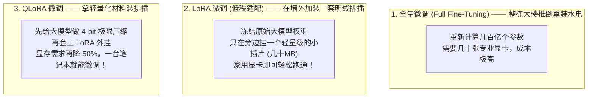

# 2.10 模型微调与量化技术：专科深造与轻量化瘦身秘籍

> **大白话一句话概括**：微调（Fine-Tuning）是把一个“通识教育毕业的大学生”送去“医学院做专科深造”，让它彻底熟悉行业术语与特定行为规范；而量化（Quantization）则是给庞大的模型“做高清转码瘦身”，让原本需要几十万服务器的庞然大物，在你的家用电脑甚至轻薄本上飞快跑起来！

---

## 🎓 为什么需要微调？（专科深造大比喻）

预训练出厂的大模型（如通用开源模型 Llama 或 DeepSeek）就像一个精通琴棋书画的博学才子，但如果你让它为一家银行输出**格式严丝合缝、完全没有多余废话的金融合规报表**，它可能会忍不住跟你闲聊几句。

**微调（SFT / 监督微调）** 就是给它准备几千条“标准参考答案”，强行纠正它的表达习惯和输出格式：


---

## 🛠️ 三大微调流派大白话拆解



---

## 🤔 终极灵魂发问：什么时候该用 RAG？什么时候该用微调？

记住这个**黄金口诀**，永远不花冤枉钱：

> **“想让 AI 查最新知识、查私有资料 ➔ 用 RAG！”**
> **“想让 AI 改说话风格、按死规定输出特定格式 ➔ 用微调！”**

| 对比维度 | RAG (检索增强生成) | 微调 (Fine-Tuning) |
| :--- | :--- | :--- |
| **日常生活比喻** | **开卷考试，随手翻看参考资料** | **闭卷考试前背熟特定解题模版与格式套路** |
| **适用场景** | 注入公司最新制度、实时新闻、海量 PDF | 强行约束输出严格 JSON、教模型学会特定方言文风 |
| **更新成本** | 极低（直接上传新文档，秒级生效） | 较高（数据更新后需要重新花算力训练） |
| **消除幻觉** | 极强（白纸黑字照着参考资料念） | 较弱（依然存在概率性编造） |

---

## 📉 什么是量化（Quantization）？—— 4K 电影转 1080P 大比喻

大模型原本的每一个参数都是用极其精准的高精度浮点数（FP16 / 16位）存储的，一个 700 亿参数（70B）的模型文件足足有 **140 GB**，必须用几张昂贵的高端显卡才能装得下。

- **日常生活比喻**：
  - 就像一部未经压缩的 4K 蓝光无损电影足足有 100GB，你的手机根本装不下；
  - 经过优秀的编码器压缩成 1080P 高清版后，体积缩小到了 **20GB**，但在手机屏幕上看**肉眼几乎分辨不出任何画质差别**！

```
高精度浮点 (FP16):  3.1415926535... ➔ 占 16 位空间
4-bit 量化整数 (INT4): 3               ➔ 仅占 4 位空间 (体积暴降 75%！)
```

- **目前最火的量化格式**：[GGUF（搭配 Ollama / llama.cpp）](https://ollama.com)、AWQ、EXL2，让你在 16GB 内存的 MacBook 或家用电脑上就能流畅本地畅玩大模型！

---

## 🔗 相关开源工具与官方平台

- [Ollama 官方网站](https://ollama.com) —— 全球最火爆的本地一键运行大模型神器
- [llama.cpp 官方开源仓库 (GitHub)](https://github.com/ggerganov/llama.cpp) —— GGUF 格式的开山鼻祖
- [Unsloth 开源微调平台](https://github.com/unslothai/unsloth) —— 提速 5 倍、节省 80% 显存的极速微调工具
- [Hugging Face PEFT 官方库](https://github.com/huggingface/peft) —— 官方维护的 LoRA 微调标准库
