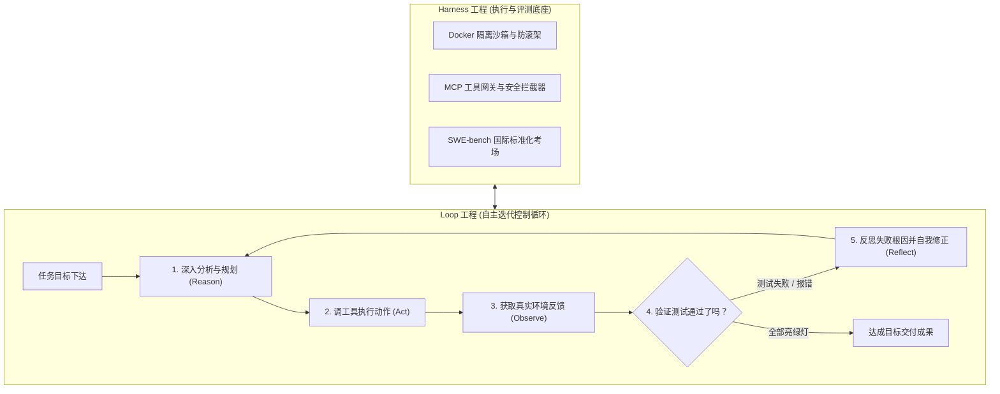
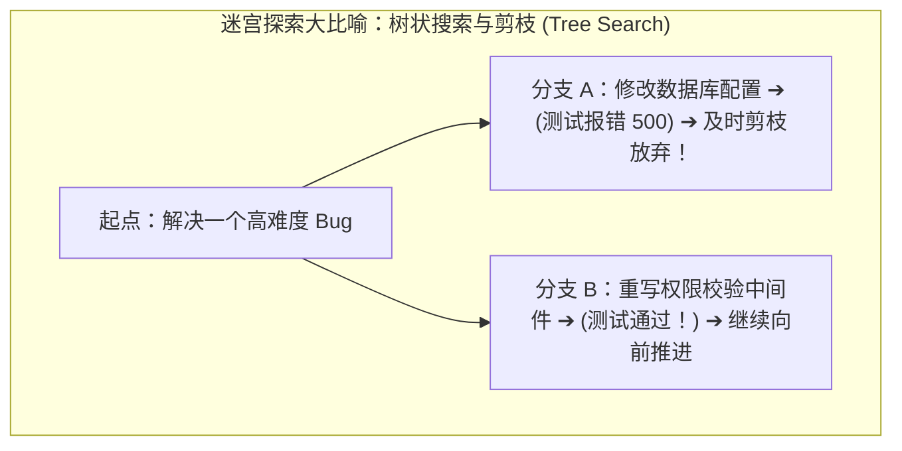

# 2.11 Harness 工程与 Loop 工程：从单次问答到自主工业级闭环

> 大模型就像一台“大马力引擎”，**Harness 工程** 是给这台引擎装上专业赛车底盘、方向盘、油门刹车（工具）、防滚架（沙箱）和专业测速考场的“整车与测试工程”；而 **Loop 工程** 则是让赛车在复杂赛道上“看路况、自动修正转向、遇障避险、自主跑完全程”的自动驾驶控制系统！

---

## 🏎️ 为什么 2026 年大家都在谈 Harness 和 Loop？

在早期，大家以为只要提示词写得好，AI 就能无所不能。但到了工业落地阶段，工程师们发现：
1. **光有聪明的大脑（模型）远远不够**：如果没有隔离的沙箱、没有工具拦截网关、没有科学的评测基准，模型就会成为“不可控的黑盒”；
2. **真实任务必须多步循环**：解决一个真实系统的 Bug，往往需要 10~30 步“探索代码 ➔ 尝试修改 ➔ 运行报错 ➔ 自我反思 ➔ 再次测试”的闭环迭代。

---

## 🏗️ 深入拆解 Harness 工程（生产支架与考场）

**Harness** 的原意是“马鞍 / 挽具 / 固定支架”。在现代 AI 体系中分为两大方向：

### 1. 运行支架：Agent Harness（生产运行环境）
- **日常生活比喻**：**全封闭无菌手术室与专业外科工具台**。
- **核心组件**：
  - **沙箱隔离（Sandbox）**：通过 Docker 容器或轻量虚拟机，让 Agent 拥有独立的操作系统环境，即使在里面执行了破坏性命令，也绝不会损坏宿主电脑；
  - **安全护栏（Guardrails）**：实时拦截高危操作（如泄露密码、向外发送垃圾邮件、违规删库）；
  - **状态快照与回滚**：随时记录系统的当前快照，一旦发现 Agent 逻辑走偏，瞬间回滚到上一步。

### 2. 评测支架：Eval Harness（全球标准化大考场）
- **日常生活比喻**：**国家级驾照封闭考场**。
- **代表标杆 —— [SWE-bench](https://www.swebench.com)**：
  - 全球公认最权威的软件工程基准测试。
  - **考试流程**：Eval Harness 自动拉取真实的开源项目历史 Issue，启动干净容器，把问题丢给 Agent；
  - Agent 在规定时间内自主翻看代码、改动文件；最后由 Eval Harness 自动运行隐藏的测试用例，只有**所有用例 100% 全部通过**，才算成功解决（Resolved）！

---

## 🔄 深入拆解 Loop 工程（控制闭环与自愈心法）

**Loop 工程（循环工程）** 专注于设计 Agent 的自我修正机制与生命周期控制：

### 核心四大安全防翻车机制

| 安全机制 | 避免了什么恶性事故？ | 日常生活比喻 |
| :--- | :--- | :--- |
| **死循环检测 (Infinite Loop Guard)** | AI 陷入“改错 ➔ 还原 ➔ 再改错 ➔ 再还原”的死胡同 | 扫地机器人卡在桌角时，连续碰撞 3 次自动倒车换方向 |
| **Token 与成本预算熔断** | 后台任务失控，一夜之间烧光几千元 API 余额 | 手机设置单月流量封顶，超标立刻自动断网保护钱包 |
| **最大步数限制 (Max Iterations)** | 任务漫无目的，一直卡在死循环里空转 | 考场敲钟交卷，哪怕没做完也必须立刻停笔输出总结 |
| **状态快照回滚 (Checkpoint Rollback)** | 发现前 10 步方向全错了，越改越烂 | 玩单机游戏时一键读取 10 分钟前的存盘点推倒重来 |

---

## 🔗 相关权威官方与学术链接

- [SWE-bench 官方基准测试与排行榜](https://www.swebench.com) —— 衡量真实软件工程 Agent 水平的全球黄金标准
- [Reflexion: Language Agents with Verbal Reinforcement Learning (经典论文)](https://arxiv.org/abs/2303.11366)
- [Anthropic Building Effective Agents 研究报告](https://www.anthropic.com/research/building-effective-agents)
- [OpenHands (原 OpenDevin) 架构与 Harness 设计文档](https://docs.openhands.ai)
