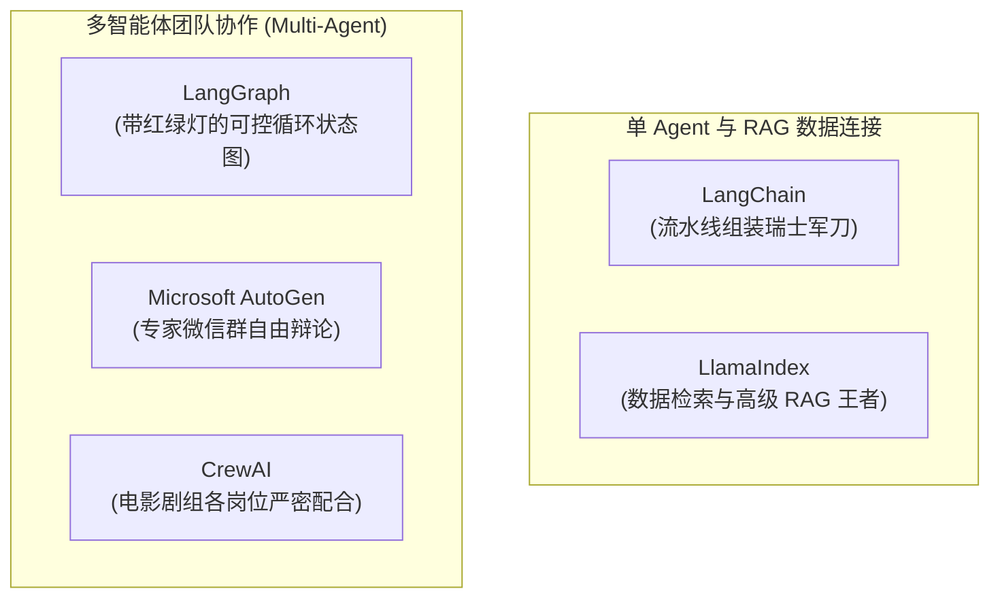

# 2.12 主流开发框架全景：LangChain、LangGraph、AutoGen 与 CrewAI

> **大白话一句话概括**：开发框架就像是搭建复杂 AI 系统的“现成乐高骨架与工业流水线”。在学完前面的大模型、Agent、上下文、RAG、Multi-Agent 几大范式后，本节带你盘点把这些理论落地的最强开源框架工具库！

---

## 🧭 主流 AI 开发框架核心全景



---

## 🔍 核心框架生活化深度剖析

### 1. [LangChain](https://www.langchain.com) —— 自来水管道拼接法（LCEL）
- **日常生活比喻**：**拼接自来水管道**。
- **核心机制**：通过统一的管道操作符 `|`，把输入、提示词、大模型、输出解析器像拼水管一样一气呵成：
  ```python
  # 提示词 | 喂给模型 | 解析成纯文本
  chain = prompt_template | chat_model | StrOutputParser()
  ```
- **核心定位**：生态最全、支持的模型和工具库最多，适合快速搭建标准化原型。

---

### 2. [LangGraph](https://www.langchain.com/langgraph) —— 带交警和红绿灯的环岛十字路口
- **日常生活比喻**：**复杂的城市交通环岛**。
- **三大核心要素**：
  - **State（共享记分黑板）**：所有 Agent 都能看到当前最新的全局状态数据；
  - **Nodes（执行工人节点）**：具体干活的函数或子 Agent（如“代码生成节点”、“代码测试节点”）；
  - **Edges（交警与路口指示牌）**：判断测试是否通过，没通过就**“掉头循环（Cyclic）”**回上一步重写，通过了才放行到终点！


---

### 3. [Microsoft AutoGen](https://microsoft.github.io/autogen/) —— 专家微信群自由辩论
- **日常生活比喻**：**拉一个各路专家云集的微信群（GroupChat）**。
- **核心机制**：群里有“数学家 Agent”、“程序员 Agent”、“批评家 Agent”。针对一个难题，大家在群里各抒己见、互相指出对方代码里的漏洞，最后由人类群主或总结 Agent 汇总出最优解。

---

### 4. [CrewAI](https://www.crewai.com) —— 严谨的电影剧组分工
- **日常生活比喻**：**好莱坞电影摄制组**。
- **核心机制**：
  - **编剧 Agent**（负责根据大纲写剧本） ➔ 产出传递给 ➔ **导演 Agent**（负责挑选拍摄机位） ➔ 产出传递给 ➔ **摄影 Agent** ➔ **剪辑 Agent**。
  - 每个岗位都有极其明确的职责（Role）、奋斗目标（Goal）与背景设定（Backstory），按部就班高效流水线作业。

---

### 5. [LlamaIndex](https://www.llamaindex.ai) —— 数据连接与高级 RAG 的天花板
- **官网**: [https://www.llamaindex.ai](https://www.llamaindex.ai) | **文档**: [https://docs.llamaindex.ai](https://docs.llamaindex.ai)
- **大白话介绍**: 专门为了把各种奇奇怪怪的企业数据（SQL、Notion、PDF、Excel）接入大模型而生。
- **杀手锏**: 拥有全世界最丰富的高级 RAG 检索策略（文档树状索引、知识图谱混合检索）。

---

## 📊 五大框架横向对比与选型指南

| 框架名称 | 上手难度 | 核心优势 | 最佳适用场景 |
| :--- | :--- | :--- | :--- |
| **LangChain** | 🟡 中等 | 生态最全面、连接器最丰富 | 快速调用 API 搭建原型、标准化链式调用 |
| **LangGraph** | 🔴 较高 | 状态管理极致严密、支持复杂循环与人工审核 | 企业级严肃生产系统、复杂的自主工作流 |
| **CrewAI** | 🟢 极低 | 角色定义极其直观、开箱即用 | 组建 AI 写作团队、市场分析团队、虚拟产品开发团队 |
| **AutoGen** | 🟡 中等 | 微软官方背书、多 Agent 对话探索能力极强 | 复杂研究性任务、探索式数据分析与编程协作 |
| **LlamaIndex** | 🟡 中等 | 检索精度极高、对复杂企业文档解析能力最强 | 严肃的企业知识库、跨数据源报表生成系统 |

---

## 🔗 官方文档与权威代码仓直达

- [LangChain 官方首页与文档](https://python.langchain.com)
- [LangGraph 官方架构教程](https://langchain-ai.github.io/langgraph/)
- [Microsoft AutoGen 官方网站](https://microsoft.github.io/autogen/)
- [CrewAI 官方开源平台](https://www.crewai.com)
- [LlamaIndex 官方知识检索库](https://www.llamaindex.ai)
