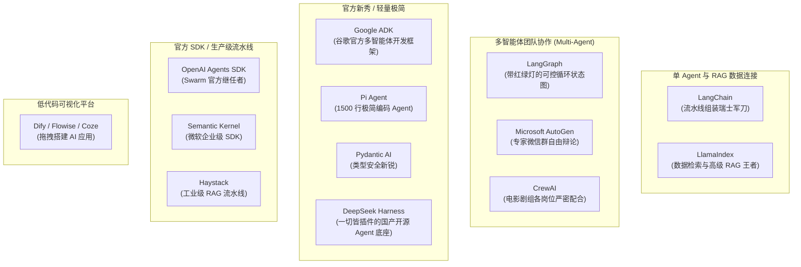
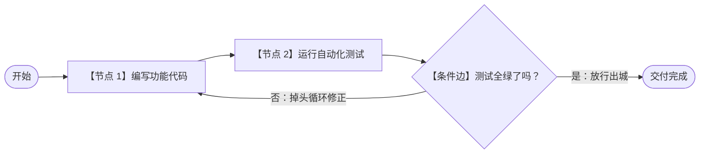

# 2.12 主流开发框架全景：LangChain、LangGraph、AutoGen 与 CrewAI

> 开发框架就像是搭建复杂 AI 系统的“现成乐高骨架与工业流水线”。在学完前面的大模型、Agent、上下文、RAG、Multi-Agent 几大范式后，本节带你盘点把这些理论落地的最强开源框架工具库！

---

## 🧭 主流 AI 开发框架核心全景



---

## 🔍 核心框架生活化深度剖析

### 1. [LangChain](https://www.langchain.com) —— 自来水管道拼接法（LCEL）
- **日常生活比喻**：**拼接自来水管道**。
- **核心机制**：通过统一的管道操作符 `|`，把输入、提示词、大模型、输出解析器像拼水管一样一气呵成：
  ```python
  # 提示词 | 喂给模型 | 解析成纯文本
  chain = prompt_template | chat_model | StrOutputParser()
  ```
- **核心定位**：生态最全、支持的模型和工具库最多，适合快速搭建标准化原型。

---

### 2. [LangGraph](https://www.langchain.com/langgraph) —— 带交警和红绿灯的环岛十字路口
- **日常生活比喻**：**复杂的城市交通环岛**。
- **三大核心要素**：
  - **State（共享记分黑板）**：所有 Agent 都能看到当前最新的全局状态数据；
  - **Nodes（执行工人节点）**：具体干活的函数或子 Agent（如“代码生成节点”、“代码测试节点”）；
  - **Edges（交警与路口指示牌）**：判断测试是否通过，没通过就**“掉头循环（Cyclic）”**回上一步重写，通过了才放行到终点！



---

### 3. [Microsoft AutoGen](https://microsoft.github.io/autogen/) —— 专家微信群自由辩论
- **日常生活比喻**：**拉一个各路专家云集的微信群（GroupChat）**。
- **核心机制**：群里有“数学家 Agent”、“程序员 Agent”、“批评家 Agent”。针对一个难题，大家在群里各抒己见、互相指出对方代码里的漏洞，最后由人类群主或总结 Agent 汇总出最优解。

---

### 4. [CrewAI](https://www.crewai.com) —— 严谨的电影剧组分工
- **日常生活比喻**：**好莱坞电影摄制组**。
- **核心机制**：
  - **编剧 Agent**（负责根据大纲写剧本） ➔ 产出传递给 ➔ **导演 Agent**（负责挑选拍摄机位） ➔ 产出传递给 ➔ **摄影 Agent** ➔ **剪辑 Agent**。
  - 每个岗位都有极其明确的职责（Role）、奋斗目标（Goal）与背景设定（Backstory），按部就班高效流水线作业。

---

### 5. [LlamaIndex](https://www.llamaindex.ai) —— 数据连接与高级 RAG 的天花板
- **官网**: [https://www.llamaindex.ai](https://www.llamaindex.ai) | **文档**: [https://docs.llamaindex.ai](https://docs.llamaindex.ai)
- **大白话介绍**: 专门为了把各种奇奇怪怪的企业数据（SQL、Notion、PDF、Excel）接入大模型而生。
- **杀手锏**: 拥有全世界最丰富的高级 RAG 检索策略（文档树状索引、知识图谱混合检索）。

---

### 6. [Google ADK（Agent Development Kit）](https://google.github.io/adk-docs/) —— 谷歌官方多智能体开发框架
- **是什么**：谷歌开源的 **code-first Python 框架**，用于构建、评估、部署 AI Agent。针对 Gemini 做了优化，但**模型无关、部署无关**，也兼容其他框架。
- **核心能力**：
  - **多智能体**：把专精 Agent 组合成层级结构协同作战；
  - **灵活编排**：既能走可预测的“工作流流水线”，也能用 LLM 动态路由；
  - **丰富工具生态**：预置工具 + 自定义函数，还能直接集成 LangChain / CrewAI；
  - **开发者体验**：自带 CLI 与浏览器 UI，逐步调试每一步执行轨迹；
  - **内置评测 + 一键部署**：可容器化到 Cloud Run / 自定义 Docker。
- **ADK 2.0 亮点**：新增 **Workflow Runtime 图执行引擎**——路由、扇出/扇入、循环、重试、状态管理、人类介入（HITL）一应俱全；
- **多语言支持**：Python / Go / TypeScript / Java / Kotlin（Android）。

---

### 7. [Pi Agent](https://pi.dev) —— 1500 行代码的极简编码 Agent
- **是什么**：由 Mario Zechner（libGDX 作者）创建、Earendil Works 维护的开源**极简编码 Agent 框架**。
- **核心哲学**：**“An autonomous agent is just an LLM + tools + a loop.”**（自主智能体 = 大模型 + 工具 + 一个循环）
- **极简到极致**：核心运行时只有 5 个文件、约 **1500 行 TypeScript**；系统提示词不到 **1000 token**；内置工具仅 **4 个**；
- **设计理念**：**“Primitives, not features”（提供原语，而非功能）**——像 Agent 世界的“Vim 哲学”，核心极简、能力全部由扩展按需加载；
- **四层包结构**：`pi-ai`（统一 30+ 模型 API）→ `pi-agent-core`（Agent 循环核心）→ `pi-coding-agent`（产品层 CLI/TUI）→ `pi-tui`；
- **刻意不内置**：MCP、子 Agent、Plan Mode、权限弹窗统统不做成标配，全部通过扩展实现（如 `pi-mcp-adapter`、`pi-subagents`）；
- **安装与使用**：`npm install -g @earendil-works/pi-coding-agent`，在项目目录运行 `pi` 即可；
- **实战表现**：Databricks 内部基准测试中，Pi 在 Claude Opus 4.8 上**通过率最高且成本显著低于 Claude Code / Codex**；Shopify 也直接用 Pi 扩展构建了 `pi-autoresearch`。

---

### 8. [OpenAI Agents SDK](https://openai.github.io/openai-agents-python/) —— Swarm 的官方继任者
- **是什么**：OpenAI 官方推出的多智能体开发 SDK（Python / JavaScript 双版本），是实验项目 **Swarm 的正统升级版**，基于最新的 Responses API 构建。
- **核心概念**：
  - **Agent（智能体）**：指令（Instructions）+ 工具（Tools）+ 模型组合成一个 Agent；
  - **Handoffs（交接）**：Agent 之间一键交接任务（继承自 Swarm 的设计）；
  - **Guardrails（护栏）**：在输入输出阶段自动校验，防止越界与危险输出；
  - **Sessions / Tracing**：会话管理与全链路可观测追踪。
- **适合谁**：想深度绑定 OpenAI 生态、需要官方支持与稳定维护的开发者。

---

### 9. [Microsoft Semantic Kernel](https://github.com/microsoft/semantic-kernel) —— 企业级 .NET / C# 智能体 SDK
- **是什么**：微软官方开源 SDK，支持 **C#（主战场）/ Python / Java**，专为**企业级应用**打造。
- **核心概念**：
  - **Kernel（内核）**：连接模型与各类插件的核心容器；
  - **Plugins（插件）**：把现有业务代码包装成语义化函数，让模型可直接调用；
  - **Agents（智能体）**：支持单 Agent 与多 Agent 协作，深度集成 Azure OpenAI 与 Microsoft 365。
- **适合谁**：使用 **.NET / C#** 技术栈、或要接入 Azure 与 Office 生态的企业开发者（**国内大量企业后端就是 C#**）。

---

### 10. [Haystack](https://haystack.deepset.ai) —— 工业级 RAG 流水线
- **是什么**：deepset 出品、面向**生产环境**的 LLM 应用框架，尤其擅长搭建可监控、可评测、可扩展的 RAG 流水线。
- **核心概念**：
  - **Pipeline（流水线）**：把文档存储、向量检索、重排、生成等组件像流水线一样串联；
  - **组件化**：DocumentStore / Retriever / Embedder / Generator / Evaluator 即插即用；
  - **生产友好**：内置评测（Evaluation）与 OpenTelemetry 可观测性，方便上线运维。
- **适合谁**：企业知识库、客服问答等**对稳定性与可观测性要求高**的场景。

---

### 11. [Pydantic AI](https://ai.pydantic.dev) —— 类型安全的新锐 Agent 框架
- **是什么**：由 Pydantic 团队打造，**以类型系统为核心卖点**的 Python Agent 框架——写出来的智能体自带类型校验与结构化输出。
- **核心优势**：
  - **模型无关**：OpenAI / Anthropic / Gemini / Groq / Ollama 等全支持；
  - **结构化输出**：用 Pydantic 模型直接约束输出格式，杜绝“自由发挥”；
  - **类型即文档**：IDE 提示、自动补全、运行时校验一应俱全，开发体验极佳。
- **适合谁**：追求**可维护性与输出确定性**的 Python 开发者（近两年增长最快的新锐之一）。

---

### 12. [Dify](https://dify.ai) / [Flowise](https://flowiseai.com) / [Coze](https://www.coze.cn) —— 低代码可视化三巨头
- **共同特点**：不用写代码或只写少量代码，**拖拽节点 + 可视化编排**即可搭出 RAG 问答、Agent、工作流应用，小白也能快速上线。
- **Dify（开源）**：自托管友好、知识库（RAG）+ 工作流 + Agent 能力均衡，国内企业落地首选；
- **Flowise（开源）**：以 LangChain 为底的可视化“连线搭积木”，适合快速原型验证；
- **Coze（扣子 / 字节）**：云端零代码平台，内置海量插件与 Bot 生态，个人做聊天机器人最快。

---

### 13. [DeepSeek Harness (dsh)](https://deepseek.com/harness/en/) —— 一切皆插件的国产开源 Agent 底座
- **是什么**：DeepSeek 于 **2026-08-13** 开源的 Agent 运行时框架（MIT 协议，开发者预览版）。官方公式：**Model + Harness = Agent**——模型是大脑，Harness 是手脚。发布即引发全球刷屏，被公认为 **Claude Code / OpenAI Codex 的直接开源替代品**。
- **核心哲学**：**“Everything is a Plugin”（一切皆插件）**——模型、工具、技能、会话、沙箱、存储，甚至 **Agent 循环和 UI 全是可插拔组件**，改能力只改配置、不碰源码。
- **底层架构**：TypeScript + Node.js，基于 **Cordis 插件微内核**构建（约 45 万行 TS、219 个 workspace 包、130+ 内置插件）。
- **模型无关**：内置 DeepSeek 适配器 + OpenAI 兼容协议，支持 Anthropic / OpenAI / Bedrock / Vertex / Azure / Codex 等，**切换模型无需重启**。
- **内置工具**：bash（Shell）、str_replace_editor（文件编辑）、terminal（持久 PTY）、web（搜索/抓取）、fs、lsp（语言服务）、subagent（子 Agent 委派）。
- **四种运行模式**：
  - **Standard（标准）**：完整编码 Agent，日常首选；
  - **Code / PTC**：让模型直接写 TypeScript 程序编排多步操作；
  - **Minimal（极简）**：只留 bash + 文件编辑，专为模型基准评测；
  - **Creative（创造）**：深度定制的实验场。
- **可追溯调试**：append-only 会话日志 + Trajectory 视图——**“模型可见，即已记录”**，可逐帧回放、Fork、Resume、检索，跑偏 4 小时也能定位到出错那一步重来；
- **沙箱安全**：read-only / workspace-write / danger-full-access 三级权限，**fail-closed**（没有沙箱后端就拒绝执行，绝不裸奔）；
- **快速迭代**：公测一周内从 v0.1 迭代到 rc.8，补齐多模态输入、Codex 子代理、Windows PTY 等 14 项更新。

---

## 📊 核心框架横向对比与选型指南

| 框架名称 | 上手难度 | 核心优势 | 最佳适用场景 |
| :--- | :--- | :--- | :--- |
| **LangChain** | 🟡 中等 | 生态最全面、连接器最丰富 | 快速调用 API 搭建原型、标准化链式调用 |
| **LangGraph** | 🔴 较高 | 状态管理极致严密、支持复杂循环与人工审核 | 企业级严肃生产系统、复杂的自主工作流 |
| **CrewAI** | 🟢 极低 | 角色定义极其直观、开箱即用 | 组建 AI 写作团队、市场分析团队、虚拟产品开发团队 |
| **AutoGen** | 🟡 中等 | 微软官方背书、多 Agent 对话探索能力极强 | 复杂研究性任务、探索式数据分析与编程协作 |
| **LlamaIndex** | 🟡 中等 | 检索精度极高、对复杂企业文档解析能力最强 | 严肃的企业知识库、跨数据源报表生成系统 |
| **Google ADK** | 🟡 中等 | 谷歌官方、编排灵活、自带评测与一键部署 | 与 GCP / Gemini 深度集成的生产级多智能体 |
| **Pi Agent** | 🟢 极低 | 极简可控、上下文极省、扩展优先 | 想“自己掌控”的轻量编码 Agent、学习 Agent 架构的最佳范本 |
| **OpenAI Agents SDK** | 🟡 中等 | OpenAI 官方、Handoff 简洁、有护栏 | 深度绑定 OpenAI 生态的稳定项目 |
| **Semantic Kernel** | 🟡 中等 | 微软官方、企业级、.NET/C# 亲儿子 | 企业后端（C#/.NET）与 Azure/Office 集成 |
| **Haystack** | 🟡 中等 | 生产级 RAG、可评测可观测 | 企业知识库、客服问答等严肃场景 |
| **Pydantic AI** | 🟢 低 | 类型安全、结构化输出、模型无关 | 追求可维护性与输出确定性的 Python 项目 |
| **Dify / Flowise / Coze** | 🟢 极低 | 零代码拖拽、开箱即用 | 快速搭建、非程序员、可视化工作流 |
| **DeepSeek Harness** | 🟡 中等 | 国产官方、一切皆插件、可追溯调试 | 想深度定制 / 自托管的开源编码 Agent |

---

## 🧰 其他值得关注的框架 / 工具全家桶速查

上面的 12 个已展开详解；下面这些同样高频出现，按类别快速了解一下：

| 类别 | 工具 | 一句话定位 |
| :--- | :--- | :--- |
| 本地推理 | **Ollama** | 一键本地运行开源模型（详见 2.10） |
| 本地推理 | **vLLM** | 生产级高性能开源推理引擎 |
| API 网关 | **LiteLLM** | 统一 100+ 模型 API，一套代码自由切换供应商 |
| Agent 记忆 | **Mem0** | 跨会话长期记忆层框架（Agent 的“记性”） |
| 虚拟团队 | **MetaGPT** | 模拟软件公司全流程的多智能体（见 2.9） |
| 虚拟团队 | **ChatDev** | 虚拟软件开发团队，角色化协作（见 2.9） |
| 多渠道平台 | **OpenClaw** | 接入 Telegram / Discord / WhatsApp 的 Agent 平台 |
| 多智能体 | **CAMEL** | 学术派角色扮演多智能体（见 2.9） |
| 多智能体 | **AgentScope** | 阿里开源，支持可视化调度的多智能体框架 |
| 官方 SDK | **Google GenAI SDK** | Gemini 官方接入 SDK |
| 官方 SDK | **Anthropic SDK** | Claude 官方接入 SDK（含 Agent 工具） |
| 可视化 | **AutoGen Studio** | AutoGen 的拖拽式可视化界面 |

---

## 🔗 官方文档与权威代码仓直达

- [LangChain 官方首页与文档](https://python.langchain.com)
- [LangGraph 官方架构教程](https://langchain-ai.github.io/langgraph/)
- [Microsoft AutoGen 官方网站](https://microsoft.github.io/autogen/)
- [CrewAI 官方开源平台](https://www.crewai.com)
- [LlamaIndex 官方知识检索库](https://www.llamaindex.ai)
- [Google ADK 官方文档](https://google.github.io/adk-docs/) | [adk-python 开源仓库 (GitHub)](https://github.com/google/adk-python)
- [Pi Agent 官方网站](https://pi.dev) | [pi-coding-agent (npm)](https://www.npmjs.com/package/@earendil-works/pi-coding-agent)
- [OpenAI Agents SDK 官方文档](https://openai.github.io/openai-agents-python/) | [openai-agents-python (GitHub)](https://github.com/openai/openai-agents-python)
- [Semantic Kernel 官方仓库 (GitHub)](https://github.com/microsoft/semantic-kernel)
- [Haystack 官方文档](https://docs.haystack.deepset.ai)
- [Pydantic AI 官方文档](https://ai.pydantic.dev) | [pydantic-ai (GitHub)](https://github.com/pydantic/pydantic-ai)
- [Dify 官方网站](https://dify.ai) | [Flowise 官方网站](https://flowiseai.com) | [Coze 扣子](https://www.coze.cn)
- [DeepSeek Harness 官方网站](https://deepseek.com/harness/en/) —— 一切皆插件的开源 Agent 底座
- [LiteLLM 官方文档](https://docs.litellm.ai) | [Mem0 官方仓库 (GitHub)](https://github.com/mem0ai/mem0)
- [OpenClaw 官方仓库 (GitHub)](https://github.com/openclaw/openclaw) | [AgentScope 官方仓库 (GitHub)](https://github.com/agentscope-ai/agentscope)
