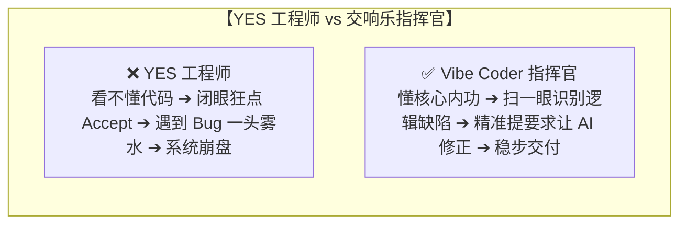

# 3.1 Python 编程核心内功：告别“YES 工程师”，打牢第一性原理

> ⚠️ **写在最前面的一记当头棒喝**：
> **“没有内功是万万不能的！在 AI 时代，最危险的就是沦为一个只会疯狂点击‘Accept / 接受’的 YES 工程师！”**
> 
> 如果你连最基础的变量、字典、循环和异常处理都看不懂，当 AI 产生幻觉、写出死循环或者把数据库删库代码递给你时，你只会傻傻地点 YES，直到整个系统当场爆炸。
> **AI 是你的副驾驶，但你必须握紧方向盘！**

---

## 🥋 为什么必须掌握 Python？

在 AI 与 Agent 的世界里，**Python 是绝对的通用世界语**：
- 几乎所有的大模型 SDK（OpenAI、Anthropic、DeepSeek）、主流 Agent 框架（LangChain、LangGraph、CrewAI、AutoGen）、向量数据库驱动和开源微调工具，都是以 Python 为第一优先级支持的。
- 掌握 Python 核心语法，你才能在 Agent 写完代码后，一眼看穿“这里的逻辑对不对”、“这个参数有没有传反”。



---

## ⚡ Python 核心内功极速通关（13 个必会知识点）

### 1. 变量与基本数据类型（贴标签比喻）
- 变量就像给现实中的物品贴上一个名字标签：

```python
# 1. 字符串 (文本文字，用引号包裹)
user_name = "Alex"

# 2. 整数与浮点数 (数字与小数)
user_age = 25
account_balance = 999.85

# 3. 布尔值 (真与假，用于判断)
is_vip_member = True
```

---

### 2. 列表（List）与字典（Dictionary）—— 购物清单与查字典
- **列表 `[]`**：有序的抽屉，按顺序放东西；
- **字典 `{}`**：带名字的档案袋（键值对 Key-Value），根据名字秒查数据。

```python
# 列表：像买菜清单，可以用下标 0, 1, 2 访问
tools = ["search_web", "read_file", "run_terminal"]
print(tools[0])  # 输出: search_web

# 字典：像个人档案，极其常用！在 AI Agent 传递参数时 90% 都在用字典
agent_config = {
    "name": "Claude-Code",
    "version": "3.7",
    "temperature": 0.2,
    "max_tokens": 4096
}
print(agent_config["name"])  # 输出: Claude-Code
```

---

### 3. 条件判断与循环（红绿灯与传送带）

```python
# 条件判断 if - else
score = 85
if score >= 90:
    print("评级：A (优秀)")
elif score >= 60:
    print("评级：B (及格)")
else:
    print("评级：C (不及格，需要重新测试)")

# 循环 for：遍历列表里的每一个元素
tasks = ["设计数据库", "编写接口", "执行测试"]
for task in tasks:
    print(f"正在执行任务：{task} ... 完成！")
```

---

### 4. 函数（面包机大比喻）
- **函数 `def`** 就像一台面包机：放入面粉和水（输入参数），经过机器内部加工，吐出烤好的吐司（返回值 `return`）。

```python
def calculate_discount(price: float, discount: float) -> float:
    """计算打折后的最终金额"""
    final_price = price * discount
    return round(final_price, 2)

# 调用函数
pay_amount = calculate_discount(199.0, 0.8)
print(f"实际需支付金额：{pay_amount} 元")  # 输出: 159.2 元
```

---

### 5. 异常捕获 try - except（杂技演员的安全保护网）
- 在真实运行中，网络可能断开、文件可能不存在。如果不加保护网，程序会当场崩溃闪退！

```python
try:
    # 尝试执行可能会出错的操作
    with open("config.json", "r", encoding="utf-8") as f:
        content = f.read()
except FileNotFoundError:
    # 捕获文件不存在的异常，优雅处理
    print("⚠️ 警告：找不到 config.json 配置文件，正在自动为您创建默认配置...")
```

---

### 6. 字符串进阶操作（文本处理神器）
- **f-string 格式化**：用 `f"..."` 直接在字符串里插值，比 `+` 拼接更优雅、更不易出错；
- **常用方法**：去空格、大小写转换、拆分/拼接、替换——解析日志与 CSV 的常客。

```python
# f-string：直接往字符串里塞变量和表达式
user_name = "Alex"
user_age = 25
print(f"用户 {user_name} 今年 {user_age} 岁，明年就 {user_age + 1} 岁了！")
# 输出: 用户 Alex 今年 25 岁，明年就 26 岁了！

# 常用字符串方法
raw_text = "  Hello, Agent World!  "
print(raw_text.strip())      # 去掉首尾空格: "Hello, Agent World!"
print(raw_text.lower())      # 全转小写: "  hello, agent world!  "
print(raw_text.upper())      # 全转大写

# split 拆分 / join 拼接（解析工具列表、拼接路径必备）
tools = "search_web,read_file,run_terminal"
tool_list = tools.split(",")          # ['search_web', 'read_file', 'run_terminal']
print("-".join(tool_list))            # search_web-read_file-run_terminal

# replace 替换（批量改写代码/文案）
snippet = "print('TODO: 待实现')"
print(snippet.replace("TODO", "DONE"))
```

---

### 7. 元组（Tuple）与集合（Set）—— 只读档案袋与自动去重器
- **元组 `()`**：一旦创建**不可修改**，用来保护不该被改的数据，还能一行解包；
- **集合 `{}`**：**自动去重** + 极速成员判断，判断"某个值在不在里面"效率极高。

```python
# 元组：只读档案袋，写入后无法修改
api_endpoint = ("https://api.example.com", 443)
# api_endpoint[0] = "x"   # ❌ 会报错：元组不可修改
host, port = api_endpoint             # 元组解包：一键拆成两个变量
print(f"主机：{host}，端口：{port}")

# 集合：自动去重，一行干掉重复元素
log_levels = ["info", "error", "info", "debug", "error"]
unique_levels = list(set(log_levels))
print(unique_levels)                  # ['info', 'error', 'debug']（顺序不保证）

# 集合成员判断：比列表快得多（O(1) vs O(n)）
allowed_roles = {"admin", "editor", "viewer"}
print("admin" in allowed_roles)       # True
```

---

### 8. 切片与推导式（Python 极客速成心法）
- **切片 `[start:end:step]`**：像切蛋糕一样截取列表的一段；
- **推导式**：用一行代码替代整个 for 循环——**AI 生成的代码里极其常见，必须会看！**

```python
# 切片 [开始:结束:步长]（左闭右开，end 本身不包含）
numbers = [0, 1, 2, 3, 4, 5, 6, 7, 8, 9]
print(numbers[2:5])      # [2, 3, 4]    第2~4个
print(numbers[:3])       # [0, 1, 2]    前3个
print(numbers[::2])      # [0, 2, 4, 6, 8]  每隔一个取一个
print(numbers[::-1])     # [9, 8, ..., 0]   反转列表

# 列表推导式：一行 for 循环
squares = [x * x for x in range(6)]
print(squares)           # [0, 1, 4, 9, 16, 25]

# 带条件过滤的推导式
even_numbers = [x for x in range(10) if x % 2 == 0]
print(even_numbers)      # [0, 2, 4, 6, 8]

# 字典推导式
names = ["alex", "bob", "carol"]
name_len = {name: len(name) for name in names}
print(name_len)          # {'alex': 4, 'bob': 3, 'carol': 5}
```

---

### 9. 函数进阶：默认参数、*args / **kwargs 与 lambda（真正的瑞士军刀）
- **默认参数**：不传就用兜底值，接口更友好；
- **`*args` / `**kwargs`**：一把梭收下任意数量的参数，写通用函数/框架的基石；
- **`lambda`**：一行匿名函数，配合 `sorted` / `max` 排序筛选特别好用。

```python
# 默认参数：不传 channel 就用默认值
def send_message(text, channel="slack"):
    print(f"通过 {channel} 发送：{text}")

send_message("你好")              # 通过 slack 发送：你好
send_message("紧急！", "email")   # 通过 email 发送：紧急！

# *args：打包任意数量的位置参数（变成元组）
def log_all(*messages):
    for msg in messages:
        print(f"[LOG] {msg}")

log_all("启动", "加载配置", "连接数据库")

# **kwargs：打包任意数量的关键字参数（变成字典）
def build_request(**params):
    print(f"请求参数：{params}")

build_request(model="gpt-4", temperature=0.7, max_tokens=1024)

# lambda + sorted：给字典列表按分数排序（Agent 排行榜必备）
agents = [
    {"name": "Alice", "score": 82},
    {"name": "Bob", "score": 95},
    {"name": "Carol", "score": 90},
]
agents_sorted = sorted(agents, key=lambda a: a["score"], reverse=True)
print(agents_sorted[0]["name"])   # Bob（分数最高）
```

---

### 10. 文件读写与 JSON（配置与数据的日常操作）
- **`with open(...)`**：安全读写文件，用完后自动关闭，不会漏关文件句柄；
- **JSON**：AI Agent 与 API 之间交换数据的**标准通用格式**，必须熟练。

```python
import json

# 写入 JSON 文件：把配置/结果永久保存
config = {"model": "deepseek-v4", "temperature": 0.2}
with open("config.json", "w", encoding="utf-8") as f:
    json.dump(config, f, ensure_ascii=False, indent=2)

# 读取 JSON 文件
with open("config.json", "r", encoding="utf-8") as f:
    loaded = json.load(f)
print(loaded["model"])            # deepseek-v4

# 字符串 <-> Python 对象互转（调用 API 时的日常操作）
text_json = '{"name": "Alex", "age": 25}'
data = json.loads(text_json)      # 字符串 -> 字典
back_to_text = json.dumps(data)   # 字典 -> 字符串
```

---

### 11. 常用标准库（装进口袋的常备工具箱）
- Python 自带"官方工具箱"，无需安装即可使用：`os`、`math`、`random`、`datetime` 等。

```python
import os                        # 操作系统交互
import math                      # 数学运算
import random                    # 随机数
from datetime import datetime    # 时间日期

print(os.getcwd())                            # 当前工作目录
print(os.path.exists("config.json"))          # 文件/目录是否存在

print(datetime.now().strftime("%Y-%m-%d %H:%M:%S"))
# 输出示例: 2026-08-19 14:30:00（打日志时间戳必备）

print(random.randint(1, 100))                 # 1~100 随机整数
print(math.sqrt(16))                          # 4.0
```

---

### 12. 面向对象入门（class：批量造对象的模板工厂）
- **类 `class`** 就像月饼模具：定义一次，就能批量做出结构相同的对象（实例）；
- **`__init__`** 是构造函数，负责在"开模"时初始化每个实例自己的属性。

```python
class Agent:
    """定义一个 Agent 模板"""
    def __init__(self, name, temperature=0.2):
        self.name = name               # 每个实例自己的名字
        self.temperature = temperature
        self.messages = []             # 对话历史，从空列表开始

    def say_hello(self):
        print(f"我是 Agent {self.name}，温度设置为 {self.temperature}")

# 用类创建两个不同的实例
agent_a = Agent("Claude")
agent_b = Agent("DeepSeek", temperature=0.8)
agent_a.say_hello()   # 我是 Agent Claude，温度设置为 0.2
agent_b.say_hello()   # 我是 Agent DeepSeek，温度设置为 0.8
```

---

### 13. 综合实战：迷你成绩管家（串起前面所有知识）
> 💪 **动手练一练**：下面的小程序把字典、列表、推导式、函数、JSON 全串起来了。建议你**亲手敲一遍**再运行，敲过的代码才算你的！

```python
import json

students = [
    {"name": "小明", "score": 92},
    {"name": "小红", "score": 78},
    {"name": "小刚", "score": 65},
]

# 1) 计算平均分（sum + 生成器表达式）
average = sum(s["score"] for s in students) / len(students)
print(f"全班平均分：{average:.1f}")

# 2) 找出最高分学生（max + key 参数）
top_student = max(students, key=lambda s: s["score"])
print(f"最高分：{top_student['name']} {top_student['score']}分")

# 3) 及格名单筛选（带条件的列表推导式）
passed = [s["name"] for s in students if s["score"] >= 60]
print(f"及格名单：{passed}")

# 4) 结果存入文件（json）
with open("class_scores.json", "w", encoding="utf-8") as f:
    json.dump(students, f, ensure_ascii=False, indent=2)
print("成绩已保存到 class_scores.json ✓")
```

---

## 🔍 AI 代码审查 3 秒清单（审查 AI 生成代码前先过一遍）

> 学会了语法，还要学会"审 AI"。AI 生成代码后，先花 3 秒核对这几点，能拦下 80% 的坑：

| 检查项 | 一眼看什么 | 典型翻车案例 |
| :--- | :--- | :--- |
| **缩进** | Python 用缩进区分代码块，4 个空格为标准 | 混用 Tab 和空格 → `IndentationError` 直接报错 |
| **变量名拼写** | 前后是否一致 | 定义 `user_name` 用 `username` 取值 → `NameError` |
| **数据结构类型** | 列表 `[]` / 字典 `{}` / 元组 `()` 有没有用混 | 该用字典却写成列表 → 取 `["name"]` 报 `TypeError` |
| **异常保护** | 外部 IO（读文件/调 API/连网络）是否包了 `try` | 文件不存在/网络断 → 程序当场崩溃 |
| **返回值** | 函数有没有写 `return` | 没写 return → 返回 `None`，下游全变空 |
| **边界情况** | 空列表、除零、索引越界 | `len(x)==0` 时 `x[0]` → `IndexError` |

---

## 📚 免费优质 Python 学习资源宝库（推荐收藏）

如果你想系统性夯实 Python 语法内功，强烈推荐以下完全免费的官方与中文名校教程：

| 平台 / 教程名称 | 官方直达链接 | 核心特色与适用人群 |
| :--- | :--- | :--- |
| **Python 官方中文文档** | [https://docs.python.org/zh-cn/3/](https://docs.python.org/zh-cn/3/) | 最权威、最标准的官方技术参考词典 |
| **菜鸟教程 (Runoob) Python 3** | [https://www.runoob.com/python3/](https://www.runoob.com/python3/python3-tutorial.html) | 国内新手普及度最高、支持在线运行代码的零基础教程 |
| **廖雪峰 Python 极速教程** | [https://www.liaoxuefeng.com](https://www.liaoxuefeng.com) | 口碑爆棚的经典实战教程，条理清晰、直击重点 |
| **Python-100-Days (GitHub ⭐150k+)** | [https://github.com/jackfrued/Python-100-Days](https://github.com/jackfrued/Python-100-Days) | GitHub 上最火的 Python 100 天从新手到大师全开源路线 |
| **W3Schools Python 中文教程** | [https://www.w3school.com.cn/python/](https://www.w3school.com.cn/python/index.asp) | 极其简单直观的网页互动式入门手册 |
