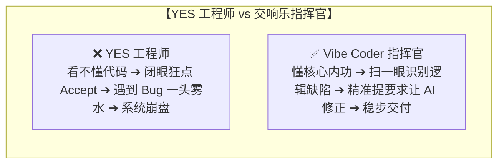

# 3.1 Python 编程核心内功：告别“YES 工程师”，打牢第一性原理

> ⚠️ **写在最前面的一记当头棒喝**：
> **“没有内功是万万不能的！在 AI 时代，最危险的就是沦为一个只会疯狂点击‘Accept / 接受’的 YES 工程师！”**
> 
> 如果你连最基础的变量、字典、循环和异常处理都看不懂，当 AI 产生幻觉、写出死循环或者把数据库删库代码递给你时，你只会傻傻地点 YES，直到整个系统当场爆炸。
> **AI 是你的副驾驶，但你必须握紧方向盘！**

---

## 🥋 为什么必须掌握 Python？

在 AI 与 Agent 的世界里，**Python 是绝对的通用世界语**：
- 几乎所有的大模型 SDK（OpenAI、Anthropic、DeepSeek）、主流 Agent 框架（LangChain、LangGraph、CrewAI、AutoGen）、向量数据库驱动和开源微调工具，都是以 Python 为第一优先级支持的。
- 掌握 Python 核心语法，你才能在 Agent 写完代码后，一眼看穿“这里的逻辑对不对”、“这个参数有没有传反”。



---

## ⚡ 10 分钟极速通关 Python 核心内功

### 1. 变量与基本数据类型（贴标签比喻）
- 变量就像给现实中的物品贴上一个名字标签：

```python
# 1. 字符串 (文本文字，用引号包裹)
user_name = "Alex"

# 2. 整数与浮点数 (数字与小数)
user_age = 25
account_balance = 999.85

# 3. 布尔值 (真与假，用于判断)
is_vip_member = True
```

---

### 2. 列表（List）与字典（Dictionary）—— 购物清单与查字典
- **列表 `[]`**：有序的抽屉，按顺序放东西；
- **字典 `{}`**：带名字的档案袋（键值对 Key-Value），根据名字秒查数据。

```python
# 列表：像买菜清单，可以用下标 0, 1, 2 访问
tools = ["search_web", "read_file", "run_terminal"]
print(tools[0])  # 输出: search_web

# 字典：像个人档案，极其常用！在 AI Agent 传递参数时 90% 都在用字典
agent_config = {
    "name": "Claude-Code",
    "version": "3.7",
    "temperature": 0.2,
    "max_tokens": 4096
}
print(agent_config["name"])  # 输出: Claude-Code
```

---

### 3. 条件判断与循环（红绿灯与传送带）

```python
# 条件判断 if - else
score = 85
if score >= 90:
    print("评级：A (优秀)")
elif score >= 60:
    print("评级：B (及格)")
else:
    print("评级：C (不及格，需要重新测试)")

# 循环 for：遍历列表里的每一个元素
tasks = ["设计数据库", "编写接口", "执行测试"]
for task in tasks:
    print(f"正在执行任务：{task} ... 完成！")
```

---

### 4. 函数（面包机大比喻）
- **函数 `def`** 就像一台面包机：放入面粉和水（输入参数），经过机器内部加工，吐出烤好的吐司（返回值 `return`）。

```python
def calculate_discount(price: float, discount: float) -> float:
    """计算打折后的最终金额"""
    final_price = price * discount
    return round(final_price, 2)

# 调用函数
pay_amount = calculate_discount(199.0, 0.8)
print(f"实际需支付金额：{pay_amount} 元")  # 输出: 159.2 元
```

---

### 5. 异常捕获 try - except（杂技演员的安全保护网）
- 在真实运行中，网络可能断开、文件可能不存在。如果不加保护网，程序会当场崩溃闪退！

```python
try:
    # 尝试执行可能会出错的操作
    with open("config.json", "r", encoding="utf-8") as f:
        content = f.read()
except FileNotFoundError:
    # 捕获文件不存在的异常，优雅处理
    print("⚠️ 警告：找不到 config.json 配置文件，正在自动为您创建默认配置...")
```

---

## 📚 免费优质 Python 学习资源宝库（推荐收藏）

如果你想系统性夯实 Python 语法内功，强烈推荐以下完全免费的官方与中文名校教程：

| 平台 / 教程名称 | 官方直达链接 | 核心特色与适用人群 |
| :--- | :--- | :--- |
| **Python 官方中文文档** | [https://docs.python.org/zh-cn/3/](https://docs.python.org/zh-cn/3/) | 最权威、最标准的官方技术参考词典 |
| **菜鸟教程 (Runoob) Python 3** | [https://www.runoob.com/python3/](https://www.runoob.com/python3/python3-tutorial.html) | 国内新手普及度最高、支持在线运行代码的零基础教程 |
| **廖雪峰 Python 极速教程** | [https://www.liaoxuefeng.com](https://www.liaoxuefeng.com) | 口碑爆棚的经典实战教程，条理清晰、直击重点 |
| **Python-100-Days (GitHub ⭐150k+)** | [https://github.com/jackfrued/Python-100-Days](https://github.com/jackfrued/Python-100-Days) | GitHub 上最火的 Python 100 天从新手到大师全开源路线 |
| **W3Schools Python 中文教程** | [https://www.w3school.com.cn/python/](https://www.w3school.com.cn/python/index.asp) | 极其简单直观的网页互动式入门手册 |
