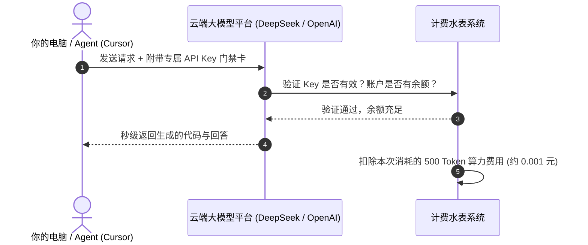
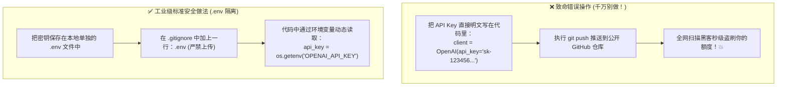

# 3.2 API Key 原理、主流申请与安全防泄露指南

> **大白话一句话概括**：API Key 就像你的“高档私人会所 VIP 门禁卡与水费电表卡”——只要在发请求时亮出这张卡，云端超级大模型就会为你提供算力服务，并自动从你的账户余额里扣除对应的 Token 费用！

---

## 🔑 什么是 API Key？它是怎么扣费的？

当你使用网页端 ChatGPT 时，你是用账号密码登录；但在写代码、使用 Cursor 或运行 Agent 时，程序需要通过代码直接和大模型通信。

**API Key（应用程序接口密钥）** 就是一段像密码一样的长字符串（例如 `sk-proj-abc123xxxx...`）。



---

## 🌐 主流大模型平台 API Key 申请保姆级教程

以下是目前最推荐、稳定性最高的主流大模型 API 申请渠道：

### 1. [DeepSeek 官方开放平台](https://platform.deepseek.com)（国内首推、性价比无敌）
- **官网入口**: [https://platform.deepseek.com](https://platform.deepseek.com)
- **申请流程**：
  1. 手机号直接注册登录；
  2. 进入左侧导航栏 **“API keys”**；
  3. 点击 **“创建 API key”**，输入名称后点击生成；
  4. **立即复制并保存到备忘录**（页面关闭后将无法再次查看完整密钥！）。

### 2. [SiliconFlow (硅基流动)](https://siliconflow.cn)（国内高速多模型聚合）
- **官网入口**: [https://siliconflow.cn](https://siliconflow.cn)
- **核心优势**：国内直连极速，聚合了 DeepSeek-V3/R1、Qwen 2.5 Coder、Llama 等几十款顶级开源模型，注册即送免费体验额度。

### 3. [OpenAI 官方开发者平台](https://platform.openai.com)
- **官网入口**: [https://platform.openai.com](https://platform.openai.com)
- **适合场景**：调用 GPT-5.6、o3-mini 等前沿官方模型。

### 4. [Anthropic Console](https://console.anthropic.com)
- **官网入口**: [https://console.anthropic.com](https://console.anthropic.com)
- **适合场景**：获取 Claude 3.7 / Claude 5 系列编程模型 API 密钥。

### 5. [OpenRouter](https://openrouter.ai)（全球多模型一站式通兑）
- **官网入口**: [https://openrouter.ai](https://openrouter.ai)
- **核心优势**：一张充值卡畅玩全球所有大模型（OpenAI、Anthropic、Google、Meta、Mistral 全支持），无需每个平台单独绑定信用卡。

---

## 🛑 API Key 核心安全铁律（防盗刷血泪教训）

> 🚨 **真实悲剧警示**：
> 有很多新手在写代码时，直接把 `sk-xxxx` 写死在 Python 文件里，然后随手 `git push` 上传到了 GitHub 公开仓库。
> 结果 **5 秒钟内** 就被全网爬虫脚本扫走盗刷，一夜之间欠下了几千美元的天价账单！



---

## 🛡️ 标准安全防泄露实操代码（3 步搞定）

### 第一步：在项目根目录新建 `.env` 文件
```bash
# 文件名：.env (注意前面有一个点)
DEEPSEEK_API_KEY=sk-your-real-deepseek-key-here
OPENAI_API_KEY=sk-your-real-openai-key-here
```

### 第二步：确保 `.gitignore` 包含 `.env`
```bash
# 在 .gitignore 文件末尾添加这一行，Git 就会永远忽略它，绝不会上传到云端
.env
```

### 第三步：在 Python 代码中优雅读取
```python
import os
from dotenv import load_dotenv  # 安装命令：pip install python-dotenv

# 自动从本地的 .env 文件加载环境变量
load_dotenv()

# 从系统环境中安全读取密钥
api_key = os.getenv("DEEPSEEK_API_KEY")

if not api_key:
    raise ValueError("❌ 错误：未检测到 DEEPSEEK_API_KEY，请检查 .env 配置文件！")

print("✅ API Key 安全加载成功，准备发起请求！")
```

---

## 🔗 相关官方平台与安全工具

- [DeepSeek 官方开放平台](https://platform.deepseek.com)
- [SiliconFlow 硅基流动开放平台](https://siliconflow.cn)
- [OpenRouter 全球模型聚合网关](https://openrouter.ai)
- [python-dotenv 官方开源库 (GitHub)](https://github.com/theskumar/python-dotenv)
