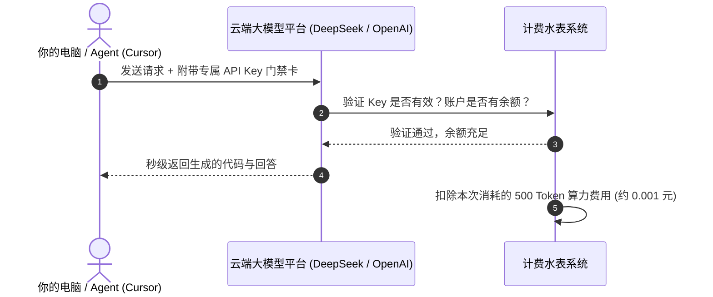
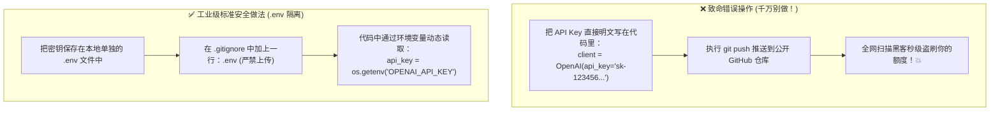

# 3.2 API Key 原理、主流申请与安全防泄露指南

> API Key 就像你的“高档私人会所 VIP 门禁卡与水费电表卡”——只要在发请求时亮出这张卡，云端超级大模型就会为你提供算力服务，并自动从你的账户余额里扣除对应的 Token 费用！

> 💳 **重要提示（新手先看这里）**：**OpenAI、Anthropic（Claude）、Google 等国外大模型的 API Key，申请后通常需要绑定「国外实卡」（海外信用卡 / 可充值虚拟卡）才能正常充值使用**；国内普通储蓄卡、微信、支付宝一般无法直接给它们充值。
> 如果你卡在这一步进不去，别硬磕——**国内直连平台**，或者下面要讲的 **Coding Plan 订阅套餐**，都是更适合新手的省钱入门方案！

***

## 🔑 什么是 API Key？它是怎么扣费的？

当你使用网页端 ChatGPT 时，你是用账号密码登录；但在写代码、使用 Cursor 或运行 Agent 时，程序需要通过代码直接和大模型通信。

**API Key（应用程序接口密钥）** 就是一段像密码一样的长字符串（例如 `sk-proj-abc123xxxx...`）。



---

## 🧮 什么是 Token？一次调用到底怎么扣费？

**Token（词元）** 是模型计量文本的最小单位：**一个汉字、一个英文单词、一个数字或一个标点符号，都可以算作 Token**。粗略估算，中文大模型大致**一个汉字约 1 个 Token、一个英文单词约 1 个 Token**（英文按字符算还会拆得更细）。

> 大白话：大模型不是按"字"收费，而是按它内部"切片"出的 **Token 数量**收费。你发的**输入**和它生成的**输出**都要计费，而且**输入（缓存命中）**、**输入（缓存未命中）**、**输出**三档价格完全不同。

### 官方最新定价：以 DeepSeek-V4-Flash 为例（元 / 百万 Tokens）

> 📊 数据来源：DeepSeek 官方文档，2026-08-17 起执行峰谷定价  
> **高峰时段**：北京时间 9:00–12:00、14:00–18:00；**其余时间为空闲时段**，空闲价格 = 高峰价格的一半。

| 计费项 | 空闲时段 | 高峰时段 |
| :--- | :---: | :---: |
| 输入（缓存命中） | 0.05 元 | 0.10 元 |
| 输入（缓存未命中） | 1.50 元 | 3.00 元 |
| 输出 | 4.50 元 | 9.00 元 |

**看懂这张表的三个关键点：**
1. **输出最贵**：同样 100 万 Token，输出要 4.5~9 元，是缓存命中输入的 90 倍以上——所以省钱第一要务是**控制输出长度**（`max_tokens`）；
2. **缓存命中 = 省钱神器**：反复使用同一段 system prompt / 长上下文时，只要命中缓存，输入成本直接从 3.0 元暴降到 0.1 元（高峰）——这也是为什么现代 AI 框架都在拼命做**前缀缓存**；
3. **错峰 = 打五折**：把不紧急的批量任务挪到夜间或早上 9 点前跑，账单直接减半。

### 真实算账演示（拿 Flash 高峰期举例）

假设一次调用：**输入 2000 Tokens（未命中缓存）+ 输出 1000 Tokens**：

- **高峰时段**：`2000 / 100万 × 3.0 + 1000 / 100万 × 9.0 = 0.006 + 0.009 = 0.015 元`
- **空闲时段**：`2000 / 100万 × 1.5 + 1000 / 100万 × 4.5 = 0.003 + 0.0045 = 0.0075 元`

> 💡 单次看似便宜，但 **Agent 跑一晚上可能消耗几百万 Token**。所以真正省钱靠的是：**选对模型（Flash vs Pro）、做好缓存、错峰调度**，这三招对账单的影响远大于纠结单次 0.01 元。

📚 **官方参考资料**：
- [DeepSeek 官方《模型 & 价格》页](https://api-docs.deepseek.com/zh-cn/quick_start/pricing/)
- [DeepSeek 官方《Token 用量计算》页](https://api-docs.deepseek.com/zh-cn/quick_start/token_usage)

---

## 🌐 主流大模型平台 API Key 申请保姆级教程

以下是目前最推荐、稳定性最高的主流大模型 API 申请渠道：

### 1. [DeepSeek 官方开放平台](https://platform.deepseek.com)（国内首推、性价比无敌）

- **官网入口**: <https://platform.deepseek.com>
- **申请流程**：
  1. 手机号直接注册登录；
  2. 进入左侧导航栏 **“API keys”**；
  3. 点击 **“创建 API key”**，输入名称后点击生成；
  4. **立即复制并保存到备忘录**（页面关闭后将无法再次查看完整密钥！）。

### 2. [SiliconFlow (硅基流动)](https://siliconflow.cn)（国内高速多模型聚合）

- **官网入口**: <https://siliconflow.cn>
- **核心优势**：国内直连极速，聚合了 DeepSeek-V3/R1、Qwen 2.5 Coder、Llama 等几十款顶级开源模型，注册即送免费体验额度。

### 3. [OpenAI 官方开发者平台](https://platform.openai.com)

- **官网入口**: <https://platform.openai.com>
- **适合场景**：调用 GPT-5.6 等前沿官方模型。

### 4. [Anthropic Console](https://console.anthropic.com)

- **官网入口**: <https://console.anthropic.com>
- **适合场景**：Claude fable5 系列编程模型 API 密钥。

### 5. [OpenRouter](https://openrouter.ai)（全球多模型一站式通兑）

- **官网入口**: <https://openrouter.ai>
- **核心优势**：一张充值卡畅玩全球所有大模型（OpenAI、Anthropic、Google、Meta、Mistral 全支持），无需每个平台单独绑定信用卡。

***

## 🎟️ Coding Plan（订阅套餐） vs 直连 API Key（按量计费）的区别

### 什么是 Coding Plan？

**Coding Plan（编程订阅套餐）** 是各家模型厂商针对「程序员 / 开发者高频写代码」场景推出的**包月 / 包年订阅服务**。你按月（或按年）付一笔固定费用，就可以在有效期内**大额度、甚至无限次**使用该厂商的编程大模型（如 Claude、MiniMax、DeepSeek 等）。

它与上面的**直连 API Key** 最本质的区别，在于**计费模式完全不同**：

| 对比维度      | 直连 API Key（按量计费）                  | Coding Plan（订阅套餐）             |
| :-------- | :-------------------------------- | :---------------------------- |
| **计费方式**  | 用多少 Token 扣多少钱，用完即止               | 按月/按年付固定费用，套餐内畅用              |
| **充值门槛**  | 需注册平台 + 充值，国外模型还需绑定国外实卡           | 一键订阅即可，通常国内支付方式也能搞定           |
| **新手友好度** | 低：担心余额、突然扣费、Key 被盗刷               | 高：价格透明，无突发天价账单                |
| **风险控制**  | Key 泄露可能被一夜盗刷到天价账单                | 额度固定，就算泄露损失也可控                |
| **适合人群**  | 深度使用、需要精确控量的开发者                   | 新手入门、高频编程辅助用户                 |
| **典型代表**  | DeepSeek / OpenAI / OpenRouter 直连 | 各家 Coding Plan（MiniMax、火山方舟等） |

### 为什么新手入门更推荐 Coding Plan？

1. **实惠划算**：新手往往"用量大、单次对话短"，按量计费不知不觉就花掉不少钱；订阅套餐一次买断，心理压力和钱包压力都更小；
2. **没有国外实卡烦恼**：直连国外大模型要绑国外实卡，Coding Plan 一般用国内支付方式即可开通；
3. **不怕盗刷**：套餐额度固定，即使 Key 意外泄露，损失也可控，不会像直连那样一夜之间欠下天价账单。

> 🔗 **Coding Plan 全方位对比**：各平台 Coding Plan 的定价、额度、首月优惠差异很大，建议直接查看这份全网汇总对比表：
>
> **<https://vibecoding.dreamfree.space/index.html?view=plans>**

### 🧭 个人推荐路线（新手省钱避坑指南）

- **🥇 新手首选**：**MiniMax**、**火山方舟**（豆包等模型）的**首月优惠**——首月价格极低，适合先低成本试水，把整个申请、配置、使用流程跑通；
- **🥈 进阶升级**：等用熟练、明确自己的真实需求后，再考虑上 **智谱（glm）**、**Kimi** 等更专业的平台；
- **🥉 高阶玩家**：最后再上 **OpenAI** 等国际一线模型——这时你对模型差异、计费逻辑已有清晰判断，才不会盲目花冤枉钱。

***

## 🛑 API Key 核心安全铁律（防盗刷血泪教训）

> 🚨 **真实悲剧警示**：
> 有很多新手在写代码时，直接把 `sk-xxxx` 写死在 Python 文件里，然后随手 `git push` 上传到了 GitHub 公开仓库。
> 结果 **5 秒钟内** 就被全网爬虫脚本扫走盗刷，一夜之间欠下了几千美元的天价账单！



***

## 🛡️ 标准安全防泄露实操代码（3 步搞定）

### 第一步：在项目根目录新建 `.env` 文件

```bash
# 文件名：.env (注意前面有一个点)
DEEPSEEK_API_KEY=sk-your-real-deepseek-key-here
OPENAI_API_KEY=sk-your-real-openai-key-here
```

### 第二步：确保 `.gitignore` 包含 `.env`

```bash
# 在 .gitignore 文件末尾添加这一行，Git 就会永远忽略它，绝不会上传到云端
.env
```

### 第三步：在 Python 代码中优雅读取

```python
import os
from dotenv import load_dotenv  # 安装命令：pip install python-dotenv

# 自动从本地的 .env 文件加载环境变量
load_dotenv()

# 从系统环境中安全读取密钥
api_key = os.getenv("DEEPSEEK_API_KEY")

if not api_key:
    raise ValueError("❌ 错误：未检测到 DEEPSEEK_API_KEY，请检查 .env 配置文件！")

print("✅ API Key 安全加载成功，准备发起请求！")
```

***

## 🔗 相关官方平台与安全工具

- [DeepSeek 官方开放平台](https://platform.deepseek.com)
- [SiliconFlow 硅基流动开放平台](https://siliconflow.cn)
- [OpenRouter 全球模型聚合网关](https://openrouter.ai)
- [python-dotenv 官方开源库 (GitHub)](https://github.com/theskumar/python-dotenv)

