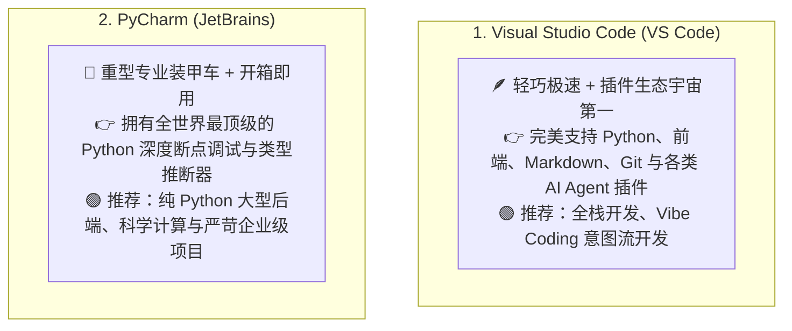
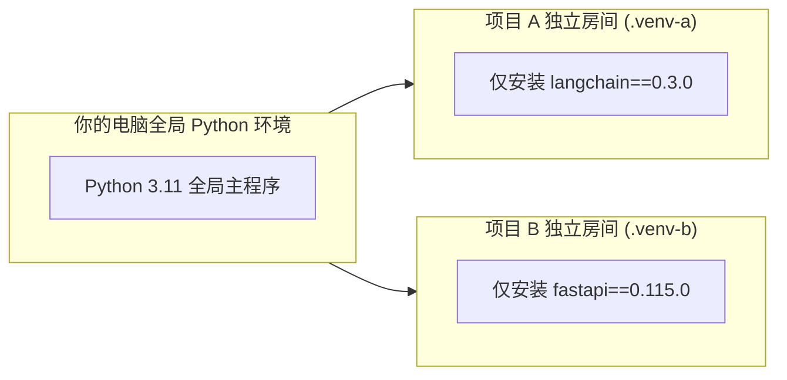

# 3.3 IDE 黄金开发环境配置：VS Code 与 PyCharm

> 写代码不能用系统自带的记事本，你需要一个专业的“现代化数字工位”——VS Code 像一把轻便、插件无限扩展的瑞士军刀；而 PyCharm 则是一台专为 Python 重型项目打造的豪华工作站！
>
> 不同人有不同的习惯，新手小白可以先从traecode、cursor开始，这样就不用下载vscode了。

***

## 🥊 VS Code vs PyCharm：我该选哪一个？



***

## 🛠️ VS Code 极速下载与必备插件“天梯榜”

### 1. 官方下载入口

- **官网直达**: <https://code.visualstudio.com>
- 下载对应操作系统的安装包（Windows / macOS / Linux），一路点击下一步完成安装。

### 2. 新手装机必备的 6 大神器插件（点击左侧四个方块 Extensions 搜索安装）

| 插件名称                          | 插件 ID / 开发者 | 解决了什么痛点？（大白话）                            |
| :---------------------------- | :---------- | :--------------------------------------- |
| **Chinese (Simplified)**      | Microsoft   | **全界面一键汉化包**，将英文菜单全部翻译为中文，新手友好           |
| **Python**                    | Microsoft   | 微软官方插件，提供 Python 代码高亮、一键点击绿色三角运行代码       |
| **Pylance**                   | Microsoft   | **代码智能大脑**，提供极速的代码跳转、自动补全与类型检查           |
| **Error Lens**                | Alexander   | **报错直接显形**，把红字报错直接贴在出错代码的同一行末尾，不用鼠标悬停去找！ |
| **GitLens**                   | GitKraken   | 每一行代码后面都会轻微显示“谁在几天前写了这行代码”，追溯历史神器        |
| **Prettier - Code formatter** | Prettier    | **强迫症福音**，按 `Cmd+S`（保存）自动把乱糟糟的代码排版得整整齐齐  |

***

## 📦 什么是 Python 虚拟环境（Virtual Environment）？

- **日常生活比喻**：**大学宿舍合租**。
  - 同一个宿舍里，室友 A 喜欢养热带鱼（需要 30℃ 水温，对应 Python 3.10 环境）；
  - 室友 B 喜欢养企鹅（需要 0℃ 冰块，对应 Python 3.12 环境）。
  - 如果把它们全扔进同一个大客厅（全局环境），系统当场冲突打架崩溃！
  - **虚拟环境** 就是给每个项目**独立隔出一个干净的小房间**，安装的第三方依赖包互不干扰。



***

## ⚡ 现代 Python 虚拟环境极速配置实操

### 方案 A：使用官方内置的 `venv`（无需额外安装工具）

```bash
# 1. 在你的项目文件夹打开终端，创建名为 .venv 的虚拟环境
python3 -m venv .venv

# 2. 激活虚拟环境 (MacOS / Linux)
source .venv/bin/activate

# 2. 激活虚拟环境 (Windows PowerShell)
# .venv\Scripts\Activate.ps1

# 3. 激活后，终端最左边会出现 (.venv) 标志，现在可以安全安装依赖了！
pip install requests python-dotenv
```

### 方案 B：使用 2026 年最火的超高速工具 `uv`（推荐极客使用）

- **[uv 官方开源仓库 (GitHub)](https://github.com/astral-sh/uv)**
- 由 Astral 团队用 Rust 编写，安装 Python 包的速度比传统 pip **快 10\~100 倍**，秒级完成环境初始化！

```bash
# 一行命令极速创建并安装依赖
uv venv
uv pip install fastapi uvicorn
```

***

## 🔗 相关官方下载与文档

- [VS Code 官方下载地址](https://code.visualstudio.com)
- [PyCharm 官方下载 (Community 免费社区版)](https://www.jetbrains.com/pycharm/download/)
- [Astral uv 官方文档](https://docs.astral.sh/uv/)

