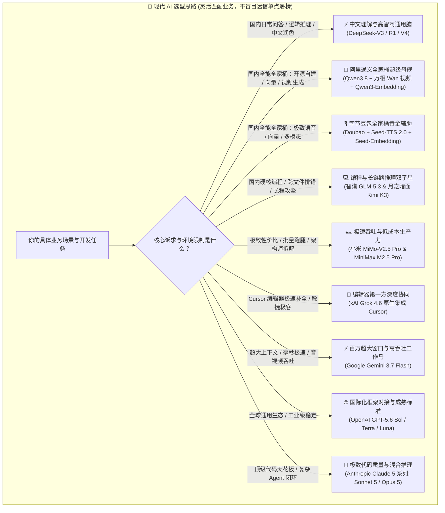
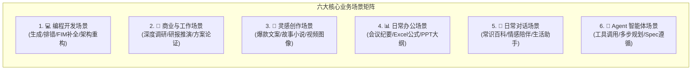
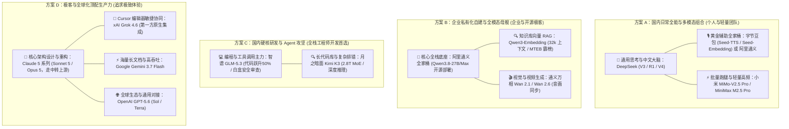

# 3.8 如何选择 AI：2026 前沿大模型全景评测与多场景实战选型指南

> **💡 核心认知心法**：  
> **模型能力榜单随时都在变化，新模型每隔一段时间都会破土而出。我们要做的绝不是盲目关注“今天又是哪个模型屠榜了”，而是深刻看清每个模型的脾气特长、底层生态与性价比，根据你的真实业务情况和现有能力，灵活选择最适合的模型来高效干活！**

***

## 🚗 选型第一性原理：组建你的“数字外包车队”

在 2026 年，大模型已经从早期的“单打独斗”演进为极度细分、各具特长的协同生态。很多人在选型时依然容易踩坑：
- **误区 A（唯跑车论）**：做个简单日常总结或改两行正则，也直接拉满最高开销的海外旗舰，不仅网络延迟大、随时面临封号风控，API 账单还在疯狂燃烧；
- **误区 B（唯免费论）**：只用基础小模型做复杂架构设计和多步 Agent 工具调用，结果频繁陷入死循环和语法幻觉，排错消耗的精力远超模型省下的几毛钱。

选大模型就像**为你的技术团队组建外包车队**：
- **轻量配送小卡车**（日常对话、文本提炼、批量跑腿）：选择响应飞快、调用成本极亲民的敏捷模型（如 **小米 MiMo-V2.5 Pro**、**Gemini Flash**）；
- **工程级重卡与攻坚铲车**（大型重构、跨文件依赖、深度排错）：出动推理底子扎实、长上下文与代码能力强劲的技术骨干（如 **智谱 GLM-5.3**、**月之暗面 Kimi K3**）；
- **全栈多功能特种作业车**（高拟真语音、视频/图像生成、向量检索 RAG）：出动生态完善的**全家桶军团**（如 **阿里通义全家桶 Qwen + 万相 Wan + Qwen-Embedding**，或 **字节跳动 豆包 + Seed-TTS + Seed-Embedding**）；
- **赛道极限方程式**（高难度架构攻坚、顶级 Agentic 闭环）：在关键战役中出动顶配旗舰（如 **Claude 5 系列**）。

***

## 🎭 六大核心业务场景深度剖析

现代工作流中的任务千差万别，我们先从 **6 大核心业务场景** 梳理不同任务对大模型的底层诉求：

### 1. 💻 编程开发场景 (Coding & Engineering)
- **核心诉求**：代码语法绝对精准、跨数十个文件的依赖拓扑感知、长函数重构、FIM（中间缺哪补哪）即时补全、白盒代码审查与安全漏洞定位。
- **评判标准**：不瞎编假 API，能够给出经过验证的最小可执行闭环代码，并具备自我反思排错能力。

### 2. 💼 商业与工作场景 (Work & Deep Research)
- **核心诉求**：超长行业研报吞吐、商业画布与可行性推演、严谨的数据逻辑对比、抗幻觉能力。
- **评判标准**：结论严谨、论据扎实，不讲空洞套话，能输出可落地的分级决策矩阵。

### 3. 🎨 灵感创作场景 (Creative Writing & Visuals)
- **核心诉求**：文学辞藻表现力、拟真情感起伏、长文本人设一致性、视频与图像生成配合、摆脱刻板的“AI 八股味”。
- **评判标准**：语调鲜活自然，能根据受众需求切换风格，并配合音画同步生成多媒体内容。

### 4. 📊 日常办公场景 (Office Productivity)
- **核心诉求**：长会议录音/文档秒级摘要、杂乱数据一键转结构化 Markdown 表格、复杂 Excel/Sheets 嵌套公式与 Python 自动化脚本编写。
- **评判标准**：响应极速、格式规整、即拿即用。

### 5. 💬 日常对话场景 (Daily Conversation)
- **核心诉求**：地道的中文俗语与文化语境理解、毫秒级交互首字延迟、低成本高频交互不心疼。
- **评判标准**：随问随答、接梗自然，不啰嗦，理解隐式提问意图。

### 6. 🤖 Agent 智能体场景 (Agent & Tool Calling)
- **核心诉求**：Function Calling（工具调用）参数 100% 准确、严格遵循系统指令（System Rules / OpenSpec）、支持 1M+ 超长上下文记忆检索（大海捞针）、JSON Mode 输出稳定性、死循环自愈能力。
- **评判标准**：在多轮自主 ReAct 闭环中绝不脱轨，准确调度外部 CLI 终端、数据库与 MCP 插件。

***

## 🔬 主流前沿大模型全景深度评测

我们对当前国内外最具代表性的主力大模型进行**实战能力拆解、优缺点剖析与权威链接汇总**：

---

### 🇨🇳 国内前沿大模型主力阵营

#### 1. DeepSeek（深度求索）—— 国内日常首选与逻辑推理性价比王者
- **官方入口**：[DeepSeek 官网](https://www.deepseek.com) ｜ [开放平台 API](https://platform.deepseek.com)
- **核心特长**：
  - **中文理解地道**：在中文语境、逻辑推理（R1 / V4 推理链）和通用对话上表现出顶级水准；
  - **极致性价比与开源底层**：开源 FlashMLA、DeepEP 等底层算子，日常使用成本极低；
  - **Agent 框架拓展**：最新开源的 **DeepSeek Harness (DSH)** 推动了智能体运行框架的发展。
- **⚠️ 核心痛点与生态短板**：
  - **单一语言模型局限**：官方原生核心主要为语言与推理大模型，**缺乏官方专属的高拟真语音大模型（TTS/STT）、专属图文/视频生成模型，以及专属高维 Embedding 向量模型**。
- **💡 选型定位**：**国内个人与团队日常主力通用脑**。在需要向量知识库（RAG）、语音交互或多模态音视频生成时，必须搭配外部全家桶（如阿里通义或字节豆包）协同作战。

---

#### 2. 阿里通义 Qwen 系列 —— 超级航空母舰：语言+向量+万相视频全家桶
- **官方入口**：[通义千问官网](https://qwen.ai) ｜ [百炼大模型平台](https://bailian.console.aliyun.com) ｜ [GitHub 官方仓](https://github.com/QwenLM/Qwen2.5) ｜ [魔搭社区](https://modelscope.cn)
- **核心特长（真正的全模态全家桶）**：
  - **语言与 Agent 底座（Qwen3.8-Max / 27B）**：2.4 万亿 MoE 架构，支持 100 万 Token 上下文与自主长程 Agent 执行，27B 稠密版更是单卡私有化部署神器；
  - **专属顶级向量大模型（Qwen3-Embedding / GTE 系列）**：支持 32k 超长文本向量化、MTEB 权威评测霸榜、支持 MRL 动态降维技术，覆盖 100+ 语言与代码向量检索，是**自建企业级私有 RAG 知识库的不二之选**；
  - **旗舰级视频生成大模型（通义万相 Wan 2.1 / Wan 2.6 / Wan 2.7）**：基于 MD-DiT 原生扩散架构，支持文生视频、图生视频与电影级镜头运镜，支持**原生音画同步生成**，一次性输出带对白、音效与配乐的视频；
  - **全模态感知矩阵**：拥有 Qwen-VL（超强视觉理解）与 Qwen-Audio（音频感知）。
- **⚠️ 痛点与局限**：
  - 开源分支与型号庞大，初学者在端侧、私有化服务器和百炼 API 选型时需要明确算力配置。
- **💡 选型定位**：**企业私有化部署、离线开发、自建全套 RAG 知识库与全模态视频创作的国内第一全能母舰**。

---

#### 3. 字节跳动 豆包（Doubao / 火山引擎）—— 黄金云端全家桶：语音声优、Embedding 向量与适配生成
- **官方入口**：[豆包官网](https://doubao.com) ｜ [火山引擎大模型服务平台](https://www.volcengine.com/product/doubao) ｜ [语音开发者文档](https://openspeech.bytedance.com/)
- **核心特长**：
  - **顶尖语音生态（Doubao-Seed-TTS-2.0）**：提供高保真、情绪可控、支持语音指令 QA 与声音复刻（Seed-ICL-2.0）的语音合成，首包流式延迟极低；
  - **高质量向量模型（Doubao-Seed-Embedding）**：专为 RAG 知识库检索优化的多模态/文本向量模型，高并发稳定；
  - **多模态图文适配生成（Seed-Edit / Doubao-Image）**：支持高质量的图像修改与多模态视觉生成；
  - **企业级高并发保障**：依托火山引擎云原生底座，SLA 极高。
- **⚠️ 痛点与局限**：
  - 偏向商业云端 API 托管服务，纯本地离线开源自由度不及 Qwen。
- **💡 选型定位**：**云端商业应用落地黄金辅助！完美与 DeepSeek 等模型组合，提供极佳的语音交互、向量检索与视觉生成体验**。

---

#### 4. 智谱 GLM-5.3 —— 国内硬核编程与工具调用的老牌领头羊
- **官方入口**：[智谱 AI 官网](https://www.zhipuai.cn) ｜ [开放平台 API](https://open.bigmodel.cn)
- **核心特长**：
  - **极致后训练提升**：GLM-5.3 采用 744B MoE 架构，通过超大规模强化学习与长程任务环境训练，**编程代码能力较前代大幅提升 50%**，在 Terminal Bench 等基准中登顶开源 SOTA；
  - **白盒安全审查**：在 CyberGym 等漏洞攻防基准中展现出强大的代码审计与漏洞排查能力；
  - **思考模式与 1M 上下文**：支持 100 万 Token 上下文，API 开放了可调推理强度（low/high/max）的 Thinking Mode，与智谱 ZCode 编码套件深度整合；
  - **Tool Calling 极度成熟**：国内支持 Function Calling 与 Agent 插件最早、最稳定的模型之一。
- **⚠️ 痛点与局限**：
  - 纯文学发散类创作略带工科严谨风格。
- **💡 选型定位**：**国内编程写代码、全栈开发与搭建私有 Agent 工具链的核心首选**。

---

#### 5. 月之暗面 Kimi K3 —— 2.8T 超大规模多模态与长程深度推理攻坚手
- **官方入口**：[Kimi 官网](https://kimi.moonshot.cn) ｜ [开放平台 API](https://platform.moonshot.cn) ｜ [Hugging Face 权重](https://huggingface.co/moonshotai)
- **核心特长**：
  - **2.8T MoE 庞大体量**：拥有 2.8 万亿总参数（896 专家 / 激活 16 专家），开源了史上规模最大的开放权重之一；
  - **KDA 架构与 1M 上下文**：引入 Kimi Delta Attention (KDA) 与 AttnRes 技术，原生 100 万 Token 超长上下文，跨长文档大海捞针与大项目代码库分析能力极强；
  - **长程深度推理与多智能体**：深度思考模式在长程编程（Kimi Code）、咨询级研报制作、智能制表与 Agent Swarm 多智能体协同中表现极为稳健。
- **⚠️ 痛点与局限**：
  - 深度思考模式在调动巨量参数推演时，首字响应时间相对较长。
- **💡 选型定位**：**国内超大工程代码库剖析、疑难 Bug 攻坚、深度研究推演的首选双子星之一**。

---

#### 6. 小米 MiMo 系列（MiMo-V2.5 / MiMo-V2.5 Pro）—— 极致性价比与敏捷全模态轻骑兵
- **官方入口**：[小米 MiMo 开发者平台](https://mimo.xiaomi.com) ｜ [小米开源项目](https://github.com/XiaoMi)
- **核心特长**：
  - **MiMo-V2.5 Pro 旗舰表现**：原生全模态架构，支持 100 万 Token 窗口，采用混合滑动窗口注意力（Hybrid Sliding-Window Attention）；
  - **极致推理速度与成本**：在 SWE-bench Pro 与长程任务基准中表现亮眼的同时，保持了极低的时延与亲民的调用成本，端云协同体验出众。
- **⚠️ 痛点与局限**：
  - 面对跨数十万行的大规模异构系统重构，深度逻辑上限略逊于 2T+ 超大规模旗舰。
- **💡 选型定位**：**国内日常办公批量处理、轻量化问答、高频 API 调用的极致性价比首选**。

---

#### 7. MiniMax M2.5 Pro（稀宇科技 / 海螺 AI）—— 原生架构师思维与全模态创作专家
- **官方入口**：[MiniMax 开放平台](https://platform.minimaxi.com) ｜ [海螺 AI 官网](https://www.minimaxi.com)
- **核心特长**：
  - **原生 Spec 架构师思维**：万亿 MoE 架构，在编写代码前会主动模拟软件架构师进行功能拆解、系统规划与 UI 设计，而非机械修补代码；
  - **极致吞吐与低成本**：推理成本低至同类模型的 1/10，Lightning 版吞吐量超 100 TPS；
  - **全模态生成标杆**：旗下海螺 AI 配备顶级的 Hailuo-02 视频生成与全球领先的高保真情感语音技术。
- **⚠️ 痛点与局限**：
  - 复杂底层汇编与单片机硬件级深度调试非其核心长项。
- **💡 选型定位**：**全栈应用快速原型开发、生动文学文案创作、高拟真多模态交互的首选**。

---

### 🌐 海外前沿大模型主力阵营

#### 8. Anthropic Claude 5 系列（Claude Sonnet 5 / Claude Opus 5）—— 编程代码与混合推理的终极天花板
- **官方入口**：[Anthropic 官网](https://www.anthropic.com) ｜ [控制台 API](https://console.anthropic.com)
- **核心特长**：
  - **👑 Claude Sonnet 5（日常生产力王牌）**：兼具极高智商与高速响应，在跨文件代码重构、复杂 Agentic 任务中表现完美，是 Claude.ai 与现代 IDE 插件的默认灵魂；
  - **👑 Claude Opus 5（终极旗舰攻坚手）**：专为深度推理、超复杂全栈架构设计和极高难度长程任务打造，代表全球大模型智力巅峰；
  - **进化版混合推理 (Hybrid Reasoning)**：可根据任务动态调节 Thinking Budget（思考预算），代码整洁规范、注释清晰，指令遵循（OpenSpec / System Prompt）登峰造极。
- **⚠️ 核心痛点与风险**：
  - **价格昂贵**：Opus 5 计费较高，适合关键战役攻坚；
  - **极高封号率与风控门槛**：对国内网络 IP 与海外信用卡风控极严（强烈建议通过合规中转上游或企业通道接入，参考第 3.7 节）。
- **💡 选型定位**：**预算充足、追求顶级代码质量与重大商业项目攻坚时的终极王者（有钱、有渠道首选）**。

---

#### 9. Google Gemini 3.7 Flash —— 百万超大原生窗口与极速高吞吐工作马
- **官方入口**：[Google AI Studio](https://aistudio.google.com) ｜ [Google AI 开发者平台](https://ai.google.dev)
- **核心特长**：
  - **Gemini 3.7 Flash 极速响应**：毫秒级首字延迟，专为超高并发、快速编码与实时 Agent 流程打造的“主力工作马”；
  - **100万 ~ 200万+ 超大原生上下文**：一次性吞下整套大型代码工程、整套技术文档库或数小时高清视频录像；
  - **原生全模态与极低成本**：底层音视频文字统一架构，Flash 系列定价极其亲民，大规模调用毫无压力。
- **⚠️ 痛点与局限**：
  - 极长上下文中对微小复杂约束的注意力偶尔需用结构化 Prompt 强化。
- **💡 选型定位**：**超长代码工程分析、长视频/音频多模态结构化提取、极速高并发任务首选**。

---

#### 10. xAI Grok 4.6 —— 与 Cursor 战略级原生集成的极客敏捷利器
- **官方入口**：[xAI 官网](https://x.ai) ｜ [控制台 API](https://console.x.ai)
- **核心特长**：
  - **Cursor 第一方深度协同**：xAI 与 Cursor 战略合作，基于数百万真实开发者调试与多文件编辑数据联合训练；
  - **Cursor 原生免配一键开启**：在 Cursor 设置中直接勾选 Grok 4.6 即可在聊天侧边栏、Cmd+K 内联编辑与 Composer 中无缝使用；
  - **实时数据与敏捷响应**：依托 X（Twitter）实时数据流，代码风格干脆利落，在多步骤编程与 Agentic 任务中极度丝滑。
- **⚠️ 痛点与局限**：
  - 国内企业级专属支持与私有化周边工具链仍在持续扩建中。
- **💡 选型定位**：**Cursor / IDE 极速敏捷开发、即时代码补全与实时极客首选**。

---

#### 11. OpenAI GPT 系列（GPT-5.6 Sol / Terra / Luna）—— 全球通用生态标杆与最广兼容者
- **官方入口**：[OpenAI 官网](https://openai.com) ｜ [开发者控制台](https://platform.openai.com)
- **核心特长**：
  - **梯队化产品布局**：GPT-5.6 分为 **Sol**（旗舰推理/编程/Agent）、**Terra**（日常高效）和 **Luna**（高吞吐极速性价比）；
  - **全球生态基石**：几乎所有的开源框架、IDE 插件与自动化工作流（LangChain、Dify 等）默认优先支持 OpenAI 标准；
  - **综合性价比突出**：通用场景下兼顾了推理智商、多模态能力与调用成本。
- **⚠️ 痛点与局限**：
  - 纯代码重构的细腻度与风格整洁度在某些极客场景下略输最新版 Claude Sonnet。
- **💡 选型定位**：**海外主力军、跨国业务对接、追求最广泛第三方生态兼容的首选**。

***

## 📊 主流大模型全景对比选型矩阵

| 模型名称 | 所属厂商 | 核心生态与技术特性 | 核心主场优势 | 痛点短板 / 局限 | 推荐落地场景 | 权威入口 |
| :--- | :--- | :--- | :--- | :--- | :--- | :--- |
| **DeepSeek** | 深度求索 | V3 / R1 / V4 (MoE + DSH 框架) | 中文理解顶级、逻辑推理强、高性价比 | 缺乏原生语音 / 专属 Embedding / 图生图 | 国内日常通用、逻辑推理、中文润色 | [官网](https://www.deepseek.com) |
| **通义 Qwen 全家桶** | 阿里巴巴 | Qwen3.8 (2.4T MoE) + 万相 Wan 视频 + Qwen3-Embedding | 🏰 超级航空母舰：语言+32k向量+音画同步视频全套开源 | 模型分支庞大，需明确硬件与端云选型 | 企业私有化部署、离线开发、全套 RAG 与视频创作 | [百炼平台](https://bailian.console.aliyun.com) |
| **豆包 Doubao 全家桶**| 字节跳动 | Doubao + Seed-TTS-2.0 + Seed-Embedding + Seed-Edit | 🎙️ 语音表现力顶尖、向量检索成熟、云原生高并发 | 偏商业云端 API，开源离线自由度不及 Qwen | 语音合成/识别、知识库向量检索、多模态生成 | [火山引擎](https://www.volcengine.com/product/doubao) |
| **GLM-5.3** | 智谱 AI | 744B MoE 极致后训练、1M 上下文 | 编程能力暴涨 50%、白盒漏洞审查、Tool Calling 极稳 | 文学创作略显工科严谨 | 💻 国内编程首选、企业 Agent 工具链 | [开放平台](https://open.bigmodel.cn) |
| **Kimi K3** | 月之暗面 | 2.8T MoE、KDA 架构、1M 上下文 | 长程深度推理稳健、跨文件代码排错、多智能体协同 | 深度思考模式首字延迟相对较高 | 💻 国内代码攻坚、深度研报、长文研读 | [开放平台](https://platform.moonshot.cn) |
| **MiMo-V2.5 Pro** | 小米集团 | MoE + 混合滑动窗口、1M 上下文 | 响应极快、轻量高效、调用成本极度亲民 | 跨多系统超大型异构架构攻坚稍逊 | ⚡ 日常办公批量跑腿、轻量高频问答 | [开放平台](https://mimo.xiaomi.com) |
| **MiniMax M2.5 Pro**| 稀宇科技 | 万亿 MoE 原生 Agent、原生 Spec | 架构师拆解思维、拟真语音与视频生成、成本极低 | 汇编及底层硬件级调试非主打长项 | 原生 Agent 快速建站、文案创作、拟真交互 | [开放平台](https://platform.minimaxi.com) |
| **Claude 5 系列** | Anthropic | Claude Sonnet 5 / Opus 5 (混合推理) | 👑 全球公认代码质量天花板、指令遵循登峰造极 | 价格昂贵、国内网络风控与封号率极高 | 复杂系统重构、高难度架构攻坚、顶级 Agent | [控制台](https://console.anthropic.com) |
| **Gemini 3.7 Flash** | Google | 原生全模态、2M 超大窗口、极速推理 | 毫秒级极速响应、2M 超大原生窗口、调用极便宜 | 超长文本细微复杂指令偶有注意力稀释 | ⚡ 高吞吐代码工程分析、长音视频多模态提取 | [AI Studio](https://aistudio.google.com) |
| **Grok 4.6** | xAI | 与 Cursor 联合训练、第一方集成 | Cursor 内原生免配直连、代码干脆敏捷、实时感知 | 国内企业级定制周边套件仍在完善 | 🚀 Cursor 编辑器内敏捷编程、极客开发 | [官网](https://x.ai) |
| **GPT-5.6** | OpenAI | Sol / Terra / Luna 矩阵体系 | 全球生态标准、o 系列推理强、多模态均衡 | 细腻重构风格部分场景略逊 Claude | 🌐 国际化通用开发、成熟框架无缝对接 | [开发者平台](https://platform.openai.com) |

***

## 💡 实战黄金组合与“抄作业”指南

结合各模型的特长与成本，我们为你精选了 4 套经过生产检验的**黄金实战搭档方案**：

### 1. 方案 A：国内日常全能与多模态组合
- **大脑中枢**：**DeepSeek** 负责 90% 的日常中文问答、文字润色与逻辑推理；
- **生态补齐**：搭配 **字节豆包（Seed-TTS / Seed-Embedding）** 或 **阿里通义** 补齐语音合成、知识库向量检索与图像生成；
- **轻量跑腿**：**小米 MiMo-V2.5 Pro** 或 **MiniMax M2.5 Pro** 处理高频批处理总结与轻量问答，极速响应又极其省钱。

### 2. 方案 B：企业私有化自建与全模态母舰组合
- **全面自主可控**：全套采用 **阿里通义全家桶**；
- **私有大模型底座**：开源部署 **Qwen3.8-27B** 或云端接入 **Qwen3.8-Max**；
- **私有知识库检索**：使用 **Qwen3-Embedding**（32k 上下文，MTEB 霸榜，支持动态降维）；
- **视频与创意生成**：接入 **通义万相 Wan 系列**，实现电影级音画同步视频生成。

### 3. 方案 C：国内硬核研发与 Agent 攻坚组合
- **日常写代码与 Agent 工具调度**：首选 **智谱 GLM-5.3**，依靠其提升 50% 的编程能力、白盒漏洞审计与成熟的 Tool Calling 稳定出活；
- **复杂长链路与跨文件排错**：出动 **月之暗面 Kimi K3**，利用 2.8T 参数与 1M 上下文一口气吞下完整框架文档和报错调用栈。

### 4. 方案 D：极客与全球化顶配生产力组合
- **核心架构设计与重大重构**：上 **Claude 5 系列（Sonnet 5 / Opus 5）**（追求顶级代码审美与指令遵循，注意使用合规中转上游保障网络防封号）；
- **IDE / Cursor 极速交互**：在 Cursor 中直接勾选 **Grok 4.6**，享受第一方联合训练带来的干脆代码补全；
- **海量多模态与极速分析**：调用 **Gemini 3.7 Flash**，以极低成本吞吐百万长文档与音视频；
- **三方生态标准对接**：调用 **GPT-5.6 系列** 连接各类前沿框架。

***

## 🏁 本节小结

通过本节的全面评测，你可以清晰地发现：**世界上没有所谓“全能无敌”的单一模型，只有最懂得“合理排兵布阵”的优秀开发者！**

在现代 Vibe Coding 与 Agent 工程中：
1. **国内日常**：用 **DeepSeek** 动脑，用 **豆包** 或 **Qwen 全家桶** 补齐语音、向量和视频多模态；
2. **私有化与知识库自建**：首选 **阿里通义全家桶（Qwen + Qwen3-Embedding + 万相 Wan 视频）**；
3. **国内编程攻坚**：首选 **GLM-5.3** 与 **Kimi K3** 这对双子星；
4. **性价比跑腿**：用 **小米 MiMo** 与 **MiniMax** 降本提效；
5. **编辑器敏捷**：在 Cursor 中尽情使用 **Grok 4.6**；
6. **海量长文本与高吞吐**：交给 **Gemini 3.7 Flash**；
7. **顶级代码天花板**：有预算、有渠道果断上 **Claude 5 系列**，用 **GPT-5.6** 搞定全球通用生态。

带着这套调兵遣将的思路，我们已万事俱备，接下来让我们正式开启后续的实战大门！
