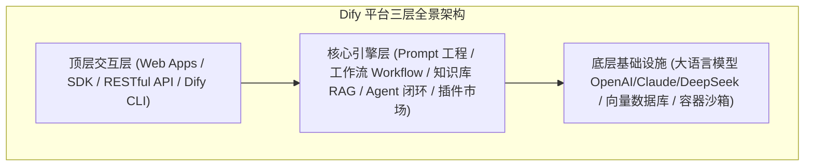
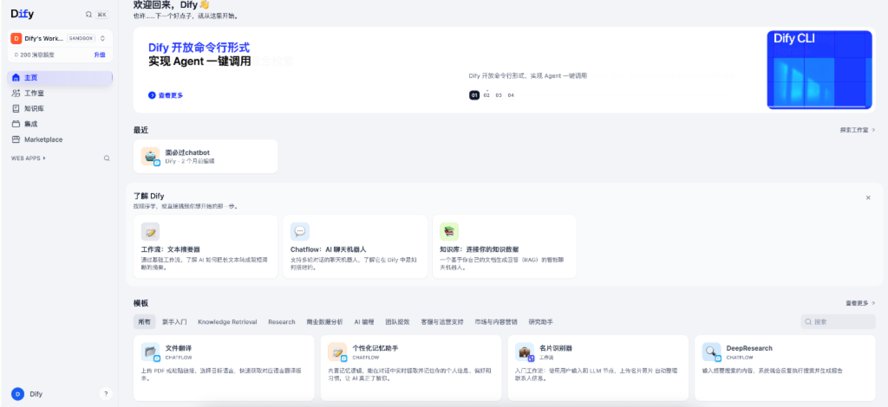
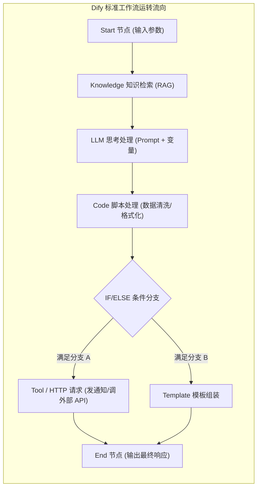

# 4.1 Dify 核心概念与平台全貌：从控制台到 LLMOps 完整体系

> **“不要重复造轮子，除非你想重新发明轮子。”**  
> 在现代 AI 应用与 Agent 智能体开发中，[Dify.ai](https://dify.ai) 就像是一座**“可视化智能乐高工厂”**。它将底层复杂的大模型调用、提示词工程、向量检索、数据解析与工具集成抽象成了一个个标准积木块，让你无需手写成千上万行粘合代码，即可在几分钟内编排并交付工业级 AI 应用！

---

## 🧭 一、什么是 Dify？为什么全球开发者都在用？

### 1. 官方权威档案
- **官方网站**：[https://dify.ai](https://dify.ai)
- **官方开源代码仓**：[https://github.com/langgenius/dify](https://github.com/langgenius/dify)（GitHub 获得超 60k+ Stars）
- **官方开发者文档**：[https://docs.dify.ai](https://docs.dify.ai)
- **定位**：开源的 LLM 应用开发与 LLMOps（大模型运维）协同平台。

---

### 2. 生活化大比喻：现代智能中央厨房

如果把开发一个 AI 应用比作**“开一家高端定制餐厅”**：
- **传统纯手写代码**：你得自己砌灶台、自己买煤气罐、手写菜单、自己下地种菜、洗菜切菜、手算账单，累到秃头；
- **Dify 平台**：直接为你提供了一间**现代化智能中央厨房**：
  - **顶级大厨** = 大语言模型（LLM，负责理解意图并掌勺炒菜）；
  - **私房秘籍与原料仓** = 知识库（Knowledge / RAG，提供独家菜谱与精准资料）；
  - **自动洗菜切菜流水线** = 工作流（Workflow，按照规定步骤一步步处理食材）；
  - **跑腿外卖员** = 外部工具与插件（Tools / Plugins，帮大厨上网查最新食材价格、调用配送 API）；
  - **点餐大堂与外卖窗口** = Web App 与开放 API 接口（顾客进门直接点单，或者第三方平台一键对接）。

---

## 🖥️ 二、Dify 平台主界面全貌与功能拆解

下面是 Dify 登录后的核心主页全貌：

结合上方主页，我们逐一拆解 Dify 的核心功能分区：

### 1. 左侧全局导航栏 (Navigation Bar)
- **主页 (Home)**：总览推荐、快捷入口、最新功能动态与热门模板推荐；
- **工作室 (Studio)**：**核心工位**！在这里创建、编排、调试你的 Chatflow（对话流）、Workflow（工作流）、Agent（智能体）以及基础文本应用；
- **知识库 (Knowledge)**：企业私有数据中枢！支持上传 PDF、DOCX、Markdown、TXT、网页 URL，平台自动完成文档清洗、切片分块（Chunking）、向量化嵌入（Embedding）与多路混合检索；
- **集成 (Tools & Integrations)**：连接外部世界的万能插座！内置高德天气、Google 搜索、维基百科、代码执行沙箱，并支持自定义 OpenAPI 插件与 MCP 协议；
- **Marketplace (插件市场与模型广场)**：官方与开源社区共享的现成应用模板、扩展插件与实用工具，一键安装即用；
- **Web Apps 独立展示区**：所有对外发布的独立 Web 应用快捷入口，无需前端开发即可直接分享给终端用户使用。

---

### 2. 顶部能力升级：Dify CLI 命令行与 Agent 调度
- Dify 现已全面支持 **Dify CLI** 命令行交互工具！
- **核心价值**：不仅能在浏览器画布中拖拽，还能通过终端命令行（CLI）直接调用已发布的工作流与 Agent，方便融入自动化脚本、CI/CD 流水线以及本地开发终端。

---

### 3. 主页推荐：三大核心应用形态

在主页的“了解 Dify”专区，官方推荐了三大基石形态：

| 应用形态 | 核心特点 | 生活比喻 | 典型应用场景 |
| :--- | :--- | :--- | :--- |
| **工作流 (Workflow)** | 单向任务流水线，**无状态**，输入立即触发执行并输出 | 工业自动化流水线（原料进去，成品打包出来） | 长文本深度摘要、批量发票/名片信息提取、跨系统数据清洗 |
| **Chatflow (对话机器人)** | **带记忆状态机**，支持多轮上下文交互与多分支跳转 | 懂你心意的一对一专属客服顾问 | 智能面试助手、个性化学习私教、智能在线客服 |
| **知识库 (Knowledge / RAG)** | 挂载专属私有文档，提供向量检索与精准溯源参考 | 开卷考试时的专业参考书库 | 企业内网问答、法律法规检索助手、技术文档库 |

---

### 4. 丰富模板生态 (Templates Hub)
Dify 主页内置了海量开箱即用的行业模板：
- **文件翻译 (Chatflow)**：上传多语言 PDF 或粘贴链接，自动保持专业术语一致性翻译；
- **个性化记忆助手 (Chatflow)**：在多轮对话中实时提取并长效存储用户的个人喜好、偏好习惯；
- **名片识别群 (Workflow)**：利用视觉多模态与 OCR 提取名片字段，自动整理归档；
- **DeepResearch (Chatflow)**：输入研究主题，系统全自动发起多轮迭代式网络深度搜索并输出完整长篇研报。

---

## 🧩 三、Dify 底层核心概念与节点体系深度剖析

要在 Dify 中游刃有余地编排复杂系统，必须彻底搞懂以下六大核心概念：

### 1. 节点体系 (Node Architecture)
工作流画布中的每一个积木块都是一个独立的**功能节点**：

1. **开始节点 (Start Node)**：定义工作流的输入变量（例如：用户上传的文章、选定的语言、目标格式）；
2. **LLM 节点**：核心计算大脑！自由切换 GPT-4o、Claude 3.5 Sonnet、DeepSeek-V3 等大模型，配置 System Prompt 与温度参数（Temperature）；
3. **知识检索节点 (Knowledge Retrieval)**：连接知识库，根据输入关键词或向量在文档中寻找最相关的参考切片，注入给下个节点；
4. **代码节点 (Code Node)**：在安全的独立沙箱环境中运行 Python 3 或 JavaScript 代码，负责高阶字符串拼接、JSON 提取、正则匹配等算法计算；
5. **条件分支节点 (IF/ELSE Branch)**：根据前置节点的输出结果（如情绪是否为负面、字数是否超标）走不同的执行流；
6. **工具节点 (Tool Node)**：调用天气查询、网页抓取、算术运算、DALL-E 画图等外部功能插件；
7. **HTTP 请求节点 (HTTP Request)**：向任意外部 RESTful API 发起 GET/POST 请求，对接自建后端系统或第三方 Webhook；
8. **模板转换节点 (Template Transform)**：使用 Jinja2 语法将多个分散的变量组装成一段结构化长文本或 Markdown；
9. **变量聚合器节点 (Variable Aggregator)**：汇聚多个分支的结果，确保无论走哪条分支，后续节点都能拿到统一的变量；
10. **结束/直接回复节点 (End / Answer Node)**：将最终处理完成的结果返回给用户或下游调用方。

---

### 2. 变量引用与上下文机制 (Variable Reference)
在 Dify 中，所有节点之间的数据流转通过统一的**变量引用语法**实现：
- 格式：`{{#node_id.output_key#}}`
- 例如：`{{#start.user_query#}}` 表示获取开始节点中用户输入的查询内容；`{{#knowledge_retrieval.result#}}` 表示获取知识库召回的参考文本；
- **系统内置变量**：
  - `{{#sys.query#}}`：用户当前轮次输入的原始问题；
  - `{{#sys.conversation_id#}}`：当前会话的唯一标识 ID；
  - `{{#sys.user_id#}}`：终端用户的唯一识别标识；
  - `{{#sys.files#}}`：用户随消息上传的多模态附件列表（图片、音频、文档）。

---

### 3. LLMOps 与全生命周期运营支持
Dify 不仅仅是一个画布编辑器，更是一个完整的**生产级大模型运营中台**：
- **实时调试与单步运行 (Debug & Run)**：在画布上点击任意节点即可单独运行测试，观察输入与输出数据流，排错秒级定位；
- **版本控制与 DSL 导出**：支持一键将整个画布编排导出为 `.yml` 格式的 DSL 描述文件，版本变动清晰可查；
- **日志与全链路追踪 (Logs & Tracing)**：记录真实用户的每一条请求、Token 消耗、延迟耗时、各节点执行状态；
- **数据标注与持续迭代 (Annotation)**：对线上真实回答进行人工打分与校准纠偏，形成高质量微调或 Few-Shot 数据集；
- **API 密钥与访问控制**：一键生成 API Key，前端工程只需向 Dify 后端发起标准的 HTTP POST 请求即可调用。

---

## 🚀 四、本节小结与下一步指引

通过本节的全面拆解，你已经对 Dify 的产品定位、主页布局、四大应用形态以及核心节点体系有了扎实的理论认知。

接下来，我们将正式进入第二小节——**[4.2 工作室实操与工作流创建：从空白画布、模板到 DSL 导入](./02_创建工作流与工作室实操.md)**，手把手带你进入工作室，开启你的第一个应用编排之旅！
