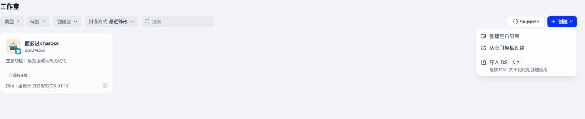

# 4.2 工作室实操与工作流创建：从空白画布、模板到 DSL 导入

> **“工欲善其事，必先进工坊。”**  
> 如果说 Dify 是现代大模型应用的“超级中央厨房”，那么**工作室 (Studio)** 就是每位开发者最重要的“操作台”。本节将结合实操界面，带你从“探索工作室”入口出发，全面掌握应用创建的三大姿势（空白创建、模板克隆、DSL 导入）与核心形态选型！

---

## 🚪 一、第一步：进入开发者的核心操作台 ——“探索工作室”

在登录 Dify 主页后，你可以通过左侧导航栏的【工作室】按钮，或点击主页“最近”模块右侧的快捷通道一键直达：

> 💡 **小贴士**：点击 **“探索工作室 →”** 后，你将进入所有已创建应用（Chatbot、Chatflow、Workflow、Agent）的统一管理中枢。

---

## 🎛️ 二、工作室 (Studio) 控制台界面深度拆解

进入工作室后，呈现在你眼前的就是开发者的完整资产面板：

我们对界面上的核心功能区域进行全面拆解：

### 1. 顶部多维筛选与搜索栏 (Filter Bar)
当你的项目越来越多时，快速定位资产至关重要：
- **类型 (Type)**：支持按应用形态精准过滤（全部、聊天助手 Chatbot、对话工作流 Chatflow、任务工作流 Workflow、智能体 Agent）；
- **标签 (Tags)**：支持自定义业务标签（如“HR助手”、“生产环境”、“研发内部工具”）；
- **创建者 (Creator)**：团队协同场景下按成员筛选应用；
- **排序方式 (Sort By)**：按“最近修改时间”或“创建时间”排序；
- **搜索框 (Search)**：按应用名称或描述关键字全局秒级检索。

---

### 2. 应用卡片与状态展示 (App Cards)
每个已创建的应用都会以卡片形式陈列（如上图中的【面必过chatbot】）：
- **应用图标与名称**：直观区分不同机器人；
- **应用类型标识**：明确标记当前应用是 `CHATFLOW`（对话工作流）、`WORKFLOW`（任务流）还是 `AGENT`；
- **主要功能描述**：如“模拟面试和简历优化”，让团队成员一眼看清职责；
- **标签管理与修改时间**：支持快速贴标签与查看历史更新状态；
- **独立 WebApp 访问入口**：点击卡片右下角的地球图标 🌐 即可直接打开免登录/公开访问的网页对话窗口。

---

### 3. 右侧核心操作区：三大创建应用方式对比

点击右上角蓝色的 **`+ 创建`** 按钮，会弹出一个三合一下拉菜单。这代表了 Dify 中最高频的三种开发路径：

<!-- 图表源文件：img/diagrams/02-diagram-01.mmd；视觉风格：Stripe 紫蓝 -->

  

| 创建方式 | 适合人群与场景 | 核心优势 | 生产建议 |
| :--- | :--- | :--- | :--- |
| **📄 创建空白应用 (Create from Blank)** | 需求明确、逻辑高度定制的业务开发 | 完全自主掌控每个节点的输入、输出与流转逻辑 | 核心业务与高阶工作流的首选 |
| **🗂️ 从应用模板创建 (Create from Template)** | 初学者学习、寻找最佳实践灵感 | 开箱即用，已配好高质量 Prompt 与示例节点 | 快速验证可行性与打样原型 (MVP) |
| **📑 导入 DSL 文件 (Import DSL File)** | 跨环境部署、团队协作资产交付、社区开源分享 | 拖入 `.yml` 文件 1 秒还原复杂拓扑图 | CI/CD 发布、灾备备份与环境迁移利器 |

> 📌 **什么是 `{ } Snippets` 代码片段库？**  
> 点击 `+ 创建` 左侧的 `{ } Snippets` 按钮，可以管理和复用你常用的小代码段（如数据清洗 Python 脚本、正则表达式提取器、标准 JSON 解析器），在不同工作流之间无缝复用，极大提升开发效率！

---

## 🧭 三、工作流与 Chatflow 选型决策指南

很多初学者在点击“创建空白应用”时容易混淆：什么时候选【工作流 Workflow】，什么时候选【对话流 Chatflow】？

<!-- 图表源文件：img/diagrams/02-diagram-02.mmd；视觉风格：Stripe 紫蓝 -->

  

### 1. 任务工作流 (Workflow)
- **核心思路**：函数式流水线（`Output = f(Input)`）。
- **运行特征**：接收参数 -> 经过中间多个节点协同运算 -> 产出固定结构的数据并结束。每一次调用都是全新且独立的，无历史对话负担。
- **典型代表**：文章摘要器、合同风险筛查、批量数据清洗与转格式。

### 2. 对话工作流 (Chatflow)
- **核心思路**：带状态机（State Machine）与多轮会话记忆的交互系统。
- **运行特征**：保留用户每一轮的聊天记录（`sys.conversation_id`），支持在对话中根据用户最新回复动态分支流转。
- **典型代表**：智能面试官（如面必过chatbot）、全能客服助理、角色扮演私教。

---

## 📚 四、官方开源资源与进阶学习直达

- **Dify 官方工作流编排指南**：[https://docs.dify.ai/v/zh-hans/guides/workflow](https://docs.dify.ai/v/zh-hans/guides/workflow)
- **Dify 官方 DSL 规范解析**：[https://docs.dify.ai/v/zh-hans/guides/workflow/dsl](https://docs.dify.ai/v/zh-hans/guides/workflow/dsl)
- **Dify 官方 GitHub 讨论区与 DSL 共享库**：[https://github.com/langgenius/dify/discussions](https://github.com/langgenius/dify/discussions)

---

## 🚀 五、本章实战总结与全景回顾

在本节中，你已经完成了从 Dify 主页导航、进入工作室、控制台界面全景解析，到掌握三大核心创建姿势（空白创建、模板克隆、DSL 导入）与工作流/Chatflow 的架构选型法则。

掌握了工作室的操作台后，你就拥有了将任意业务场景快速转化为可视化工作流的强大基建能力！
