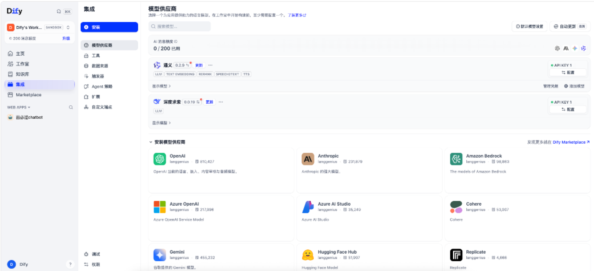
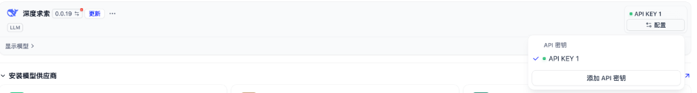
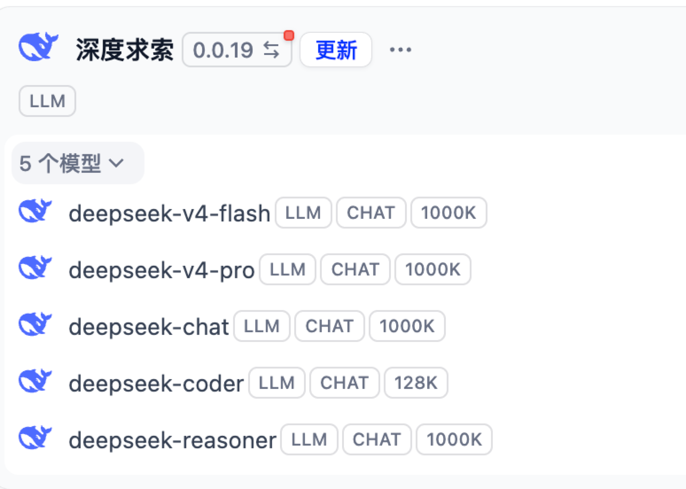
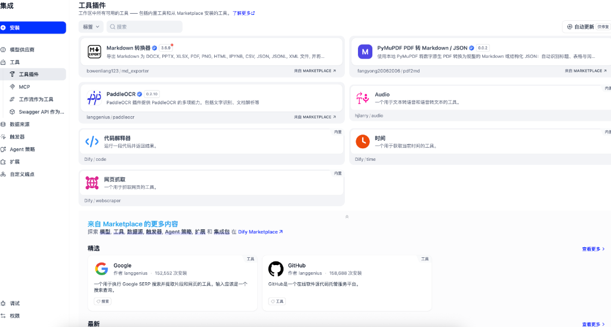

# 4.3 模型供应商与工具插件生态：连接大模型大脑与外部世界能力

> **“独木不成林，单模型难成应用。”**\
> 一个真正强大的 AI 应用，不仅需要聪明绝顶的“思考大脑”（大语言模型 LLM），还需要能够听懂声音、看懂图片、向量化切片的“多模态感官”，以及能够上网搜索、解析 PDF、识别文字、调用业务系统的“机械手臂”（工具与插件）。\
> 在 Dify 中，**【集成 (Integrations)】** 模块就是整座智能工厂的“能源中枢与万能插座”！

***

## ⚡ 一、集成中心全景架构与生活化大比喻

<!-- 图表源文件：img/diagrams/03-diagram-01.mmd；视觉风格：Stripe 紫蓝 -->

  

### 1. 生活化大比喻：顶级厨师与瑞士军刀

如果把 Dify 比作一个超级赛博人：

- **模型供应商** = 给赛博人挑选**大脑智商与感官中枢**（可以选择高性价比的 DeepSeek、擅长逻辑推理的 Reasoner、擅长向量计算的 Embedding 专用模型）；
- **工具与插件** = 给赛博人装配**瑞士军刀与外骨骼机械臂**（让他不仅能脑内思考，还能自己去网上查最新的汇率天气、读取用户的名片 PDF、甚至帮用户在 GitHub 上提 Issue）。

***

## 🧠 二、模型供应商 (Model Providers) 体系深度解析

进入 Dify 左侧导航栏的【集成】->【模型供应商】，即可看到全球主流模型的配置大厅：

### 1. 全球主流模型供应商矩阵

Dify 原生支持了全球数十家顶级大模型供应商与开源托管平台：

- **国内顶流旗舰**：[深度求索 (DeepSeek)](https://www.deepseek.com)、[阿里通义千问 (Qwen/DashScope)](https://tongyi.aliyun.com)；
- **国际顶级大厂**：[OpenAI (GPT系列）](https://openai.com)、[Anthropic (Claude系列)](https://www.anthropic.com)、[Google Gemini](https://deepmind.google/technologies/gemini/)、[Cohere](https://cohere.com)；
- **企业级云与开源推理平台**：[Amazon Bedrock](https://aws.amazon.com/bedrock/)、[Azure OpenAI / Azure AI Studio](https://azure.microsoft.com/en-us/products/ai-services/openai-service)、[Hugging Face Hub](https://huggingface.co)、[Replicate](https://replicate.com)。

***

### 2. 模型五大核心能力标签全景扫盲

在模型卡片上（如上图中的通义千问与 DeepSeek），你会看到几个重要的能力胶囊标签。它们代表了模型在 Dify 内部的不同职责分工：

| 能力标签                 | 全称与定位                        | 生活比喻                  | 典型应用场景            |
| :------------------- | :--------------------------- | :-------------------- | :---------------- |
| **`LLM`**            | 大语言模型 (Large Language Model) | 掌勺大厨（负责理解、推理、生成文本）    | 对话生成、文章润色、工作流思考节点 |
| **`TEXT EMBEDDING`** | 文本嵌入向量化模型                    | 智能图书管理员（把文字变成高维数学坐标）  | 知识库（RAG）文档分块切片向量化 |
| **`RERANK`**         | 重排序模型                        | 决赛裁判（从海选初筛中挑出最精准的段落）  | 知识库混合检索后的精准二次排序   |
| **`SPEECH2TEXT`**    | 语音识别转文字 (ASR)                | 录音速记员（听懂语音并转成文本）      | 语音输入法、电话录音质检分析    |
| **`TTS`**            | 语音合成 (Text to Speech)        | 电台播音员（将 AI 生成的文本朗读出来） | 智能外呼、有声读物生成、无障碍播报 |

***

### 3. API Key 多密钥池与多账号管理机制

点击供应商卡片右上角的 `• API KEY 1`，可以展开密钥管理菜单：

- **多密钥负载均衡与容灾**：Dify 支持为一个模型供应商添加多个 API Key（如 `API KEY 1`、`API KEY 2`）；
- **为什么需要多 Key？**
  1. **防止限流 (Rate Limit 熔断)**：在高并发生产场景下，多 Key 轮询可以有效分摊并发压力；
  2. **权限与计费隔离**：可以按部门或业务线配置专属的 API 密钥与配额消耗监控。

***

### 4. 深度求索 (DeepSeek) 模型家族与超大上下文

点击深度求索卡片下方的【显示模型】，可以看到其麾下的 5 大主力模型：

- **`deepseek-reasoner`** **(1000K 上下文)**：专精深度逻辑推理的大模型（强化学习驱动），在生成最终答案前会输出完整的思考链（Chain of Thought），适合复杂算法分析与数学推理；
- **`deepseek-chat`** **(1000K 上下文)**：极高性价比的通用多轮对话与内容创作主力模型；
- **`deepseek-coder`** **(128K 上下文)**：针对数十种编程语言做过深度专项训练的代码生成与审查专家；
- **`deepseek-v4-flash`** **/** **`deepseek-v4-pro`** **(1000K 上下文)**：专为超低延迟交互与旗舰级工业任务优化的新一代模型版本。

> 💡 **什么是 1000K (100 万 Token) 超大上下文？**\
> 1000K Token 相当于大约 **150 万汉字或 80 万英文单词**。这意味着你可以把整整 10 本《红楼梦》或一个完整中型开源项目的全部源码一次性塞入模型上下文中，让它在整套代码库中精准定位 Bug 或进行跨模块重构，彻底告别以往模型“读了后文忘前文”的尴尬！

***

## 🛠️ 三、工具与插件生态 (Tools & Plugins) 深度剖析

点击左侧导航栏的【集成】->【工具】，即可进入工具生态的配置中心：

在现代智能体开发中，工具是赋予 AI“手脚”的核心。Dify 将工具体系分为了四大来源：

<!-- 图表源文件：img/diagrams/03-diagram-02.mmd；视觉风格：Stripe 紫蓝 -->

  

### 1. 核心工具插件 (Tool Plugins) 盘点

在工具面板中，我们可以看到丰富的高频实用工具：

- **`Markdown 转换器`** **(来自 Marketplace)**：一键将 Markdown 格式无损导出为 DOCX、PPTX、XLSX、PDF、PNG、HTML、IPYNB 等十几种格式；
- **`PyMuPDF PDF 转 Markdown / JSON`** **(来自 Marketplace)**：直接使用本地高性能 PyMuPDF 引擎，把数字原生 PDF 解析为排版规整的 Markdown 与结构化表格数据；
- **`PaddleOCR`** **(来自 Marketplace)**：集成百度开源的高精度多语言文字识别与版面文档分析引擎；
- **`代码解释器`** **(内置)**：在安全沙箱内动态执行一段 Python/JS 代码并实时返回运算结果；
- **`网页抓取`** **(内置)**：输入 URL 自动清洗并提取网页主体正文内容；
- **`时间`** **(内置)**：为模型提供精准的当前系统绝对时间戳，消除大模型“不知今夕何夕”的时间幻觉。

***

### 2. 前沿协议：MCP (Model Context Protocol) 深度支持

- **什么是 MCP？**\
  [MCP (Model Context Protocol)](https://modelcontextprotocol.io) 是由 Anthropic 于 2024 年底提出、并在 2025/2026 年迅速成为全行业事实标准的开放大模型通信协议。
- **Dify 原生支持 MCP**：你可以将本地部署的 MCP 服务器（如访问本地文件系统、查询 PostgreSQL 数据库、调用 GitHub CLI）直接挂载到 Dify 中，让画布上的 Agent 无缝调用！

***

### 3. 架构高阶玩法：工作流作为工具 (Workflow as Tool)

- **核心概念**：你在工作室中精心搭建好的一条复杂工作流（比如“专利查重工作流”），可以一键发布为“工具”；
- **协同效应**：在其他的 Chatflow 或多 Agent 决策系统中，大模型可以直接把这条工作流当作一个独立函数来调用，实现系统架构的高内聚与模块化复用！

***

### 4. 企业级系统打通：Swagger / OpenAPI 快速导入

- 传统企业内部已经积累了成百上千个微服务 API；
- 在 Dify 中，你只需上传现有的 `swagger.json` 或 `openapi.yaml` 接口描述文件，Dify 就会**自动解析出所有入参、出参和接口描述**，瞬间把沉睡的传统企业 API 升级为 AI Agent 可以自主调用的智能工具！

***

## 🎯 四、生产环境最佳组合与选型心法

在真实的 Vibe Coding 与 Agent 落地中，建议采用以下黄金组合策略：

1. **思考中枢 (Reasoning Brain)**：
   - 复杂长文本研究、跨文件代码重构、数学计算：选用 `deepseek-reasoner` 或 `Claude 3.5 Sonnet`；
   - 高频快速对话、日常数据清洗：选用 `deepseek-chat`、`通义千问` 或 `GPT-4o-mini`，兼顾响应速度与超低成本。
2. **知识检索 (RAG Pipeline)**：
   - Embedding 模型优先选用专精向量模型（如 `text-embedding-3-large`、`bge-large-zh`）；
   - 配合 `RERANK` 标签模型（如 `bge-reranker-large`、`Cohere Rerank`）进行决赛精筛。
3. **工具外挂 (Tool Arming)**：
   - 文档解析选用 `PyMuPDF` + `PaddleOCR`；
   - 外部业务联通用 `Swagger / OpenAPI` 快速挂载企业后台。

***

## 🔗 五、官方开源资源与进阶学习直达

- **Dify 模型供应商配置官方文档**：<https://docs.dify.ai/v/zh-hans/guides/model-configuration>
- **Dify 插件与工具生态官方指南**：<https://docs.dify.ai/v/zh-hans/guides/tools>
- **Model Context Protocol (MCP) 官方标准**：<https://modelcontextprotocol.io>
- **Dify 官方 Marketplace 插件广场**：<https://marketplace.dify.ai>

