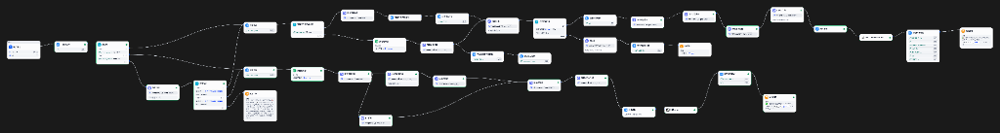
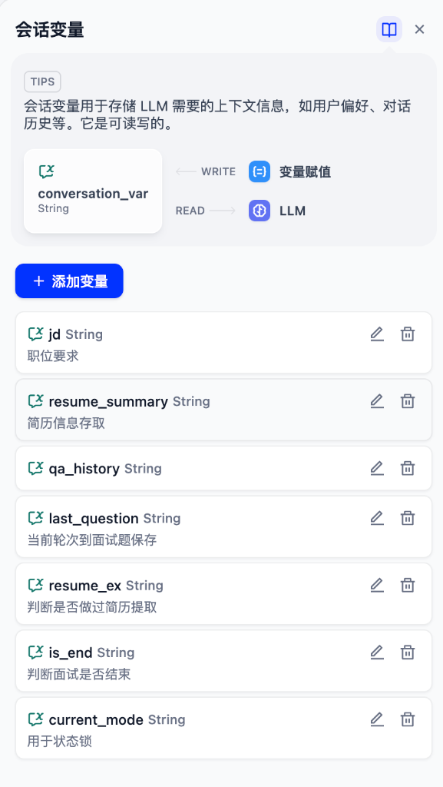
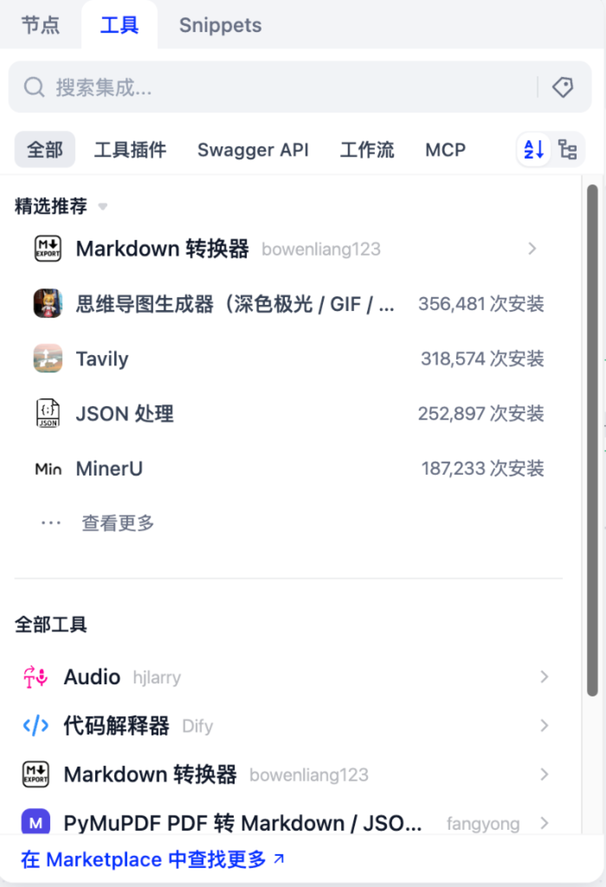

# 4.4 案例全景透视与架构设计：认识「面必过」双引擎 Chatbot

> **“一个优秀的 Agent 系统，绝不是单次 Prompt 的碰运气，而是精密状态机与多专家协同编排的确定性闭环。”**  
> 在前面的小节中，我们熟悉了 Dify 的界面布局、工作流创建姿势与模型工具生态。从本节开始，我们将进入真正的工业级大项目实战 —— 深度解构并掌握包含 **41 个节点、7 大全局会话变量、双流水线架构** 的求职神器：**「面必过」双引擎 Chatbot**！

---

## 🧭 一、项目定位与业务痛点：传统单次 AI 为什么搞不定模拟面试？

### 1. 官方权威档案与案例概览
- **项目名称**：面必过 chatbot
- **应用形态**：`advanced-chat`（高级对话流 / Chatflow）
- **核心业务场景**：
  1. **沉浸式模拟面试**：支持多轮真实深度技术面试、问答记忆滚雪球记录、以及面试结束后的多专家（表现评估 + 改进方案 + 技术复盘）HTML 报告导出；
  2. **多专家圆桌式简历优化**：基于目标职位（JD），由 JD 匹配师、HR 审核师、内容优化师三方会诊，输出符合 STAR 原则的精修简历并生成排版 HTML。
- **源码参考**：本项目目录下的 [`面必过chatbot .yml`](./面必过chatbot%20.yml)（Dify 标准 DSL 配置文件）。

---

### 2. 传统单次大模型问答的“三大死穴”

如果我们直接在 ChatGPT 或单次 LLM 对话框里说“请帮我模拟面试”，通常会迅速陷入以下尴尬困境：

| 传统单次对话死穴 | 产生原因 | 用户痛苦体验 |
| :--- | :--- | :--- |
| **1. 金鱼记忆与节奏失控** | 缺乏专门的问答历史提取与变量追加机制 | 聊到第 3 轮，AI 就忘记了第 1 轮问了什么、候选人怎么回答的，甚至反复问相同的问题。 |
| **2. 意图乱窜与身份漂移** | 缺乏多轮会话的“状态锁（State Lock）”机制 | 当候选人回答“这个技术我没用过”时，AI 误以为用户在日常闲聊，直接跳出面试官角色开始科普技术。 |
| **3. 产出单薄无结构** | 缺乏多专家协同评审与后处理流水线 | 面试结束后只能给出几句不痛不痒的套话评语，无法输出可量化打分、有实操改进方案的专业复盘报告。 |

---

### 3. 生活化大比喻：游乐园入场手环与三甲医院专家会诊

为了彻底解决上述痛点，「面必过」工作流引入了两个极为精妙的核心设计思路：

<!-- 图表源文件：img/diagrams/04-diagram-01.mmd；视觉风格：Stripe 紫蓝 -->

  

- **设计思路一：状态机与状态锁（State Machine & State Lock）**  
  就像去迪士尼乐园，你在门口检票后会戴上一个**“专属手环”**。在园内游玩期间，你无需每次去新项目都在大门口重新安检排队。系统通过 `current_mode` 变量锁定你的状态：**只要手环在，你的每一句话都被认定为“面试回答”；直到面试结束剪断手环，状态才被重置！**

- **设计思路二：多专家圆桌会诊（Multi-Agent Collaboration）**  
  无论是面试复盘还是简历精修，不再靠单一模型草草了事，而是引入了类似**三甲医院专家联合会诊**的机制：**主考官打分、技术专家挑刺、HR 评估稳定性、文字润色师重塑表达**，最后由圆桌主持汇总交付。

---

## 🗺️ 二、「面必过」工作流全景图谱拆解

下图是「面必过」在 Dify 平台画布中的完整编排全貌（去img目录打开看吧）：

### 全局架构流向图

<!-- 图表源文件：img/diagrams/04-diagram-02.mmd；视觉风格：Stripe 紫蓝 -->

  

---

## 🗃️ 三、核心精髓：7 大会话变量（Conversation Variables）深度拆解

在 Dify 的 Chatflow 中，**会话变量（Conversation Variables）** 是整个应用维持长周期记忆、状态切换与数据传递的“全局数据库”。

在「面必过」工作流中，一共精心设计了 **7 个核心全局变量**：

| 变量名 (Name) | 数据类型 (Type) | 核心职责 | 写入时机 (Write) | 读取时机 (Read) | 生活化比喻 |
| :--- | :--- | :--- | :--- | :--- | :--- |
| `current_mode` | String | **状态锁**：标记当前处于面试、简历优化还是自由状态 | 意图分流后写入 `interview` 或 `resume`；结束时赋空值 | 每次用户发送消息时，由「状态锁」节点首先读取 | **游乐园手环**（戴上则专人专带，取下恢复自由） |
| `jd` | String | 存储用户提供的目标岗位 JD 要求 | 会话入口节点提取并持久化 | 面试出题、JD 匹配分析师对比时读取 | **招聘方的考纲** |
| `resume_summary` | String | 存储从用户上传附件中提取的结构化简历文本 | 首次上传简历解析后一次性写入 | 面试引擎出题、简历优化各专家分析时读取 | **候选人档案袋** |
| `resume_ex` | String | **提取标志位**：标记简历是否已经完成过解析提取 | 首次提取完成后置为 `'1'` | 每一轮面试前判断，防止重复耗费 Token 解析 | **体检盖章“已检查”** |
| `qa_history` | String | **多轮问答记忆库**：按轮次滚雪球记录所有问答对 | 每一轮用户回答后，经 Python 格式化拼接追加 | 面试引擎判断回答质量、技术复盘专家终审时读取 | **面试全程录音笔速记** |
| `last_question` | String | 暂存当前轮次面试官提出的上一道问题 | 每次生成新试题后立即覆盖更新 | 用户回答时，与用户的新答案拼装成问答对 | **黑板上当前写的那道题** |
| `is_end` | String | **完结信号**：标记面试是否达到终止轮次或候选人主动交卷 | 面试引擎判定达到结束条件时置为 `'true'` | 结束变量判断节点读取，决定是继续出题还是开启复盘 | **交卷铃声** |

---

## 🔌 四、依赖生态解密：DeepSeek 插件到底是什么？它与 LLM 节点是什么关系？

很多初学者在查看 DSL 的 `dependencies` 依赖配置时，会产生一个经典的疑问：  
> **“既然工作流里直接拖出来的都是 LLM 节点，那依赖里的 DeepSeek 插件到底是什么？不就是一个 LLM 节点吗？”**

### 1. 从“一体化硬编码”到“模块化插件架构”

在 Dify 的早期版本中，大模型供应商（OpenAI、DeepSeek 等）的代码是直接写死在 Dify 核心源码里的。随着全球大模型爆炸式涌现，Dify 在 **v0.7+ / v1.0+** 中全面升级为 **Marketplace 插件化生态架构**：

<!-- 图表源文件：img/diagrams/04-diagram-03.mmd；视觉风格：Stripe 紫蓝 -->

  

- **LLM 节点（方向盘与控制台）**：工作流画布中的一个**通用功能积木**。你可以在这个节点里填 Prompt、设 Temperature、绑输入输出变量。
- **DeepSeek 插件（发动机引擎驱动）**：Dify 官方插件市场中的**供应商驱动包（Model Plugin）**。它向 Dify 平台注册了 `deepseek-chat`（V3 极速大模型）与 `deepseek-reasoner`（R1 深度推理大模型）的接入协议。
- **Markdown 转换器插件（`bowenliang123/md_exporter`）**：一个**工具插件（Tool Plugin）**，负责将大模型生成的 Markdown 文本在沙箱内转换为现代化排版、支持一键打印与样式渲染的高保真 HTML 网页文件。

> [!TIP]**一句话总结**：依赖项中的 `langgenius/deepseek` 是“驱动程序”，有了它，你的通用 LLM 节点才能在下拉列表里认出并调用 DeepSeek 模型！

---

## 🛠️ 五、DSL 一键导入与实操环境准备

要在你自己的 Dify 平台中复现并体验「面必过」工作流，只需三步：

1. **安装依赖插件**：
   - 进入 Dify 导航栏的 **「Marketplace」**；
   - 搜索并安装 **`Markdown 转换器`**（作者：`bowenliang123`）；
   - 确保模型供应商中已配置好 **`DeepSeek`** 的 API Key。
2. **导入 DSL 文件**：
   - 进入 **「工作室 (Studio)」** -> 点击右上角 **「导入 DSL 文件」**；
   - 选择本项目目录下的 [`面必过chatbot .yml`](./面必过chatbot%20.yml) 并点击创建。
3. **环境检查**：
   - 导入后，点击左侧 **「会话变量」**，确认 7 个变量（`current_mode`、`jd` 等）已全部正确就绪。

---

## 🎯 小结与下一节预告

在本节中，我们从宏观视角俯瞰了「面必过」双引擎 Chatbot 的全景架构，理解了解决复杂多轮对话的“状态锁与状态机”设计思路，并剖析了支撑整个应用的 **7 大会话变量** 与 **插件体系**。

在接下来的 [4.5 核心调度引擎：状态锁路由与意图识别分流](./05_状态锁路由与意图识别分流.md) 中，我们将聚焦于应用的“第一道大门”——深入拆解 **用户输入预处理、状态锁 If-Else 判定、意图识别 LLM 的 Prompt 编写以及动态加锁机制**！
