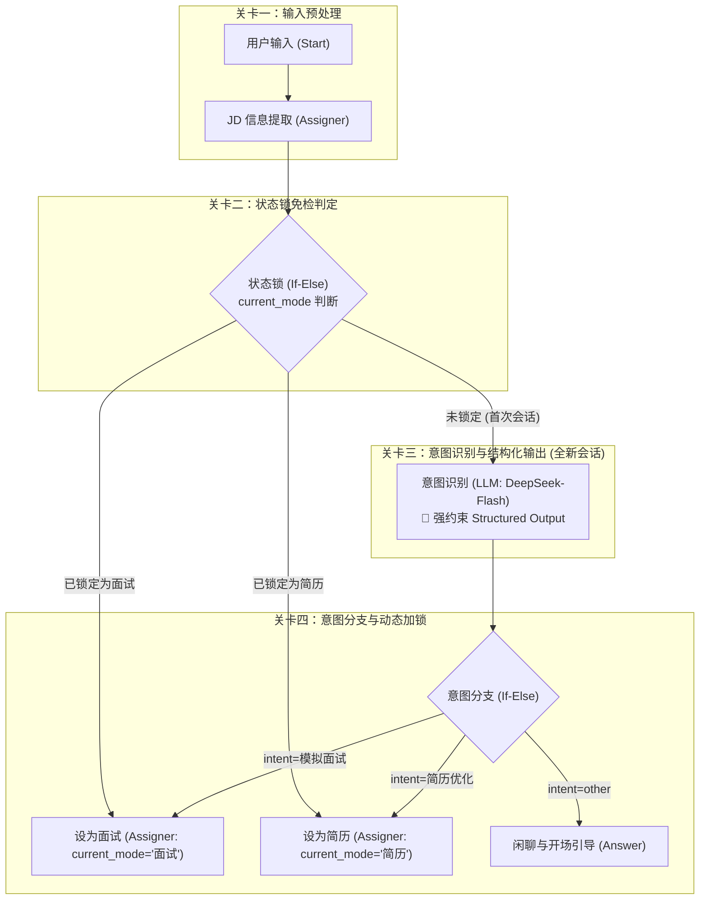
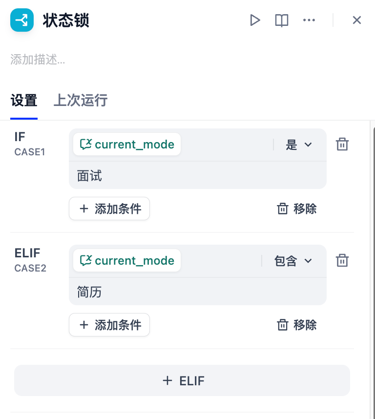
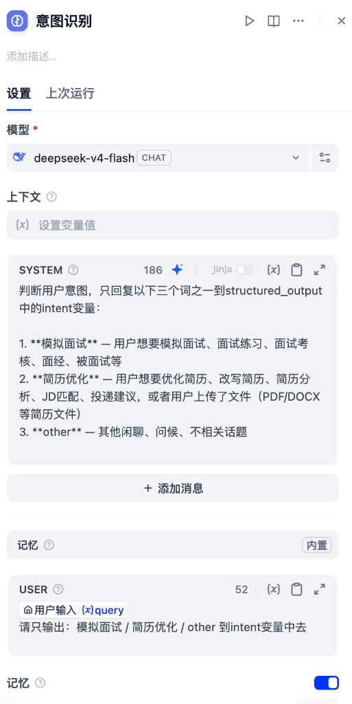
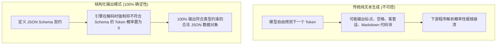
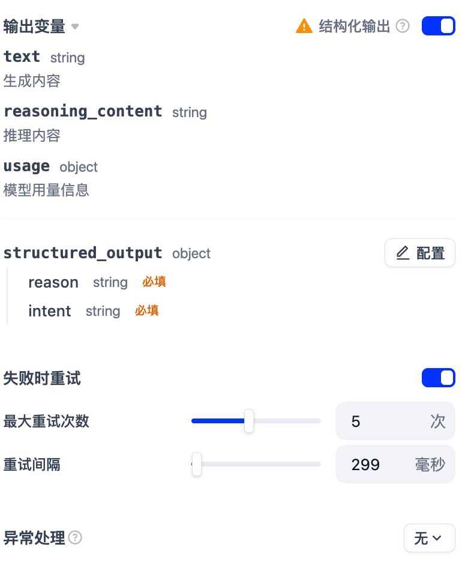
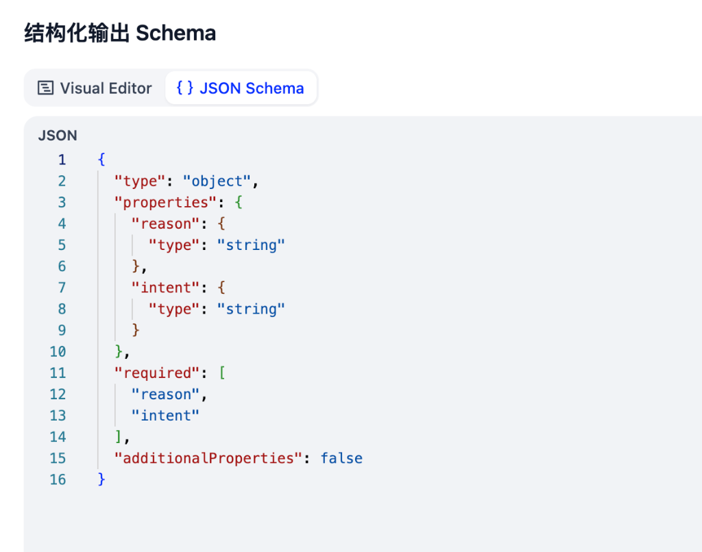
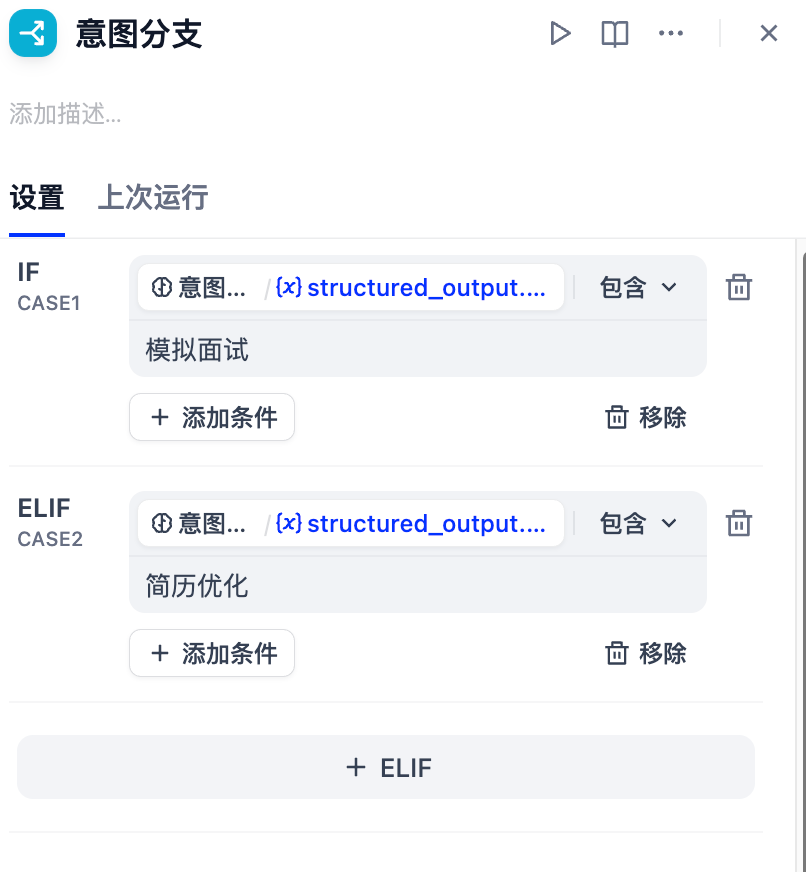

# 4.5 核心调度引擎：状态锁路由、意图识别与结构化输出

> **“在复杂的 AI 应用中，未经严格调度的自然语言就像脱轨的野马；而状态机与结构化输出，就是为它铺设的高铁轨道。”**\
> 在上一小节中，我们建立了「面必过」双引擎 Chatbot 的全景认知与 7 大会话变量体系。本节我们将深入应用的“第一道大门与中央调度室”，拆解 **状态锁免检路由、意图识别 Prompt 提示词工程、大模型结构化输出（Structured Output）第一性原理、以及状态动态加锁机制**！

***

## 🧭 一、中央调度室全貌：四道关卡设计

用户在前端界面发来一句话（例如：“我想面试 Java 高级开发，这是我的简历”），在进入具体的业务流水线之前，必须经历中央调度室的 **四道精密关卡**：



***

## 🚪 二、关卡一与关卡二：输入预处理与状态锁（If-Else）免检通关

### 1. 输入预处理与 JD 持久化

- **用户输入节点**：接收用户的原始消息（`sys.query`）与可能上传的附件文件（PDF/Word/图片）；
- **`jd信息提取`（Assigner 赋值节点）**：将输入中包含的岗位描述存入全局会话变量 `conversation.jd`，方便后续出题引擎与匹配专家随时读取。

***

### 2. 状态锁（If-Else）节点配置



状态锁是整个多轮对话系统的“免检快速通道闸机”：

- **IF (CASE 1)**：`conversation.current_mode` **是** `面试`\
  👉 **直接放行**：说明该用户已经在面试进程中，当前发来的消息必定是对上一道面试题的回答，**直接跳过意图识别大模型**，直达面试处理引擎！
- **ELIF (CASE 2)**：`conversation.current_mode` **包含** `简历`\
  👉 **直接放行**：说明用户正在进行简历优化，直接流向简历优化流水线。
- **ELSE（默认兜底）**：`current_mode` 为空（首次新会话或上一轮刚刚结束）\
  👉 **拦截分流**：引导至关卡三的「意图识别」大模型进行身份判定。

> \[!TIP]
> **为什么要加状态锁？**\
> 如果没有状态锁，在模拟面试第 3 轮时，候选人回答：“*我上一份工作主要负责用 Python 编写数据清洗脚本...*”，普通的意图识别大模型极有可能误以为用户在“咨询 Python 简历怎么写”，从而把用户踢出面试流。**状态锁彻底杜绝了意图误判与跳戏！**

***

## 🧠 三、关卡三：意图识别专家（LLM）的 Prompt 提示词工程

对于新进来的首次会话，系统必须判断用户的真实诉求。



### 1. 模型选型：极速轻量模型（`deepseek-v4-flash`）

意图分类是一个典型的“高吞吐、低延迟”任务，不需要调用超大型推理模型。选用响应只需 100\~300ms 的 Flash 轻量模型，既能做到秒级分流，又能大幅节约 Token 成本。

### 2. 提示词设计解密（Prompt Engineering）

```markdown
# SYSTEM 角色设定
判断用户意图，只回复以下三个词之一到 structured_output 中的 intent 变量：

1. **模拟面试** —— 用户想要模拟面试、面试练习、面试考核、面经、被面试等
2. **简历优化** —— 用户想要优化简历、改写简历、简历分析、JD匹配、投递建议，或者用户上传了文件（PDF/DOCX 等简历文件）
3. **other** —— 其他闲聊、问候、不相关话题
```

```markdown
# USER 输入绑定
{{#1782652624715.query#}}
请只输出：模拟面试 / 简历优化 / other 到 intent 变量中去
```

***

## 🌟 四、重磅特写：大模型“结构化输出（Structured Output）”第一性原理

在构建工业级 AI 工作流时，**结构化输出（Structured Output）** 是决定整个系统能否稳定商用的最核心基石！

### 1. 痛点大揭秘：为什么纯文本输出是下游节点的“噩梦”？

如果我们只靠在 Prompt 里写“*请只输出'模拟面试'四个字，不要输出任何废话*”，大模型由于其**概率性自回归文本接龙**的本质，往往会输出各种奇怪变体：

````
变体 A："好的！根据您的输入，意图分类为：模拟面试。"  ❌（下游 If-Else 判断 == '模拟面试' 失败！）
变体 B："```json {"intent": "模拟面试"} ```"      ❌（带有 markdown 代码块标记，解析崩溃！）
变体 C："模拟面试\n"                              ❌（多了一个看不见的换行符，匹配失败！）
````

这种输出的不确定性，被称为“输出格式漂移（Format Drift）”，是导致传统 LLM 工作流频繁报错崩溃的第一元凶！

***

### 2. 什么是真正的结构化输出？（Schema-Constrained Decoding）

**结构化输出（Structured Output）** 绝不是简单的“在提示词里求大模型听话”，而是在大模型底层的 Token 采样阶段引入了 **语法约束解码（Grammar-Guided / Logits Masking）** 技术：



- **底层原理**：在生成每个词时，推理引擎会根据你提供的 JSON Schema 规则，**强行把所有不合法的字符概率压为 0**（Logits Masking）。例如在需要输出数字的地方，模型绝对不可能输出英文字母！

***

### 3. Dify 中的结构化输出配置实操

在 Dify 的意图识别节点中，我们通过可视化面板与 JSON Schema 进行了严密的双字段约束：

#### ① 变量与重试配置面板



- **输出变量**：自动生成 `structured_output` 对象；
- **失败重试（Retry Mechanism）**：开启重试，设置 **最大重试次数 5 次**，**重试间隔 299 毫秒**。即使遇到罕见网络抖动或模型偶发异常，系统也会自动重试修复，形成工业级双保险。

#### ② JSON Schema 契约定义



```json
{
  "type": "object",
  "properties": {
    "reason": {
      "type": "string"
    },
    "intent": {
      "type": "string"
    }
  },
  "required": [
    "reason",
    "intent"
  ],
  "additionalProperties": false
}
```

- **`reason`（思考理由，String）**：强制要求大模型在给出结论前先写出思考理由（利用隐式思维链 CoT 机制大幅提升分类准确率）；
- **`intent`（核心意图，String）**：精准承载 `模拟面试`、`简历优化` 或 `other`；
- **`required: ["reason", "intent"]`**：两个字段均为必填；
- **`additionalProperties: false`**：严格禁止大模型自行发挥输出多余的字段。

***

## 🔀 五、关卡四：意图分支（If-Else）与状态动态加锁

得到 100% 确定性的 `structured_output.intent` 之后，下游的 **`意图分支`**（If-Else 节点）即可做到精准无误的条件匹配：



### 1. 三大分支路由逻辑

1. **CASE 1（模拟面试）**：
   - 条件：`意图识别.structured_output.intent` **包含** `模拟面试`
   - 流向：触发 **`设为面试`（Assigner 节点）**，写入 `conversation.current_mode = '面试'`，为会话戴上“面试手环”；
2. **CASE 2（简历优化）**：
   - 条件：`意图识别.structured_output.intent` **包含** `简历优化`
   - 流向：触发 **`设为简历`（Assigner 节点）**，写入 `conversation.current_mode = '简历'`，为会话戴上“简历手环”；
3. **ELSE（默认闲聊/引导）**：
   - 流向：触发 **`闲聊引导`（Answer 节点）**，输出开场白并温和提示用户：“*你好！我是「面必过」AI 求职助手，请告诉我你想进行【模拟面试】还是【简历优化】\~*”。

***

## 🎯 小结与下一节预告

在本节中，我们完整拆解了「面必过」调度中枢的四道核心防线：

1. **状态锁** 实现了老用户的极速免检通关；
2. **Flash 轻量模型** 实现了毫秒级意图识别；
3. **结构化输出（JSON Schema）** 从底层彻底消灭了格式漂移与解析崩溃；
4. **状态赋值器** 实现了多轮业务心流的动态加锁。

在接下来的 **[4.6 实战（上）：沉浸式模拟面试流水线与多专家技术复盘](./06_模拟面试流与多专家技术复盘.md)** 中，我们将正式步入最硬核的实战篇章 —— 拆解 **简历多模态懒加载提取、Python 代码节点问答历史拼接、面试官控场引擎、以及三大专家联动的 HTML 报告生成**！
