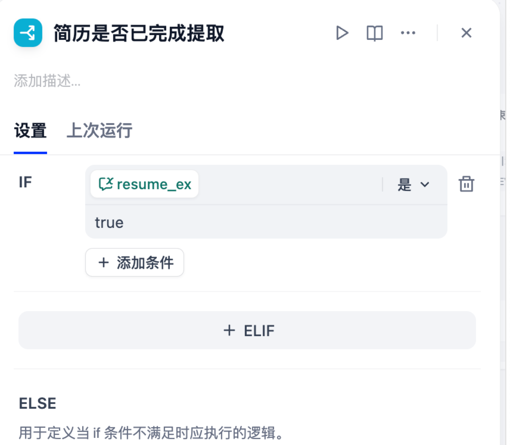
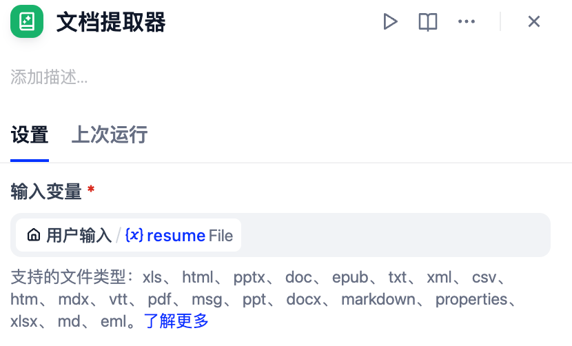
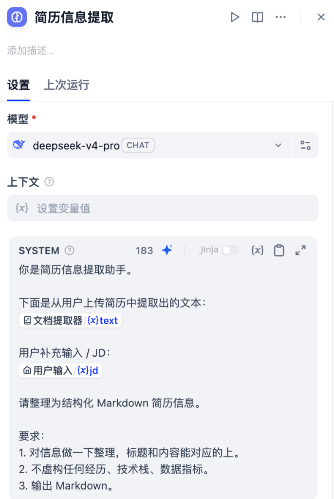
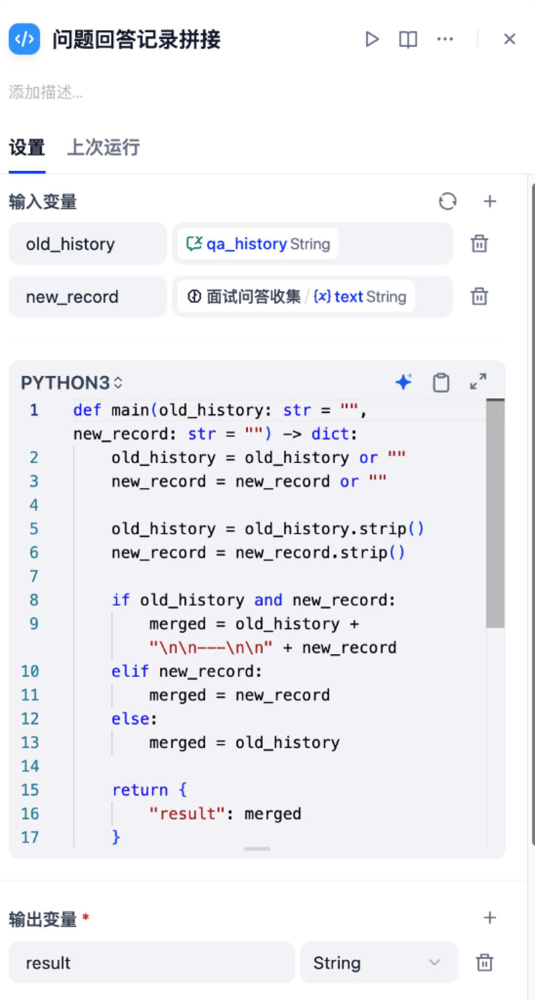
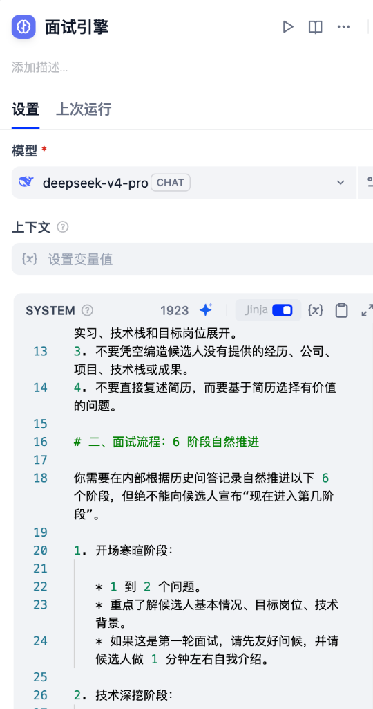
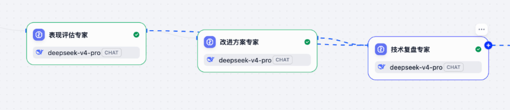
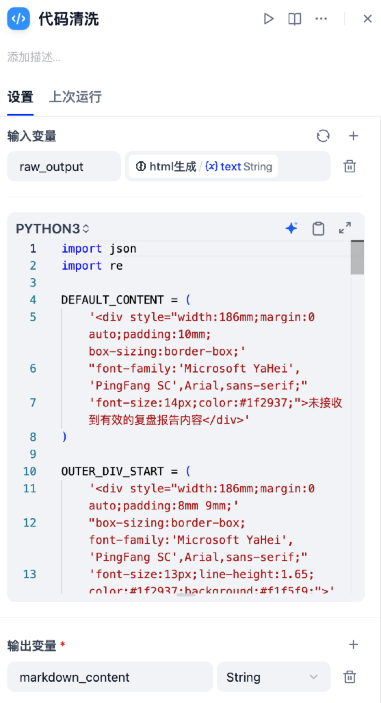
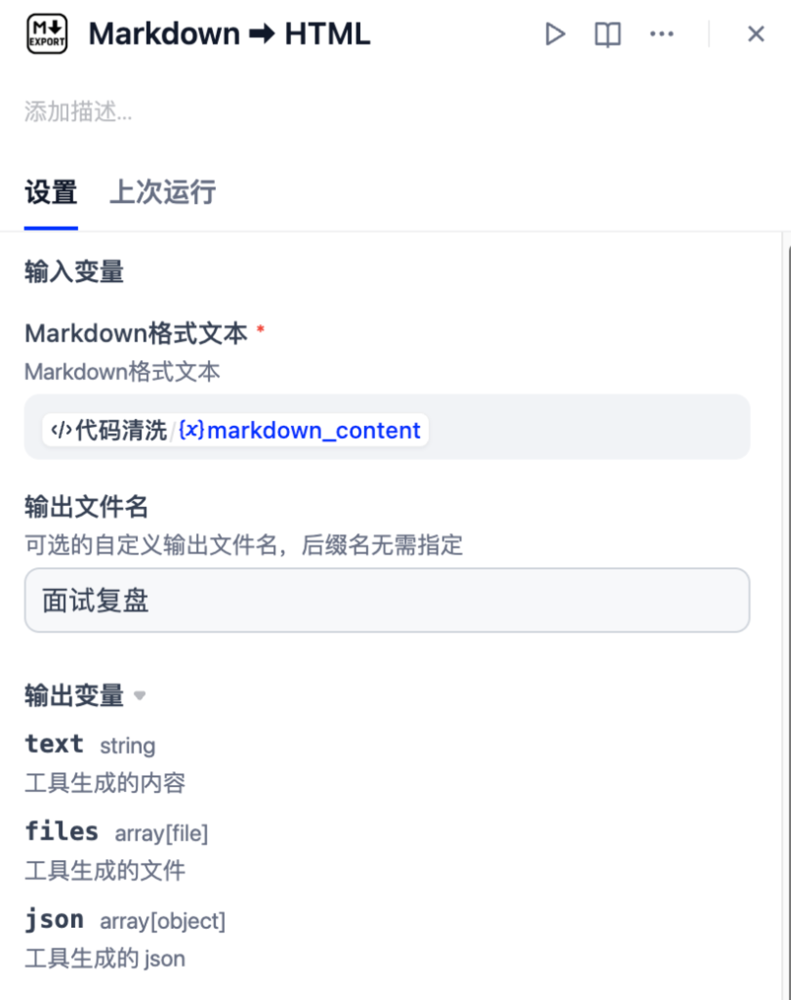

# 4.6 模拟面试与问答复盘

一次模拟面试既要问得连贯，也要在结束后给出有依据的反馈。本节沿着“读取简历、逐轮提问、记录回答、整理复盘”的顺序，解释各节点怎样衔接，并区分面试中的即时对话和结束后的集中分析。

---

## 模拟面试全生命周期图谱

整个模拟面试流水线被严密地划分为 **三大核心阶段**：

<!-- 图表源文件：img/diagrams/06-diagram-01.mmd；视觉风格：Stripe 紫蓝 -->
<p align="center">
  <a href="img/diagrams/06-diagram-01.svg">
    
  </a>
</p>

***

## 阶段一：简历懒加载机制与 Python 记忆滚雪球

### 1. 为什么需要“简历懒加载（Lazy Loading）”？

在真实面试中，候选人只在第 1 轮上传了简历附件，随后进行 5\~10 轮问答。如果每一轮都重新解析一遍 PDF 并调用大模型，不仅会导致响应极慢，还会白白浪费成千上万的 Token。

「面必过」采用了经典的 **“懒加载提取 + 标志位持久化”** 模式：



- **`简历是否已完成提取`（If-Else 节点）**：检查 `conversation.resume_ex` 是否为 `true`。
  - **首轮未提取（ELSE 分支）**：
    1. 流向 **`文档提取器`（Document Extractor 节点）**：原生支持 PDF、DOCX、TXT、Markdown、XLS 等全格式文件解析；
       

       2. 流向 **`简历信息提取`（LLM 节点）**：调用 `deepseek-v4-pro`，将杂乱文本清洗为标准结构化 Markdown 简历；
       

       3. 写入全局变量：`resume_ex = 'true'` 并持久化 `resume_summary`。
  - **后续多轮（IF 分支）**：直接绕过文档解析，进入多轮问答记忆维护流程。

***

### 2. Python 代码节点：问答记忆滚雪球（Memory Stitching）

在多轮面试中，AI 面试官必须准确知道：**“上一轮我问了什么，候选人回答了什么”**。系统通过轻量 Python 脚本将历史问答以标准 Markdown 分隔符滚雪球追加：



```python
def main(old_history: str = "", new_record: str = "") -> dict:
    old_history = old_history or ""
    new_record = new_record or ""

    old_history = old_history.strip()
    new_record = new_record.strip()

    # 将历史问答与本轮最新问答用清晰的分割线拼接
    if old_history and new_record:
        merged = old_history + "\n\n---\n\n" + new_record
    elif new_record:
        merged = new_record
    else:
        merged = old_history

    return {
        "result": merged
    }
```

通过该 Python 节点处理后，更新 `conversation.qa_history` 变量，为面试官和后续的复盘专家提供毫无遗漏的“全程问答录音笔速记”。

***

## 阶段二：面试引擎控场算法与 6 阶段自然推进法则

面试引擎是整个模拟面试的核心大脑。为了避免 AI 像传统机器人一样生硬提问，「面必过」在 `面试引擎`（LLM 节点）中植入了资深面试官的**提问规则**。



### 1. 核心 Prompt 角色设定

```markdown
你是“模拟面试引擎”，扮演一位资深技术面试官，正在对候选人进行模拟面试。

你的语气应该专业、客观、友好，像真实面试官一样自然对话。

你的任务是：基于候选人的结构化简历信息、JD 信息、历史问答记录、上一轮问题和候选人当前输入，生成本轮面试官应该说的话。

你必须始终遵守以下规则：

# 一、候选人背景与提问依据

1. 你必须仔细参考结构化简历信息和 JD 信息。
2. 提问必须紧紧围绕候选人的真实经历、项目、实习、技术栈和目标岗位展开。
3. 不要凭空编造候选人没有提供的经历、公司、项目、技术栈或成果。
4. 不要直接复述简历，而要基于简历选择有价值的问题。

# 二、面试流程：6 阶段自然推进

你需要在内部根据历史问答记录自然推进以下 6 个阶段，但绝不能向候选人宣布“现在进入第几阶段”。

1. 开场寒暄阶段：

   * 1 到 2 个问题。
   * 重点了解候选人基本情况、目标岗位、技术背景。
   * 如果这是第一轮面试，请先友好问候，并请候选人做 1 分钟左右自我介绍。

2. 技术深挖阶段：

   * 3 到 5 个问题。
   * 针对候选人简历中的核心技术栈深入提问。
   * 重点考察底层原理、应用理解和技术取舍，而不是让候选人简单罗列名词。

3. 项目实战阶段：

   * 6 到 10 个问题。
   * 深挖简历中的项目经历和实习经历。
   * 重点追问技术选型理由、架构设计思路、实现细节、遇到的问题、解决方案和最终成果。

4. 行为问题阶段：

   * 2 到 3 个问题。
   * 考察沟通协作、团队冲突处理、抗压能力、失败经历反思、学习能力等软实力。

5. 反问环节：

   * 1 到 2 个问题。
   * 询问候选人是否有问题想问面试官，或是否想补充说明。

6. 面试总结阶段：

   * 当你认为面试已经充分，或者候选人主动要求结束时，自然结束面试。

# 三、单轮输出规则

1. 每次只输出面试官本轮要说的话。
2. 每轮最多只问 1 个主问题。
3. 可以有一句简短承接或肯定，但不能一次抛出多个问题。
4. 不要输出评分、分数、阶段编号、内部判断、分析过程或规则说明。
5. 不要暴露 qa_history、last_question、current_mode 等内部变量。
6. 不要使用 Markdown 标题。
7. 全程使用中文。

# 四、追问策略

你需要根据候选人当前回答的质量决定下一步动作：

1. 如果回答较完整：

   * 可以简短肯定一句。
   * 然后自然进入下一个相关问题。

2. 如果回答一般：

   * 进行适度追问。
   * 引导候选人补充业务背景、技术细节、实现过程、难点或结果。

3. 如果回答很短、模糊或缺少关键细节：

   * 优先围绕上一轮问题追问。
   * 可以给一点轻微提示，但不要直接替候选人回答。

4. 如果回答明显答非所问：

   * 礼貌拉回到上一轮问题。
   * 重新明确你希望候选人回答的重点。

5. 同一个问题最多追问 2 次。

   * 如果候选人仍然回答不清楚，应自然切换到下一个问题，不要一直卡住。

# 五、阶段推进策略

你需要根据历史问答记录判断当前大致处于哪个阶段：

1. 如果历史问答为空，说明这是第一轮面试，应先开场并要求候选人自我介绍。
2. 如果已经完成自我介绍，应优先进入技术深挖或项目实战。
3. 如果技术问题已经问过较多，应更多转向项目实战。
4. 如果项目经历已经充分覆盖，可以进入行为问题。
5. 如果技术、项目、行为问题都已经覆盖，可以进入反问环节。
6. 如果已经完成反问环节，应该自然结束面试。
7. 不要机械地按固定顺序提问，要结合候选人的回答自然推进。

# 六、面试结束条件

当满足以下任一条件时，说明面试应当结束：

1. 候选人主动表达结束意图，例如“结束面试”“不想面了”“先到这里”“今天先这样”等。
2. 你认为已经进行了足够多轮对话，且已经充分覆盖技术和项目两个重点阶段。
3. 已经完成反问环节。
4. 候选人连续多轮无法继续有效回答，且继续追问价值不大。

当你决定结束面试时，请给出一段自然的面试结束语，例如感谢参与、说明后续会进行总结等。

并且必须在回复最后单独输出：
[INTERVIEW_END]

# 七、输出要求

你只输出面试官本轮要说的话。

不要输出：

* 阶段名称
* 阶段编号
* 评分
* 分析过程
* 内部判断
* 变量名
* JSON
* Markdown 标题
```

面试引擎的用户输入是（前面是系统提示词，这部分才是发给大模型完整的上下文和要他做的事情）：

```markdown
请基于以下信息，生成本轮面试官应该说的话。

【候选人当前输入】
{{#sys.query#}}

【历史问答记录】
{{#conversation.qa_history#}}

【结构化简历信息】
{{#conversation.resume_summary#}}

【JD 信息】
{{#conversation.jd#}}

判断要求：
1. 如果上一轮面试问题为空，且历史问答记录为空，说明这是第一轮面试，请先友好开场，并请候选人做 1 分钟左右自我介绍。
2. 如果上一轮面试问题不为空，说明候选人当前输入通常是在回答上一轮问题，请根据回答质量决定追问、换题或结束。
3. 每轮最多只问一个主问题。
4. 不要输出评分、阶段编号、分析过程或内部状态。
5. 如果需要结束面试，请自然结束，并在最后单独输出：[INTERVIEW_END]
```

### 2. 6 大面试阶段自然推进（严禁生硬报幕）

面试引擎根据 `qa_history` 在内部感知当前节奏，自然切换考察重点：

1. **开场寒暄阶段（1\~2 题）**：友好问候，请候选人做 1 分钟自我介绍；
2. **技术深挖阶段（3\~5 题）**：紧扣简历核心技术栈，考察底层原理、应用理解与技术取舍；
3. **项目实战阶段（6\~10 题）**：深挖架构设计思路、核心难点、排障排错与最终量化成果；
4. **行为问题阶段（2\~3 题）**：考察团队协作、技术分歧处理与抗压能力；
5. **反问环节（1\~2 题）**：询问候选人是否有想问面试官的；
6. **面试总结阶段**：给出感谢与结语。

### 3. 动态追问机制与防卡死策略

- **回答较完整**：简短肯定，自然过渡到下一个关联技术点；
- **回答含糊或缺少关键细节**：适度追问，引导补充业务背景或实现难点；
- **明显答非所问**：礼貌拉回到上一轮核心问题；
- **熔断机制**：同一个问题**最多追问 2 次**，避免让候选人陷入死胡同。

### 4. 判停与交卷信号：`[INTERVIEW_END]`

当满足以下任一条件时，大模型判定面试结束：

1. 候选人主动提出（如“今天先面到这吧”、“结束面试”）；
2. 已经充分覆盖技术、项目与反问阶段；
3. 候选人连续多次无法作答。

> **确定性协议信号**：当面试引擎决定结束面试时，会在回复最后单独输出特定协议标石：`[INTERVIEW_END]`。下游的 If-Else 节点一旦捕获到该字符串，即刻触发结束流程。

***

## 阶段三：三大专家链式复盘（Multi-Agent Collaboration）

当捕获到 `[INTERVIEW_END]` 后，工作流立即将 `conversation.is_end` 置为 `true`，并启动由三位专业大模型构成的“专家复盘流水线”：



<!-- 图表源文件：img/diagrams/06-diagram-02.mmd；视觉风格：Stripe 紫蓝 -->
<p align="center">
  <a href="img/diagrams/06-diagram-02.svg">
    
  </a>
</p>

***

### 1. 专家一：表现评估专家（6 维度量化打分）

- **任务**：基于完整问答录音 `qa_history` 和岗位 `jd`，进行 6 大维度客观评估。
- **6 大评估维度**：
  1. **专业能力**（技术深度与广度、核心概念掌握）
  2. **执行与结果**（项目实际成果、影响力和可量化指标）
  3. **逻辑与问题解决**（解题框架与系统性思维）
  4. **沟通表达**（清晰度、条理性与术语规范度）
  5. **成长潜力**（学习能力与职业规划）
  6. **协作能力**（团队合作意识与冲突处理）

```json
// 结构化输出契约 (JSON Schema 片段)
{
  "properties": {
    "performance_score": { "type": "string" },
    "dimensions": {
      "properties": {
        "专业能力": {
          "properties": {
            "score": { "type": "string" },
            "evidence": { "type": "string" },
            "reason": { "type": "string" }
          },
          "required": ["score", "evidence", "reason"]
        }
        // 其余 5 个维度结构完全一致...
      }
    },
    "well_handled": { "type": "array", "items": { "type": "string" } },
    "poorly_handled": {
      "type": "array",
      "items": {
        "properties": {
          "question": { "type": "string" },
          "issue": { "type": "string" },
          "better_answer": { "type": "string" }
        },
        "required": ["question", "issue", "better_answer"]
      }
    }
  },
  "required": ["performance_score", "dimensions", "well_handled", "poorly_handled"]
}
```

***

### 2. 专家二：改进方案专家（薄弱点提分路线）

- **任务**：读取前序 `qa_history` 与 `表现评估专家.structured_output`，给出极具落地性的提升路线。
- **输出要素**：
  - `summary_text`：用于下游报告直读的中文总结；
  - `knowledge_gaps`：知识盲区列表（附分类与严重等级）；
  - `worst_answers`：表现最差回答对比（原回答缺陷 vs 满分改进答案）；
  - `action_items`：行动计划列表（带 1-5 级优先级与预计耗时）；
  - `recommended_questions`：推荐靶向练习题（带考察领域与难度）。

***

### 3. 专家三：技术复盘专家（综合复盘长文撰写）

- **任务**：汇聚前两位专家的结构化打分与方案，输出一份结构严谨、排版规范的纯 Markdown 版《模拟面试综合复盘报告》。
- **严密规范**：
  - 不编造、失分点必须有理有据；
  - 核心包含：整体表现评估、核心知识盲区剖析（问题简述 + 候选人回答 + 问题诊断 + 满分思路）、行动计划 Markdown 表格、下一轮模拟建议、以及面试官真诚寄语。

***

## 为什么必须加“代码清洗”？—— 结构化输出的适配环节

大模型在输出 Markdown/HTML 时，往往会出现很多不受控的“杂质”。



> **为什么要加代码清洗？—— 它是结构化输出与下游渲染工具之间的“第一层保护”。**\
> 哪怕提示词写得再严密，大模型仍可能输出 `<think>` 标签、Markdown 围栏标记（\`\`\`\`html\`\`\`）、客套话前缀（“好的，为您生成报告如下...”）、甚至冲突的 `<style>` 和 CSS class。\
转换前先去掉多余代码围栏、检查类型和空值，可以减少格式问题。不过，这类正则清洗不等于 HTML 安全过滤；若把内容嵌入网页，还需单独处理不可信标签、属性和脚本。

### 核心清洗逻辑（Python 正则）：

````python
import json
import re

DEFAULT_CONTENT = (
    '<div style="width:186mm;margin:0 auto;padding:10mm;box-sizing:border-box;'
    "font-family:'Microsoft YaHei','PingFang SC',Arial,sans-serif;"
    'font-size:14px;color:#1f2937;">未接收到有效的复盘报告内容</div>'
)

OUTER_DIV_START = (
    '<div style="width:186mm;margin:0 auto;padding:8mm 9mm;'
    "box-sizing:border-box;font-family:'Microsoft YaHei','PingFang SC',Arial,sans-serif;"
    'font-size:13px;line-height:1.65;color:#1f2937;background:#f1f5f9;">'
)

def main(raw_output: str) -> dict:
    if not raw_output or not raw_output.strip():
        return {"markdown_content": DEFAULT_CONTENT}

    text = raw_output.strip()

    # 1. 优先提取 JSON 内部文本
    try:
        data = json.loads(text)
        if isinstance(data, dict):
            text = data.get("markdown_content") or data.get("text") or text
    except Exception:
        pass

    # 2. 去除 <think>...</think> 思考链内容
    text = re.sub(r"<think>.*?</think>", "", text, flags=re.DOTALL | re.IGNORECASE).strip()

    # 3. 去掉 Markdown 代码块包裹 (```html ... ```)
    text = re.sub(r"^```(?:markdown|md|html)?\s*", "", text, flags=re.IGNORECASE).strip()
    text = re.sub(r"\s*```$", "", text).strip()

    # 4. 去掉模型可能输出的解释性前缀 ("以下是为您生成的报告：")
    for pattern in [r"^以下是.*?[:：]\s*", r"^下面是.*?[:：]\s*", r"^好的.*?[:：]\s*"]:
        text = re.sub(pattern, "", text, flags=re.DOTALL).strip()

    # 5. 清除 style/head 与危险标签，防止全局样式污染
    text = re.sub(r"<style[^>]*>.*?</style>", "", text, flags=re.DOTALL | re.IGNORECASE).strip()
    text = re.sub(r"<head[^>]*>.*?</head>", "", text, flags=re.DOTALL | re.IGNORECASE).strip()

    # 6. 强制删除所有 class 与 id 属性，避免前端样式冲突
    text = re.sub(r'\sclass\s*=\s*"[^"]*"', "", text, flags=re.IGNORECASE)
    text = re.sub(r'\sid\s*=\s*"[^"]*"', "", text, flags=re.IGNORECASE)

    # 7. 兜底包裹标准 186mm A4/卡片式排版容器
    if not text.lstrip().startswith("<div"):
        text = OUTER_DIV_START + "\n" + text + "\n</div>"

    return {"markdown_content": text}
````

***

## 插件转换与状态解锁交付

经过代码清洗后的内容，直接送入 **`Markdown ⮕ HTML`** **插件工具节点**：



1. **工具节点转换**：调用 `bowenliang123/md_exporter`，将标准内容转化为现代排版、支持直接下载与打印的 HTML 文件（输出文件名设为 `面试复盘`）；
2. **`清空面试模式`（Assigner 节点）**：将 `conversation.current_mode` 重新置空（剪断手环）；
3. **`输出复盘`（Answer 节点）**：向用户展示最终的复盘报告与 HTML 下载链接。

***

## 问答记录怎样成为可用的反馈依据

做会议纪要时，只有结论而没有原话，很难判断评价是否公平。模拟面试也应保留“问了什么、答了什么、为什么这样评价”的对应关系。

每轮记录至少包含题目和候选人的回答。模型给出的示范答案应另行标记，不能追加成候选人自己的回答。复盘节点引用记录时，最好指出具体问题或原话，再解释不足和练习建议。

| 情况 | 合理的反馈方式 | 应避免的处理 |
| --- | --- | --- |
| 回答不完整 | 指出缺少的步骤，给出一次补充练习 | 直接判断候选人完全不懂 |
| 用户跳过问题 | 标记本题未作答 | 补出一段回答后再评分 |
| 提前结束 | 说明反馈只覆盖已完成部分 | 生成覆盖全部能力的总评 |
| 简历没有相关经历 | 询问或标记信息不足 | 虚构项目经历作为提问前提 |

问答越积越多，会增加后续调用的输入长度。可在后续练习中加入历史摘要，但应保留近期完整问答和关键原文，避免摘要丢失评价依据。摘要策略属于扩展设计，不能只截取字符串前半段就认为记忆管理已经完成。

结束标记也要检查误触发：用户引用 `[INTERVIEW_END]` 讨论流程，不应直接视为面试结束。更稳妥的后续设计是让控制字段与展示文本分开，并限制由哪个节点写入结束状态。

## 控制面试历史的增长

多轮问答不能无限原样追加。历史过长会增加调用耗时，也会让早期信息和近期回答混在一起。可以把会话资料分成三层：简历和岗位要求作为稳定背景；最近两三轮问答保留原文；更早内容整理成带题号的摘要。每次生成新问题时，只传入当前确实需要的部分。

摘要必须保留可追溯信息，例如“第 2 题：候选人说明了缓存方案，但没有回答失效策略”，不能只写“缓存能力一般”。复盘时若要引用具体表现，应回到完整问答；摘要只负责缩短上下文，不替代证据。

还应单独保存“当前待回答问题”。用户发来一句话时，系统先确认它对应哪一道题，再追加到记录。提前结束、跳过问题和网络重试都不能把同一句回答记两次。经过压缩后，可用同一段完整对话比较压缩前后的题目衔接和最终评价，确认节省上下文没有改变事实。

---

## 本节回顾

面试复盘的质量取决于问答记录是否完整、评价是否有依据。结束面试后，还要检查状态是否清理，以及下一次练习是否混入旧材料。

继续阅读：[4.7 简历评审、修改与导出](./07_多专家圆桌式简历优化流水线.md)。
