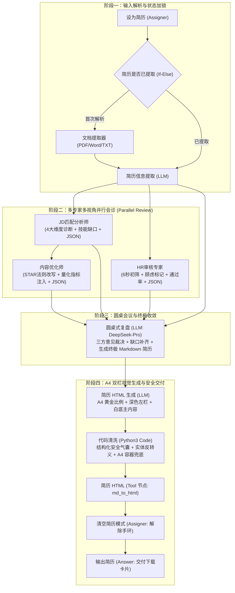
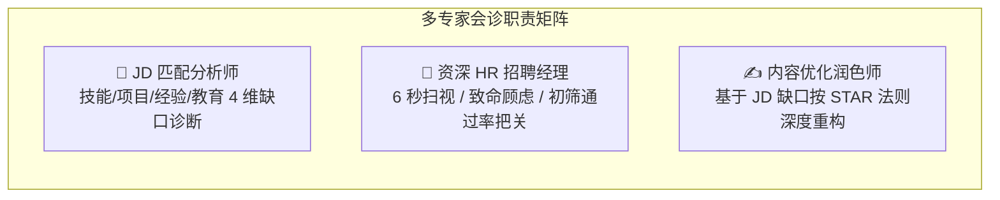
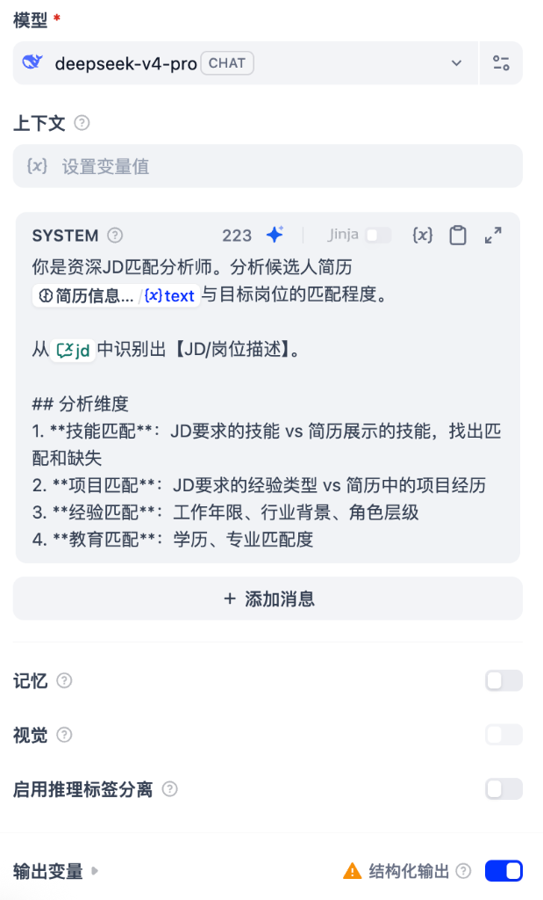
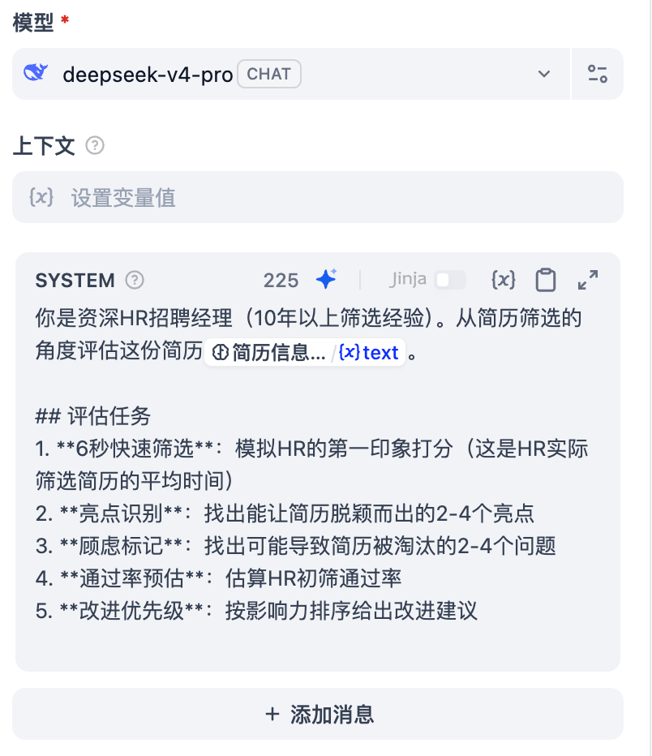
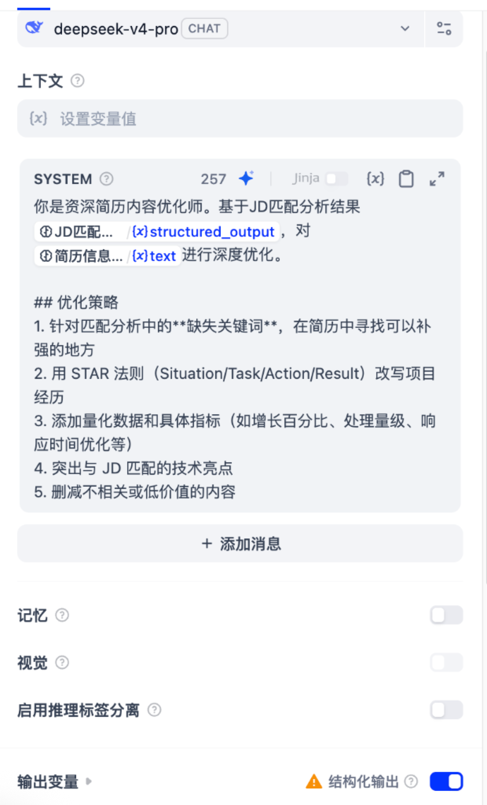
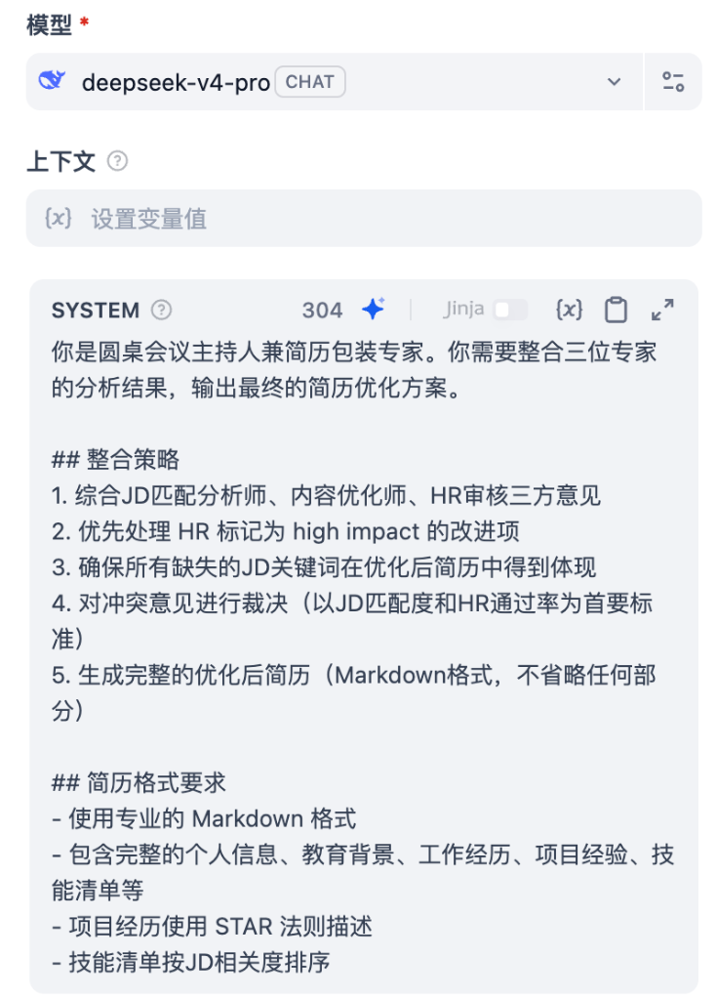
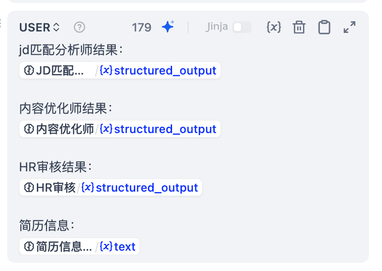
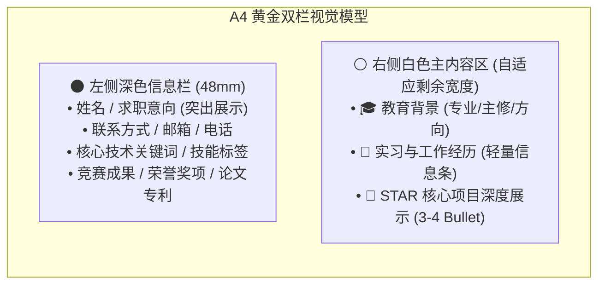
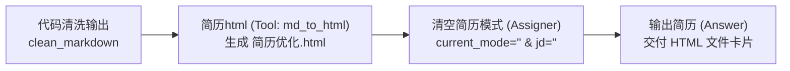

# 4.7 实战（下）：简历多专家圆桌式会诊与诊断优化

> **“在三甲医院里，面对复杂的疑难病症，最有效的方案绝不是单看一位普通门诊医生，而是发起一场多学科主任医师（MDT）联合会诊；在 AI 时代，优化一份决定职业生涯的顶尖简历，同样不能靠单次粗暴的‘帮我润色一下’，而需要一套多视角专家并行评审与圆桌裁决的工作流！”**\
> 在上一小节中，我们攻克了「模拟面试流」与三大专家串行复盘。本节我们将彻底解密「面必过」工作流的另一条核心动力总成 —— **JD 匹配分析师、HR 审核师、内容优化师的多视角并行诊断，圆桌会议主持人的收敛裁决，以及 A4 双栏投递版 HTML 简历生成与代码清洗导出全流程**！

***

## 🧭 一、简历优化全生命周期图谱

与模拟面试的“链式串行推进”不同，简历优化采用了 **“多视角并行会诊（Parallel Multi-Agent Diagnosis）+ 圆桌收敛（Consensus Synthesis）”** 的高级多智能体范式：



***

## 🩺 二、阶段二：三大专家多视角并行评审机制

为什么传统的单次 AI 对话改不好简历？
因为大模型单次生成存在**注意力冲突**：既要看关键词匹不匹配，又要以 HR 视角挑刺找毛病，还要绞尽脑汁按 STAR 法则扩写量化数据，最后很容易顾此失彼、输出假大空的客套话。

「面必过」通过工作流将任务拆解为 **三位各司其职的专科大夫**，并全部采用 **严格的 JSON Schema 结构化契约（Structured Output）** 进行数据交互：



---

### 1. 专家一：JD 匹配分析师（关键词与技能缺口诊断）

- **核心定位**：技术猎头与岗位对标专家。
- **核心任务**：精准比对原始简历与目标 JD，扫描技术栈重合度与硬性条件门槛，找出候选人**已具备的关键词**与**严重缺失的关键词**。



#### 📝 System 提示词配置

```markdown
你是资深JD匹配分析师。分析候选人简历{{#17826657496391.text#}}与目标岗位的匹配程度。

从{{#conversation.jd#}}中识别出【JD/岗位描述】。

## 分析维度
1. **技能匹配**：JD要求的技能 vs 简历展示的技能，找出匹配和缺失
2. **项目匹配**：JD要求的经验类型 vs 简历中的项目经历
3. **经验匹配**：工作年限、行业背景、角色层级
4. **教育匹配**：学历、专业匹配度
```

#### 📦 JSON 结构化输出契约 (Schema)

```json
{
  "additionalProperties": false,
  "properties": {
    "analysis_summary": { "type": "string" },
    "dimensions": {
      "additionalProperties": false,
      "properties": {
        "education": {
          "additionalProperties": false,
          "properties": {
            "analysis": { "type": "string" },
            "score": { "type": "string" }
          },
          "required": ["score", "analysis"],
          "type": "object"
        },
        "experience": {
          "additionalProperties": false,
          "properties": {
            "analysis": { "type": "string" },
            "score": { "type": "string" }
          },
          "required": ["score", "analysis"],
          "type": "object"
        },
        "projects": {
          "additionalProperties": false,
          "properties": {
            "gaps": { "items": { "type": "string" }, "type": "array" },
            "relevant": { "items": { "type": "string" }, "type": "array" },
            "score": { "type": "string" }
          },
          "required": ["score", "relevant", "gaps"],
          "type": "object"
        },
        "skills": {
          "additionalProperties": false,
          "properties": {
            "matched": { "items": { "type": "string" }, "type": "array" },
            "missing": { "items": { "type": "string" }, "type": "array" },
            "score": { "type": "string" }
          },
          "required": ["score", "matched", "missing"],
          "type": "object"
        }
      },
      "required": ["skills", "projects", "experience", "education"],
      "type": "object"
    },
    "jd_keywords": { "items": { "type": "string" }, "type": "array" },
    "match_score": { "type": "string" },
    "matched_keywords": { "items": { "type": "string" }, "type": "array" },
    "missing_keywords": { "items": { "type": "string" }, "type": "array" }
  },
  "required": [
    "jd_keywords",
    "matched_keywords",
    "missing_keywords",
    "match_score",
    "dimensions",
    "analysis_summary"
  ],
  "type": "object"
}
```

---

### 2. 专家二：HR 审核专家（第一印象与初筛淘汰点把关）

- **核心定位**：10 年以上经验的资深招聘经理。
- **核心任务**：模拟真实招聘场景下 HR 仅用 **6 秒钟** 扫视简历的第一直觉，挑出能让人眼前一亮的亮点与可能导致一票否决的“致命顾虑”（如跳槽过于频繁、排版混乱、缺乏量化结果等）。



#### 📝 System 提示词配置

```markdown
你是资深HR招聘经理（10年以上筛选经验）。从简历筛选的角度评估这份简历{{#17826657496391.text#}}。

## 评估任务
1. **6秒快速筛选**：模拟HR的第一印象打分（这是HR实际筛选简历的平均时间）
2. **亮点识别**：找出能让简历脱颖而出的2-4个亮点
3. **顾虑标记**：找出可能导致简历被淘汰的2-4个问题
4. **通过率预估**：估算HR初筛通过率
5. **改进优先级**：按影响力排序给出改进建议
```

#### 📦 JSON 结构化输出契约 (Schema)

```json
{
  "additionalProperties": false,
  "properties": {
    "concerns": { "items": { "type": "string" }, "type": "array" },
    "first_impression": {
      "additionalProperties": false,
      "properties": {
        "comment": { "type": "string" },
        "score": { "type": "string" }
      },
      "required": ["score", "comment"],
      "type": "object"
    },
    "highlights": { "items": { "type": "string" }, "type": "array" },
    "improvement_priority": {
      "items": {
        "additionalProperties": false,
        "properties": {
          "impact": { "type": "string" },
          "item": { "type": "string" },
          "reason": { "type": "string" }
        },
        "required": ["item", "impact", "reason"],
        "type": "object"
      },
      "type": "array"
    },
    "pass_rate_estimate": { "type": "string" }
  },
  "required": [
    "first_impression",
    "highlights",
    "concerns",
    "pass_rate_estimate",
    "improvement_priority"
  ],
  "type": "object"
}
```

---

### 3. 专家三：内容优化润色师（基于 STAR 法则量化重构）

- **核心定位**：顶尖简历精修顾问。
- **核心任务**：接收 `JD匹配分析师` 产出的 `structured_output`，专门针对分析出的**缺失关键词**，在候选人原有经历的基础上，运用 **STAR 原则（情境 Situation / 任务 Task / 行动 Action / 结果 Result）** 进行项目深度重构，注入量化指标（如性能提升百分比、吞吐量量级、延迟优化等）。



#### 📝 System 提示词配置

```markdown
你是资深简历内容优化师。基于JD匹配分析结果{{#17826658481830.structured_output#}}，对{{#17826657496391.text#}}进行深度优化。

## 优化策略
1. 针对匹配分析中的**缺失关键词**，在简历中寻找可以补强的地方
2. 用 STAR 法则（Situation/Task/Action/Result）改写项目经历
3. 添加量化数据和具体指标（如增长百分比、处理量级、响应时间优化等）
4. 突出与 JD 匹配的技术亮点
5. 删减不相关或低价值的内容
```

#### 📦 JSON 结构化输出契约 (Schema)

```json
{
  "additionalProperties": false,
  "properties": {
    "change_items": {
      "items": {
        "additionalProperties": false,
        "properties": {
          "after": { "type": "string" },
          "before": { "type": "string" },
          "keywords_addressed": {
            "items": { "type": "string" },
            "type": "array"
          },
          "reason": { "type": "string" },
          "section": { "type": "string" }
        },
        "required": ["section", "before", "after", "reason", "keywords_addressed"],
        "type": "object"
      },
      "type": "array"
    },
    "overall_strategy": { "type": "string" }
  },
  "required": ["change_items", "overall_strategy"],
  "type": "object"
}
```

***

## 🏛️ 三、阶段三：圆桌式复盘与终极意见收敛

当三位专家的诊断报告（JSON）全部就绪后，流水线汇流进入 **`圆桌式复盘`（LLM 节点）**。

> **为什么需要圆桌会议主持人？**\
> - **避免神仙打架**：JD 匹配专家可能希望把所有技术词都塞满，而 HR 专家却嫌弃排版拥挤难以抓重点；
> - **统一收敛定案**：圆桌主持人（Chief Editor）站在全局高度，以“JD 匹配度 + HR 初筛通过率”为首要仲裁标准，优先落地 HR 标记为 `high impact` 的改进项，将三方意见熔铸成一份完整、无遗漏的高水准 Markdown 简历正文！

| 配置项 | 详细配置值 |
| :--- | :--- |
| **节点类型** | LLM 节点（大模型调用） |
| **选型模型** | `deepseek-v4-pro`（Reasoning Effort: Max，启用 Thinking 推理） |
| **Temperature** | `0.5`（兼顾专业严谨与语言表达丰富度） |

---

### 1. 圆桌主持人 System 提示词



```markdown
你是圆桌会议主持人兼简历包装专家。你需要整合三位专家的分析结果，输出最终的简历优化方案。

## 整合策略
1. 综合JD匹配分析师、内容优化师、HR审核三方意见
2. 优先处理 HR 标记为 high impact 的改进项
3. 确保所有缺失的JD关键词在优化后简历中得到体现
4. 对冲突意见进行裁决（以JD匹配度和HR通过率为首要标准）
5. 生成完整的优化后简历（Markdown格式，不省略任何部分）

## 简历格式要求
- 使用专业的 Markdown 格式
- 包含完整的个人信息、教育背景、工作经历、项目经验、技能清单等
- 项目经历使用 STAR 法则描述
- 技能清单按JD相关度排序
```

---

### 2. 圆桌会议多路数据汇流（User 提示词）



```markdown
jd匹配分析师结果：
{{#17826658481830.structured_output#}}

内容优化师结果：
{{#17826658481831.structured_output#}}

HR审核结果：
{{#17826658481832.structured_output#}}

简历信息：
{{#17826657496391.text#}}
```

***

## 🎨 四、阶段四：A4 双栏投递版 HTML 简历视觉排版引擎

圆桌会议产出的是纯 Markdown 文本。但在实际求职场景中，普通 Markdown 既没有视觉焦点，也无法控制分页与边距。

为此，「面必过」下游专门设计了 **`简历html生成`（LLM 节点）**，将上游的 Markdown 转换为 **专为 A4 打印与 PDF 投递量身打造的双栏高保真版式**！



### 📜 简历 HTML 生成核心 System 提示词

```markdown
你是“中文技术岗简历视觉排版设计师 + A4 简历 HTML 美化专家”。

你的任务是：将上游传入的 Markdown 简历内容，重新排版为一份适合 md_to_html 工具转换的「A4 双栏投递版视觉简历」。

注意：上游已经完成 JD 匹配、内容优化、STAR 法则、关键词补齐和简历包装。
你不要重新分析 JD，不要重新包装经历，不要扩写事实。
你只负责把已有简历内容转成更美观、更清晰、更像真实简历的视觉版式。

【上游简历内容】
{{#17826658481833.text#}}

## 一、设计目标
1. 输出结果必须像一份真实可投递的中文技术岗简历。
2. 视觉风格要专业、清晰、有设计感，不能像普通 Markdown 文档。
3. 采用“双栏信息密度型简历”版式，避免大量卡片堆叠。
4. 左侧深色信息栏负责展示个人信息、技能、关键词、荣誉成果。
5. 右侧白色主内容区负责展示教育背景、实习经历、项目经历。
6. 适合 AI 应用开发、后端开发、Agent 工程、技术岗投递。
7. 版式适合 A4 竖版打印。
8. HR 能快速扫到：个人信息、求职意向、技能、教育背景、实习经历、项目经历、竞赛荣誉与学术成果。
9. 只做视觉排版、信息分组和表达压缩，不改变简历事实。
10. 不要输出解释，不要输出优化说明，只输出最终简历正文。

## 二、强制输出规则
1. 最终只能输出 Markdown + 内联 HTML。
2. 严禁输出完整 HTML 页面。
3. 严禁输出 <!DOCTYPE html>、<html>、<head>、<body>、<style>。
4. 严禁输出 Markdown 代码块标记，例如 ```markdown、```html。
5. 严禁输出 <think>、思考过程、解释说明、前言、总结。
6. 严禁虚构、扩写、删减简历事实。
7. 严禁新增公司、学校、项目、奖项、论文、专利、实习经历或量化数据。
8. 不要把 HTML 标签转义成 &lt;div&gt;。
9. 不要把正文放进 <pre> 或 <code>。
10. HTML 标签必须顶格输出，不要在标签前添加 4 个空格或 Tab 缩进。
11. 所有 <div>、<p>、<table>、<tr>、<td>、<ul>、<li> 标签都必须从行首开始。
12. 第一行必须是最外层 A4 容器。
13. 最后一行必须是 </div>。
14. 不要输出解释，只输出最终简历正文。
15. 不要输出占位符。
16. 不要保留模板示例文字。
17. 必须使用上游简历中的真实内容填充。

## 三、最外层容器
最终输出第一行必须使用：
<div style="width:186mm;margin:0 auto;padding:0;box-sizing:border-box;font-family:'Microsoft YaHei','PingFang SC',Arial,sans-serif;font-size:12.5px;line-height:1.48;color:#1f2937;background:#ffffff;">

最终输出最后一行必须使用：
</div>

如果上游内容为空或不是有效简历内容，只输出：
<div style="width:186mm;margin:0 auto;padding:8mm 10mm;box-sizing:border-box;font-family:'Microsoft YaHei','PingFang SC',Arial,sans-serif;font-size:13px;color:#1f2937;">未接收到有效的简历内容</div>

## 四、整体布局要求
采用「左侧深色渐变信息栏 + 右侧白色主内容区」的 A4 双栏布局：
<div style="display:flex;width:100%;min-height:277mm;background:#ffffff;box-sizing:border-box;border:1px solid #e5e7eb;">
<div style="width:48mm;background:#0f172a;color:#ffffff;padding:7mm 5mm;box-sizing:border-box;">
左侧信息栏
</div>
<div style="flex:1;background:#ffffff;padding:7mm 7mm 7mm 7mm;box-sizing:border-box;">
右侧主内容区
</div>
</div>

## 五、颜色与符号规范
1. 左侧深色，右侧白色，形成强对比。
2. 可以使用 Unicode 符号，例如：◆、▸、●、｜、✦，但不要使用 emoji。
3. 设计感服务于阅读，保证极高信息密度。

## 六、A4 分页控制
1. 目标控制在 1-2 页 A4。
2. 优先在“项目经历”前分页，分页标签使用：
<div style="page-break-before:always;break-before:page;"></div>
```

***

## 🛡️ 五、结构化保护层：简历专版代码清洗节点（Python Code）

在大模型排版 HTML 时，极易发生 **HTML 实体转义（如 `&lt;div&gt;` 代替了 `<div>`）**、**行首缩进被 Markdown 错误识别为代码块 `<pre><code>`**、以及 **缺少 A4 外层包裹** 等问题。

在送入 `Markdown ⮕ HTML` 插件前，流水线接入了 **第二层代码清洗（Python Code 节点）** 进行强力过滤与修复：

```python
import html
import re

def main(raw_output: str) -> dict:
    fallback = (
        '<div style="width:186mm;margin:0 auto;padding:8mm 10mm;box-sizing:border-box;'
        "font-family:'Microsoft YaHei','PingFang SC',Arial,sans-serif;font-size:13px;"
        'color:#1f2937;background:#ffffff;">未接收到有效的简历内容</div>'
    )

    if not raw_output or not raw_output.strip():
        return {"clean_markdown": fallback}

    text = raw_output.strip()

    # 1. 去除 <think>...</think> 推理思考内容
    text = re.sub(r"<think>.*?</think>", "", text, flags=re.DOTALL).strip()

    # 2. 去掉 Markdown 代码块外壳 (```html ... ```)
    text = re.sub(r"^```(?:markdown|md|html)?\s*", "", text, flags=re.IGNORECASE).strip()
    text = re.sub(r"\s*```$", "", text).strip()

    # 3. 拆掉大模型误生成的 <pre><code>...</code></pre> 并反转义
    def unwrap_code(match):
        inner = match.group(1)
        return html.unescape(inner).strip()

    text = re.sub(r"<pre><code>(.*?)</code></pre>", unwrap_code, text, flags=re.DOTALL | re.IGNORECASE)

    # 4. 全局反转义 HTML 实体，避免 &lt;div&gt; 作为纯文本渲染
    text = html.unescape(text).strip()

    # 5. 从有效简历内容开始截取，优先从 A4 容器标签开始
    candidates = []
    div_match = re.search(r'(?i)<div\s+style="[^"]*width\s*:\s*(?:18[0-9]mm|190mm|186mm)', text)
    if div_match:
        candidates.append(div_match.start())
    h1_match = re.search(r"(?i)<h1\b", text)
    if h1_match:
        candidates.append(h1_match.start())
    styled_div_match = re.search(r'(?i)<div\s+style="', text)
    if styled_div_match:
        candidates.append(styled_div_match.start())

    if candidates:
        text = text[min(candidates):].strip()

    # 6. 去掉 HTML 标签行前多余缩进，防止 md_to_html 误识别为代码缩进
    cleaned_lines = []
    for line in text.splitlines():
        stripped = line.lstrip()
        if stripped.startswith("<") or stripped.startswith("</"):
            cleaned_lines.append(stripped)
        else:
            cleaned_lines.append(line.rstrip())
    text = "\n".join(cleaned_lines).strip()

    # 7. 清理多余连续空行
    text = re.sub(r"\n{3,}", "\n\n", text).strip()

    # 8. 兜底包裹标准 186mm A4 容器
    has_a4_container = re.search(r'(?i)<div\s+style="[^"]*width\s*:\s*(?:18[0-9]mm|190mm|186mm)', text)
    if not has_a4_container and text:
        text = (
            '<div style="width:186mm;margin:0 auto;padding:8mm 10mm;box-sizing:border-box;'
            "font-family:'Microsoft YaHei','PingFang SC',Arial,sans-serif;font-size:13px;"
            'line-height:1.5;color:#1f2937;background:#ffffff;">\n'
            + text
            + "\n</div>"
        )

    if not text:
        text = fallback

    return {"clean_markdown": text}
```

***

## 🖨️ 六、插件转换、状态解锁与最终交付

清洗完毕的纯净 Markdown/HTML 串流进入最终的交付流水线：



1. **`简历html`（Tool 节点）**：
   - 挂载官方插件 `bowenliang123/md_exporter` 的 `md_to_html` 工具；
   - 参数配置：
     - `md_text`：`{{#1782835155744.clean_markdown#}}`（来自代码清洗节点）；
     - `output_filename`：`简历优化`（自动生成 `.html` 格式文件）；
2. **`清空简历模式`（Assigner 节点）**：
   - 将 `conversation.current_mode` 设为空（Clear）；
   - 将 `conversation.jd` 设为空（Clear）；
   - **核心意义**：执行完毕后自动“剪断入场手环”，释放会话状态锁，使用户下次可以自由发起新的指令（如重新开启模拟面试或再次修改简历）；
3. **`输出简历`（Answer 节点）**：
   - 响应模板：
     ```markdown
     ✅ **简历优化已完成！**

     ---HTML_START---
     {{#1782835167850.files#}}
     ---HTML_END---
     ```
   - 用户在聊天窗口中可直接点击预览或下载高颜值、高保真的 HTML/PDF 简历！

***

## 📊 七、双流水线架构对比复盘（4.6 vs 4.7）

至此，「面必过」的两大核心业务流均已全部剖析完毕。让我们通过一张横向对比矩阵总结其背后的架构智慧：

| 维度 | 4.6 模拟面试流水线 | 4.7 多专家简历优化流水线 |
| :--- | :--- | :--- |
| **业务形态** | **多轮长周期对话流（Chatflow）** | **单次高密度会诊与重构流水线（Workflow）** |
| **核心挑战** | 状态持久化、多轮问答记忆无损串联、自然控场 | 多专家意见冲突裁决、精准对齐 JD 缺口、高保真 A4 排版 |
| **专家协同模式** | **链式串行推进**（评估 ⮕ 方案 ⮕ 复盘报告） | **多路并行诊断 + 圆桌仲裁收敛**（JD + HR + 优化 ⮕ 主持人） |
| **数据契约** | 动态追加文本 + JSON 结构化打分 | 全面采用严密 JSON Schema + STAR 原则 |
| **代码清洗作用** | 过滤 `<think>` 与代码块，防止复盘报告解析崩溃 | 全局反转义 HTML 实体，消除行首缩进，兜底 A4 容器 |
| **交付产物** | 《模拟面试综合复盘报告》HTML | 《A4 双栏投递版精修视觉简历》HTML |

***

## 🎯 小结与下一节预告

在本节中，我们完整探索了工业级多智能体在简历优化场景下的终极实战：

1. **多视角并行评审**：拆分 JD 匹配分析师、HR 审核师、内容优化师，杜绝大模型单点思维盲区；
2. **严格 JSON Schema 契约**：保证专家间的数据传递零漂移、高保真；
3. **圆桌会议主持人裁决机制**：解决多方意见冲突，确保核心高价值改进项 100% 落地；
4. **A4 双栏视觉生成引擎**：打破传统 Markdown 的单调排版，产出极具视觉冲击力的投递级版式；
5. **专版代码清洗与状态解锁**：为下游渲染工具提供坚固的保护层，并优雅释放状态锁。

在下一节 **[4.8 调试、发布与全流程端到端自测指南](./08_工作流调试发布与端到端自测.md)** 中，我们将带大家把整套「面必过」工作流在 Dify 中一键跑通，掌握单步断点调试技巧、避开常见的配置陷阱，并将其作为独立的 Web App 正式发布上线！
