# 4.8 实战：工作流调试、发布与端到端自测指南

> **“在航天工程中，火箭点火升空之前，必须经历严密的分系统地面试车与全系统联调；在低代码 AI 工作流编排中，要让一个包含数十个大模型、Python 代码沙箱与外部插件工具的工业级应用稳定运转，同样必须掌握一套科学的调试、避坑、发布与端到端自测心法！”**\
> 经过前面 7 小节的系统学习，我们已经完整构建了「面必过」双引擎 Chatbot 的全部核心流水线。本节作为第四章的压轴实战，我们将彻底掌握：**单节点单步调试（Run Step）秘籍、低代码开发 Top 5 高频踩坑避错清单、Web App 外观与功能增强定制、RESTful API 对外集成调用、深水区反思，以及两大核心业务流的端到端黑盒实测**！

***

## 🧭 一、全流程调试与发布生命周期图谱

在 Dify 中，从一个画布草稿到生产级上线的标准工作流包括以下四个递进阶段：

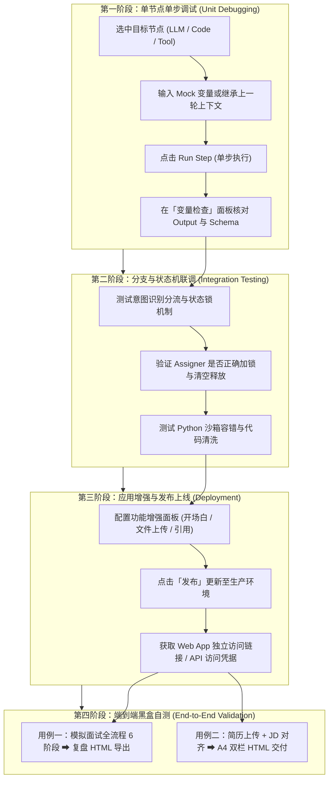

***

## 🔬 二、单节点独立调试与变量追踪（Run Step 调试心法）

在面对几十个节点相连的庞大工作流时，**最忌讳一上来就直接点击右上角全局运行**。全局运行不仅耗费漫长的等待时间与高昂的 API Token，一旦报错也极难排查到底是哪个节点的输入缺失或格式不匹配。

### 1. 单节点单步执行（Run Step）

在 Dify 画布中，任何一个节点（无论是大模型、Python 代码还是工具节点）右上角都提供了独立的 **调试运行按钮**：

1. **隔离测试**：无需启动全流程，仅对当前节点的输入提示词或算法逻辑进行快速验证；
2. **Mock 依赖数据**：手动填入上游节点输出的模拟文本或 JSON，检验当前节点的输出健壮性；
3. **极速迭代 Prompt**：微调 System Prompt 后单步点运行，3 秒内即可看到模型生成的反馈效果。

***

### 2. 变量检查面板（Variable Inspector）深度追踪

当单步执行或全流程运行完毕后，点击节点右侧的 **`变量检查`** **面板**，即可对流经该节点的全部数据展开全景式审查：

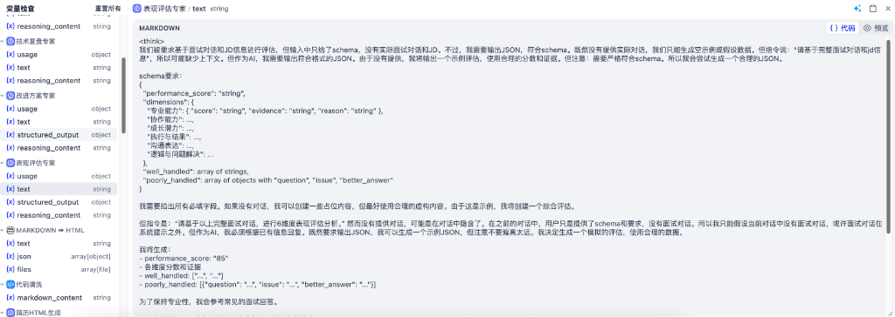

在变量检查面板中，重点观察以下几大核心字段：

| 变量名称                    | 数据类型     | 核心关注点与排查要点                                                      |
| :---------------------- | :------- | :-------------------------------------------------------------- |
| **`text`**              | `string` | 大模型生成的原始正文字符串，检查是否有多余的 `<think>` 标签或客套话。                        |
| **`structured_output`** | `object` | JSON 结构化输出对象，检查字段名是否与 Schema 契约 100% 吻合，有无字段遗漏。                 |
| **`reasoning_content`** | `string` | 大模型（如 DeepSeek-R1 / Pro）的内部思考推理链，用于分析模型做决策的深层逻辑。                |
| **`usage`**             | `object` | 记录本次请求消耗的 `prompt_tokens`、`completion_tokens` 和 `total_tokens`。 |

***

### 3. 文件生成与插件输出树验证

当流水线执行到尾部的 `简历html` 或 `Markdown ⮕ HTML` 插件工具节点时，通过变量树可以直观验证生成的实体文件：

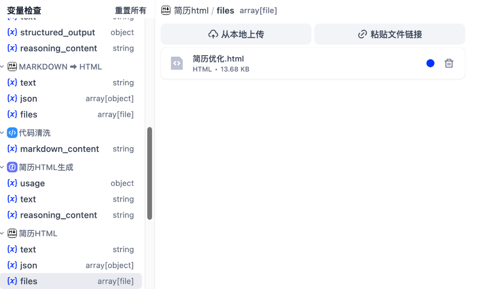

- 检查输出变量 `files` 是否为 `array[file]` 格式；
- 确认生成文件的名称（如 `简历优化.html`）和文件体积（如 `13.68 KB`）正常；
- 支持在控制台直接点击下载或在线预览，确保下游 Answer 节点能够顺利渲染出下载卡片。

***

## 🛡️ 三、低代码编排高频“踩坑翻车”避坑清单 (Top 5)

根据工业级开发与实战经验，我们总结了低代码工作流中最容易导致系统崩溃或逻辑失常的 **五大高频踩坑点** 与标准解法：

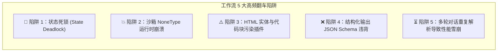

***

### 💣 陷阱 1：会话变量未清空导致“状态死锁（State Deadlock）”

- **现象**：候选人面试已经结束，或者简历优化已经完成，下一次输入普通的问候（如“你好”），系统却依然调起复盘大模型或报错，无法开启新对话。
- **根因**：游乐园入场手环（状态锁）没有被剪断！在前序流程结束后，会话变量 `conversation.current_mode` 依然残留为 `interview` 或 `resume`，导致入口的「状态锁 If-Else」死死咬住原有分支。
- **✅ 破解之道**：
  - 在任何业务分支的最终交付 `Answer` 节点**前**，必须显式插入 `Assigner` 节点；
  - 务必调用 `operation: clear` 将 `conversation.current_mode`、`conversation.jd` 等临时状态完全置空！

***

### 💣 陷阱 2：Python 代码沙箱类型报错（NoneType AttributeError）

- **现象**：Python 节点报错 `AttributeError: 'NoneType' object has no attribute 'strip'` 或 `TypeError: expected str, got NoneType`。
- **根因**：Dify 的 Code 节点运行在隔离的安全沙箱中。当工作流在首次启动或上游某些可选分支未运行时，传递给 Python 节点的参数默认可能是 `None`。
- **✅ 破解之道**：
  - 在所有 Python 代码节点首行必须写**防御性赋值**与容错：
    ```python
    # 防御性代码编写规范
    old_history = (old_history or "").strip()
    new_record = (new_record or "").strip()
    raw_output = (raw_output or "").strip()
    if not raw_output:
        return {"clean_markdown": fallback_content}
    ```

***

### 💣 陷阱 3：大模型 Markdown 围栏与 HTML 实体转义污染下游插件

- **现象**：送入 `Markdown ⮕ HTML` 插件后，生成的网页出现源码暴露（如直接显示 `&lt;div&gt;`）或者被包裹在黑色代码框内。
- **根因**：大模型习惯性地用 `html ... `  围栏包裹输出，或者将 `<` 转义成了 HTML 实体字符。
- **✅ 破解之道**：
  - 必须在 LLM 节点与 Tool 节点之间插入 **代码清洗节点**；
  - 使用 `html.unescape()` 进行全局实体反转义；
  - 用正则表达式强制剥除 ` ```html ` 标记并去除行首空格缩进。

***

### 💣 陷阱 4：大模型输出 JSON 键名漂移或缺失字段

- **现象**：下游代码节点在提取 `structured_output["dimensions"]` 时抛出 `KeyError` 导致工作流中断。
- **根因**：提示词中仅口头要求“输出 JSON”，大模型在发散思维下随意增减键名或拼错属性。
- **✅ 破解之道**：
  - 在 LLM 节点配置中**开启「结构化输出」开关**，并严格配置 JSON Schema；
  - 必须在 Schema 中将所有下游依赖的字段全部写入 `required: [...]` 数组，且将 `additionalProperties` 设为 `false`。

***

### 💣 陷阱 5：多轮长对话中简历文件被“重复解析”引发性能雪崩

- **现象**：面试进行到第 8 轮时，每回复一句话要等 15 秒以上，Token 消耗急剧膨胀。
- **根因**：没有做懒加载提取判断，导致每一轮问答都把 PDF 文档重新送进解析器和提取大模型。
- **✅ 破解之道**：
  - 引入标志位变量 `conversation.resume_ex`；
  - 配合 If-Else 节点：仅在首次为 `false` 时执行文档提取并将结果持久化到 `conversation.resume_summary`，后续轮次直接绕过文档解析器。

***

## 🌐 四、发布上线与对外集成：打造生产级 Web App

当工作流自测无误后，即可进入发布与集成阶段。

### 1. 功能增强面板配置（Features Enhancement）

在 Dify 画布右上角或应用设置中打开 **`功能`** **增强面板**，为终端用户打造丝滑的交互体验：

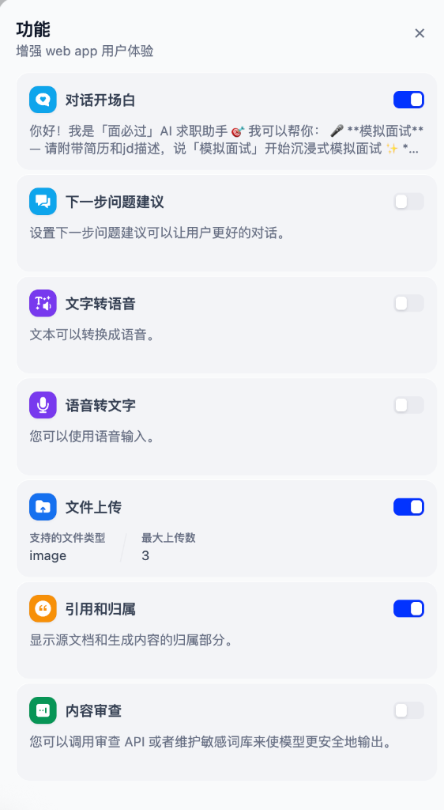

- **对话开场白（Conversation Opener）**：开启并配置贴心的欢迎词与操作指南；
- **文件上传（File Upload）**：开启文件上传开关，支持图片、PDF 与 Word 文档；
- **引用和归属（Citation & Attribution）**：展示数据源文档与生成内容的追溯信息；
- **下一步问题建议 / 语音转文字（TTS/STT）**：按需开启，赋能多模态交互。

***

### 2. 预览窗口与开场白视觉调优

配置完成后，可在右侧的 **`预览`** **窗口** 中实时自测终端用户的开屏效果：

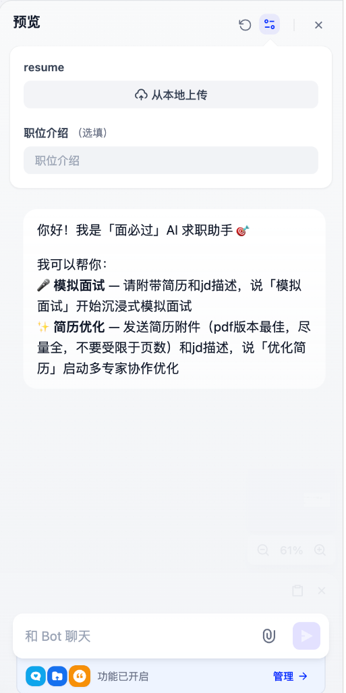

```markdown
你好！我是「面必过」AI 求职助手 🎯

我可以帮你：
🎤 模拟面试 —— 请附带简历和jd描述，说「模拟面试」开始沉浸式模拟面试
✨ 简历优化 —— 发送简历附件（pdf版本最佳，尽量全，不要受限于页数）和jd描述，说「优化简历」启动多专家协作优化
```

***

### 3. 发布概览与三大对外集成渠道

点击右上角的 **`发布`（Publish）** 按钮，系统将当前画布状态冻结并部署为生产版本，并在「概览」页提供三大核心对外通道：

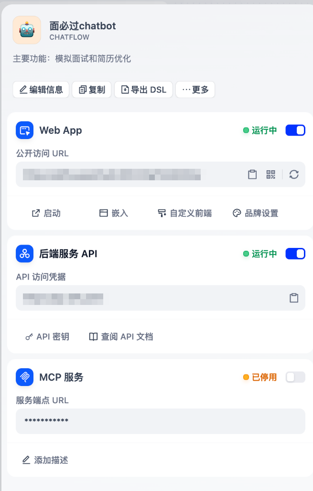

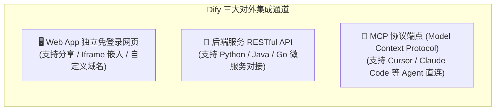

1. **Web App 独立网页**：
   - 提供开箱即用的网页聊天界面，支持直接复制公开访问 URL 分享给用户；
   - 点击“嵌入”可获取网页 Iframe 或浮窗代码，3 行代码即可将 AI 助手嵌入公司官网或博客。
2. **后端服务 API**：
   - 提供工业级 RESTful API 端点（默认基地址 `https://api.dify.ai/v1`）；
   - 在“API 密钥”中生成专属的 Bearer Token，即可与企业的自有后端、小程序或 App 无缝打通。
3. **MCP 服务**：
   - 支持将当前工作流作为标准 MCP 工具向外部智能体开放，让 Claude Code、Cursor 等桌面级 Agent 也能直接调起面试与简历优化能力！

***

### 4. Python 后端调用 API 实战代码示例

通过标准 Python `requests` 库调用 Dify Chatflow 服务的完整代码：

```python
import json
import requests

# 1. 配置 Dify API 凭据与端点
DIFY_API_BASE = "https://api.dify.ai/v1"
API_KEY = "app-xxxxxxxxxxxxxxxxxxxxxxxx"  # 在 Dify 控制台生成的 API 密钥

headers = {
    "Authorization": f"Bearer {API_KEY}",
    "Content-Type": "application/json"
}

# 2. 发起对话请求 (以开启模拟面试为例)
payload = {
    "inputs": {
        "jd": "熟练掌握 Python、FastAPI 与大模型工作流编排，具备 Agent 开发经验。"
    },
    "query": "你好，我已上传简历，我想开始模拟面试！",
    "response_mode": "streaming",  # 支持 streaming 流式输出或 blocking 阻塞等待
    "conversation_id": "",         # 首次发起留空，后续轮次传入 Dify 返回的 conversation_id
    "user": "candidate_user_001",
    "files": [
        # 若需要上传文件，可先调用 /files/upload 接口获取 file_id 传入此处
    ]
}

response = requests.post(
    f"{DIFY_API_BASE}/chat-messages",
    headers=headers,
    json=payload,
    stream=True
)

# 3. 处理流式响应并实时打印
print("AI 面试官：", end="", flush=True)
for line in response.iter_lines():
    if line:
        decoded_line = line.decode("utf-8")
        if decoded_line.startswith("data: "):
            try:
                event = json.loads(decoded_line[6:])
                if event.get("event") == "message":
                    print(event.get("answer", ""), end="", flush=True)
                elif event.get("event") == "message_end":
                    print("\n\n[本轮会话结束，已沉淀 Conversation ID:", event.get("conversation_id"), "]")
            except json.JSONDecodeError:
                pass
```

***

## 🚀 五、端到端黑盒全流程实测展示

为了确保整套应用达到上线标准，我们在独立 Web App 中完成了两条核心业务流的完整端到端黑盒实测：

### 🧪 实测场景一：沉浸式模拟面试全流程自测

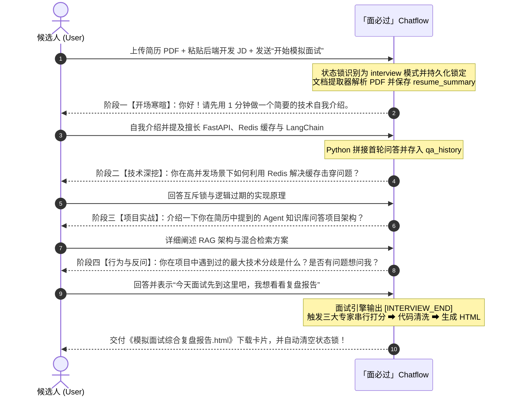

***

### 🧪 实测场景二：多专家圆桌式简历优化自测

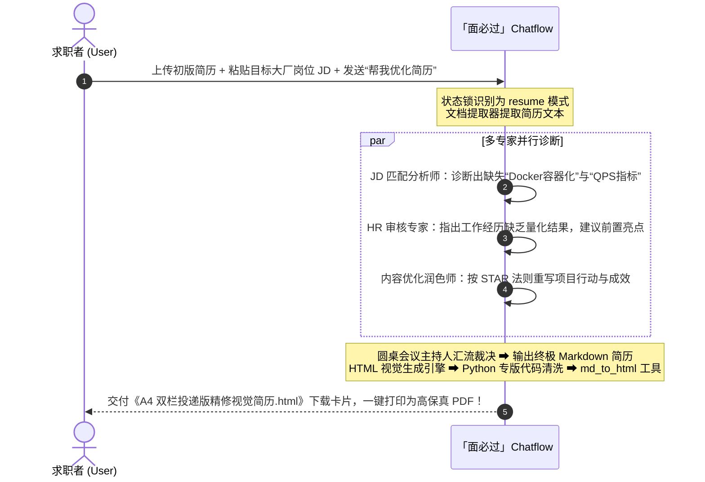

***

## 🧠 六、深水区思考：低代码平台的局限性与架构妥协 —— 为什么我们不用单一 Agent 节点？

在很多低代码平台的宣传演示中，你经常能看到类似这样的设想：*“拖入一个万能的 Agent 节点，给它挂上 10 个工具，它就能自主思考、自主规划、自动帮你把面试和简历全搞定。”*

但在真实的工业级落地过程中，如果你直接用一个 Agent 节点去承载复杂业务，往往会迅速撞上一堵厚重的**工程现实之墙**。

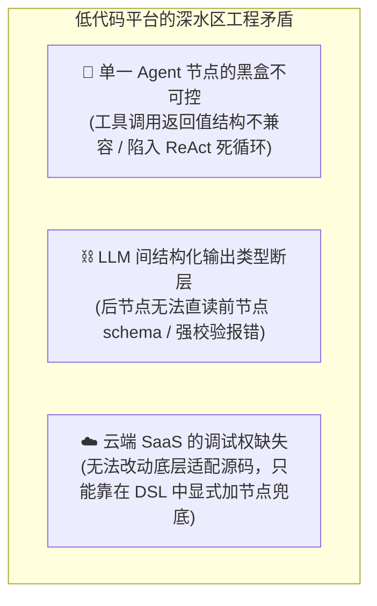

***

### 1. 为什么不用 Agent 节点？—— 工具调用与数据结构的“阻抗失配”

- **工具返回值与节点预期的契约冲突**：
  Dify 的 Agent 节点内部采用 ReAct / Function Calling 机制运转。当 Agent 自主调用外部插件工具（如 `md_to_html` 或 `document_extractor`）时，工具返回的 payload 结构（可能是字典、文件数组或包含状态码的对象）往往与大模型内部预期的输入格式**产生阻抗失配**；
- **致命后果**：
  大模型无法准确解析工具返回的数据结构，要么在日志中报错 `Tool call failed: Invalid output format`，要么误以为工具执行失败而陷入重复调用的死循环；
- **无法在网页端拦截**：
  在云端 SaaS 的图形化界面上，你无法在 Agent 内部插入中间件去拦截并清洗工具的返回值。

***

### 2. 跨 LLM 节点的结构化输出类型断层（Schema 适配地狱）

- **后一个 LLM 为什么读不懂前一个 LLM 的 JSON？**
  理论上，A 节点通过 `structured_output` 生成了 JSON，B 节点直接在 User Prompt 里写 `{{#A.structured_output#}}` 就能顺畅使用；
- **实际工程中的坑**：
  由于平台对 JSON Schema 的类型校验极其严苛，一旦嵌套层级较深，或者模型返回的数值类型与字符串类型稍有偏差，下游节点在取值时就会直接解析失败；
- **排错成本极高**：
  在网页端开发时，你常常会陷入“改了 A 的 Schema 导致 B 报错，改了 B 又导致 C 解析失败”的反复调参地狱。

***

### 3. 本地代码魔改 vs 云端 SaaS 妥协：在 DSL 中多加节点的工程哲学

- **本地私有化部署视角**：
  如果你是将 Dify 源码部署在自己的服务器上，上述问题其实只要在后端 `api/core/workflow/nodes/agent/` 或工具适配层里**修改两三行 Python 源码**、把类型做一次统一转换就能彻底根治；
- **云端 Web 网页端视角**：
  但在使用官方 Cloud 网页版或面对企业标准 SaaS 时，开发者没有修改底层引擎源码的权限。
- **架构师的妥协与破局**：
  **既然无法在平台底层修路，那就在工作流上搭桥！**
  这就是为什么在我们的「面必过」DSL 中，你看到了看似“繁琐”却**无比稳固**的防御性节点设计：
  1. **用确定性工作流替代自由发散的 Agent**：通过 `状态锁 If-Else + 意图识别`，以 100% 确定性的代码流替代黑盒 Agent 的不可控决策；
  2. **显式插入 Python 代码清洗节点**：充当数据流的“转接头”与“安全气囊”，负责去除 `<think>`、剥除代码围栏、反转义 HTML 实体；
  3. **串行与并行专家分流**：将复杂的单体思考拆解为多个独立 LLM 节点，每个节点背负极其简单的单一职责与专属 Schema，最终由圆桌会议主持人统一收敛。

> 💡 **架构启示**：在 AI 工程化中，**“显式编排的复杂性”远远好过“隐式黑盒的不确定性”**！通过在 DSL 中增加确定性节点换取 100% 的生产稳定性，是所有成熟 AI 工程师在低代码生态下的最佳实践。

***

### 4. 为什么我们需要迈向“代码级 Agent”？

低代码工作流帮我们用最高效的可视化方式建立了对 Prompt 链、数据流转、状态路由和插件调用的第一心智模型；但它在底层灵活性、动态分支扩展、复杂条件循环以及深度代码魔改上的天花板，也正是我们后续必须迈入 **代码级开源 Agent 与开发框架（LangGraph / 手写 Agent）** 的最核心动力！

***

## 📚 七、第四章全章总结与知识图谱复盘

历经 8 个小节的系统构建，我们从零到一建立起了对于 **Dify 低代码与可视化工作流编排** 的完整认知体系与工程化实战能力：

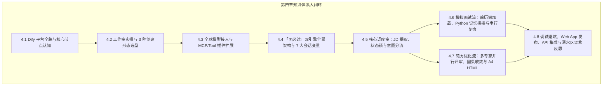

| 章节回顾                                                | 核心掌握内功                                                        |
| :-------------------------------------------------- | :------------------------------------------------------------ |
| **[4.1 Dify 核心概念与平台全貌](./01_Dify核心概念与平台全貌.md)**     | 控制台功能区、工作流/对话流/RAG/Agent 四大应用形态、核心节点体系与变量引用机制。                |
| **[4.2 创建工作流与工作室实操](./02_创建工作流与工作室实操.md)**          | 探索工作室、三大创建应用姿势（空白/模板/DSL导入）、Chatflow vs Workflow 决策树。         |
| **[4.3 模型供应商与工具插件生态](./03_模型供应商与工具插件生态.md)**        | 多 Key 负载均衡与模型矩阵、5 大能力标签、DeepSeek 大上下文、MCP 与外部工具插件。            |
| **[4.4 案例全景透视与架构设计](./04_面必过Chatbot全景架构与状态机设计.md)** | 游乐园手环（状态锁）心智模型、7 大会话变量表、DeepSeek 插件依赖、DSL 一键导入。               |
| **[4.5 核心调度引擎：状态锁路由与意图识别分流](./05_状态锁路由与意图识别分流.md)** | 入口 JD 提取、状态锁 If-Else 三路分支、意图识别 Few-shot 提示词、动态加锁与闲聊兜底。        |
| **[4.6 模拟面试流与多专家技术复盘](./06_模拟面试流与多专家技术复盘.md)**      | 简历懒加载、Python 问答记录拼接、6 阶段面试引擎、三大专家链式打分、代码清洗第一层保护。              |
| **[4.7 多专家圆桌式简历优化流水线](./07_多专家圆桌式简历优化流水线.md)**      | JD 分析师+HR 审核+内容优化师并行评审、圆桌主持人仲裁收敛、A4 双栏 HTML 视觉生成引擎。           |
| **[4.8 工作流调试发布与端到端自测](./08_工作流调试发布与端到端自测.md)**      | 单节点 Run Step、Top 5 高频避坑、功能增强面板、Web App 发布、API 工业级集成与深水区局限性反思。 |

***

## 🎯 八、第五章预告：迈入代码级智能体开发

恭喜你顺利通关 **第四章：Dify 低代码与可视化工作流编排**！

低代码工作流让我们以最直观的可视化方式理解了大模型应用的拓扑结构与数据流转；而在接下来的 **第五章：OpenCode 实战** 中，我们将把视野投向更加自由、灵活的 **代码级开源 Agent 与本地模型协同开发**，开启更高维度的 Vibe Coding 之旅！在这之前请同学们做好准备工作：
下载好opencode，准备好一个api key，检查是否有python环境，如果没有请配置一个python环境和一个编译器（推荐vscode）！
