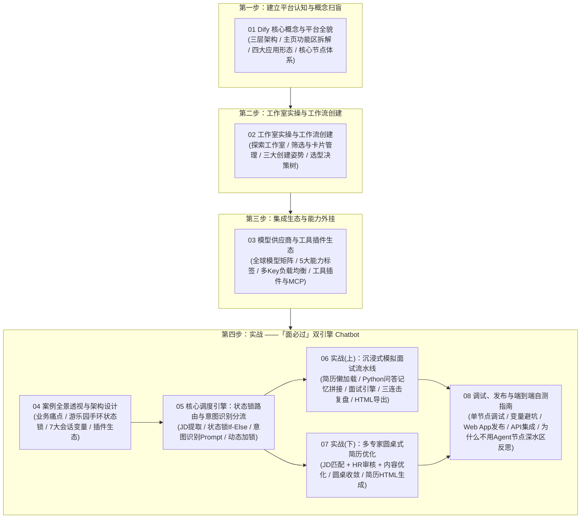

# 🎛️ 第四章：Dify 实战 —— 低代码与可视化工作流编排

欢迎来到 **《Vibe Coding 极速通关》第四章：Dify 实战**！

在前面的章节中，我们系统梳理了现代 AI 与 Agent 体系的核心概念，并完成了基础脚手架与开发环境的搭建。在本章中，我们将正式开启低代码与可视化工作流编排（Dify）的实战之旅！

[Dify.ai](https://dify.ai) 是目前全球最流行、功能最强劲的开源大模型应用开发底座与 LLMOps 协同平台。它将大模型、提示词工程、知识库（RAG）、代码沙箱与外部工具封装为可视化的“积木块”，让你只需动动鼠标，就能快速搭建出高可用、高扩展的工业级 AI 应用与自动化流水线！

***

## 💡 为什么我们要带大家做一个“略带复杂度”的真实双引擎工作流？

很多初学者在低代码平台学习时，往往只接触过“用户提问 ⮕ 单个 LLM ⮕ 回答”这种 3 个节点的玩具 Demo（Toy Project）。那种 Demo 固然简单，但根本无法让你体会到现代 AI 编排的真正魅力，也无法让你见识到生产环境中必然会遭遇的真实工程挑战。

在本章中，我们特意设计了一个**双引擎驱动的「面必过」求职助手（包含 30+ 节点、状态锁会话机制、多专家并行评审与 HTML 渲染交付）**：

1. **领略确定性编排的艺术**：通过「状态锁路由 + 意图分流」，体验如何像设计摩天大楼一样，把多轮沉浸式模拟面试与多专家简历优化两条截然不同的业务线无缝熔铸在同一个画布中；
2. **直面低代码平台的工程局限与权衡**：
   - **为什么我们不直接用一个“万能 Agent 节点”？** 在图形化低代码平台中，单一 Agent 节点在自主调用工具时极其脆弱（工具返回值与节点预期的数据结构经常发生不兼容而崩溃）；
   - **为什么跨节点的结构化输出需要反复调整？** 后一个 LLM 节点在引用前一个 LLM 的 `structured_output` 时经常遇到类型断层；
   - **为什么我们在 DSL 中主动增加了多个 Python 代码清洗与中转节点？** 如果本地私有化部署 Dify，改两行 Python 源码就能彻底解决类型适配；但在网页端/SaaS 模式下，为了保证 100% 稳定运行，必须用显式的工程化节点（代码清洗、状态锁、多专家级联）建立防御性安全气囊！

通过这套实战，你不仅能收获一个真正可投产、能装逼的顶级 AI 作品，更能深度建立起**架构师级别的 AI 工程心智模型**！\
同学们可以直接把yml文件导入到dsl中，对照着课件进行学习，只需安装对应的大模型插件和课程所需的工具，再配置好大模型需要的api key即可一键运行！

## 🧭 第四章全景知识图谱

***

## 📑 章节目录导航

点击下方链接逐一阅读各小节的保姆级图文指南与权威资源：

1. **[4.1 Dify 核心概念与平台全貌：从控制台到 LLMOps 完整体系](./01_Dify核心概念与平台全貌.md)**
   - 官方权威档案、现代中央厨房大比喻、主界面全貌与功能分区图解、工作流/Chatflow/RAG/Agent 四大形态、核心节点体系与变量引用机制。
2. **[4.2 工作室实操与工作流创建：从空白画布、模板到 DSL 导入](./02_创建工作流与工作室实操.md)**
   - 探索工作室入口与控制台界面解析、三大创建应用方式（空白创建/模板克隆/DSL导入）对比矩阵、工作流 vs 对话流形态决策树与核心特征对比。
3. **[4.3 模型供应商与工具插件生态：连接大模型大脑与外部世界能力](./03_模型供应商与工具插件生态.md)**
4. **[4.3 模型供应商与工具插件生态：连接大模型大脑与外部世界能力](./03_模型供应商与工具插件生态.md)**
   - 全球主流供应商矩阵、5 大能力标签（LLM/Embedding/Rerank/ASR/TTS）、多 API Key 密钥池管理、DeepSeek 1000K 上下文、4 大工具生态（插件/MCP/Workflow as Tool/Swagger API）。
5. **[4.4 案例全景透视与架构设计：认识「面必过」双引擎 Chatbot](./04_面必过Chatbot全景架构与状态机设计.md)**
   - 业务痛点剖析、游乐园入场手环（状态锁）心智模型、Mermaid 全景架构图谱、7 大会话变量深度表格拆解、DeepSeek 插件与 LLM 节点关系解密、DSL 一键导入指南。
6. **[4.5 核心调度引擎：状态锁路由与意图识别分流](./05_状态锁路由与意图识别分流.md)**
   - 入口 JD 提取、状态锁 If-Else 三路分支设计、意图识别 LLM Prompt 提示词工程与 Few-shot 策略、状态动态加锁与闲聊引导兜底。
7. **[4.6 实战（上）：沉浸式模拟面试流水线与多专家复盘闭环](./06_模拟面试流与多专家技术复盘.md)**
   - 简历懒加载提取与标志位、多轮问答记忆滚雪球（Python Code 节点拼接）、面试引擎控场与结束信号、表现评估+改进方案+技术复盘三专家链、HTML 报告清洗与转换导出。
8. **[4.7 实战（下）：多专家圆桌式简历诊断与优化](./07_多专家圆桌式简历优化流水线.md)**
   - JD 匹配分析师与 HR 审核双路并行评审、STAR 原则内容优化师润色、圆桌式复盘收敛汇聚、精修简历 HTML 生成与排版交付。
9. **[4.8 调试、发布与全流程端到端自测指南](./08_工作流调试发布与端到端自测.md)**
   - 单节点单步调试与变量追踪、常见避坑指南（状态死锁、沙箱报错）、独立 Web App 外观定制与发布、API 接口调用实战、深水区思考（低代码平台的局限性与为什么不用 Agent 节点）。

***

## 🔗 官方权威链接

- **Dify 官方主页**：<https://dify.ai>
- **Dify 开源代码仓**：<https://github.com/langgenius/dify>
- **Dify 官方中文文档**：<https://docs.dify.ai/v/zh-hans>
- **Dify 官方工作流文档**：<https://docs.dify.ai/v/zh-hans/guides/workflow>

