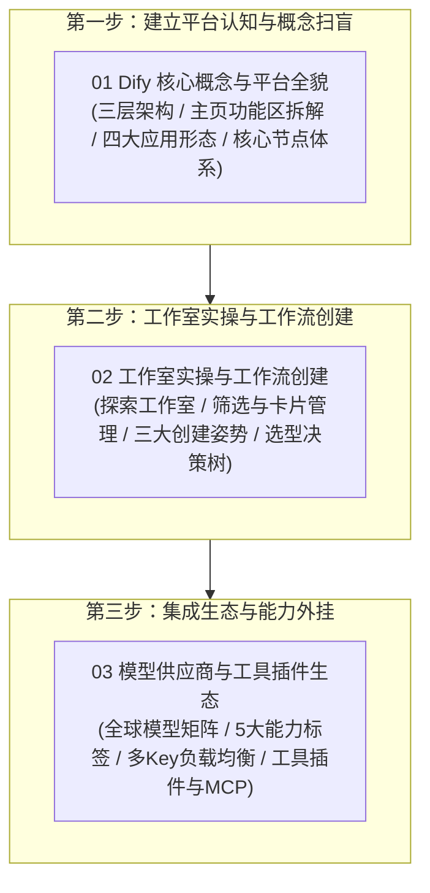

# 🎛️ 第四章：Dify 实战 —— 低代码与可视化工作流编排

欢迎来到 **《Vibe Coding 极速通关》第四章：Dify 实战**！

在前面的章节中，我们系统梳理了现代 AI 与 Agent 体系的核心概念，并完成了基础脚手架与开发环境的搭建。在本章中，我们将正式开启**低代码与可视化工作流编排（Dify）**的实战之旅！

[Dify.ai](https://dify.ai) 是目前全球最流行、功能最强劲的开源大模型应用开发底座与 LLMOps 协同平台。它将大模型、提示词工程、知识库（RAG）、代码沙箱与外部工具封装为可视化的“积木块”，让你只需动动鼠标，就能快速搭建出高可用、高扩展的工业级 AI 应用与自动化流水线！

---

## 🧭 第四章全景知识图谱

---

## 📑 章节目录导航

点击下方链接逐一阅读各小节的保姆级图文指南与权威资源：

1. **[4.1 Dify 核心概念与平台全貌：从控制台到 LLMOps 完整体系](./01_Dify核心概念与平台全貌.md)**
   - 官方权威档案、现代中央厨房大比喻、主界面全貌与功能分区图解、工作流/Chatflow/RAG/Agent 四大形态、核心节点体系与变量引用机制。

2. **[4.2 工作室实操与工作流创建：从空白画布、模板到 DSL 导入](./02_创建工作流与工作室实操.md)**
   - 探索工作室入口与控制台界面解析、三大创建应用方式（空白创建/模板克隆/DSL导入）对比矩阵、工作流 vs 对话流形态决策树与核心特征对比。

3. **[4.3 模型供应商与工具插件生态：连接大模型大脑与外部世界能力](./03_模型供应商与工具插件生态.md)**
   - 全球主流供应商矩阵、5 大能力标签（LLM/Embedding/Rerank/ASR/TTS）、多 API Key 密钥池管理、DeepSeek 1000K 上下文、4 大工具生态（插件/MCP/Workflow as Tool/Swagger API）。

---

## 🔗 官方权威链接

- **Dify 官方主页**：[https://dify.ai](https://dify.ai)
- **Dify 开源代码仓**：[https://github.com/langgenius/dify](https://github.com/langgenius/dify)
- **Dify 官方中文文档**：[https://docs.dify.ai/v/zh-hans](https://docs.dify.ai/v/zh-hans)
- **Dify 官方工作流文档**：[https://docs.dify.ai/v/zh-hans/guides/workflow](https://docs.dify.ai/v/zh-hans/guides/workflow)
