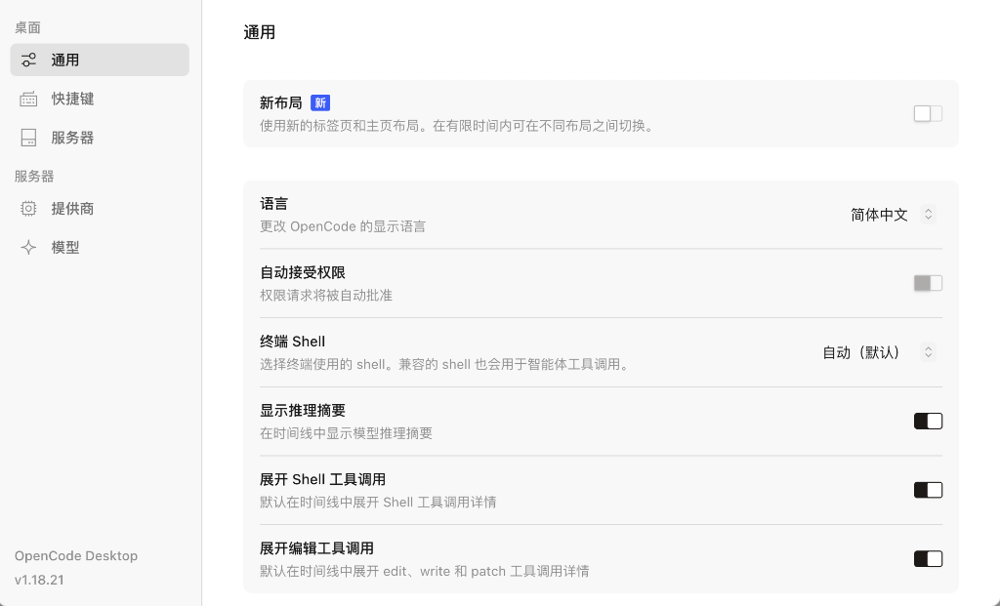
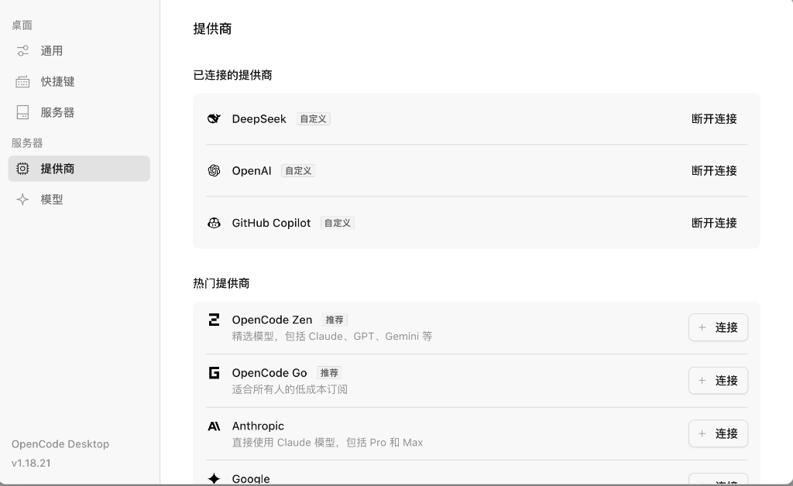

# 5.1 OpenCode 安装与基础设置

OpenCode 可以通过终端或桌面界面操作项目。两种入口都需要选对工作目录、接通模型并确认执行权限。本节先完成这些基础设置，再通过一次小范围修改检查环境是否可用。

---

## 什么是 OpenCode 的双端体验？

如果把传统的编程比作“在工地上徒手搬砖”，那么使用 OpenCode 就相当于给你配备了一套**高科技外骨骼装甲与智能副驾**：

- 🖥️ **OpenCode CLI（终端命令行版）**：就像是**特种兵随身携带的战术多功能瑞士军刀**。无需打开庞大的窗口，在任何终端或远程服务器里敲一行命令，就能让 AI 像闪电一样快速检索代码、定位 Bug、批量修改文件并自动运行测试；
- 🖼️ **OpenCode Desktop（桌面图形化客户端）**：集中展示会话历史、项目工作区、代码差异和命令执行结果，适合希望在图形界面中审查改动的读者。

CLI 与桌面端可以使用 OpenCode 配置。切换入口后，仍应确认当前项目目录、配置来源和模型选择，尤其是连接了不同服务或运行环境时。

<!-- 图表源文件：img/diagrams/01-diagram-01.mmd；视觉风格：Pastel 多巴胺 -->
<p align="center">
  <a href="img/diagrams/01-diagram-01.svg">
    
  </a>
</p>

***

## 全平台双端下载与安装指南

### 1. 终端命令行版（CLI）快速安装

OpenCode CLI 支持全平台一键安装，你可以根据自己的操作系统选择最便捷的方式：

#### macOS & Linux

你可以使用官方一键脚本或 Node.js 全局包管理器安装：

```bash
# 方式一：官方一键 Shell 脚本安装（推荐）
curl -fsSL https://opencode.ai/install.sh | bash

# 方式二：使用 Homebrew 安装 (macOS)
brew install sst/tap/opencode

# 方式三：使用 npm / pnpm 全局安装
npm install -g opencode-ai
# 或者
pnpm add -g opencode-ai
```

#### Windows

Windows 用户可以在 PowerShell（建议以管理员身份打开）中运行：

```powershell
# 方式一：官方 PowerShell 一键安装
irm https://opencode.ai/install.ps1 | iex

# 方式二：使用 npm 全局安装
npm install -g opencode-ai

# 方式三：使用 Scoop 包管理器
scoop bucket add opencode https://github.com/sst/opencode-scoop.git
scoop install opencode
```

#### 验证 CLI 安装

在终端输入以下命令，输出版本号即代表安装成功：

```bash
opencode --version
# 输出示例: opencode v1.18.x
```

在任何项目目录下输入 `opencode`，即可直接唤醒终端交互式智能体。

#### CLI 首次启动三步曲（快速上手）

安装验证通过后，建议按以下三步完成首次启动与模型接入：

```bash
# 1. 登录模型提供商并填写 API Key（官方直连或第三方中转均可）
opencode auth login

# 2. 拉取该账户下最新可用的模型列表
opencode models --refresh

# 3. 进入任意项目目录，直接唤起终端交互式智能体
opencode
```

进入 CLI 交互界面后，`Tab` 键可在 **Plan（规划）/ Build（构建）** 等智能体模式间快速切换，输入 `/` 即可呼出斜杠命令菜单（切换模型、查看智能体等），与 Desktop 版的操作习惯完全一致。

***

### 2. 桌面图形化版（Desktop）下载与安装

OpenCode Desktop 提供了开箱即用的跨平台安装包，教程也主要采用desktop版本：

- **官方下载中心**：<https://opencode.ai/download>
- **学习社区镜像与指南**：<https://learnopencode.com/>

| 操作系统        | 安装包格式                | 适用架构                                      | 安装与配置注意事项                                                                    |
| :---------- | :------------------- | :---------------------------------------- | :--------------------------------------------------------------------------- |
| **macOS**   | `.dmg`               | Apple Silicon (M1/M2/M3/M4) / Intel (x64) | 下载后拖拽至 `Applications`；首次打开如遇安全提示，在“系统设置 ⮕ 隐私与安全性”中点击“仍要打开”。                  |
| **Windows** | `.exe` / `.msi`      | x64 / ARM64                               | 双击安装向导，一路点击“下一步”即可完成安装并自动创建桌面快捷方式。                                           |
| **Linux**   | `.AppImage` / `.deb` | x64 / ARM64                               | Ubuntu/Debian 可执行 `sudo dpkg -i opencode-desktop.deb`；AppImage 赋予执行权限即可直接运行。 |

### 双端怎么选？CLI 与 Desktop 适用场景对比

| 维度     | 🖥️ CLI（终端命令行）                     | 🖼️ Desktop（桌面图形化）                 |
| :----- | :--------------------------------- | :---------------------------------- |
| **上手门槛** | 需熟悉终端操作，界面极简                  | 图形化界面，新人友好，所见即所得                  |
| **典型场景** | 服务器 / SSH 远程开发、快速批改、脚本化流水线 | 本地项目精雕细琢、可视化 Diff 审查、沉浸式多文件编码    |
| **视觉反馈** | 纯文本流式输出                         | 时间线 / 代码 Diff / 图片预览一应俱全            |
| **配置与模型** | 与 Desktop 共享同一份全局配置与已登录模型，衔接 | 同左                               |

> 💡 **学习建议**：本教程后续实战主要采用 **Desktop 版**，便于对照截图和查看改动。需要在服务器环境开发或编写自动化脚本时，再使用 CLI 版即可。

***

## OpenCode Desktop 主界面说明

首次启动 OpenCode Desktop 时，你将看到一个极简、清爽且专注于代码创造的现代化界面：


### 主界面核心功能分区：

1. **左上角新建与控制区**：
   - 🔴🟡🟢 **窗口控制红黄绿灯**（macOS 原生风格）；
   - 📑 **侧边栏与分栏切换按钮**：快速收起或展开左侧会话面板，最大化代码与对话可视区域；
   - ➕ **新建会话按钮（`+`）**：随时开启一段全新上下文的 AI 协作任务，避免历史对话过长导致注意力漂移。
2. **中间主工作区（项目加载区）**：
   - 📂 **“打开项目”按钮（Open Project）**：点击后选择你本地的工程文件夹（如 Git 仓库目录）。OpenCode 会自动建立本地文件树索引并加载环境配置。
3. **左下角配置与支持区**：
   - ⚙️ **设置齿轮图标（快捷键** **`⌘,`** **/** **`Ctrl+,`）**：进入系统级控制中枢（包含通用偏好、快捷键定义、模型提供商与服务器连接）；
   - ❓ **帮助与文档图标**：一键直达官方文档与社区支持通道。

### Desktop 首次启动动线（三分钟上手）

1. 点击主界面「打开项目（Open Project）」，选择你的工程文件夹，OpenCode 会自动建立文件树索引并加载环境配置；
2. 点击左上角 ➕ 新建会话，确认底部已选中目标模型（首次可先选择免费模型熟悉流程）；
3. 在输入框敲下第一条意图指令（如“帮我把这个项目的 README 梳理一遍”），按 `⌘↵`（`Ctrl+Enter`）发送，即可触发 Agent 自治执行。

> 💡 **双端衔接**：Desktop 中登录的模型与密钥与 CLI 完全共享（同一份 `~/.config/opencode/opencode.jsonc`），桌面端调好后，终端直接 `opencode` 即可复用，无需重复配置。

***

## 设置中心逐步深度调优

点击左下角设置图标（或按下快捷键 `⌘,`），进入 OpenCode 设置面板。这里分为**通用偏好**与**提供商/模型连接**两大核心板块：

### 1. 通用设置（General Settings）



#### 核心配置项逐项解析：

| 设置项                           | 推荐状态           | 功能说明                                                                                                                    |
| :---------------------------- | :------------- | :---------------------------------------------------------------------------------------------------------------------------- |
| **新布局 (New Layout)**          | 🔘 按需开启        | 开启后启用最新的标签页和主页分栏布局，适合喜欢在多文件和多任务间快速跳转的用户。                                                                                      |
| **语言 (Language)**             | 🇨🇳 **简体中文**  | 一键切换全中文界面，降低视觉疲劳与认知门槛。                                                                                                        |
| **自动接受权限 (Auto-approve)**     | ⚠️ **按项目决定**   | 开启后，部分文件读写和命令执行不再逐次等待确认。刚开始使用或处理不熟悉的项目时建议保留人工复核；只有在操作范围明确、回退方式可靠时，再按需要放宽。 |
| **终端 Shell (Terminal Shell)** | 💻 **自动 (默认)** | 自动识别你当前系统的主 Shell（macOS 默认为 `zsh`，Linux 为 `bash`，Windows 为 `powershell`），作为智能体调用系统工具的基础底座。                                    |
| **显示推理摘要 (Reasoning)**        | ✅ **强烈建议开启**   | **透视 AI 的内心戏。** 针对具备思考能力的大模型（如 DeepSeek-R1、o1/o3、Claude 3.7 Extended Thinking），在时间线中完整展开其思维链（Chain of Thought），让你看清 AI 的推理逻辑。 |
| **展开 Shell 工具调用**             | ✅ **推荐开启**     | 默认在时间线中展开 AI 敲终端命令的完整细节与标准输出，避免黑盒盲盒操作。                                                                                        |
| **展开编辑工具调用**                  | ✅ **推荐开启**     | 默认在时间线中展开 `edit`、`write` 和 `patch` 等文件修改操作详情，方便随时肉眼 Review。                                                                   |

***

### 2. 提供商与模型接入（Providers & Models）



OpenCode 拥有极度开放的模型生态，支持主流官方模型、订阅型服务与第三方中转网关：

#### 支持的常见模型类型：

1. **已连接的提供商（Connected Providers）**：
   - **DeepSeek**：性价比极高、推理与代码内功深厚的模型服务，支持通过官方 API 或硅基流动等中转快速接入；
   - **OpenAI**：这里显示自定义是因为用的中转；
   - **GitHub Copilot**：如果你拥有 Copilot 订阅，可以直接复用其模型通道；
2. **热门官方直连提供商（Featured Providers）**：
   - **OpenCode Zen / OpenCode Go**：官方推荐的即用型订阅与精选模型池（涵盖 Claude、GPT、Gemini 等），opencode go的套餐非常划算，是目前性价比最高的套餐之一；
   - **Anthropic**：Claude 系列，可按代码理解、生成质量、价格和响应速度进行实际比较；
   - **Google**：Gemini 系列，拥有百万级超长上下文窗口；
3. **自定义提供商（Custom Provider）**：
   - 支持填写任意兼容 OpenAI 规范的第三方 Base URL 与 API Key，无论是本地部署的 Ollama / vLLM，还是公司内部的私有网关，都能一键接入。

***

## 高频快捷键与快速工作流

熟练掌握快捷键是开启“Vibe”的关键法宝：

| 快捷键 (macOS)             | 快捷键 (Windows/Linux) | 动作说明                 |
| :---------------------- | :------------------ | :------------------- |
| `⌘ ,`                   | `Ctrl + ,`          | 打开系统设置面板             |
| `⌘ N`                   | `Ctrl + N`          | 快速新建会话窗口             |
| `⌘ P`                   | `Ctrl + P`          | 快速文件模糊搜索与定位          |
| `⌘ K`                   | `Ctrl + K`          | 选中文本唤醒行内 AI 意图修改     |
| `⌘ B`                   | `Ctrl + B`          | 展开 / 折叠侧边栏           |
| `⌘ ↵` (Command + Enter) | `Ctrl + Enter`      | 发送当前指令并触发 Agent 自治执行 |

***

## 常见问题速查（FAQ）

1. **安装后终端提示 `command not found`？**
   - 关闭并重新打开终端窗口使 PATH 生效；若使用 npm 全局安装，可运行 `npm prefix -g` 确认全局 bin 目录已加入 `PATH`。
2. **macOS 首次打开 Desktop 提示“无法验证开发者”？**
   - 前往“系统设置 ⮕ 隐私与安全性”，点击“仍要打开”即可放行（属于 macOS 对新下载应用的常规安全拦截）。
3. **如何切换为简体中文界面？**
   - 打开设置（`⌘,`）⮕ 通用设置 ⮕ 语言 ⮕ 选择“简体中文”，重启应用后生效。
4. **Desktop 与 CLI 配置不一致？**
   - 双端共享同一份 `~/.config/opencode/opencode.jsonc`，无需分别维护；修改配置后按 `⌘R` 重载窗口即可生效。

***

## 安装完成后，检查一次实际工作过程

新工具安装好后，先做一次小任务，像新买的打印机先打测试页。本节可以用一个临时练习目录，让 OpenCode 列出文件并说明目录内容，然后修改一小段说明文字，最后查看修改差异。

| 检查环节 | 需要看见什么 |
| --- | --- |
| 打开项目 | 当前目录与准备修改的目录一致 |
| 模型连接 | 一次短对话正常返回，未出现授权错误 |
| 文件读取 | 回答能对应实际文件，而非泛泛描述 |
| 修改审查 | 能看到具体增加和删除的内容 |
| 结果保存 | 重新打开文件仍能看到本次修改 |

这里要区分三个位置：客户端运行的位置、模型服务所在的位置，以及工具命令实际执行的位置。使用本地客户端，并不意味着模型在本地运行；切换到另一台机器，也不意味着原机器的文件和环境会自动跟随。

权限配置像给维修人员划定工作范围。练习目录内的小改动和向外发布内容，需要不同程度的检查。可先熟悉读取、编辑和命令执行的权限项，再按项目需要调整。具体配置参见 [OpenCode 权限文档](https://opencode.ai/docs/permissions/)。

## 把“安装成功”定义成一条完整工作闭环

能打开界面只说明客户端已经启动，开发环境是否可用还要经过一次完整任务。可以选一份不重要的练习文档，让 OpenCode 先说明当前目录，再读取指定文件、修改一句话、展示差异，最后执行一个不会改变系统状态的检查。每一步都要能解释结果来自哪里。

如果读取到的不是目标文件，先纠正工作目录；如果模型能对话却不能改文件，检查权限和当前模式；如果改动已经写入但界面没有显示，重新读取文件并查看差异。不要用一次复杂任务同时验证模型、目录、权限和命令环境，否则失败后很难定位。

完成这条闭环后，记下客户端版本、配置位置和项目路径。桌面端与命令行端可以共用部分配置，但启动目录和会话上下文仍可能不同；在另一端继续任务时，应重新确认这些信息。

---

## 参考资料

- **OpenCode 官方主页**：<https://opencode.ai>
- **OpenCode 学习指南（推荐必读教程）**：<https://learnopencode.com/>
- **OpenCode 中文网配置文档**：<https://www.opencodecn.com/docs/config>
- **OpenCode 官方 GitHub 仓库**：<https://github.com/sst/opencode>
