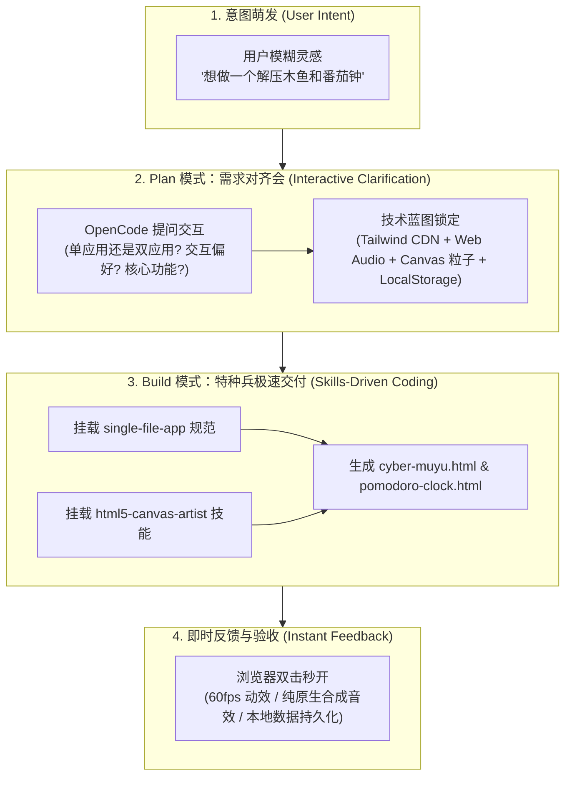
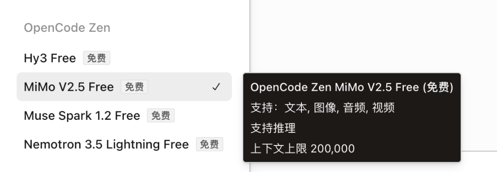
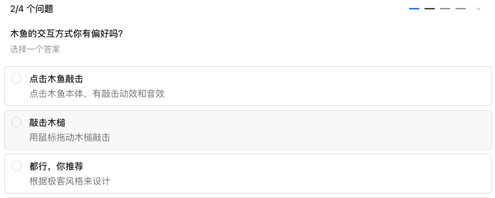
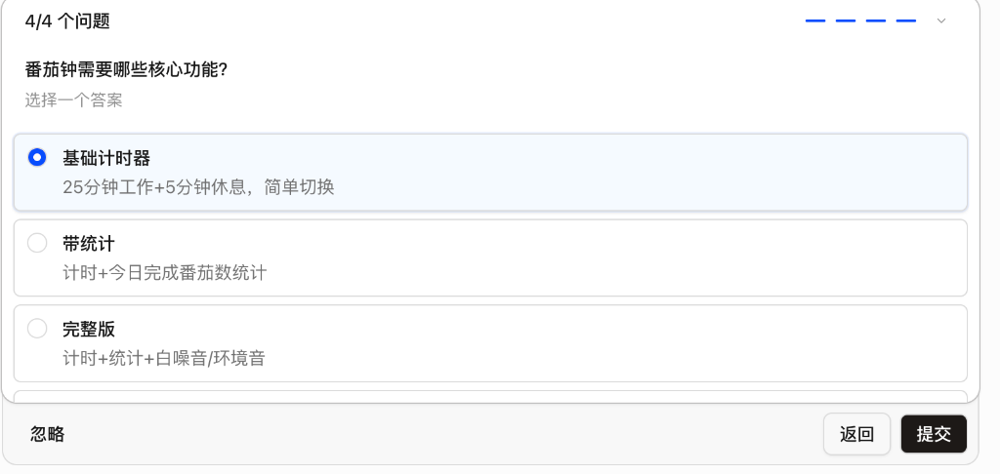
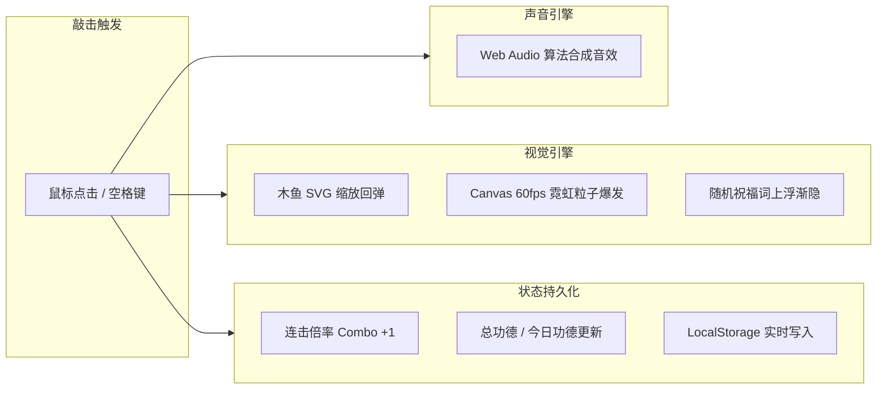
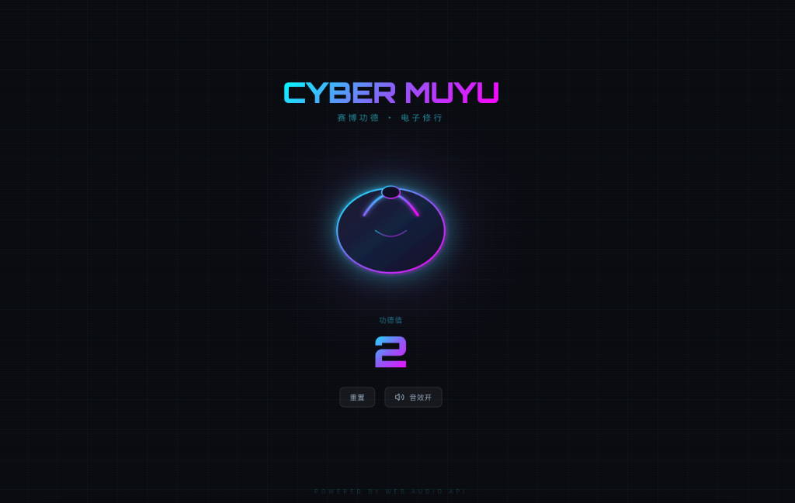
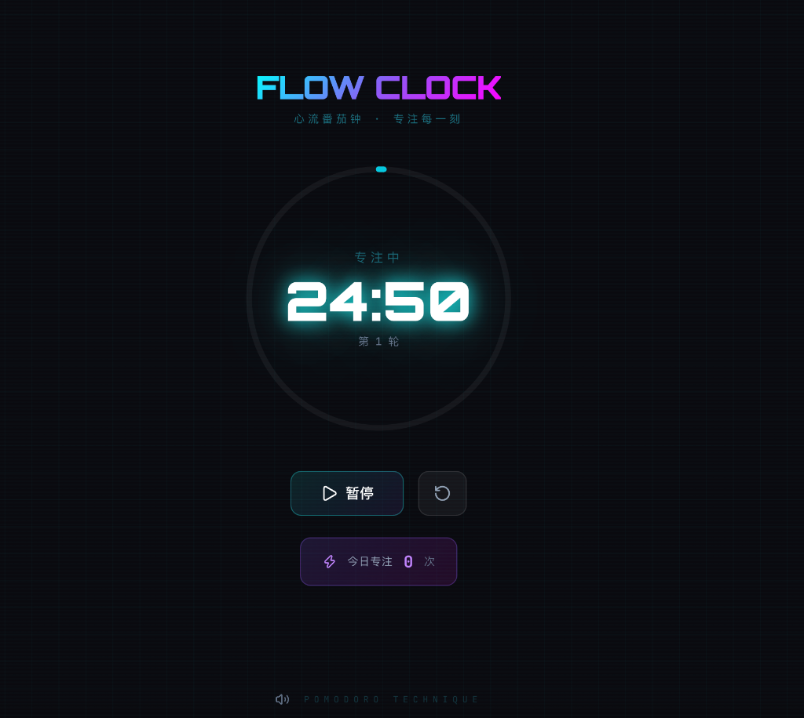

# 5.3 极速破冰：意图驱动单文件小工具实战（赛博解压木鱼 & 番茄钟）

> **本节导读**：无需配置庞大的后端服务，无需执行复杂的 `npm install`，只凭一句随口而出的自然语言意图，AI 真的能直接交付一个高颜值、带音效、有粒子动画并且可以在浏览器里双击即跑的完整应用吗？\
> 本节将带你进行第一次 **OpenCode 意图驱动破冰实战**：通过 OpenCode 的原生 **Plan（规划）** 与 **Build（构建）** 模式，结合本地项目级 Skills 技能，从 0 到 1 打造一对赛博朋克极客小工具 —— **《赛博极客解压木鱼》** 与 **《心流番茄钟》**！

***

## 💡 一、生活化大比喻：什么是“意图驱动”与“单文件架构”？

在过去，如果你想做一个具有交互动效、音效播放和本地存储的网页小工具，通常需要经历漫长的工序：搭脚手架、配置打包工具、设计 CSS 样式、寻找无版权音效 MP3 文件、调试 JavaScript 逻辑……

而在 **Vibe Coding 时代**，这个过程发生了颠覆性的变化：

- 🍳 **意图驱动（Intent-Driven）**：就像你去一家米其林餐厅点餐，你只需要说“我想要一份七分熟、带黑松露香气的菲力牛排”，大厨（AI）就会主动向你确认配菜偏好、烹饪温度，随后在后厨完成所有煎烤与摆盘，直接把成品端到你面前；
- 💊 **自包含单文件应用（Single-File App）**：就像是**一颗便携式战术胶囊**。所有的 HTML 结构、Tailwind CSS 样式、Web Audio 纯算法合成音效以及 Canvas 粒子动效，全部浓缩在一个独立的 `.html` 文件中。无需任何 Node.js 环境，双击即可在任何电脑的浏览器中满血运行！



***

## ⚙️ 二、实战前置：对齐模型与项目级 Skills 配置

在动手之前，我们先统一实战环境，确保每位读者都能以**零成本、零污染、轻负担**的状态顺利通关。

### 1. 选用零门槛免费模型：OpenCode Zen `MiMo V2.5 Free`

对于本节这种轻量级的前端单文件实战，完全不需要调用昂贵的商业旗舰大模型。OpenCode 官方提供的免费模型 **MiMo V2.5 Free** 已经具备了极强的推理与代码生成能力：

- 🚀 **完全免费**：零 API 计费负担，新手随便折腾不用心疼 Token；
- 🧠 **支持深度推理（Reasoning）**：能在生成代码前自主规划 DOM 结构与动画链路；
- 📚 **200,000 超长上下文**：轻松容纳几千行代码与设计上下文。

在 OpenCode 顶部或右下角模型切换面板中，选择 **`MiMo V2.5 Free`** 即可：



***

### 2. 为什么本节“不加装 omo-slim 与重型 MCP”？

在上一节 [5.2 高级配置](./02_高级配置_MCP与Skills及omo_slim实战.md) 中，我们学习了功能强大的 `oh-my-opencode-slim` 多专家智囊团和 MCP 扩展坞。但在第一次破冰实战中，我们特意采用**极简纯净方案**：

> 💡 **核心考量**：
>
> 1. **降低心智负担**：先掌握 OpenCode 最原生的 **Plan 模式（规划）** 与 **Build 模式（构建）**；
> 2. **凸显原生实力**：体验在不依赖额外复杂插件的情况下，AI 仅凭自身推理与基础规范就能交付的高水准。

***

### 3. 项目级 Skills 还是全局 Skills？

在 OpenCode 中，Skills（技能包）支持两种存放形式：

| 技能类型                       | 存放路径                          | 作用范围        | 适用场景                                 |
| :------------------------- | :---------------------------- | :---------- | :----------------------------------- |
| **全局技能 (Global Skills)**   | `~/.config/opencode/skills/`  | 全局所有项目可见    | 通用的代码规范（如 `simplify` 重构规则、全局 git 规范） |
| **项目级技能 (Project Skills)** | 当前项目根目录下的 `.opencode/skills/` | **仅当前项目生效** | 特定项目依赖的前端动效规范、特定框架模板、专属 API 契约       |

> 🌟 **项目级配置的巨大优势**：
> 我们可以直接让 AI 帮我们把需要的 skills 下载或生成到当前项目的 `.opencode/skills/` 目录下！
> 这样不仅**完全不会影响到电脑里的其他项目**，而且当把整个项目文件夹分享给他人或提交到团队代码仓时，所有协作者都能立刻获得完全一致的 AI 辅助能力！

本节实战中，我们已经在项目目录 `.opencode/skills/` 中挂载了以下**五大核心技能**，它们各司其职、组合发力，共同保障 AI 交付出颜值与质量俱佳的单文件应用：

- 📦 **`single-file-app`**：约定单文件 HTML 规范（通过公共 CDN 引入 Tailwind CSS、Lucide 图标、LocalStorage 持久化、双击即跑）；
- 🎨 **`tailwind-ui-master`**：约定暗黑深色系 + 毛玻璃拟态（Glassmorphism）+ 霓虹渐变点缀的高质感 UI 设计规范，让木鱼与番茄钟自带沉浸式赛博朋克审美；
- ✨ **`html5-canvas-artist`**：约定 Canvas 60fps 粒子爆发动效与 **Web Audio API 纯原生合成音效规范（免除外链 MP3 丢失风险）**；
- 🧹 **`simplify`**：约定代码精简重构规则（消除深嵌套、剔除冗余样板代码），确保生成的单文件代码整洁、清晰、易读；
- 🌐 **`agent-browser`**：约定自动化浏览器测试规范（模拟点击交互、截图、检查控制台报错），用于双击即跑后的可视化自查与验收闭环。

> 💡 **Skills 是「可插拔的军火库」，随时按需补充**：技能包并非一成不变，随着项目不断进阶，你随时可以在 `.opencode/skills/` 中挂载更多专项技能（如后端 API、数据可视化、文档生成等），让 AI 始终遵循最新、最合适的规范作战。

***

## 🗣️ 三、Plan 模式：从模糊灵感开启“需求对齐会”

### 1. 意图的第一声发问

在开发初期，我们往往只有一个模糊的方向：“我想做个解压木鱼和番茄钟”，但并不清楚具体需要哪些控件、什么样的配色或交互形式。

此时，**千万不要直接开工写代码**！我们先将 OpenCode 切换至 **Plan（规划模式）**，输入提示词：

```text
要做赛博极客解压木鱼 & 心流番茄钟这个小工具，但我没有什么头绪，你能和我讨论一些方案吗？
```

***

### 2. 交互式多轮需求对齐

收到意图后，OpenCode 并没有盲目堆砌代码，而是化身为**资深产品经理兼架构师**，通过交互式弹窗向我们发起了针对性提问：

#### ❓ 问题 1/4：架构形态选择

> *“你希望这两个功能是合并成一个应用，还是做成两个独立的小工具？”*
>
> - 选项 A：**合并成一个应用**（木鱼解压 + 番茄钟计时，在一个界面里切换）
> - 选项 B：**两个独立应用**（两个独立的 HTML 文件，各自独立运行）


#### ❓ 问题 2/4：木鱼交互偏好

> *“木鱼的交互方式你有偏好吗？”*
>
> - 选项 A：**点击木鱼敲击**（点击木鱼本体，有敲击动效和音效）
> - 选项 B：**敲击木槌**（用鼠标拖动木槌敲击）
> - 选项 C：**都行，你推荐**（根据极客风格来设计）



#### ❓ 问题 4/4：番茄钟核心功能

> *“番茄钟需要哪些核心功能？”*
>
> - 选项 A：**基础计时器**（25分钟工作 + 5分钟休息，简单切换）
> - 选项 B：**带统计**（计时 + 今日完成番茄数统计）
> - 选项 C：**完整版**（计时 + 统计 + 白噪音/环境音）



***

### 3. AI 输出的完整技术与设计蓝图

在收集完我们的偏好后，AI 立即整理出了一份条理清晰的详细设计方案：

> ### 好的，方案清晰了。下面是两个独立应用的详细设计讨论：
>
> #### 🥁 应用一：赛博木鱼
>
> **核心体验**：点击木鱼 → 视觉/听觉反馈 → 功德数字飙升
>
> | 元素       | 说明                              |
> | :------- | :------------------------------ |
> | **木鱼本体** | 暗黑风格 + 霓虹描边，点击时触发缩放回弹动画         |
> | **敲击音效** | Web Audio 合成木质敲击声（零 MP3），低沉浑厚   |
> | **飘字反馈** | 每次敲击弹出 +1 功德 / 赛博功德 +1，随机位置上浮消失 |
> | **连击特效** | 连续快速点击触发霓虹光晕 + 粒子爆发             |
> | **功德计数** | 大号数字显示，带千分位格式化                  |
>
> **赛博朋克元素**：
>
> - 背景：深空黑 + 霓虹网格地面（CSS 扫描线与网格）
> - 故障艺术：功德数字偶尔抖动/错位
> - 霓虹光效：木鱼边缘发光，点击时脉冲扩散
> - 色调：紫 / 青 / 粉 霓虹三色系
>
> ***
>
> #### ⏱️ 应用二：心流番茄钟
>
> **核心体验**：25分钟专注 → 5分钟休息，干净利落
>
> | 元素        | 说明                  |
> | :-------- | :------------------ |
> | **环形进度条** | SVG 圆环倒计时，霓虹渐变描边    |
> | **状态切换**  | 专注中 → 休息中，自动循环      |
> | **开始/暂停** | 一个按钮搞定，极简操作         |
> | **音效提示**  | 到时触发合成提示音（不吓人，有科技感） |
>
> **赛博朋克元素**：
>
> - 背景：暗黑 + 漂浮的代码粒子
> - 配色：专注时青色冷调，休息时紫色暖调
> - 字体：等宽字体（JetBrains Mono / Fira Code）模拟终端感
>
> ***
>
> #### 🛠️ 技术选型
>
> | 技术                     | 用途             |
> | :--------------------- | :------------- |
> | **Tailwind CSS (CDN)** | 快速样式开发，暗黑模式    |
> | **Lucide Icons (CDN)** | 播放/暂停等图标       |
> | **Web Audio API**      | 零依赖纯算法合成音效     |
> | **HTML5 Canvas**       | 粒子系统、飘字动效      |
> | **CSS Animations**     | 脉冲、悬浮与扫描线效果    |
> | **LocalStorage**       | 本地保存功德数、番茄钟完成数 |
>
> #### 📂 文件结构
>
> ```text
> 05_OpenCode实战/project_01_赛博解压小工具/
> ├── cyber-muyu.html        # 赛博木鱼
> └── pomodoro-clock.html    # 心流番茄钟
> ```

***

## 🔨 四、Build 模式：一键切换，AI 极速编码交付

确认方案无误后，我们直接将 OpenCode 切换至 **Build（构建模式）**，输入：“**确认**”。

### 1. AI 自主建立任务追踪与规范遵循

进入 Build 模式后，AI 会自动建立 Todo 进度项，严格遵循 `AGENTS.md` 和 `.opencode/skills/` 里的开发规则：

1. **采用单文件 HTML 架构**；
2. **使用 Tailwind CSS CDN**；
3. **赛博朋克暗黑风格**；
4. **不擅自 commit**。


随后，AI 依次完成两个独立应用的编写，生成文件结构清晰明了：


***

### 2. 核心黑科技一：Web Audio API 纯算法合成音效（零外部 MP3 依赖）

很多传统前端教程在做音效时，都会让大家去网上找 `dong.mp3` 或 `bell.wav`。但外链音频经常失效、加载缓慢，甚至有跨域或版权风险。

在本项目中，AI 使用了浏览器的原生 **[Web Audio API](https://developer.mozilla.org/zh-CN/docs/Web/API/Web_Audio_API)**：

```javascript
// 🎵 纯算法实时合成沉浸式木鱼敲击声
function playWoodblockSound() {
  const audioCtx = new (window.AudioContext || window.webkitAudioContext)();
  const now = audioCtx.currentTime;

  // 1. 创建三角波振荡器模拟木质共鸣
  const osc = audioCtx.createOscillator();
  const gain = audioCtx.createGain();
  const filter = audioCtx.createBiquadFilter();

  osc.type = 'triangle';
  // 频率在 0.12 秒内由 580Hz 骤降至 120Hz，模拟敲击木质空腔的瞬态衰减
  osc.frequency.setValueAtTime(580, now);
  osc.frequency.exponentialRampToValueAtTime(120, now + 0.12);

  // 2. 带通滤波器滤除多余高频，让声音更浑厚扎实
  filter.type = 'bandpass';
  filter.frequency.setValueAtTime(650, now);
  filter.Q.setValueAtTime(3, now);

  // 3. 指数音量衰减，杜绝爆音
  gain.gain.setValueAtTime(0.9, now);
  gain.gain.exponentialRampToValueAtTime(0.001, now + 0.12);

  // 4. 连接音频节点链路：振荡器 -> 滤波器 -> 音量增益 -> 扬声器输出
  osc.connect(filter);
  filter.connect(gain);
  gain.connect(audioCtx.destination);

  osc.start(now);
  osc.stop(now + 0.12);
}
```

> 🎯 **效果体验**：零网络请求，点击瞬间 0 毫秒超低延迟发声，清脆浑厚，敲击感极佳！

***

### 3. 核心黑科技二：HTML5 Canvas 60fps 霓虹粒子与连击系统

在 `cyber-muyu.html` 中，每次点击木鱼，除了触发木鱼本身的缩放回弹动画外，底层 Canvas 会根据点击坐标以物理速度、角度和透明度衰减发射一簇霓虹粒子，并触发随机祝福语上浮飘字（如 `功德 +1 · 需求不改`、`功德 +1 · 线上零 Bug`、`功德 +1 · 头发茂密`）。

快速连续敲击还会触发 **Combo 连击倍率计算（x2 \~ x99）** 与 100 次敲击大圆满的五彩纸屑撒花特效（`canvas-confetti`）！



***

### 4. 核心黑科技三：SVG 动态圆环进度与时空舱番茄钟

在 `pomodoro-clock.html` 中，倒计时采用了现代极客最爱的 **SVG 动态圆环描边偏移（`stroke-dashoffset`）** 算法：

- ⚡ **深度专注模式（25分钟）**：冷艳青色霓虹光晕（`#00f0ff`）；
- ☕ **极速小憩模式（5分钟）**：浪漫品红霓虹光晕（`#ff007f`）；
- 🌴 **深度大休模式（15分钟）**：温暖琥珀金霓虹光晕（`#f59e0b`）；
- 🚀 **10秒极速演示模式**：在设置弹窗中一键开启，无需苦等 25 分钟即可立即验证到时提醒和水晶和弦音效！

***

## 🔍 五、即时反馈：双击即跑与真实浏览器运行效果

代码生成完毕后，所有文件均已妥善保存在项目目录下的 `project_01_赛博解压小工具/` 文件夹中：

- 📁 **木鱼应用**：[cyber-muyu.html](./project_01_赛博解压小工具/cyber-muyu.html)
- 📁 **番茄钟应用**：[pomodoro-clock.html](./project_01_赛博解压小工具/pomodoro-clock.html)

### 🖥️ 极速体验方式：双击秒开！

因为这两个小工具都是标准的**自包含单文件 HTML 格式**，你不需要在本地运行任何 Node.js 服务，也不需要打开命令行，**直接双击文件，就能在浏览器中打开运行**！

#### 1. 赛博解压木鱼（Cyber Muyu）实际效果

深黑背景搭配赛博霓虹网格，中心是发光的赛博木鱼，点击伴随着清脆的 Web Audio 合成音效与飘字，非常解压：



#### 2. 心流番茄钟（Flow Clock）实际效果

科技感十足的青色发光倒计时环、等宽数字显示、实时的番茄轮次与专注统计，营造出沉浸的心流氛围：



***

## 🔬 六、实战探秘：挂载 Skills 与不挂载 Skills 的效果大 PK！

> 💡 **给同学们的实操小建议**：
> 强烈推荐大家在本地做一个趣味对比实验 —— **把前面同一份设计计划提示词发给没有加载 Skills 的 AI，与加载了 Skills 的 AI 进行一次 PK**，亲身体会一下 Skills 技能包的巨大魔力！

| 对比维度         | ❌ 没有加载 Skills 的 AI                                                      | ✅ 挂载了五大 Skills（`single-file-app` + `tailwind-ui-master` + `html5-canvas-artist` 等） |
| :----------- | :---------------------------------------------------------------------- | :--------------------------------------------------------------------------------- |
| **文件组织形式**   | 往往把代码拆成 `index.html`、`style.css`、`main.js` 多个文件，甚至让你本地执行 `npm install`。 | 严格遵守**自包含单文件规范**，CDN 引入依赖，用户**双击单个** **`.html`** **即可满血运行**。                       |
| **音效实现方案**   | 代码里常常硬编码 `<audio src="dong.mp3">`，但本地根本没有这个 MP3 文件，导致**页面一跑就报错哑火**。     | 自动使用 **Web Audio API 纯原生数学算法合成**，0 外部文件依赖，声音永不丢失、永无跨域报错！                           |
| **UI 与交互审美** | 往往是灰白色的默认原生 HTML 按钮、生硬的文本换行，缺乏现代科技质感。                                   | 自动应用 Tailwind 暗黑深色系、霓虹发光（Glow）、平滑过渡动画与精美排版。                                        |
| **动效呈现水平**   | 几乎没有动效，或者只是简单的 CSS 淡入淡出。                                                | 自动构建 **HTML5 Canvas 60fps 粒子爆发物理系统** 与 SVG 动态圆环渲染。                                 |

通过这个对比，大家可以清晰地看到：**Skills 绝不是约束 AI 的紧箍咒，而是为 AI 智能体量身定制的“特种作战战术包”**！它把人类资深工程师在特定领域的最佳实践与规范直接注入到了 AI 的心智模型中。

***

## 📝 七、本节小结与 Vibe Coding 心智沉淀

通过本节极速破冰实战，我们完整体会了 Vibe Coding 的核心开发范式：

1. **从“代码搬砖”到“意图对话”**：遇到新需求，先在 **Plan 模式** 下与 AI 进行多轮方案澄清与结构设计，把架构与细节想清楚；
2. **从“繁琐配置”到“单文件胶囊”**：善用公共 CDN 与浏览器原生 API（Web Audio、Canvas、SVG、LocalStorage），零依赖交付高质量自包含应用；
3. **从“全局污染”到“项目级 Skills”**：将特定领域规范收敛在项目内 `.opencode/skills/`，使 AI 生成的代码始终具备顶级审美与稳健架构；
4. **极速闭环反馈**：写完直接双击在浏览器中预览，通过微调意图迅速迭代完善。

***

## 🔗 八、官方权威与拓展学习资源

- **MDN Web Audio API 官方中文文档**：<https://developer.mozilla.org/zh-CN/docs/Web/API/Web_Audio_API>
- **MDN Canvas API 官方中文教程**：<https://developer.mozilla.org/zh-CN/docs/Web/API/Canvas_API>
- **Tailwind CSS 官方文档**：<https://tailwindcss.com/docs>
- **Lucide 图标库官方检索**：<https://lucide.dev/icons/>
- **Canvas-Confetti 开源项目 (GitHub)**：<https://github.com/catdad/canvas-confetti>
- **OpenCode 官方文档**：<https://opencode.ai/docs>

