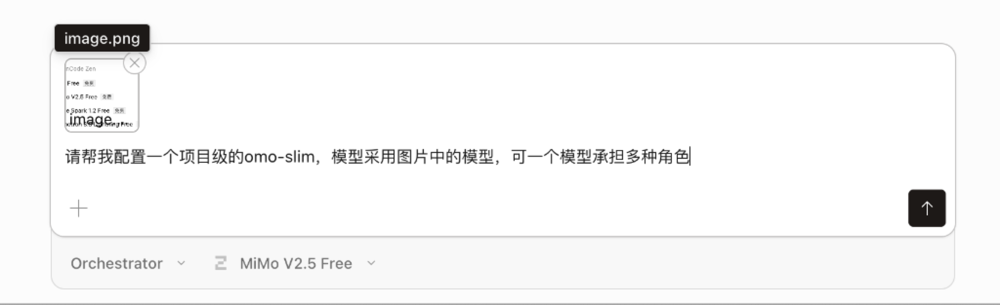
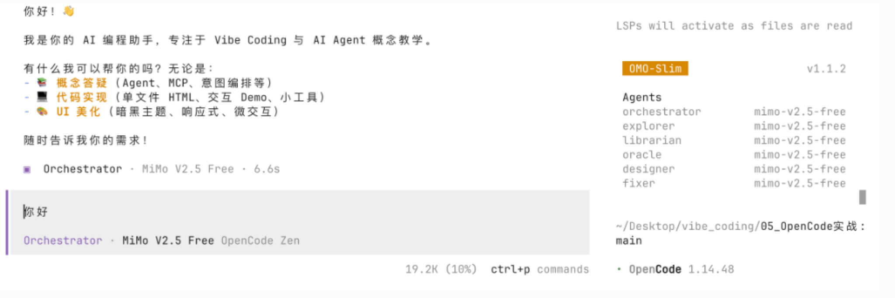
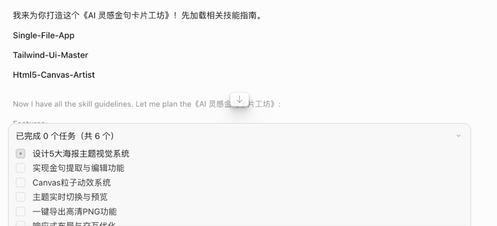
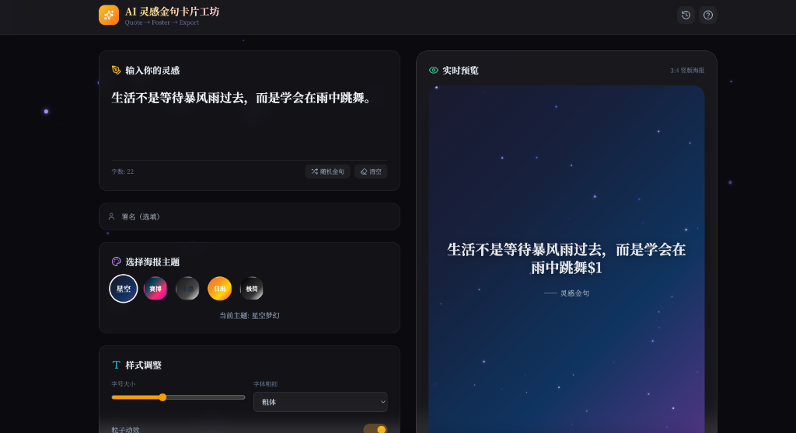

# 5.4 交互网页：灵感卡片生成器

这一节制作一个可以切换主题、调整文案并导出图片的卡片页面。相比上一节，重点增加了多个角色之间的任务衔接，以及屏幕显示和导出结果的一致性检查。

---

## 从“独行侠工匠”到“交响乐指挥部”

如果说 5.3 节的单文件木鱼实战是**一位通用木匠戴着不同的帽子**（一会儿当规划师画图纸，一会儿当泥瓦匠砌砖），那么 5.4 节的多智能体协作就是**组建一家现代化的顶尖创意工作室**：

<!-- 图表源文件：img/diagrams/04-diagram-01.mmd；视觉风格：Pastel 多巴胺 -->
<p align="center">
  <a href="img/diagrams/04-diagram-01.svg">
    
  </a>
</p>

- **`orchestrator`（统筹角色）**：负责拆分任务、安排执行顺序，并把边界清楚的工作交给对应角色；
- 🎨 **`designer`（UI 设计师）**：挂载了 `tailwind-ui-master` 技能，拥有审美，专注于调色盘、毛玻璃拟态、字体排印与暗黑流光动效；
- 🔮 **`oracle`（架构智囊）**：专门攻坚深层逻辑，如 Canvas 像素比高分屏适配、HTML 节点渲染为高清无损图片的数学计算；
- 🌐 **`agent-browser`（浏览器检查）**：像专业 QA 测试员一样，自动在真实浏览器中模拟用户点击、切换主题、下载图片，并截图反馈排版是否符合要求。

***

## `oh-my-opencode-slim`（omo-slim）快速安装

在开始项目前，我们需要确保本地已安装轻量高能的 `oh-my-opencode-slim` 插件。

### 1. 为什么选择 `omo-slim`？

我们在 [5.2 节](./02_高级配置：MCP、Skills及omo_slim.md) 中深度对比过：原版 OMO 往往存在大量上下文冗余与 Token 浪费，而 `omo-slim` 采用了**极简模块化架构**，不仅大幅降低 Token 消耗，还支持将多个专家角色自由绑定到任意模型（包括完全免费的模型）上。

### 2. 一键安装命令：

打开终端，运行官方提供的交互式安装脚本：

```bash
# 使用 bunx（推荐，速度最快）
bunx oh-my-opencode-slim@latest install

# 或者使用 npm/npx
npx oh-my-opencode-slim@latest install
```

安装脚本会自动检测本地 OpenCode 环境，完成插件依赖注入与基础配置模板初始化。

***

## 新开会话：生成一份可用的项目配置

在日常开发中，我们强烈推荐采用「配置（Project-level Config）」而非直接修改全局配置：

- 🎯 **项目隔离**：每个项目可单独配置所需专家、绑定的技能（Skills）与模型，互不干扰；
- **便于共享**：项目配置文件可以随代码仓保存，团队成员仍需根据自己的模型权限和环境补齐本地配置；
- 💰 **省钱**：我们完全可以**灵活借用 OpenCode Zen 提供的免费模型（如** **`MiMo V2.5 Free`** **等）**，让一个高性价比的免费大模型同时兼任多个角色。

### 1. 告别手写 JSON：让 AI 帮我们写配置。

你完全不需要手动去敲复杂的 `oh-my-opencode-slim.jsonc` 配置文件。我们只需打开 OpenCode，新建一个会话，直接让 `MiMo V2.5 Free` 帮我们生成即可。

#### 第一步：确认当前会话处于 Orchestrator 模式与 MiMo 免费模型

在 OpenCode 对话框底部左侧切换角色为 **`Orchestrator`**，右侧模型选择 **`MiMo V2.5 Free`**：


#### 第二步：发送提示词（附带模型列表截图）

在对话框中上传包含可用免费模型列表的截图（或直接列出模型名称），并输入以下精准提示词：

> 💬 **向 AI 发送的提示词**：
>
> ```text
> 请帮我配置一个的omo-slim，模型采用图片中的模型，可一个模型承担多种角色
> ```



***

### 2. AI 提权与生成的配置文件：`.opencode/oh-my-opencode-slim.jsonc`

当 AI 开始生成配置文件并准备写入本地磁盘时，OpenCode 会弹出**工具执行与文件写入权限申请**，我们直接点击 **“允许 (Allow)”** 即可。

AI 为我们自动生成的配置文件结构如下：

```jsonc
{
  "$schema": "https://unpkg.com/oh-my-opencode-slim@latest/oh-my-opencode-slim.schema.json",
  // 当前激活的默认预设名称
  "preset": "mimo-free",
  "presets": {
    "mimo-free": {
      // 1. 统筹角色：负责拆解整体需求、安排任务
      "orchestrator": {
        "model": "opencode/mimo-v2.5-free",
        "skills": ["*"],                    // 允许使用所有已挂载技能
        "mcps": ["*", "!context7"]          // 挂载所有 MCP 工具，但排除 context7
      },
      // 2. 智囊顾问：攻克疑难算法、架构设计与高难度推导
      "oracle": {
        "model": "opencode/mimo-v2.5-free",
        "variant": "max",                   // 开启最高思考强度 (推理链拉满)
        "skills": ["simplify"],             // 专门挂载代码精简技能
        "mcps": []
      },
      // 3. 图书管理员：专职查阅文档、全库检索、外部资料搜索
      "librarian": {
        "model": "opencode/mimo-v2.5-free",
        "skills": [],
        "mcps": ["websearch", "grep_app"]   // 赋予联网搜索与全网代码检索权限
      },
      // 4. 代码探路者：极速扫描项目结构、定位文件与梳理依赖关系
      "explorer": {
        "model": "opencode/mimo-v2.5-free",
        "skills": [],
        "mcps": []
      },
      // 5. 前端/UI 设计师：负责页面布局、交互设计与样式美化
      "designer": {
        "model": "opencode/mimo-v2.5-free",
        "variant": "high",
        "skills": ["agent-browser"],        // 挂载浏览器端到端测试技能
        "mcps": []
      },
      // 6. Bug 修复专家：针对编译报错、单测失败精准打补丁
      "fixer": {
        "model": "opencode/mimo-v2.5-free",
        "variant": "high",
        "skills": [],
        "mcps": []
      }
    },
    // 备用预设：组合使用多个免费模型
    "multi-free": {
      "orchestrator": {
        "model": "opencode/mimo-v2.5-free",
        "skills": ["*"],
        "mcps": ["*", "!context7"]
      },
      "oracle": {
        "model": "opencode/hy3-free",
        "variant": "max",
        "skills": ["simplify"],
        "mcps": []
      },
      "librarian": {
        "model": "opencode/muse-spark-1.2-contributor-free",
        "skills": [],
        "mcps": ["websearch", "grep_app"]
      },
      "explorer": {
        "model": "opencode/nemotron-3.5-lightning-free",
        "skills": [],
        "mcps": []
      },
      "designer": {
        "model": "opencode/mimo-v2.5-free",
        "variant": "high",
        "skills": ["agent-browser"],
        "mcps": []
      },
      "fixer": {
        "model": "opencode/hy3-free",
        "variant": "high",
        "skills": [],
        "mcps": []
      }
    }
  }
}
```

> 💡 **核心点拨：为什么所有角色都是 MiMo 也能高效协作？**
> 看样子 AI 认为 `mimo` 模型应对当前开发任务已经完全足够了，实际上也确实如此。同学们完全不用担心：
>
> - **主模型是总指挥**：当前会话中直接与你对话的是 `orchestrator`；
> - **专家是独立的“子智能体”**：虽然底层都是 `mimo-v2.5-free`，但各个专家是以**独立的子智能体（Sub-agent）方式被唤醒和调用的**，每个角色都被注入了专属的系统提示词（System Prompt）、不同的思考强度（`variant: max/high`）以及隔离的工具权限；
> - **用量检查**：示例曾使用免费模型。是否仍免费、额度是否足够，以当前模型列表和服务说明为准。

***

### 3. 实机检验：如何确认 omo-slim 配置已成功激活？

配置完成后，我们必须先检验一下 omo-slim 是否已经正确加载（在项目打开终端，输入opencode，注意这里是TUI模式）：

1. **新建会话 / 终端**；
2. 在对话框中随便发送一条测试消息（如输入 `你好` 并回车）；
3. **观察终端界面右侧的状态栏**：
   - 看到明显的 **`OMO-Slim`** **橙色标签与版本号（如** **`v1.1.2`）**；
   - 下方清晰列出了当前激活的 **6 大 Agents 及其分配的模型列表**（`orchestrator`、`explorer`、`librarian`、`oracle`、`designer`、`fixer` 均显示为 `mimo-v2.5-free`）。

右侧状态卡片可以用于观察角色状态；是否完成了实际协作，还应查看子任务记录和最终修改。



***

## 全新范式：Orchestrator 模式开发（告别 Plan / Build 手动切换）

在进入实际编码前，我们需要理解 **Orchestrator 模式** 带来的工作方式：

<!-- 图表源文件：img/diagrams/04-diagram-02.mmd；视觉风格：GitHub Dark -->
<p align="center">
  <a href="img/diagrams/04-diagram-02.svg">
    
  </a>
</p>

### 为什么在此模式下无需手动切换 Plan 和 Build？

1. **AI 内部自主计划（Self-Planning）**：
   在 `Orchestrator` 模式下，统筹角色会先形成可查看的任务清单，再安排实现和检查；
2. **多专家动态分发**：
   总指挥根据计划，自动将 UI 视觉任务委托给 `designer`，将复杂 Canvas 算法委托给 `oracle`，并将最终页面交由 `agent-browser` 自测；
3. **减少手动切换模式**：
   需求方仍要说明产品目标、交互边界和审美偏好，统筹角色则负责安排后续步骤。执行过程中的改动和验证结果仍需人工审查。

***

## 第一步：一句话下发需求 —— 启动《AI 灵感金句卡片工坊》

确认 `omo-slim` 成功激活后，我们无需手动在 Plan 与 Build 之间切换。直接在对话框中以 `Orchestrator` 角色输入我们的顶层产品意图：

> 💬 **向 AI 发送的一句话需求提示词**：
>
> ```text
> 我要做一个集成了金句提取、5 大海报主题实时切换、Canvas 动效与一键导出高清图片的现代化前端动态交互作品 —— 《AI 灵感金句卡片工坊》。
> ```

***

## 第二步：AI 自动读取技能与任务规划拆解

收到需求后，`orchestrator` 先拆分任务，再按配置调用参与角色：

1. **自动按需挂载技能包（Skills）**：
   - 📦 **`Single-File-App`**：约束单文件自包含 HTML 规范；
   - 🎨 **`Tailwind-Ui-Master`**：注入暗黑玻璃拟态与现代字体排印；
   - ✨ **`Html5-Canvas-Artist`**：约束 Canvas 60fps 粒子流光与高分屏适配规范。
2. **内部自主拟定执行清单（TodoList）**：
   AI 会自动拆解出以下 6 大关键任务并逐项推进执行：
   - [x] **设计 5 大海报主题视觉系统**（星空梦幻、赛博霓虹、水墨丹青、朝阳日出、极简黑白）；
   - [x] **实现金句提取与编辑功能**（随机金句、实时字数统计、署名定制、一键清空）；
   - [x] **Canvas 粒子动效系统**（粒子悬浮流光与动效开关）；
   - [x] **主题实时切换与预览**（3:4 竖版海报实时渲染、字号大小滑动调节、字体粗细选择）；
   - [x] **一键导出高清 PNG 功能**（基于 `html2canvas` 导出 2x Retina 高清海报）；
   - [x] **响应式布局与交互优化**（磨砂毛玻璃卡片、流光过渡动画）。



***

## 第三步：成果验收 —— 沉浸式海报工坊体验

稍等片刻，AI 就在 `project_02_AI灵感卡片生成器/` 目录下为我们生成了完整的单文件作品。

双击在浏览器中打开，效果如下：



### 核心亮点与交互体验：

1. **🎨 5 大精美海报主题即时切换**：
   - 🌌 **星空梦幻**：深邃星空渐变 + 柔光点缀；
   - ⚡ **赛博霓虹**：霓虹青紫流光 + 科技暗黑；
   - 🖌️ **水墨丹青**：灰黑雅致渐变 + 东方禅意；
   - 🌅 **朝阳日出**：金粉朝霞撞色 + 暖调氛围；
   - ⬛ **极简黑白**：纯粹极简黑灰 + 现代冷感。
2. **✍️ 智能文字排印与灵感输入**：
   - 点击 **“随机金句”** 即可一键轮播精选哲思语录，并自动统计字数；
   - 支持自定义署名、实时滑动调节字号大小（16px - 36px）与粗细切换；
3. **✨ 60fps Canvas 梦幻漂浮粒子**：
   - 右侧 3:4 竖版海报背景实时演算粒子动效，可随时通过开关启用/停用；
4. **📥 一键导出 Retina 2x 高清无损 PNG 海报**：
   - 点击下方 **“一键导出高清 PNG 海报”** 按钮，系统会自动将卡片无损渲染为高质量 PNG 图片下载，排版清晰不模糊，可直接分享至朋友圈或小红书。

### 扩充讲解：海报导出的技术原理 —— 从 DOM 到高清 PNG

“导出高清 PNG”由 **`html2canvas`** 完成，主要步骤如下：

<!-- 图表源文件：img/diagrams/04-diagram-03.mmd；视觉风格：Notion 简洁 -->
<p align="center">
  <a href="img/diagrams/04-diagram-03.svg">
    
  </a>
</p>

1. **快照（Snapshot）**：`html2canvas` 读取海报卡片的 DOM 结构与计算后样式，逐层绘制到一张 `Canvas` 上；
2. **Retina 适配**：导出前先将 `canvas` 的物理尺寸按 `devicePixelRatio`（通常为 2）放大绘制，再通过 CSS 缩回显示，从而得到**无损 2x 高清图**；
3. **下载（Download）**：调用 `canvas.toDataURL('image/png')` 生成 base64 图片，再动态创建 `<a download="poster.png">` 触发浏览器保存。

> 💡 **对比知识**：浏览器原生 `Canvas` 导出适合纯绘制内容；而 `html2canvas` 能把「CSS 排版好的 DOM」直接拍成图，非常适合把海报、图表、卡片这类富样式区域一键导出分享。

***

## 实战复盘：Vibe Coding 的真正入门之道

> 💡 **阶段性里程碑**：
本例练习了需求说明、角色分工和结果验收。接下来可以尝试换一组文案，检查页面和导出结果是否仍符合要求。

回看我们的进化之路：

- 在 **5.3 节** 中，我们体验了**单兵作战**：人类需要手动在 Plan（澄清规划）与 Build（写代码）之间来回切换；
- 而在 **5.4 节** 中，我们全面升级到了 **`omo-slim`** **多智能体意图编排**：
  1. 根据当前可用模型和计费方式生成配置，并在使用前核对官方说明；
  2. 进入 `Orchestrator` 模式后，**人类只需输入一句自然语言意图**；
  3. AI 就会**自动加载技能规范、自动制定计划、自动调度各专家子智能体**完成从 UI 审美到 Canvas 动效的全面交付。

这类协作能减少重复配置工作，但需求表达、审美判断、结果审查和最终取舍仍由使用者负责。

***

## 导出图片应单独验收

海报像打印稿，屏幕上排得整齐，打印出来仍可能缺字或换行。页面预览和图片导出经过的处理不同，因此“能下载 PNG”只是第一步。

先固定几份测试文案：一句短句、一段长中文、一条长英文和含标点的混合文本。逐个主题切换后导出，比较图片与预览中的换行、字体、背景和边距。

| 问题 | 可能原因 | 排查方向 |
| --- | --- | --- |
| 字体与预览不同 | 导出时字体尚未加载 | 等待字体就绪再生成图片 |
| 图片缺少背景或图标 | 外部资源未加载或读取受限 | 检查资源地址、跨域和加载状态 |
| 长句被截断 | 容器高度或溢出规则固定 | 用长文本检查边界 |
| 图片模糊 | 导出像素尺寸不足 | 区分页面显示尺寸与图片像素尺寸 |
| 连续点击生成多次 | 缺少导出中的按钮状态 | 禁止重复触发并展示进度 |

还应确认“AI 灵感卡片”中的文案究竟来自真实模型调用、内置素材还是本地组合逻辑。它们的成本和失败方式不同，验收说明应与实际实现一致。若后续接入在线模型，密钥应交给后端保存，不能写进任何用户都能查看的 HTML。

多角色协作时可以让设计任务交付样式规范，开发任务交付交互实现，检查任务按上述用例验收。每个角色有明确产物，最后合并才有依据。

## 多角色协作先约定交付接口

任务拆给多个角色后，最常见的问题不是没人完成，而是交付物无法直接合并。设计角色如果只说“做得更有质感”，开发角色很难据此实现；开发角色若自行改动文案结构，导出检查又可能读取不到原来的元素。

开始前可以约定三类接口：设计角色交付颜色、字体、间距和状态说明；前端角色交付固定的元素结构、主题切换和导出函数；验收角色使用同一组长短文案、字体和图片尺寸检查。最后由一个明确的负责人合并修改，避免多个角色同时覆盖同一文件。

导出结果还应尽量可重复。同样的输入、主题和尺寸应得到相同布局；随机背景或粒子可以在页面中变化，但不应导致文字位置和可读性不可预测。需要复现问题时，可以暂时固定随机种子或关闭装饰动效。

---

## 下一节预告：挑战极简全栈前后端

既然纯前端单文件的动态交互已经难不倒我们，那么在接下来的章节中，我们将迈出更具里程碑意义的一步：**告别纯前端，正式进入真实的全栈开发世界。**

👉 **[5.5 极简全栈：FastAPI 与 SQLite 个人博客系统实战](./05_极简全栈_FastAPI与SQLite个人博客实战%28上%29.md)**：
我们将指挥 AI 从 0 到 1 搭建一个包含 **FastAPI 异步后端、SQLite 数据库持久化、完整 RESTful CRUD API 与响应式 Markdown 博客前端** 的经典全栈项目。

***

## 参考资料

- **Oh My OpenCode Slim 官方代码仓**：<https://github.com/code-any-way/oh-my-opencode-slim>
- **OpenCode 官方网站**：<https://opencode.ai>
- **OpenCode 学习指南（推荐必读）**：<https://learnopencode.com/>
- **OpenCode 中文网配置文档**：<https://www.opencodecn.com/docs/config>
- **Tailwind CSS 官方文档**：<https://tailwindcss.com/docs>
- **html2canvas 官方文档**：<https://html2canvas.hertzen.com/>
- **Model Context Protocol (MCP) 官方标准**：<https://modelcontextprotocol.io/>
- **Agent Skills 官方规范**：<https://agentskills.io>
