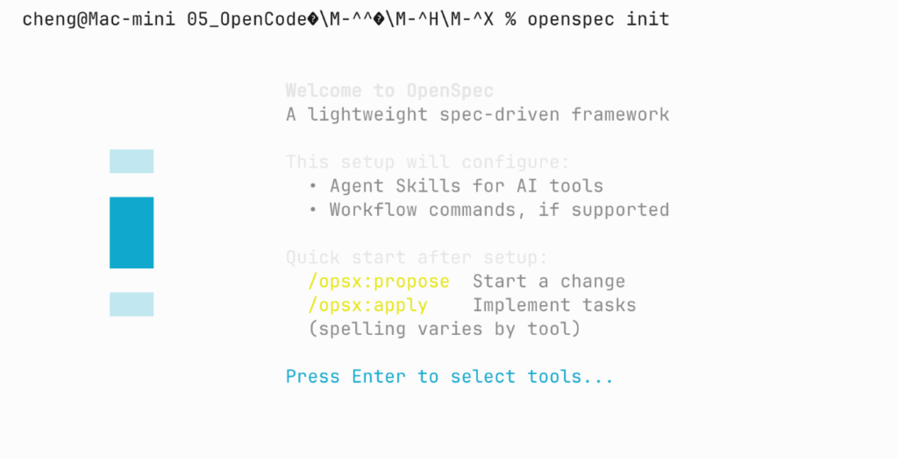
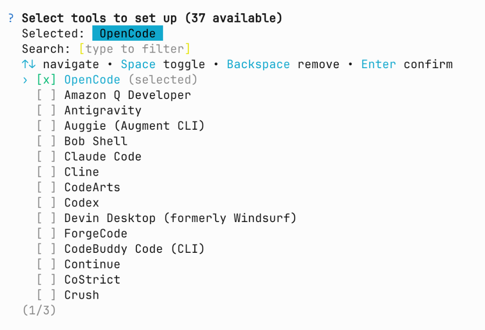
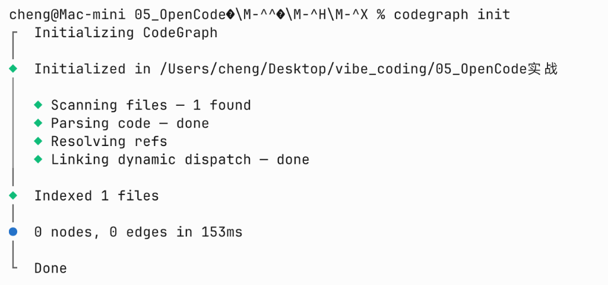
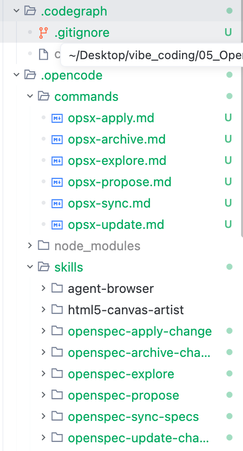

# 5.5 个人博客（上）：需求、接口与阶段计划

从单文件页面走到博客系统，数据需要跨页面、跨刷新保存，前后端也需要约定传什么、返回什么。本节先确定功能范围和接口约定，再把开发拆成四个可分别验收的阶段。

---

## 从“街头泥瓦匠盲盖”到“现代化数字装配式建筑”

如果把传统的全栈写代码比作**街头泥瓦匠盖房子**（想到哪砌到哪，改二楼客厅时把一楼承重墙砸穿了都没发觉），那么我们这一套结合了 OpenSpec 与 CodeGraph 的 Vibe Coding 全栈工作流就是**现代化数字装配式建筑工程队**：

<!-- 图表源文件：img/diagrams/05-diagram-01.mmd；视觉风格：Pastel 多巴胺 -->
<p align="center">
  <a href="img/diagrams/05-diagram-01.svg">
    
  </a>
</p>

- 📐 **OpenSpec（施工蓝图与验收规程）**：就像盖楼前必须先出的**正规工程图纸与质检标准**。在动第一块砖（写业务代码）之前，必须先明确需求范围（Proposal）、数据模型（Schema）与接口契约（Specification），从根源杜绝 AI “胡思乱想与代码幻觉”；
- 🛰️ **CodeGraph（高精度 GPS 卫星导航与雷达）**：就像施工队的**地下管线雷达探测仪**。AI 不需要把整个城市掘地三尺（无脑 Read 全库文件撑爆上下文），而是通过抽象语法树精准定位函数与类的调用链路，“指哪打哪，命中即已读”；
- ⚡ **uv（超音速工程装配机）**：基于 Rust 编写的下一代 Python 工具，就像**快速吊装设备**，安装依赖比传统 pip 快 10 到 100 倍，免去手动配置虚拟环境的繁琐痛点；
- 📜 **AGENTS.md（总工程师的操作规范守则）**：为 AI 注入不可逾越的红线纪律（禁止私自 git commit、前后端分离规范等）。

***

## 准备工作 1：安装与配置 OpenSpec（规格驱动开发框架）

### 1. 什么是 OpenSpec？为什么要配置它？

- **官方权威链接**：[OpenSpec 官方 GitHub 仓库](https://github.com/Fission-AI/openspec)
- **痛点场景**：在使用大模型编写稍大一些的项目时，AI 往往会“想到哪写到哪”，容易遗漏边界情况，甚至在修改新功能时不小心破坏了已有的旧功能。
- **核心功能**：[OpenSpec](https://github.com/Fission-AI/openspec) 是一套专为 AI Coding Agent 设计的**轻量级规格驱动开发（Spec-Driven Development, SDD）框架**。它将开发流程严格拆分为：
  1. **Propose（提出变更与设计规范）**：生成包含 `proposal.md`、`spec.md`、`design.md`、`tasks.md` 的四件套制品；
  2. **Apply（按步骤执行实现）**：严格按照 `tasks.md` 逐条敲定代码与测试；
  3. **Sync & Archive（同步与归档）**：将变更增量合并回主系统规格库，沉淀清晰的项目演进历史。

#### OpenSpec「四件套」职责速查表

| 制品文件              | 回答的问题         | 核心内容                                                |
| :---------------- | :------------ | :-------------------------------------------------- |
| **`proposal.md`** | 为什么改（Why）     | 变更背景、业务目标、技术边界、备选方案取舍                               |
| **`spec.md`**     | 要做什么（What）    | 验收标准与 Given-When-Then 行为场景（WHEN…THEN…），AI 照着它写测试与实现 |
| **`design.md`**   | 怎么做（How）      | 技术选型、架构设计、数据模型、关键实现路径                               |
| **`tasks.md`**    | 按什么顺序做（Order） | 可勾选的任务清单 `- [ ]`，一步一验，全部打勾 `- [x]` 即本变更完成           |

> 💡 **节奏建议**：这四件套严格遵循「先 Why/What 后 How/Order」的推导顺序。**Propose 阶段只写文档、禁止写业务代码**，等规格被认可后再进入 Apply 逐条实现，从根源上避免 AI “想到哪写到哪”。

### 2. 全局安装 OpenSpec CLI

在终端中执行以下命令进行全局安装：

```bash
# 使用 npm 全局安装
npm install -g @fission-ai/openspec

# 或使用 bun 全局安装（速度更快）
bun add -g @fission-ai/openspec
```

安装完成后，可以在终端运行 `openspec --version` 验证安装成功。

### 3. 执行初始化：`openspec init`

打开终端，进入当前工作区根目录，运行初始化命令：

```bash
openspec init
```

执行后，终端会出现交互式欢迎配置界面：



按下回车键（`Enter`）进入工具选择列表。在支持的工具列表中（共 37+ 种 AI 编程工具），通过上下方向键移动光标，按下空格键（`Space`）选中 **`[x] OpenCode`**，然后按回车确认：



### 4. 初始化后的结构变化

初始化完成后，OpenSpec 会自动为 OpenCode 配置专属的指令集与技能包：

- 📁 **`.opencode/commands/`**：新增 `/opsx-propose`、`/opsx-apply`、`/opsx-explore`、`/opsx-update`、`/opsx-sync`、`/opsx-archive` 等快捷 Slash Commands；
- 📁 **`.opencode/skills/`**：自动注入 `openspec-propose`、`openspec-apply-change` 等标准化智能体技能包。

***

## 准备工作 2：安装与配置 CodeGraph（代码语义图谱）

### 1. 什么是 CodeGraph？为什么要配置它？

- **官方权威链接**：[CodeGraph MCP 官方代码仓](https://github.com/colbymchenry/codegraph)
- **痛点场景**：大模型在不了解代码全貌时，经常使用全库 `grep` 或盲目 `read_file` 读取几十个文件，不仅耗费巨量 Token、拖慢响应速度，还会导致上下文窗口过载而产生幻觉。
- **核心功能**：[CodeGraph](https://github.com/colbymchenry/codegraph) 是一款专为 AI 打造的**轻量级代码语义图谱工具**。它基于 Tree-sitter 语法分析器扫描整个项目，将所有文件中的**函数、类、接口、变量及其相互调用关系**构建成一张拓扑知识图谱。
- **核心原则**：AI 仅需调用 `mcp_codegraph` 的 `codegraph_explore` 工具，传入符号名称或问题，就能精准获取该符号的定义与引用依赖。**命中符号即视为已读，无需再重复全文读取，大幅节省 80% 以上的上下文消耗。**

### 2. 全局安装 CodeGraph CLI

CodeGraph 提供官方一键脚本与 npm 全局包两种方式，按你的操作系统任选其一：

#### macOS / Linux：

```bash
# 方式一：官方一键安装脚本（推荐，自带运行时，无需 Node.js）
curl -fsSL https://raw.githubusercontent.com/colbymchenry/codegraph/main/install.sh | sh

# 方式二：已有 Node.js 环境，直接全局安装
npm install -g @colbymchenry/codegraph
```

#### Windows：

```powershell
# 方式一：官方一键安装脚本
irm https://raw.githubusercontent.com/colbymchenry/codegraph/main/install.ps1 | iex

# 方式二：已有 Node.js 环境，直接全局安装
npm install -g @colbymchenry/codegraph
```

安装完成后，在终端运行 `codegraph --version`，出现类似 `1.5.0` 即表示安装成功。

> 💡 **推荐**：再运行一次交互式安装器 `codegraph install`，它会自动检测你已安装的 AI 编程工具（Claude Code / Cursor / Codex CLI / opencode 等），并自动写入 MCP 服务器配置（即 [5.2 节](./02_高级配置：MCP、Skills及omo_slim.md) 中 `codegraph serve --mcp` 的挂载）。

### 3. 执行初始化：`codegraph init`

在当前项目或工作区终端中，直接运行：

```bash
codegraph init
```

`codegraph init` 执行完成后，CodeGraph 会\*\*立即在后台启动守护进程（Daemon）并自动同步（Auto-Sync）\*\*项目代码图谱——之后每次保存代码都会自动增量同步，无需手动重建索引（机制详见下方「4. 初始化后自动同步」）。首次运行时终端将快速扫描项目文件并构建代码引用拓扑网：



构建完成后，可以在 VS Code / OpenCode 左侧文件树中查看到生成的 `.codegraph/` 数据库与 `.opencode/` 技能树：



### 4. 初始化后自动同步（Auto-Sync）：一次初始化，全程免维护

`codegraph init` 完成首次全量扫描后，并不会就此“一锤子买卖”。CodeGraph 会在后台常驻一个**守护进程（Daemon）**，并开启**文件监听（File Watcher）**，之后你（或 AI）每保存一次代码，它都会自动把变更增量同步进代码图谱：

- 🕵️ **文件监听常驻**：守护进程会实时监听项目内文件的新增、修改与删除，日志中会输出 `File watcher active — graph will auto-sync on changes`；
- ⚡ **毫秒级增量同步**：每次代码变更只重扫受影响的文件，日志输出形如 `Auto-synced 1 file(s) in 5ms`，几乎无感，完全无需手动重建索引；
- 🔁 **确认图谱与代码一致**：同步完成后再通过 `codegraph_explore` 查询；若结果与当前文件不符，应先检查索引状态并重新构建。

初始化后，项目根目录下会生成如下 `.codegraph/` 目录：

```text
.codegraph/
├── codegraph.db        # 🗄️ SQLite 代码语义图谱索引库（核心数据）
├── codegraph.db-wal    # 预写日志（WAL，保证并发写入安全）
├── codegraph.db-shm    # 共享内存索引（Shared Memory）
├── daemon.pid          # 后台守护进程 PID
└── daemon.log          # 守护进程日志（可查看 Auto-Sync 同步记录）
```

> 💡 **提示**：`.codegraph/` 属于本地索引产物，CodeGraph 初始化时会自动生成 `.gitignore` 忽略规则，因此它不会进入版本库，无需手动处理。

***

## 准备工作 3：安装与配置 uv（下一代快速 Python 管理器）

### 1. 什么是 uv？为什么要淘汰传统 pip/venv？

- **官方网站**：<https://docs.astral.sh/uv/>
- **GitHub 仓库**：<https://github.com/astral-sh/uv>
- **核心优势**：
  - 🏎️ **性能**：由知名团队 Astral（Ruff 的作者）采用 **Rust** 从零重构，包解析与安装速度比传统 `pip` / `pip-tools` 快 **10 到 100 倍**；
  - 🧰 **通用合一**：集 Python 版本管理、虚拟环境创建、依赖锁定（`pyproject.toml` + `uv.lock`）、脚本运行于一体；
  - 🪄 **零激活门槛**：告别 `source .venv/bin/activate` 或 Windows 下繁琐的脚本激活，直接通过 `uv run <命令>` 即可在隔离环境中秒级执行。

### 2. uv 跨平台快速安装

根据你的操作系统，在终端运行以下安装命令：

#### macOS / Linux：

```bash
# 官方一键安装脚本（推荐）
curl -LsSf https://astral.sh/uv/install.sh | sh

# 或者使用 Homebrew 安装
brew install uv
```

#### Windows：

```powershell
# PowerShell 一键安装脚本
powershell -c "irm https://astral.sh/uv/install.ps1 | iex"

# 或者使用 Scoop / Winget
winget install --id=astral-sh.uv -e
```

安装完成后，在终端运行 `uv --version`，出现类似 `uv 0.6.x` 即表示安装成功。

### 3. 项目快速初始化实操

进入项目目录 `05_OpenCode实战/project_03_个人博客系统`，执行两步走：

```bash
# 1. 初始化 Python 3.12 项目
uv init --python 3.12

# 2. 极速添加项目核心依赖（FastAPI、Uvicorn、SQLAlchemy）
uv add fastapi uvicorn sqlalchemy
```

***

## 打磨项目专属项目规则：`AGENTS.md` 解析

为了确保 AI 在后续实战中严格遵守前后端分层、规格先行等高质量工程规范，我们在 `05_OpenCode实战/` 目录下建立了专属的 **`agents.md`**：

```markdown
# AGENTS.md

> 规则分工：开发代码按本文件执行；撰写教学文档按根目录 agents.md 执行。
> 项目代码位于 project_03_个人博客系统（uv 管理，Python 3.12）。

## 一、技术栈
- 后端：FastAPI + uvicorn + SQLite（内置，单文件 blog.db），ORM 用 SQLAlchemy
- 前端：单文件 HTML5 + TailwindCSS（CDN）+ 原生 JS + Marked.js，无 npm/构建链
- 依赖管理：uv（uv add / uv run），禁止手写 venv/pip

## 二、开发工作流（阶段式：CodeGraph 查询 → OpenSpec 规划 → ATDD 实现）

0. **阶段式推进（先行）**：项目按 [docs/](./project_03_个人博客系统/docs/README.md) 阶段蓝图（phase_01~04）分阶段开发，**一个阶段一个完整闭环**：
   - 动手前先读 `docs/README.md` 确认当前阶段目标；
   - 每阶段严格走：`/opsx-explore` 探索本阶段 → `/opsx-propose` 生成该阶段四件套 → `/opsx-apply` 实现+验收 → `/opsx-sync` / `/opsx-archive` 收尾；
   - 阶段内每个功能仍遵守 ATDD（验收测试先行）；
   - 完成本阶段并勾选对应 `docs/phase_*.md` 核对清单后，才可进入下一阶段；**禁止跳阶段、禁止跨阶段一次性开发**。

1. **查询**：先调用 `mcp_codegraph` 的 `codegraph_explore`（`query` 传符号/文件名/问题，`projectPath` 传项目路径）。命中符号即视为已读，不再重复 Read。禁止盲目全库搜索。
2. **规划**：`/opsx-propose` 生成四件套：`proposal.md`（why）、`specs/*/spec.md`（what，含 WHEN/THEN 验收场景）、`design.md`（how）、`tasks.md`（任务清单）。此阶段**禁止写业务代码**。
3. **ATDD**：先把 specs 中的 Scenario 写成可执行验收测试（后端 `pytest`+TestClient，前端 `agent-browser`），再写实现。顺序：测试红 → 实现绿 → 重构。
4. **实现**：`/opsx-apply` 按 tasks.md 逐条实现，每完成一个任务跑通测试并勾选 `- [x]`。遇「任务不清/设计缺陷/报错」→ 暂停询问，禁止硬猜。
5. **收尾**：需求变更 → `/opsx-update`；完成 → `/opsx-sync` 合并 delta 规格 → `/opsx-archive` 归档（先 `openspec validate`）。

## 三、纪律红线
- 禁止未经用户明确授权执行 git commit；
- 禁止虚构官方链接与技术细节。
```

***

## 核心：为什么要对全栈项目进行「阶段拆分」？

在接触大型或全栈项目时，初学者最常犯的错误就是给 AI 发送一段长 prompt：“*帮我写一个个人博客，包含后端、数据库、前端、Markdown 和增删改查全部功能。*”

一次要求完成所有阶段，会让需求、接口和验收混在一起。这里引入 `docs/` 分阶段推进，主要基于两项原则：

<!-- 图表源文件：img/diagrams/05-diagram-02.mmd；视觉风格：Stripe 紫蓝 -->
<p align="center">
  <a href="img/diagrams/05-diagram-02.svg">
    
  </a>
</p>

### 1. 方便分步验收与快速回滚（降低试错与排错成本）

- **痛点**：如果一次性把 ORM、API 路由、CORS、TailwindCSS 页面和 Markdown 渲染器全写完，一旦页面打不开或数据无法写入，你根本无法快速判断是 SQLite 连接池未释放、Pydantic 校验拦截、CORS 跨域阻断还是前端 DOM 渲染异常。
- **解法**：阶段拆分后，每个阶段产物清晰独立：
  - **Phase 1** 锁定数据表与 API 契约；
  - **Phase 2** 专注把后端接口调通（通过 Swagger UI 验证）；
  - **Phase 3** 专注打磨前端视觉与 Markdown 交互；
  - **Phase 4** 前后端合体联调。
  - **收益**：哪一步出问题就优先检查该阶段，同时验证它是否影响其他模块。

### 2. 减少长任务中的上下文遗漏

- **技术本质**：当前使用的是免费模型，上下文窗口只有 200k Token 左右。当项目代码量逐渐膨胀，如果把整个项目的所有上下文一股脑塞给 AI，大模型会出现严重的**注意力漂移（Attention Drift）与指令遗忘**；
- **工程习惯养成**：虽然我们当前的极简博客系统体积轻量（200k 上下文完全充裕），但**我们必须借此养成正规长项目、大工程的 Vibe Coding 阶段驱动的工作方式**。唯有掌握了按阶段规划、按模块推进的工程能力，未来面对几万、几十万行代码的企业级系统重构时，你才能从容不迫地调度 AI。

***

## 阶段拆分落地：`project_03_个人博客系统/docs/` 工程蓝图

基于上述原则，我们在 `05_OpenCode实战/project_03_个人博客系统/docs/` 下沉淀了清晰的 4 大阶段工程推进文档：

```
project_03_个人博客系统/
├── docs/                         # 📚 OpenSpec 阶段实施推进文档库
│   ├── README.md                 # 实施阶段总览与推进路线图
│   ├── phase_01_规格定义与API契约.md  # 阶段一：极简目录结构、SQLite 单表与 RESTful API 契约
│   ├── phase_02_后端工程与数据持久化.md # 阶段二：FastAPI + SQLAlchemy + SQLite CRUD 实现
│   ├── phase_03_响应式前端与Markdown引擎.md # 阶段三：TailwindCSS + Marked.js 单页交互
│   └── phase_04_全链路联调与验收交付.md # 阶段四：前后端联调与功能自测交付
├── pyproject.toml                # ⚡ uv 依赖管理配置
└── README.md                     # 📖 项目快速启动说明
```

### Phase 1 确立的核心契约速览：

1. **数据模型 (`posts`** **表)**：
   - 字段包含：`id`（自增主键）、`title`（标题）、`content`（Markdown 正文）、`category`（分类）、`tags`（标签）、`status`（状态：published/draft）、`views`（阅读量）、`created_at`、`updated_at`；
2. **6 个核心 RESTful CRUD 接口**：
   - `GET /api/posts`：获取文章列表（支持分类、状态、搜索词过滤）
   - `GET /api/posts/{id}`：获取文章详情（阅读量自增）
   - `POST /api/posts`：发布新文章（返回 201）
   - `PUT /api/posts/{id}`：编辑修改文章
   - `DELETE /api/posts/{id}`：安全删除文章（返回 204）
   - `GET /api/categories`：获取全站分类列表及文章计数

***

## 每个阶段要留下什么

分阶段开发像装修时分别验收水电、墙面和家具。关键是每一阶段都有可检查的结果，而不是把同一项模糊任务拆成几句提示词。

| 阶段 | 开始前需要明确 | 完成时应留下 |
| --- | --- | --- |
| 规格与接口 | 文章字段、必填项、错误格式 | 请求和响应示例、验收场景 |
| 后端与存储 | 已确认的接口约定 | 能独立验证的接口与持久化记录 |
| 页面与交互 | 接口返回的数据形状 | 表单、列表、详情及失败提示 |
| 联调与交付 | 前后端各自验证结果 | 完整操作记录、启动说明和已知限制 |

例如“删除文章”需要同时约定：删除不存在的文章返回什么，删除后列表如何更新，用户取消确认时是否发请求。提前写清这些情况，可以减少前后端各自猜测。

阶段中出现新需求时，先判断是否影响当前接口。如果只是调整按钮颜色，可以放进页面阶段；如果要新增草稿状态，就要检查数据模型、列表过滤和访问权限，更新相关约定后再继续。

规格归档表示把已完成的需求整理入记录；Git 提交保存的是代码版本。两者用途不同，也不会相互替代。按本项目约定，提交必须由用户明确授权，不能把“阶段结束”视作自动提交指令。

## 先冻结接口约定，再让 Agent 编写实现

前后端并行前，先确定双方共同依赖的部分：文章字段、状态取值、请求方法、成功状态码和错误结构。这里的“冻结”不是以后永远不能改，而是变更时要先更新约定，再同步所有调用方，不能让页面和接口各自猜测。

例如新增 `draft` 状态，会同时影响数据库默认值、创建接口、列表过滤、详情权限和页面标签。可以在阶段计划中列出受影响位置，并为每项写一个验收场景。这样 Agent 生成代码时有明确边界，审查者也能判断是否遗漏。

每个阶段结束后保存三类证据：实际请求与响应样例、对应的自动检查结果、人工完成一次操作的记录。若某项暂时无法验证，应直接写进已知限制，不要用“代码已经生成”代替“功能已经完成”。

---

## 本节回顾

四个阶段分别留下接口约定、后端实现、页面交互和联调结果。需求变化时更新受影响的约定，再继续实现。

继续阅读：[5.6 个人博客（下）：实现、联调与交付](./06_极简全栈_FastAPI与SQLite个人博客实战%28下%29.md)。
