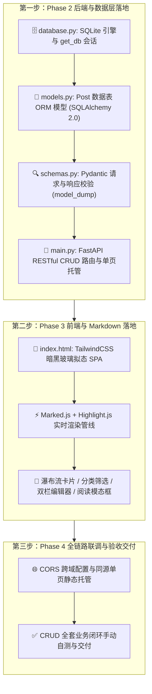
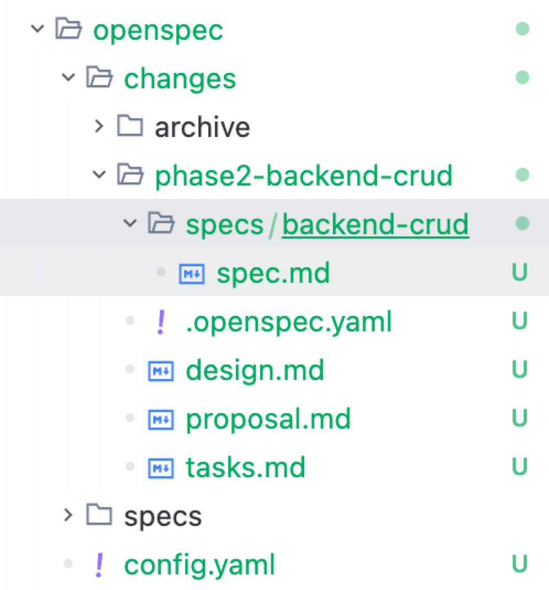
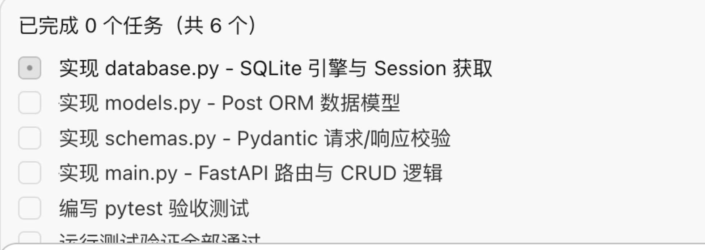
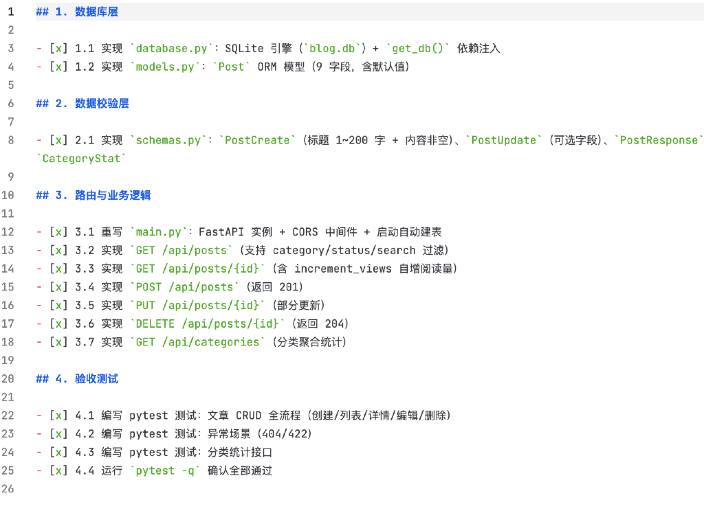
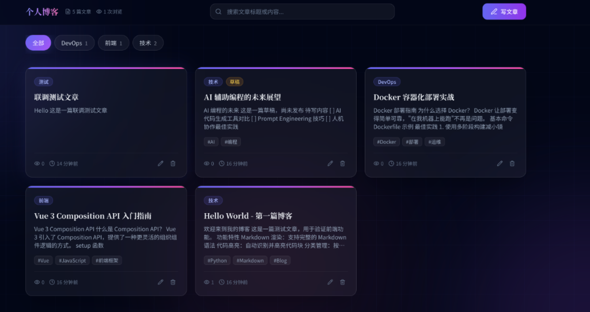
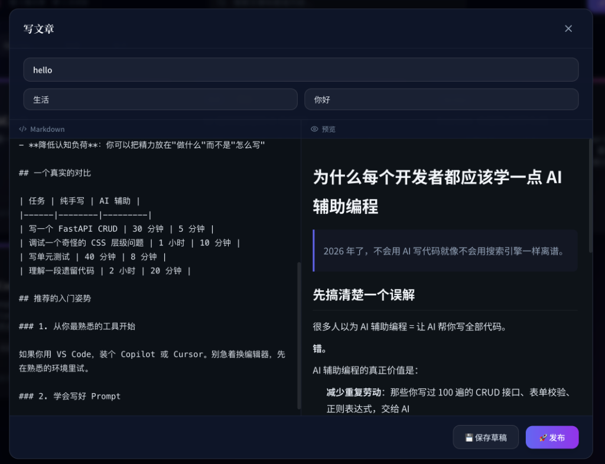
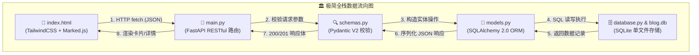

# 5.6 极简全栈实战（下）：前后端编码落地与全链路交付

> **本节导读**：在 [5.5 极简全栈实战（上）](./05_极简全栈_FastAPI与SQLite个人博客实战\(上\).md) 中，我们已经完成了 OpenSpec、CodeGraph、uv 与 `AGENTS.md` 的环境准备，并深刻理解了**阶段拆分（Phase Breakdown）对验收回滚与大模型上下文管理的核心价值，在** **`docs/`** **目录下完成了 4 大阶段工程蓝图的规划。
> 本节我们将正式开启**代码编写与全栈落地实战！我们将向 AI 下达阶段推进指令、深度拆解 OpenSpec 自动生成的规格四件套与任务清单、启动全栈服务体验高质感暗黑玻璃拟态博客，并逐一剖析 FastAPI 后端、SQLAlchemy 2.0 ORM、SQLite 持久化与 Markdown 渲染的核心代码实现！

***

## 🗺️ 一、全栈编码推进路线图

按照在 `docs/` 中确立的极简 5 文件分工，我们将分步推进实现：



***

## 📜 二、开发规则升级：适配阶段式推进的 `AGENTS.md`

因为我们拆分了阶段进行开发，为了彻底杜绝 AI 智能体“自作聪明跨阶段一次性开发完毕”，我们在 `05_OpenCode实战/agents.md` 中同步对开发工作流进行了规则改造，新增了 **「0. 阶段式推进（先行）」** 的刚性约束：

```markdown
## 二、开发工作流（阶段式：CodeGraph 查询 → OpenSpec 规划 → ATDD 实现）

0. **阶段式推进（先行）**：项目按 [docs/](./project_03_个人博客系统/docs/README.md) 阶段蓝图（phase_01~04）分阶段开发，**一个阶段一个完整闭环**：
   - 动手前先读 `docs/README.md` 确认当前阶段目标；
   - 每阶段严格走：`/opsx-explore` 探索本阶段 → `/opsx-propose` 生成该阶段四件套 → `/opsx-apply` 实现+验收 → `/opsx-sync` / `/opsx-archive` 收尾；
   - 阶段内每个功能仍遵守 ATDD（验收测试先行）；
   - 完成本阶段并勾选对应 `docs/phase_*.md` 核对清单后，才可进入下一阶段；**禁止跳阶段、禁止跨阶段一次性开发**。

1. **查询**：先调用 `mcp_codegraph` 的 `codegraph_explore`（`query` 传符号/文件名/问题，`projectPath` 传项目路径）。命中符号即视为已读，不再重复 Read。禁止盲目全库搜索。
2. **规划**：`/opsx-propose` 生成四件套：`proposal.md`（why）、`specs/*/spec.md`（what，含 WHEN/THEN 验收场景）、`design.md`（how）、`tasks.md`（任务清单）。此阶段**禁止写业务代码**。
3. **ATDD**：先把 specs 中的 Scenario 写成可执行验收测试（后端 `pytest`+TestClient，前端 `agent-browser`），再写实现。顺序：测试红 → 实现绿 → 重构。
4. **实现**：`/opsx-apply` 按 tasks.md 逐条实现，每完成一个任务跑通测试并勾选 `- [x]`。遇「任务不清/设计缺陷/报错」→ 暂停询问，禁止硬猜。
5. **收尾**：需求变更 → `/opsx-update`；完成 → `/opsx-sync` 合并 delta 规格 → `/opsx-archive` 归档（先 `openspec validate`）。
```

有了这层规则大脑的强力约束，AI 在执行任务时将严格遵循“**读阶段蓝图 $\rightarrow$ 逐阶段交付 $\rightarrow$ 勾选清单验收**”的标准工业节奏，绝不越雷池一步！

***

## 🚀 三、阶段驱动实战：如何向 AI 下达推进指令？

现在我们开始正式推进项目。在 OpenCode 中新建对话，直接向 AI 发送指令：

> 💬 **向 AI 发送阶段推进指令**：
>
> ```text
> 05_OpenCode实战/project_03_个人博客系统/docs/phase_01_规格定义与API契约.md
> 进行阶段性开发和推进
> ```

### 💡 为什么 01 文档没有自动生成 OpenSpec？

在实际推进过程中，你会发现 `docs/phase_01_规格定义与API契约.md` 并没有直接触发生成 `openspec/` 目录：

- **原因**：`phase_01` 本身就是一份**全局基础规格与目录定义文档**（已确立了 5 核心文件分工、SQLite 单表与 RESTful API 契约）；
- **操作建议**：你可以让 AI 针对 Phase 1 补充一次形式上的 OpenSpec 流程，也可以**直接跳过 01，让 AI 从 Phase 2（后端核心与数据库持久化）正式开启 OpenSpec 规格驱动推进**！

***

## 📦 四、OpenSpec 规格四件套与任务拆解深度剖析

当我们让 AI 推进 Phase 2 后端开发时，AI 会在项目根目录下自动创建 `openspec/` 变更集并拆解任务：



### 1. OpenSpec 阶段四件套结构解析

在 `openspec/changes/phase2-backend-crud/` 目录下，AI 自动生成了以下标准化制品：

- 📄 **`.openspec.yaml`**：记录当前变更集的唯一 ID、Schema 版本与阶段元数据；
- 📄 **`proposal.md`**：阐述 Phase 2 的实施背景、业务目标与技术边界；
- 📄 **`design.md`**：确定 FastAPI + SQLAlchemy 2.0 ORM + SQLite 的架构设计与 Session 会话生命周期方案；
- 📁 **`specs/backend-crud/spec.md`**：定义详细的验收标准与 Given-When-Then 行为场景；
- 📄 **`tasks.md`**：将后端落地细化为清晰有序的任务清单。

### 2. 任务清单 `tasks.md` 拆解全貌

AI 在 `tasks.md` 中不仅拆解了业务代码实现步骤，还**自觉多出了自动化测试的步骤**：

```markdown
## 1. 数据库层

- [ ] 1.1 实现 `database.py`：SQLite 引擎（`blog.db`）+ `get_db()` 依赖注入
- [ ] 1.2 实现 `models.py`：`Post` ORM 模型（9 字段，含默认值）

## 2. 数据校验层

- [ ] 2.1 实现 `schemas.py`：`PostCreate`（标题 1~200 字 + 内容非空）、`PostUpdate`（可选字段）、`PostResponse`、`CategoryStat`

## 3. 路由与业务逻辑

- [ ] 3.1 重写 `main.py`：FastAPI 实例 + CORS 中间件 + 启动自动建表
- [ ] 3.2 实现 `GET /api/posts`（支持 category/status/search 过滤）
- [ ] 3.3 实现 `GET /api/posts/{id}`（含 increment_views 自增阅读量）
- [ ] 3.4 实现 `POST /api/posts`（返回 201）
- [ ] 3.5 实现 `PUT /api/posts/{id}`（部分更新）
- [ ] 3.6 实现 `DELETE /api/posts/{id}`（返回 204）
- [ ] 3.7 实现 `GET /api/categories`（分类聚合统计）

## 4. 验收测试

- [ ] 4.1 编写 pytest 测试：文章 CRUD 全流程（创建/列表/详情/编辑/删除）
- [ ] 4.2 编写 pytest 测试：异常场景（404/422）
- [ ] 4.3 编写 pytest 测试：分类统计接口
- [ ] 4.4 运行 `pytest -q` 确认全部通过
```

### 3. AI 自动执行与任务推进状态

在开发过程中，AI 会在左侧或弹窗中展示实时任务进度（从 0/6 逐步推进）：



等待 AI 逐步编写代码并运行测试，当所有测试通过后，`tasks.md` 将全线变成绿色打勾状态 `[x]`：


***

## 🛡️ 五、人工验收、归档与 Git 提交全流程

当一个阶段的所有任务全部打勾后，请牢记以下原则：

1. **人工验收与归档**：
   - 尽管在这个轻量博客项目中，AI 可能会由于逻辑简单顺畅而自动完成测试与验收，但**在真实工程中，我们必须人工检查一下核心接口与生成的文件**；
   - 确认无误后执行 `/opsx-sync` 与 `/opsx-archive` 完成规格归档，也可以让 AI 协助归档。
2. **Git 本地化提交（打 Checkpoint）**：
   - 完成一个阶段后，在终端手动执行一次 `git add .` 与 `git commit -m "feat(phase2): complete backend crud and sqlite persistence"`（有关 Git 的详细用法，可回顾 [2.2 Git 与 GitHub 极速入门](../02_概念扫盲/02_Git与GitHub极速入门.md)）；
   - **核心价值**：这就好比单机游戏中的“**存档点（Save Point）**”。后续如果前端开发（Phase 3）或联调（Phase 4）改乱了代码，你可以一键回滚到 Phase 2 的稳定状态，拥有绝对的安全感！
3. **后续阶段推进**：
   - 紧接着对 AI 发送指令推进 `docs/phase_03_响应式前端与Markdown引擎.md` 与 `docs/phase_04_全链路联调与验收交付.md`，执行流程完全一致。

***

## 🌐 六、启动全栈项目与真机体验

当 4 个阶段全部交付完毕后，我们来启动项目进行真机体验！

### 1. 终端启动服务

在终端中进入项目目录，执行以下命令：

```bash
cd project_03_个人博客系统
uv run uvicorn main:app --reload --port 8000
```

### 2. 浏览器访问主页

在浏览器地址栏输入：**`http://127.0.0.1:8000`**（也就是大名鼎鼎的本地服务器 `localhost:8000`）。

你将看到一个**极高质感的暗黑极客风格个人博客系统**：



- **顶部导航**：展示全站文章数、总阅读量统计、全局实时搜索框与紫蓝渐变「✍️ 写文章」按钮；
- **分类标签胶囊**：动态拉取分类（全部、DevOps、前端、技术等），点击即时过滤；
- **瀑布流文章卡片**：展示分类 Badge、草稿/发布状态、标题、正文摘要、阅读量、发布时间以及编辑 ✏️ / 删除 🗑️ 按钮。

> 💡 **顺带一提**：FastAPI 会自动生成交互式 API 文档，在浏览器访问 **`http://127.0.0.1:8000/docs`**（Swagger UI），即可可视化调试全部 RESTful 接口（增删改查、分类统计），无需 Postman 也能一键验证后端契约。

### 3. 写文章与实时 Markdown 预览

点击右上角「✍️ 写文章」，弹出双栏创作工坊模态框：



- **左侧输入**：输入文章标题、分类、标签，并在左栏输入 Markdown 正文；
- **右侧预览**：监听键盘输入，毫秒级实时将 Markdown 解析渲染为排版精美的富文本（含代码高亮、表格、引用块）；
- **操作闭环**：支持「💾 保存草稿」或「🚀 发布」，点击发布后首页卡片流即时刷新！

### 4. 常见启动报错排查

| 报错现象                                             | 常见原因                  | 快速解法                                               |
| :----------------------------------------------- | :-------------------- | :------------------------------------------------- |
| `Address already in use` / 端口被占用                 | 8000 端口被其他进程占用        | 换端口：`uv run uvicorn main:app --reload --port 8001` |
| `ModuleNotFoundError: No module named 'fastapi'` | 依赖未安装（可能误用了系统 Python） | 统一用 `uv run` / `uv add` 管理，不要混用 `pip`              |
| 打开页面白屏 / 接口 404                                  | 服务未启动或路由未挂载           | 确认终端进程在运行；API 前缀统一为 `/api/...`                     |
| 写入数据后刷新丢失                                        | `blog.db` 路径或磁盘写入权限问题 | 确认数据库文件生成在项目根目录，检查目录写权限                            |

***

## 🔍 七、核心代码深度剖析与极简架构解析

整个博客系统仅由 5 个核心文件构成，结构极其扁平清爽。我们来重点剖析其最新的核心代码实现细节：



### 1. 数据库连接与会话生命周期：`database.py`

```python
# project_03_个人博客系统/database.py
from sqlalchemy import create_engine
from sqlalchemy.orm import sessionmaker

SQLALCHEMY_DATABASE_URL = "sqlite:///./blog.db"

# connect_args 设置 check_same_thread=False，允许 FastAPI 异步多线程安全访问 SQLite
engine = create_engine(
    SQLALCHEMY_DATABASE_URL,
    connect_args={"check_same_thread": False},
)

SessionLocal = sessionmaker(autocommit=False, autoflush=False, bind=engine)


def get_db():
    """FastAPI 依赖注入：每个请求自动创建独立会话，处理完毕后自动关闭释放连接"""
    db = SessionLocal()
    try:
        yield db
    finally:
        db.close()
```

- 💡 **关键点**：`get_db()` 是一个 Python 生成器（`yield`），配合 FastAPI 的 `Depends(database.get_db)` 能够保证无论请求处理成功还是抛出异常，数据库连接都一定会安全关闭，杜绝连接泄露。

### 2. ORM 数据实体定义：`models.py`

采用现代 SQLAlchemy 2.0 的 `Mapped` 与 `mapped_column` 类型注解风格：

```python
# project_03_个人博客系统/models.py
from datetime import datetime
from sqlalchemy import Integer, String, Text
from sqlalchemy.orm import DeclarativeBase, Mapped, mapped_column


class Base(DeclarativeBase):
    pass


class Post(Base):
    __tablename__ = "posts"

    id: Mapped[int] = mapped_column(Integer, primary_key=True, autoincrement=True)
    title: Mapped[str] = mapped_column(String(200), nullable=False)
    content: Mapped[str] = mapped_column(Text, nullable=False)
    category: Mapped[str] = mapped_column(String(50), default="默认分类")
    tags: Mapped[str] = mapped_column(String(200), default="")
    status: Mapped[str] = mapped_column(String(20), default="published")
    views: Mapped[int] = mapped_column(Integer, default=0)
    created_at: Mapped[datetime] = mapped_column(default=datetime.now)
    updated_at: Mapped[datetime] = mapped_column(
        default=datetime.now, onupdate=datetime.now
    )
```

- 💡 **关键点**：`DeclarativeBase` 是 SQLAlchemy 2.0 推荐的标准基类，`Mapped[...]` 结合 IDE 可以提供极强的静态类型提示；`onupdate=datetime.now` 会在记录每次被更新时自动刷新时间戳。

### 3. Pydantic 数据校验模式：`schemas.py`

```python
# project_03_个人博客系统/schemas.py
from datetime import datetime
from typing import Optional
from pydantic import BaseModel, Field


class PostCreate(BaseModel):
    title: str = Field(..., min_length=1, max_length=200)
    content: str = Field(..., min_length=1)
    category: str = "默认分类"
    tags: str = ""
    status: str = "published"


class PostUpdate(BaseModel):
    title: Optional[str] = Field(None, min_length=1, max_length=200)
    content: Optional[str] = Field(None, min_length=1)
    category: Optional[str] = None
    tags: Optional[str] = None
    status: Optional[str] = None


class PostResponse(BaseModel):
    id: int
    title: str
    content: str
    category: str
    tags: str
    status: str
    views: int
    created_at: datetime
    updated_at: datetime

    model_config = {"from_attributes": True}


class CategoryStat(BaseModel):
    category: str
    count: int
```

- 💡 **关键点**：
  - `PostCreate` 限制标题为 1\~200 字符且内容非空，不合法请求会在最外层被 FastAPI 自动拦截并返回 `422`；
  - `PostUpdate` 均为可选字段（`Optional`），支持局部字段修改；
  - `model_config = {"from_attributes": True}` 允许直接从 SQLAlchemy ORM 实例读取属性并序列化为 JSON 响应。

### 4. FastAPI RESTful 路由与静态托管：`main.py`

```python
# project_03_个人博客系统/main.py
from contextlib import asynccontextmanager
from pathlib import Path

import database
from fastapi import Depends, FastAPI, HTTPException, Query
from fastapi.middleware.cors import CORSMiddleware
from fastapi.responses import FileResponse
from sqlalchemy import func
from sqlalchemy.orm import Session

from models import Base, Post
from schemas import CategoryStat, PostCreate, PostResponse, PostUpdate

# 项目根目录（index.html 所在位置）
BASE_DIR = Path(__file__).resolve().parent


@asynccontextmanager
async def lifespan(app: FastAPI):
    """应用启动时自动建表"""
    Base.metadata.create_all(bind=database.engine)
    yield


app = FastAPI(title="个人博客系统", version="0.1.0", lifespan=lifespan)

# CORS 跨域配置
app.add_middleware(
    CORSMiddleware,
    allow_origins=["*"],
    allow_credentials=True,
    allow_methods=["*"],
    allow_headers=["*"],
)


# ────────────────────────── 前端页面 ──────────────────────────


@app.get("/")
def serve_index():
    """返回前端单页面"""
    return FileResponse(BASE_DIR / "index.html", media_type="text/html")


# ────────────────────────── 文章 CRUD ──────────────────────────


@app.get("/api/posts", response_model=list[PostResponse])
def get_posts(
    category: str | None = Query(None),
    status: str | None = Query(None),
    search: str | None = Query(None),
    db: Session = Depends(database.get_db),
):
    """获取文章列表，支持分类/状态/关键词过滤"""
    query = db.query(Post)
    if category:
        query = query.filter(Post.category == category)
    if status:
        query = query.filter(Post.status == status)
    if search:
        query = query.filter(
            Post.title.contains(search) | Post.content.contains(search)
        )
    return query.order_by(Post.created_at.desc()).all()


@app.get("/api/posts/{post_id}", response_model=PostResponse)
def get_post(
    post_id: int,
    increment_views: bool = Query(False),
    db: Session = Depends(database.get_db),
):
    """获取文章详情，可选自增阅读量"""
    post = db.query(Post).filter(Post.id == post_id).first()
    if not post:
        raise HTTPException(status_code=404, detail="文章不存在")
    if increment_views:
        post.views += 1
        db.commit()
        db.refresh(post)
    return post


@app.post("/api/posts", response_model=PostResponse, status_code=201)
def create_post(post_in: PostCreate, db: Session = Depends(database.get_db)):
    """发布新文章"""
    post = Post(**post_in.model_dump())
    db.add(post)
    db.commit()
    db.refresh(post)
    return post


@app.put("/api/posts/{post_id}", response_model=PostResponse)
def update_post(
    post_id: int, post_in: PostUpdate, db: Session = Depends(database.get_db)
):
    """修改编辑文章"""
    post = db.query(Post).filter(Post.id == post_id).first()
    if not post:
        raise HTTPException(status_code=404, detail="文章不存在")
    for field, value in post_in.model_dump(exclude_unset=True).items():
        setattr(post, field, value)
    db.commit()
    db.refresh(post)
    return post


@app.delete("/api/posts/{post_id}", status_code=204)
def delete_post(post_id: int, db: Session = Depends(database.get_db)):
    """删除文章"""
    post = db.query(Post).filter(Post.id == post_id).first()
    if not post:
        raise HTTPException(status_code=404, detail="文章不存在")
    db.delete(post)
    db.commit()


# ────────────────────────── 分类统计 ──────────────────────────


@app.get("/api/categories", response_model=list[CategoryStat])
def get_categories(db: Session = Depends(database.get_db)):
    """获取分类列表及文章数统计"""
    results = (
        db.query(Post.category, func.count(Post.id).label("count"))
        .group_by(Post.category)
        .all()
    )
    return [CategoryStat(category=r[0], count=r[1]) for r in results]
```

- 💡 **关键点**：
  - `Post(**post_in.model_dump())`：利用 Pydantic V2 的 `model_dump()` 将校验后的字典快速解包实例化为 ORM 模型；
  - `post_in.model_dump(exclude_unset=True)`：在更新时仅提取前端传递了修改值的字段，未传字段保持数据库原值不被覆盖；
  - 根路由 `@app.get("/")` 直接返回 `index.html`，做到了“后端即应用”，开发者无需额外部署 Nginx 或 Web 服务器，一个 `uvicorn` 命令直接启动整套全栈系统！

### 5. CORS 跨域：为什么「前后端分离」必须配置它？

浏览器有一条 **同源策略（Same-Origin Policy）** 安全规则：网页默认只能向「与自身同源」的地址发请求。本项目中 `index.html` 托管在 `127.0.0.1:8000`，如果它想直接请求**另一个端口/域名**的后端 API，就会被浏览器拦截。

FastAPI 通过 `CORSMiddleware` 显式声明“允许哪些来源跨域访问”：

```python
app.add_middleware(
    CORSMiddleware,
    allow_origins=["*"],        # 允许的来源（生产环境应换成具体域名，而非 *)
    allow_credentials=True,
    allow_methods=["*"],        # 允许的 HTTP 方法
    allow_headers=["*"],        # 允许的请求头
)
```

> 💡 **本项目为什么** **`allow_origins=["*"]`** **也安全？** 因为我们采用的是**同源单页托管**方案：前端 `index.html` 与后端 API 都跑在同一个 `uvicorn` 服务上（同一个域名、同一个端口），本质是「同源请求」，CORS 配置只是为将来分离部署预留的保险丝。

***

## 🌟 八、本章小结与 Vibe Coding 全栈模型

回顾整个个人博客系统的构建全流程，我们完整实践了业界顶尖的 Vibe Coding 阶段驱动工程范式：

| 实施阶段              | 核心任务                               | 交付产物                                                | 核心收益                   |
| :---------------- | :--------------------------------- | :-------------------------------------------------- | :--------------------- |
| **5.5 基建与规划 (上)** | 工具链装配、规则大脑与 `docs/` 阶段拆分           | `docs/phase_*.md` 蓝图                                | 锁死需求与契约，规避大模型幻觉与上下文衰减  |
| **Phase 2 后端实现**  | FastAPI 分层、ORM 实体与 SQLite 持久化      | `database.py`, `models.py`, `schemas.py`, `main.py` | 独立验证数据持久化与 RESTful API |
| **Phase 3 前端实现**  | TailwindCSS 暗黑单页与 Marked.js 实时双栏预览 | `index.html`                                        | 零 npm 构建，双击即用，高颜值视觉呈现  |
| **Phase 4 联调交付**  | 同源静态挂载、CORS 配置与 CRUD 闭环自测          | 完整运行的个人博客系统                                         | 前后端严密咬合，功能完整闭环         |

通过上、下两篇的系统化演练，你已经完全掌握了如何运筹帷幄地指挥 AI 智能体，从基础设施准备、工程阶段拆分规划，一步步稳健推进到高质量全栈系统交付！

***

## 🔗 九、官方权威与进阶学习资源

- **FastAPI 官方文档**：<https://fastapi.tiangolo.com/>
- **SQLAlchemy 2.0 官方指南**：<https://docs.sqlalchemy.org/en/20/>
- **SQLite 官方规范**：<https://www.sqlite.org/docs.html>
- **TailwindCSS 官方文档**：<https://tailwindcss.com/docs>
- **Marked.js 官方文档**：<https://marked.js.org/>
- **Highlight.js 官方代码仓**：<https://highlightjs.org/>
- **Astral uv 极速包管理器**：<https://docs.astral.sh/uv/>
- **OpenSpec 官方开源规范**：<https://github.com/Fission-AI/openspec>

