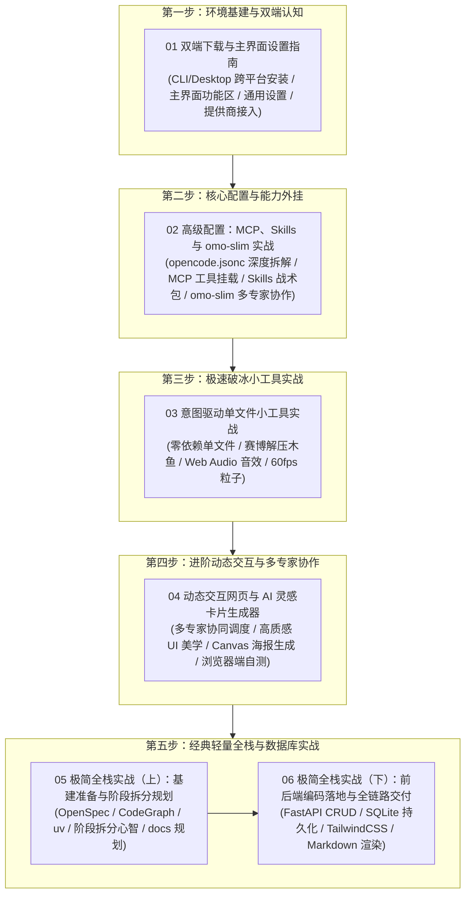

# 💻 第五章：OpenCode 实战 —— 新一代开源 AI 终端与多智能体意图编排

欢迎来到 **《Vibe Coding 极速通关》第五章：OpenCode 实战**！

在前面的章节中，我们学习了现代 AI 与 Agent 智能体的核心模型，掌握了低代码工作流平台 Dify 的编排逻辑。从本章开始，我们将正式步入**代码原生、终端与桌面协同的智能体实战主战场 —— OpenCode**！

> 🥾 **少谈概念，多动手实战**：只学概念不实战，无异于纸上谈兵！本章我们坚决奉行「实战先行」的原则——**先从一个最简单的单文件小工具做起**（双击即跑的赛博木鱼与番茄钟），再**一步步接触更复杂的场景**（多智能体协作 → 全栈工程），在真实项目中循序渐进、越战越勇，最终把概念真正内化成肌肉记忆！

***

## 🌟 为什么说 OpenCode 是 Vibe Coding 的中流砥柱？

[OpenCode](https://opencode.ai) 是当前开源 AI 编程领域最受瞩目的全能智能体开发平台之一。它不仅具备极度轻量、极致响应的特性，更带来了前所未有的自由度与可扩展性：

1. **开源透明与本地优先（Open Source & Local First）**：不再受制于单一闭源商业客户端的规则黑盒，所有配置、历史记录和行为完全掌握在自己手中；
2. **CLI 终端与 Desktop 桌面双端协同**：无论是服务器上的极速黑客操作，还是本地图形界面的直观代码 Diff 审查，一套配置双端通用；
3. **强大的多模型与中转路由生态**：原生支持 OpenAI、Anthropic、DeepSeek、Google Gemini 以及任意兼容 OpenAI 的第三方自建中转 API，随时无缝切换；
4. **无限外挂与多专家协作体系**：通过原生集成 **MCP（Model Context Protocol）** 协议、**Agent Skills** 技能包以及 **`oh-my-opencode-slim`** 多专家智囊团插件，OpenCode 可以化身为拥有总指挥（Orchestrator）、智囊（Oracle）、图书管理员（Librarian）、探路者（Explorer）、设计师（Designer）和修复师（Fixer）的超级六人开发天团！

***

## 🧭 第五章全景知识图谱



***

## 📑 章节目录导航

点击下方链接逐一阅读各小节的保姆级图文教程与深度剖析：

1. **[5.1 OpenCode 双端下载与主界面设置指南](./01_OpenCode双端下载与主界面设置指南.md)**
   - 认识 OpenCode 的双端架构（CLI 与 Desktop 协同）；
   - macOS / Windows / Linux 跨平台双端一键安装指南；
   - 桌面主界面结构深度拆解与功能分区全景图；
   - 设置中心保姆级实操（通用布局、语言、自动权限、思考模型推理摘要、模型提供商接入与 API 绑定）。
2. **[5.2 高级配置：`opencode.jsonc` 核心拆解、MCP、Skills 与 `omo-slim` 进阶](./02_高级配置：MCP、Skills及omo_slim.md)** 
   - 揭秘 OpenCode 的中枢控制脑：`opencode.jsonc` 字段逐行解析与超时调优防坑秘籍；
   - MCP（Model Context Protocol）工具扩展协议本地与远程配置；
   - Agent Skills 技能即插即用战术包挂载；
   - 深度解析 `oh-my-opencode-slim`（omo-slim）：为什么坚决弃用臃肿的原版 OMO 而选择 Slim？六大专家角色分工与白名单权限控制实战。
3. **[5.3 极速破冰：意图驱动单文件小工具实战（赛博解压木鱼 & 心流番茄钟）](./03_极速破冰_意图驱动单文件小工具实战.md)**
   - 体验“一句话动嘴即交付”，通过 Plan/Build 双模对齐与交付，利用 `.opencode/skills/` 中的 `single-file-app` 与 `html5-canvas-artist` 打造兼具 Web Audio 原生合成音效、60fps Canvas 霓虹粒子与 LocalStorage 本地持久化的免依赖单文件交互小工具。
4. **[5.4 进阶实战：动态交互网页与 AI 灵感卡片生成器](./04_进阶实战_动态交互网页与AI灵感卡片生成器.md)**
   - 玩转 `omo-slim` 专家多智能体协同，借力免费模型零成本配置，结合 `tailwind-ui-master` 与 `html5-canvas-artist` 打造集金句提炼、5 大主题切换、Canvas 粒子动效与一键导出 Retina 高清海报于一体的高质感动态交互作品。
5. **[5.5 极简全栈实战（上）：基建准备与 OpenSpec 阶段拆分规划](./05_极简全栈_FastAPI与SQLite个人博客实战(上).md)**
   - 工业级轻量全栈基础设施：OpenSpec（规格驱动框架）、CodeGraph（代码语义图谱精准检索）、uv（超极速包管理）与项目专属规则大脑 `AGENTS.md`；
   - 深度剖析**为什么全栈项目必须进行阶段拆分**（降低试错排错成本与秒级回滚、突破 200k 上下文窗口限制与大型工程习惯养成）；
   - 在 `project_03_个人博客系统/docs/` 下沉淀 4 大阶段工程蓝图与极简 5 文件目录结构。
6. **[5.6 极简全栈实战（下）：前后端编码落地与全链路交付](./06_极简全栈_FastAPI与SQLite个人博客实战(下).md)**
   - 依照 `docs/` 推进路线图全面落地编码：分层构建 FastAPI RESTful API 与 SQLite 持久化；
   - 编写单文件 `index.html`，实现 TailwindCSS 暗黑玻璃拟态、Marked.js Markdown 实时双栏预览与详情阅读器；
   - 完成前后端全链路联调与 CRUD 全套业务闭环自测。

***

## 📂 配套项目与技能目录

- **[agents.md](./agents.md)**：本章节智能体协作规范与代码生成铁律；
- **[.opencode/skills/](./.opencode/skills/)**：内置 5 大前端交互神级技能包（`tailwind-ui-master`、`agent-browser`、`single-file-app`、`html5-canvas-artist`、`simplify`）；
- **[project\_01\_赛博解压小工具/](./project_01_赛博解压小工具/)**：5.3 节配套项目代码目录；
- **[project\_02\_AI灵感卡片生成器/](./project_02_AI灵感卡片生成器/)**：5.4 节配套项目代码目录；
- **[project\_03\_个人博客系统/](./project_03_个人博客系统/)**：5.5 与 5.6 节配套全栈项目代码目录。

## 🚀 启动说明（Quick Start）

本章是 **OpenCode CLI / Desktop** 驱动的实战章节，分为“启动智能体”和“运行配套项目”两部分：

### 1. 启动 OpenCode 智能体
```bash
# 终端启动 CLI（推荐在项目根目录执行，OpenCode 会自动读取 ./opencode.jsonc 与 .opencode/ 配置）
opencode

# 或打开 OpenCode Desktop 桌面应用，选择工作目录后进入对话
```
> 📌 模型供应商与 API Key 在 `opencode.jsonc` / `.opencode/oh-my-opencode-slim.jsonc` 中配置，首次使用按提示绑定即可（详见 [5.1 双端下载与主界面设置指南](01_OpenCode双端下载与主界面设置指南.md)）。

### 2. 运行配套项目
- **单文件小工具**（赛博木鱼 / 番茄钟 / AI 灵感卡片）：这些是零依赖纯前端 HTML，**直接双击文件**即可在浏览器运行；
- **个人博客全栈项目**（`project_03_个人博客系统/`，FastAPI + SQLite + uv）：
```bash
cd project_03_个人博客系统
uv sync                          # 首次：创建 .venv 并安装依赖
uv run uvicorn main:app --reload --port 8000   # 启动后端
```
浏览器访问 `http://127.0.0.1:8000` 即可体验前后端全链路（CRUD / Markdown 渲染）。

> 💡 **IDE 提示**：若在 VS Code / Trae 中打开博客项目，请把解释器选择为 `project_03_个人博客系统/.venv/bin/python`，可消除未安装依赖导致的红色波浪线，并支持直接点 ▶ 运行。

***

## 🔗 官方权威与学习资源

- **OpenCode 官方网站**：<https://opencode.ai>
- **OpenCode 学习指南（推荐必读）**：<https://learnopencode.com/>
- **OpenCode 中文网配置文档**：<https://www.opencodecn.com/docs/config>
- **OpenCode 官方代码仓 (GitHub)**：<https://github.com/sst/opencode>
- **Oh My OpenCode Slim 代码仓**：<https://github.com/code-any-way/oh-my-opencode-slim>
- **Model Context Protocol (MCP) 官方标准**：<https://modelcontextprotocol.io/>
- **Agent Skills 官方规范**：<https://agentskills.io>

