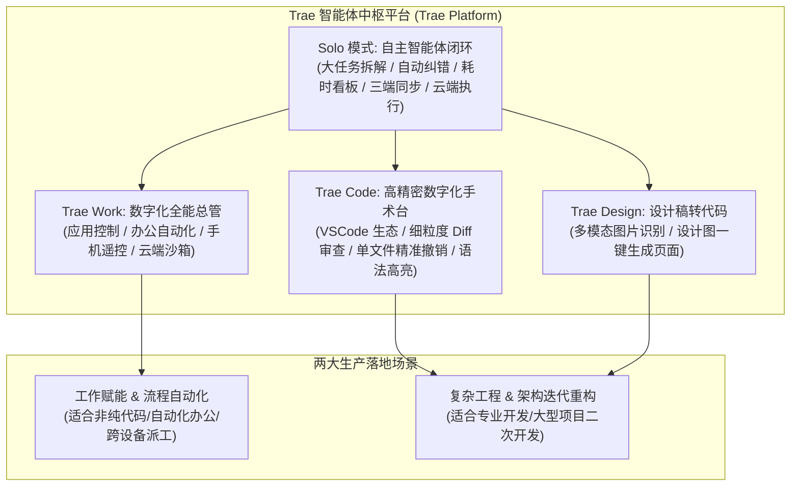
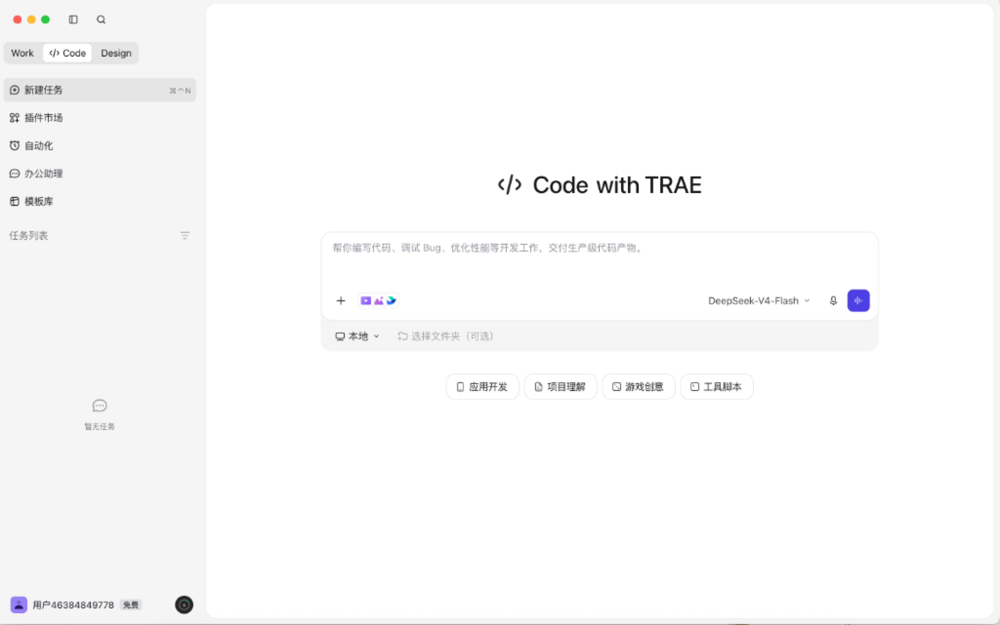
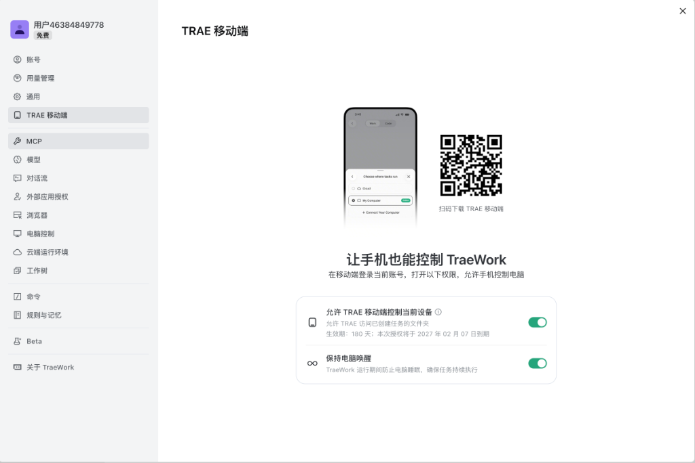
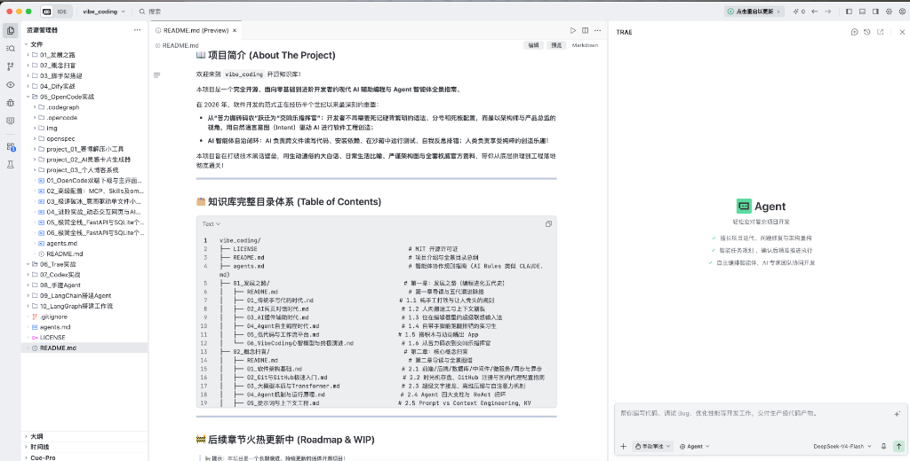
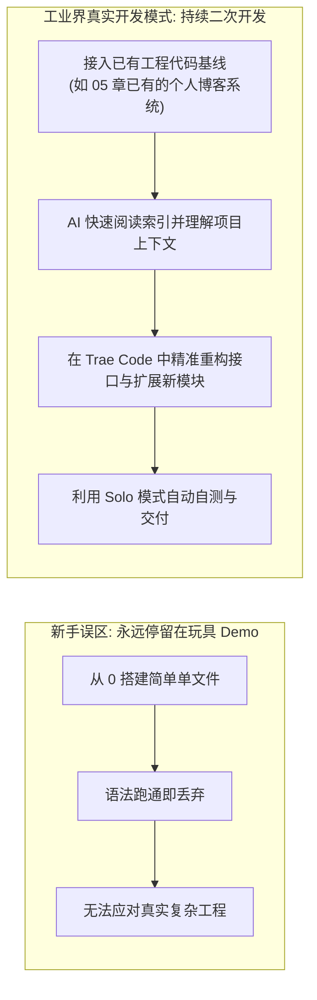
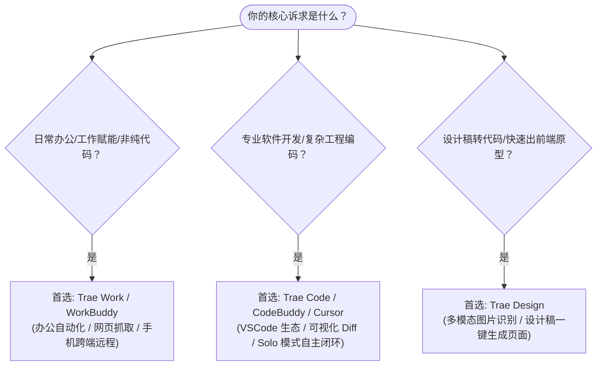

# 6.1 初识 Trae：双模驱动、新人福利与生产级 IDE 新范式

> **本节导读**：在前面的章节中，我们感受了 OpenCode 的开源终端极速流与轻量多专家协同。但当你迈入真实企业级开发与复杂工程时，一个**兼具编译器级精准掌控、云端与移动跨端协同、且拥有自主闭环能力（Solo 模式）的现代化 AI IDE** 将成为你的终极战袍！本节我们将全方位认识新一代原生 AI 编程神器 —— **Trae**，揭秘其独特的双模引擎架构，解锁新人羊毛福利与生产级二次开发的核心心智！

***

## 💡 一、为什么选 Trae？（性价比王道与神级福利）

市面上的 AI 编程工具琳琅满目，从老牌的 Cursor、Windsurf 到各种终端智能体，为什么我们要在本章重磅推荐 **[Trae](https://www.trae.ai)**？

答案非常简单朴实：**功能更强、体验更爽，最关键的是 —— 现在能薅！**

```
🤔 读者灵魂拷问：“什么？你问我为什么不用 WorkBuddy 和 Cursor？”
🤣 教程作者心声：“开玩笑，他们的 Coding Plan 打折了吗？做教程很累的好不好，
   花的大把 tokens 打磨调优起来很贵的！这 tokens 真不真我还能不知道吗？！”
```

### 1. 🎁 新人超值福利与日常“薅羊毛”指南

- **注册即送免费额度**：同学们首次下载注册 Trae，即可直接领取丰厚的免费积分额度，零门槛开启你的 Vibe Coding 心流探索；
- **每日打卡签到**：Trae 内置了非常亲民的日常签到福利机制，每天顺手点一次签到即可领取可用额度，白嫖党狂喜 😊；
- **Coding Plan 骨折级优惠**：对于重度开发者，Trae 官方推出了极具诚意的订阅优惠，新人首月 **Lite 低至 ¥9.9（原价 ¥49）**、**Pro 低至 ¥59（原价 ¥99）**，国际版 Pro 还含 **7 天免费试用**！比起动辄每月数十美刀且毫无折扣竞品，性价比直接拉满！

#### 📌 2026 最新资费体系速览（积分制计费）

> 💡 **重要更新**：从 2026 年 7 月起，Trae 全面切换为 **“以积分为核心”的计费模式**。积分是统一的用量单位，你的每次对话与任务都会按实际用量消耗积分（不同模型、任务复杂度与上下文长度，积分消耗不同）。官网定价页随时更新：[trae.cn 定价](https://www.trae.cn/pricing) / [trae.ai 定价](https://www.trae.ai/pricing)。

| 套餐 | 国内版价格 | 国际版价格 | 核心权益（国内版） |
| :--- | :--- | :--- | :--- |
| **Free 免费版** | ¥0 | $0 | 每月 **500 积分**、全部功能可免费使用、2 个云端任务并行 |
| **Lite** | 首月 **¥9.9**（原价 ¥49） | $3 | 2,000 Work 专属积分/月、**Doubao-Seed 模型 2.5 折**、高峰期优先响应 |
| **Pro** | 首月 **¥59**（原价 ¥99） | $10（7 天免费试用） | 4,000 积分/月、Doubao-Seed 2.5 折、10 个云端任务并行 |
| **Pro+** | 低至 **¥219**/月（原价 ¥239） | $30 | 12,000 积分/月、Doubao-Seed 2.5 折、10 个云端任务并行 |
| **Ultra** | 低至 **¥629**/月（原价 ¥699） | $100 | 40,000 积分/月、**新模型抢先体验**、20 个云端任务并行 |

> 🧠 **积分制心智模型**：可以理解为 **“积分 ≈ AI 干活的汽油”**。免费版每月送你一小桶汽油，日常聊天、轻量补全绰绰有余；重度开发（高频 Agent 调用、长时间 Solo 任务）时，升个会员就像办了加油卡，不仅量大管饱（积分额度翻几十倍），还享**高峰期快速通道**与**Seed 系列模型 2.5 折**，性价比直接拉满！

### 2. 📊 主流 AI 编程工具核心维度横向对比

| 评估维度       | 🇨🇳 字节 Trae（Work + Code）              | ⚡ Cursor                 | 🌐 OpenCode（CLI + Desktop） |
| :--------- | :-------------------------------------- | :----------------------- | :-------------------------- |
| **底层架构**   | **VSCode 深度定制 + 原生三模工作台（Work/Code/Design）** | VSCode 深度定制 + 自研 Composer 2 模型 + 多 Agent 工作台（Cursor 3） | 自研极简客户端 + 终端 CLI            |
| **运行形态**   | **Trae Work（应用/办公）+ Trae Code（专业 IDE）+ Design** | 桌面 IDE + CLI + Web，并上线 iOS/iPad 移动端 App（2026） | 终端命令行 + 桌面轻看板               |
| **跨端与自动化** | **三端打通（App/Web/PC）：手机远程操控、云端运行、电脑防休眠唤醒、任务跨端接力** | 已有 Remote Control 远程控制、防休眠与云端后台 Agent，但**无 Work 式办公/非代码自动化** | 本地执行 / 远程 SSH               |
| **自主智能体**  | **Solo 模式（多步骤规划、自主执行、耗时看板）+ MTC 非代码任务** | Composer 2 / Agent 模式 + 云端后台 Agent（并行、产出 PR）+ Bugbot 审查 | Plan / Build 模式 + 多专家插件     |
| **资费与福利**  | **免费版充足（注册送积分 + 每日签到）；付费 Lite $3 / Pro $10 / Pro+ $30 / Ultra $100 起（国内 ¥49 起，新人首月折扣）** | 免费 Hobby 额度极少；Pro $20/月起（年付 $16）、Ultra $200，2025 年起按“额度池”计费，无签到福利 | 软件开源免费，需自备 API Key          |
| **学习门槛**   | **极低（全中文本土化界面、开箱即用）**                   | 中等（英文为主，需熟悉快捷键与额度计费）     | 中等（需理解终端与配置文件）              |

***

## 🎭 二、生活化大比喻：Trae 的双模引擎（Work vs. Code）

许多初学者第一次打开 Trae 时，会发现它拥有 **Trae Work** 和 **Trae Code** 两种截然不同的核心形态（此外还有面向设计稿转代码的 **Design** 工作区）。这两种核心形态到底有什么区别？我们用一个生活中的生动比喻来理解：



- 🏢 **Trae Work ——「带专属秘书团的数字化调度中心」**：
  - 它不仅能写代码，还能帮你做办公自动化、浏览器网页爬取、调用第三方应用、甚至在云端沙箱跑任务；
  - 你在外面逛街或通勤时，掏出手机就能给家里的电脑派发任务（如“帮我把项目重构并跑通测试”），电脑在后台自动执行并不休眠！
- 🔬 **Trae Code ——「专为老法师打造的高精密数字化手术台」**：
  - 它是一个真正的**生产级 IDE 编译器环境**。基于 VSCode 深度二次开发定制，完美继承了你所有的开发习惯与插件生态；
  - 界面左侧是完整的文件目录树，中间是代码编辑器与实时预览，右侧是 AI Agent 智能助手；
  - 最大的好处在于**拥有极致的掌控感**——AI 即使一口气修改了十几个文件，你也可以在编辑器里逐行审查代码 Diff，对不满意的修改**一键单文件精准撤销**，绝不会像黑盒终端那样“要么全盘接受，要么全盘重来”！

***

## ⚡ 三、Trae Work 核心功能拆解：超越代码的超级工作流

### 0. 🆕 2026 生态进化速览：TraeWork 已升级为独立“AI 原生工作台”

> ⚠️ **重要更新**：在 2026 年 6 月，字节正式推出了 **TraeWork** —— 一个独立的 **AI 原生工作台（AI-Native Workspace）** 产品，提供**网页版 / 桌面版 / 移动版**三种形态，并内置 **Work / Code / Design** 三种模式。它本质上是在 TraeCode SOLO 模式能力基础上进一步升级的“去 IDE 化”智能体工作台：
>
> - 🌐 **网页版**：开箱即用的云端环境，无需下载安装，有网就能跑，适合临时需求、外出办公与快速验证；
> - 💻 **桌面版**：专为 AI Agent 设计的独立应用，不依赖 TraeCode 也能运行，兼顾本地与云端任务，面向长期开发与复杂项目；
> - 📱 **移动版（TRAE App）**：**口袋里的智能体调度中心**——默认支持“按住说话”语音派单，可统一管理云端与多台个人电脑上的 TraeWork，向不同设备**并发派发任务**并实时监控；设备离线时自动切换到云端执行，任务绝不中断，三端任务数据全量同步！
> - ☁️ **云端智能体（Cloud Agent）**：在统一、隔离的云端沙箱中执行代码分析、运行与调试，彻底规避本地环境差异（不用纠结“为什么我电脑能跑、你电脑跑不了”）。

当我们启动 Trae 并处于 Work 模式时，呈现在眼前的是一个集任务调度、自动化与多端控制于一体的现代化工作台。

### 1. 🎛️ 主工作台与多场景切换

在主界面顶部，提供了 **Work**、**`</> Code`** 和 **Design** 三大核心工作区切换，支持自然语言对话、代码生成、多模态图片识别以及语音输入：



- **应用开发 / 项目理解 / 游戏创意 / 工具脚本**：点击快捷标签即可一键加载行业最佳实践 Prompts；
- **智能模型中枢**：原生接入多款主流大模型（国内版内置豆包 Doubao、DeepSeek、Kimi、通义千问、GLM 等，国际版另有 Claude / GPT 可选），响应极速且推理逻辑严密。

### 2. ⚙️ 模型管理与能力外挂中心

进入设置面板中的 **“模型”** 与能力选项，我们可以直观地配置与扩展 Trae 的大脑与外挂工具：


- **多模型灵活接入**：支持火山引擎预置模型（豆包 Seed 系列等），同时允许开发者通过 `+ 添加模型` 自由接入自己的 API Key；
- **丰富的能力侧边栏**：内置 **MCP 协议**、**对话流**、**外部应用授权**、**浏览器操作**、**电脑控制**、**云端运行环境** 与 **规则与记忆** 模块，让 AI 真正具备调用本地和云端一切资源的能力。

### 3. 📱 手机远程控制与电脑防休眠唤醒

Trae 最具颠覆性的创新之一，就是打通了**桌面端与移动端的跨设备协同链路**：



- 📲 **扫码下载 TRAE 移动端**：在手机上登录相同账号，授权开启“允许 TRAE 移动端控制当前设备”；
- ☕ **保持电脑唤醒（Keep-Awake）**：打开该开关后，Trae 运行期间会自动防止操作系统进入睡眠，确保耗时较长的重构、打包或自动化测试任务持续稳定推进；
- 🚶‍♂️ **移动派工体验**：人在地铁上，灵光一闪想做一个新功能，直接在手机端发一条语音或文本指令，家里的电脑就开始自动编写、验证代码，回到家直接验收成果！

> 💡 **补充对比**：2026 年起，Cursor 也上线了 iOS/iPad 移动端 App，并支持 Remote Control 远程控制、电脑防休眠与云端后台 Agent。但其移动端主要面向“编程智能体”的远程跟进，**缺少 Trae Work 式的办公自动化 / 非代码任务（MTC）能力**——这正是 Trae 双模布局的差异化优势。

> 📌 **实战定位说明**：需要特别说明的是，**Trae Work 在功能和实用性上也非常不错**（非常适合日常办公自动化、多任务调度与轻量探索），但**我们不在这里展开演示如何使用 Trae Work，为了贴近真实企业级工程与精准代码重构，本章后续我们将主要使用 Trae Code 展开实战演练**！

***

## 🛠️ 四、Trae Code 深度体验：IDE 编译器的精确掌控力

对于严肃的软件工程与日常编码开发，我们点击左上角的 **`</> Code`** 即可瞬间无缝切入 **Trae Code** 专业编程模式：



### 1. 🌲 VSCode 基因与熟悉的操作手感

- **无痛迁移**：Trae Code 与 Cursor 一样，基于成熟的 VSCode 进行深度定制与二次开发。你的快捷键习惯、主题配色、甚至绝大多数 VSCode 插件（Extensions）都能无缝迁移使用；
- **经典三栏布局**：
  - **左侧**：项目资源管理器（工作区文件树、大纲、时间线）；
  - **中间**：多标签代码编辑器，支持 Markdown 实时双栏预览与语法高亮；
  - **右侧**：TRAE Agent 专属智能体协作交互抽屉，随时向 AI 发出指令。

### 2. 🛡️ 为什么说 IDE 编译器比纯终端/网页更具生产力？

在终端命令行或单网页聊天窗口中写代码，开发者最常遇到的痛点就是**缺乏代码控制感与追溯能力**。而在 Trae Code 中：

1. **可视化代码审查（Visual Diff Review）**：AI 生成的修改会以高亮红绿色彩块直接呈现在编辑器中，增删变动一清二楚；
2. **细粒度单文件撤销（Granular Revert）**：
   - 设想一个真实场景：你让 AI 重构用户认证模块，AI 一口气改动了 12 个文件；
   - 经你审查发现，其中 10 个文件改得非常精妙，但有 2 个文件的路由逻辑改偏了；
   - 在 Trae Code 中，你完全不需要把整个对话撤回重来，只需在编辑器中**对那 2 个不满意的局部文件单独点击撤销/拒绝**，保留其余 10 个文件的成果并继续微调！

### 3. ⚡ CUE 智能补全：仓库级“编辑序列预测”

Trae Code 原生内置了新一代代码补全引擎 **CUE**，它比传统“猜下一行”的 Tab 补全强大得多：

- **仓库级上下文感知**：CUE 不只是看你光标前后的几行，而是理解**整个代码仓库**中函数、变量与调用关系的编辑模式；
- **编辑序列预测**：能够预测你接下来会做的一连串修改（例如你刚给某个函数加了参数，CUE 会预判你可能还要修改它的调用点、测试用例与文档），按 `Tab` 即可一键跳转采纳；
- **链式补全与多行修改**：支持整段多行代码的智能补全、修改点预测、智能导入与智能重命名（在 Python / TypeScript / Go 项目中尤其丝滑）。

> 🧠 **心智模型**：普通补全是“猜你下一个字”，CUE 是“猜你下一整套动作”。配合 Solo 模式，AI 对项目的“肌肉记忆”会越来越准。

### 4. 🛡️ 内置 Git 工作流与智能代码审查

Trae Code 内置了完整的 Git 工作流，并加持 AI 的智能审查能力：

- **智能 Commit Message**：一键让 AI 根据你的代码变更生成符合 Conventional Commits 规范的提交信息；
- **智能代码审查（Code Review）**：对未提交变更、单次提交或分支差异进行总结与审查，通过摘要、流程图与 Diff 视图辅助你快速理解改动内容；
- **远程开发**：支持通过 Remote SSH 或 WSL 连接远程主机，在远程环境中完成开发。

### 5. 🔒 隐私模式与沙箱运行（安全双保险）

- **隐私模式（Privacy Mode）**：开启后，TraeCode 不会将你的对话内容、代码片段及 AI 生成输出用于数据分析、产品优化或模型训练；代码库文件始终保存在本地设备上；
- **沙箱运行（Sandbox）**：智能体生成的命令可以在受限环境中执行，通过文件访问控制与高风险命令拦截策略，最大限度降低误操作风险（比如防止 AI 误删文件、误改系统配置）。

***

## 🔥 五、王牌王炸：Solo 模式（Agent 自主闭环）

如果说普通 AI 插件只是一个“代码自动补全器”，那么 Trae 最吸引人、最具生产力跃迁的核心功能就是 **SOLO 模式（Agent 模式）**！

它与 OpenAI Codex 的 Goal 模式异曲同工，能够实现**自主任务规划、自我拆解、多步骤迭代推进与终端闭环自省**：


### 🌟 Solo 模式核心特性拆解：

1. **📋 智能任务规划与拆解（Smart Task Planning）**：
   - 擅长应对复杂项目迭代、大型 Bug 修复与架构重构；
   - 当你输入一段宏观意图后，Solo 模式会自动将其拆解为若干个清晰的小步骤，并在左侧面板形成结构化的执行清单。
2. **⏱️ 清晰的任务流与状态看板**：
   - 左侧面板清晰呈现每个历史任务的执行状态与耗时（例如：`完善技能列表 任务完成 · 00:55`、`控制图片插入大小 任务完成 · 02:07` 等）；
   - 即使任务发生意外中断（如网络抖动），也可以一键查看中断上下文并随时恢复重试。
3. **🚦 手动审批（Manual Approval） vs 自动执行（Auto-Run）自由切换**：
   - 底部输入框贴心提供了权限模式切换；
   - **新手/谨慎场景**：选择“手动审批”，AI 每次创建文件、修改关键代码或在终端执行 Shell 命令前，都会弹窗等待你的确认；
   - **极速心流/熟练场景**：开启“自动执行”，AI 将全自动呼啸推进，自测自修，直到交付最终产物！
4. **📱 三端同步与移动指挥（App / Web / PC）**：
   - 手机端、桌面端与 Web 端共享**同一个 Agent 会话与任务进度**：在地铁上发起任务、途中实时查看看板，到家直接验收成果；
   - 还可切换到**云端运行环境**，即使电脑不在身边或处于休眠，Agent 也能在云端拉取仓库、跑测试并自动产出 Pull Request。
5. **🗂️ 多任务并行（Multi-Task Parallel）**：打破传统串行执行的限制，支持在同一个项目中同时管理多个任务，AI 可以像项目经理一样并行推进多条工作线，整体开发效率进一步提升；
6. **🧩 内置智能体 Agent + 自定义智能体编排**：
   - Solo 模式内置 **Agent** 智能体，可独立承担“从需求迭代到架构重构”的全流程开发；
   - 更进一步，你还能**自主编排多个智能体，组建属于你的 AI 团队**（例如：一个负责前端、一个负责后端、一个负责测试），实现多角色协同开发，各有独立上下文、互不干扰；
   - 支持在 `.trae/agents/` 目录下加载 Subagents 定义文件，将智能体配置纳入版本管理。
7. **🧰 工具面板（Tool Panel）**：Solo 模式提供一套可视化工具面板，包括**编辑器、文档、浏览器**等，AI 可以借助它们完成真实环境下的操作与验收。

### 🌟 进阶玩法：Solo 模式内置的 Plan 模式 与 Spec 模式

除了“一键全自动”，Solo 模式还贴心地内置了两种**控制粒度更高**的执行模式：

| 模式 | 适用场景 | 工作方式 |
| :--- | :--- | :--- |
| **Plan 模式** | 中小型功能开发、模块级重构 | AI 先分析需求、规划任务并生成**规划文档**，你确认后按计划逐项执行；不满意可直接在文档上修改或要求 AI 调整 |
| **Spec 模式** | 复杂系统级任务、从零搭建新模块/新系统、大规模架构重构 | AI 一次性生成三件套——**spec.md（大纲）/ tasks.md（任务清单）/ checklist.md（验收清单）**，存入项目根目录 `.trae/specs/`，可纳入 Git 版本管理，作为长期项目知识资产 |

> 💡 **与我们教程的呼应**：你在本章后续会看到，我们实战用的 `docs/` 落盘计划 + OpenSpec 规格演进，本质上就是 **Spec 模式思想的“开源 DIY 版”**——先规划再施工、先验收再交付，让 AI 编程从“自由发挥”走向“按图施工”！

***

## 🎯 六、为什么后续章节我们要基于已有项目做“二次开发”？

在接下来的实操章节中，我们将做出一项非常关键且贴近实战的教学决策：**直接基于第五章搭建好的 FastAPI + SQLite 个人博客系统（`project_03_个人博客系统`），使用 Trae Code 进行二次开发与功能升级改造！**

为什么我们不再从零（0 到 1）去新建一个简单的 Demo 呢？

```
🧐 现实真相打脸：
“在真实企业工作场景中，你以为大家天天都在从 0 到 1 架构一个全新系统吗？”
“醒醒吧！除了‘纯牛马全栈’可能会偶尔被抓去从零搭脚手架，在 90% 的企业研发中，
大家面临的都是已有项目（甚至祖传屎山代码）的优化、重构或某几个独立模块的迭代！”
```



### 💡 基于已有项目二次开发的四大核心价值：

1. **培养真实生产体感**：学会如何让 AI 快速阅读既有代码库、理解路由与数据库表结构，而不是每次都“白纸一张”；
2. **掌握代码审查与局部修补能力**：在已有代码中改动，最考验 AI 的上下文关联能力与你的代码审查（Diff）功底；
3. **模块化扩展实战**：我们将为现有的博客系统引入文章标签分类、阅读量统计、全站搜索或图片上传等全新模块，体验模块化开发的爽快感；
4. **前后连贯，知识内化**：将第五章学习的全栈轻量架构无缝串联进第六章的 Trae 实战，构建起牢不可破的工程肌肉记忆！

***

## 🧭 七、场景化工具选型指南：你该怎么选？

为了让不同背景的同学能够选对最适合自己的武器，我们整理了一份权威选型指南：



- **💼 办公赋能、数据处理与日常自动化**：
  - 如果你的目标是让 AI 帮你在电脑上整理表格、批量处理文档、抓取网页信息或在手机上远程控制电脑做任务，极力推荐体验 **Trae Work** 与 **WorkBuddy**；
- **👨‍💻 严肃编程、全栈开发与工程二次开发**：
  - 如果你需要扎根在项目代码堆中，进行模块重构、接口编写、Bug 调试与团队协同，请毫不犹豫选择 **Trae Code**、**CodeBuddy** 或 **Cursor**！
- **🎨 设计稿转代码、快速出前端原型**：
  - 如果你希望把设计图（如 Figma / 效果图）直接转成可运行的页面，或想用“一句话 + 一张图”快速验证创意，可以直接使用 **Trae Design** 工作区。

***

## ❓ 七点五、高频疑问速答（FAQ）

| 问题 | 快速解答 |
| :--- | :--- |
| **Trae 与 TraeWork 到底什么关系？** | TraeCode 是“坐在电脑前用 AI 写代码”的专业 IDE；TraeWork 是 2026 年新推出的独立 AI 原生工作台（网页/桌面/移动三端），让你“不在电脑前也能让 AI 干活”。两者共享账号体系，能力互补。 |
| **国内版与国际版有什么区别？** | 国内版（trae.cn）内置豆包 Doubao-Seed、DeepSeek、Kimi、通义、GLM 等模型，采用积分计费、人民币定价；国际版（trae.ai）另有 Claude / GPT 可选，美元定价。 |
| **免费版够用吗？** | 完全够入门！每月 500 积分 + 2 个云端任务并行，日常补全、Chat 问答、轻量 Agent 任务绰绰有余；重度高频开发再考虑升级会员。 |
| **Solo 模式会不会乱改我的代码？** | 有双保险：①底部可切换“手动审批 / 自动执行”，关键操作前弹窗等你确认；②Diff 视图 + 单文件精准撤销，改错了随时一键回退。 |
| **我的代码和数据安全吗？** | 开启**隐私模式**后，对话与代码不会被用于模型训练；还有**沙箱运行**拦截高风险命令，代码库始终保存在本地。 |
| **Trae 支持哪些编程语言/框架？** | 全栈通用（Python / JS/TS / Go / Java / Rust 等），原生集成 Vercel / Supabase（国际版），并可通过 MCP 协议接入 Figma、数据库等一切外部工具。 |

***

## 🚀 八、小结与本章后续实战规划

在本节中，我们建立了对 Trae 及其双模架构的完整认知，领略了 Trae Work 的跨端自动化与 Trae Code 的编译器精准掌控力，并了解了 Solo 模式带来的自主 Agent 闭环体验。

在接下来的小节中，我们将正式挽起袖子，进入实战环境配置与已有博客系统的二次开发演进之路：

- ⚙️ **6.2 Trae 全平台安装、环境配置与模型接入实战**；
- 🔄 **6.3 导入已有博客系统：利用 Trae 深度阅读理解项目上下文**；
- 🧩 **6.4 模块扩展实战：在 Trae Code 中新增标签分类与文章搜索系统**；
- 🤖 **6.5 玩转 Solo 模式：让 AI 自主排查 Bug 并完成全链路自动化测试**！

赶紧打开 Trae，领取你的新手福利积分，开启下一小节的实战之旅吧！
