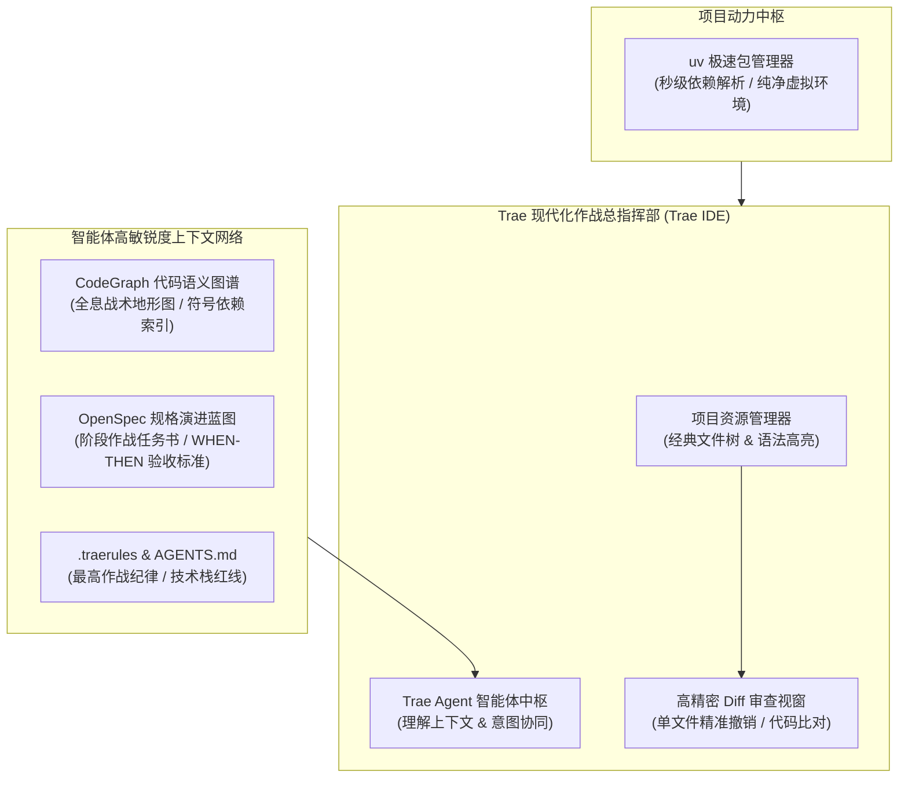
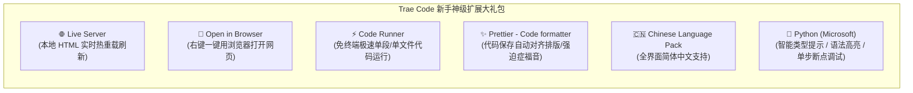

# 6.2 环境基建与项目导入：在 Trae 中建立上下文与依赖安装

> **本节导读**：在上一节中，我们建立了对 Trae 双模引擎与核心优势的宏观认知。从本节开始，我们将告别“纸上谈兵”，正式进入工程实操阶段！我们将把在第五章中打磨好的 **FastAPI + SQLite 个人博客系统** 无缝迁移至 Trae 中，建立由 **CodeGraph（代码语义图谱）+ OpenSpec（规格演进驱动）+ `.traerules`（智能体规则大脑）** 组成的高敏锐度上下文网络，并为初次使用 IDE 的同学量身定制神级插件清单与课后探索大作业！

***

## 💡 一、生活化大比喻：项目迁移与上下文建立

如果把我们在第五章中用 OpenCode 构建的代码比作**一支刚刚结束野外拉练的特种作战小队**，那么本次将项目导入 Trae，就相当于**将小队进驻到现代化高科技作战总指挥部**：



- 🗺️ **CodeGraph**：就像是**基地的全息战术沙盘**。它把整个博客系统的路由（Router）、数据模型（Model）、输入校验（Schema）以及数据库连接（Database）的关系绘制成一张网，让 AI 不需要每次把所有代码从头读到尾，就能一秒定位核心逻辑；
- 📋 **OpenSpec + `.traerules`**：就像是**指挥官的战役任务书与最高军纪**。它明确告诉 Trae：“我们接下来分哪几个阶段推进、绝不能明文存密码、必须写测试用例验证”；
- ⚡ **`uv` 极速包管理**：就像是**特种装备的秒级换弹充能系统**，告别传统 pip 慢吞吞的下载和容易冲突的环境！

***

## 📂 二、项目工程迁移与一键启动

### 1. 迁移工程目录结构
我们将上一章的博客工程复制到第六章的配套目录 `project_01_个人博客系统二次开发/`，并保持纯净的目录结构（自动过滤掉 `.venv` 和 `__pycache__` 缓存）：

```bash
# 查看项目目录结构
06_Trae实战/
├── agents.md                                     # Trae 章节全局协作规范
├── project_01_个人博客系统二次开发/
│   ├── .traerules                                # Trae 专属项目规则大脑
│   ├── pyproject.toml                            # uv 依赖声明文件
│   ├── uv.lock                                   # 锁定的确定性依赖版本
│   ├── database.py                               # SQLite 引擎与 Session 依赖
│   ├── models.py                                 # SQLAlchemy ORM 数据模型
│   ├── schemas.py                                # Pydantic 数据传输模型
│   ├── main.py                                   # FastAPI 路由与静态服务入口
│   ├── index.html                                # 单文件前端与 Markdown 渲染器
│   ├── test_main.py                              # pytest 自动化回归测试套件
│   └── docs/                                     # 阶段演进蓝图与设计文档
```

### 2. 在 Trae 中打开工程
1. 启动 **Trae** 客户端；
2. 点击顶部菜单栏的 **File ⮕ Open Folder...（文件 ⮕ 打开文件夹）**；
3. 选择并打开 `06_Trae实战/project_01_个人博客系统二次开发/` 目录；
4. 此时，左侧资源管理器将完整展现项目的文件层级，右侧将自动加载 Trae Agent 交互侧边栏。

### 3. 一键安装依赖并验证工程基线
得益于 `uv` 的极速能力，我们无需繁琐地手动创建 `venv`。在 Trae 底部打开终端（快捷键 **`Ctrl + ~`** 或 **`⌘ + ~`**），直接运行以下命令：

```bash
# 1. 一键同步并安装全部依赖（极速秒级完成）
uv sync

# 2. 运行自动化测试套件，确认上一章遗留功能 100% 绿灯健康！
uv run pytest -v
```

如果看到所有测试用例均为绿色通过（`PASSED`），说明我们的基础工程基线完美就绪！

```bash
# 3. 启动本地开发服务器进行预览
uv run uvicorn main:app --reload --port 8000
```
在浏览器访问 `http://127.0.0.1:8000`，即可看到我们熟悉的玻璃拟态暗黑风个人博客！

***

## 🧠 三、在 Trae 中建立智能体上下文：CodeGraph 与 Rules 注入

为了让 Trae 的 AI 能够拥有“上帝视角”，在后续的二次开发中不写错文件名、不破坏已有 API 契约，我们需要完成上下文基建的注入。

### 1. 注入 Trae 专属项目规则大脑（`.traerules`）
在项目根目录创建 `.traerules` 文件，明确项目的技术栈与开发守则：

```ini
# Trae Project Rules (.traerules)

## 项目基础信息
- 项目名称：个人博客系统（二次开发实战版）
- 技术栈：FastAPI + SQLite + SQLAlchemy 2.0 + HTML5/TailwindCSS + uv
- 运行命令：`uv run uvicorn main:app --reload --port 8000`
- 测试命令：`uv run pytest -v`

## 二次开发核心原则
1. 保持分层清晰：models.py（ORM 表结构）、schemas.py（DTO）、database.py（引擎）、main.py（路由）、index.html（前端）。
2. 安全规范：涉及用户注册登录必须采用密码哈希（bcrypt）与 JWT 鉴权。
3. 遵循 ATDD：新增或改造接口必须在 test_main.py 中编写对应的验收测试。
4. UI 规范：维持深色玻璃拟态质感（bg-white/5 backdrop-blur-md border-white/10）与丝滑微交互。
```

### 2. CodeGraph 代码语义图谱支持
通过 CodeGraph 工具，Trae 能够快速索引整个项目的函数调用链与类依赖：
- 当我们要求 AI “给文章表增加一个作者关联”时，AI 能够通过图谱一秒感知到：
  `Post (models.py) ➔ PostCreate/PostResponse (schemas.py) ➔ create_post (main.py) ➔ index.html` 这一整条调用链，从而给出零遗漏的修改方案！

***

## 🛠️ 四、Trae Code 新手必装神级扩展推荐（幸福感倍增）

很多同学是第一次从纯文本编辑器或终端迈入真正的现代 IDE（VSCode / Trae Code）。打开左侧的 **Extensions（扩展市场，快捷键 `Ctrl+Shift+X` / `⌘+Shift+X`）**，面对成千上万的插件可能不知所措。

这里特地为大家精选了 **5 款提升 10 倍开发幸福感的神级扩展**，强烈建议新手同学点击安装：



| 插件名称 | 核心功能与使用场景 | 为什么强烈推荐？ |
| :--- | :--- | :--- |
| **`Live Server`** | 启动一个具备实时热重载（Live Reload）的本地轻量静态网页服务器。 | 修改了 `index.html` 或样式后，按 `Ctrl+S` 保存，浏览器页面**无需手动按 F5 即刻自动刷新**，写前端的神器！ |
| **`Open in Browser`** | 在 HTML 文件编辑区右键，直接呼出 `Open in Default Browser`。 | 省去每次去文件夹找文件、或者在浏览器地址栏手动粘贴长路径的繁琐。 |
| **`Code Runner`** | 选中任意一段代码（Python/JS/Shell 等），按 `Ctrl+Alt+N`（macOS 为 `⌃⌥N`）极速运行并在输出面板查看打印结果。 | 调试一个简单的加密函数或正则匹配时，无需打开终端反复敲命令，随写随跑！ |
| **`Prettier`** | 业界最通用的前端与代码格式化工具。 | 配合设置中的 `Format On Save`（保存时自动格式化），瞬间把杂乱缩进对齐得整整齐齐。 |
| **`Chinese (Simplified)`** | 适用于 VSCode / Trae Code 的简体中文语言包。 | 将所有菜单、设置项与快捷键提示全面汉化，告别生僻英文困扰。 |
| **`Python` (Microsoft)** | Python 官方全套开发支持插件。 | 带来极致的 Python 变量类型推导、代码跳转（Go to Definition）与智能补全。 |

***

## 🎯 五、课后动手大作业：探索与规划你的专属新特性

光看不练假把式，真正的高手都是在思考与实践中蜕变出来的！在正式开启下一节编码前，请同学们认真完成以下三项任务：

### 📝 任务一：Trae Code 专属工作台个性化配置
1. 安装完成上述推荐中的 2~3 款神级扩展（如 `Live Server`、`Code Runner`、`Prettier`）；
2. 尝试在 Trae Code 中右键 `index.html` 并用浏览器打开，或者在 `test_main.py` 里用 Code Runner 跑一段测试，感受现代 IDE 带来的行云流水。

### 💡 任务二：脑力激荡 —— 为博客系统构思 3 个你最想增加的“杀手级功能”
- 发挥你的产品经理与全栈架构师思维：如果这个博客是你未来的个人主页与技术影响力阵地，你最希望给它增添什么能力？
- 💭 *提示：如果一时没有特别的想法，也完全不用焦虑！可以直接跟随我们后续的黄金演进路线：*
  1. **阶段 1：用户注册登录与 JWT 权限隔离系统**；
  2. **阶段 2：评论楼层与点赞互动系统 + 后端分页重构**；
  3. **阶段 3：AI 智能摘要提炼 + 智能自动打标**。

### 🔍 任务三：利用 AI 完成 3 个功能的深度调研与落地规划（重点！）
- **关键技巧提示**：在向 AI（如 Trae Agent / ChatGPT / Claude / DeepSeek）请教功能实现方案时，**务必记得开启大模型的「深度思考（Reasoning / Think）」和「联网搜索（Web Search）」开关**！
- 让 AI 针对你构思的 3 个功能，输出一份结构化的设计蓝图：
  - 需要新增什么数据库表结构（Models）？
  - 需要提供哪些 RESTful API 接口（路由、请求体、响应体）？
  - 前端界面应该如何布局呈现？
- 期待在学习社区与交流群中看到同学们充满创意的专属特性规划！

***

## 🚀 六、小结与下节预告

在本节中，我们完成了博客系统的项目导入、依赖秒级同步与测试基线验证，构建了完整的智能体规则上下文，并掌握了 IDE 神级插件的配置使用。

在下一节 **6.3 阶段一实战：用户认证与 JWT 权限隔离系统** 中，我们将正式开启编码实操，手把手带领大家在 Trae Code 中实现安全的密码哈希加密、Token 颁发校验以及文章作者权限守卫！准备好你的键盘，我们下一节见！
