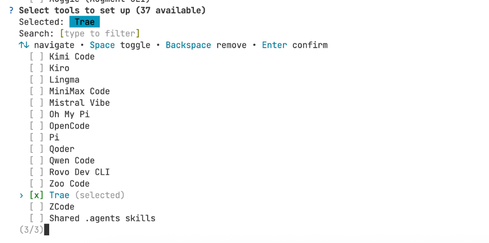
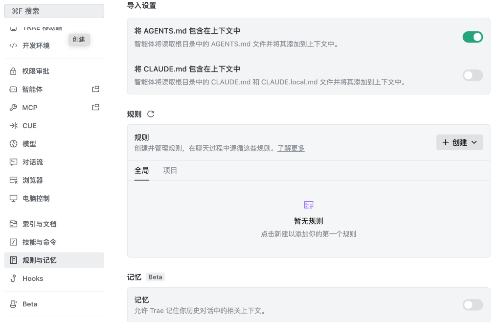
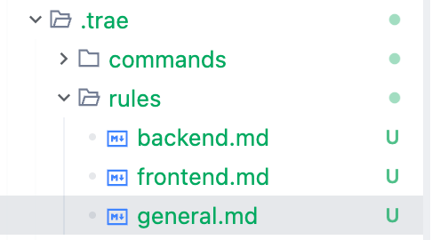
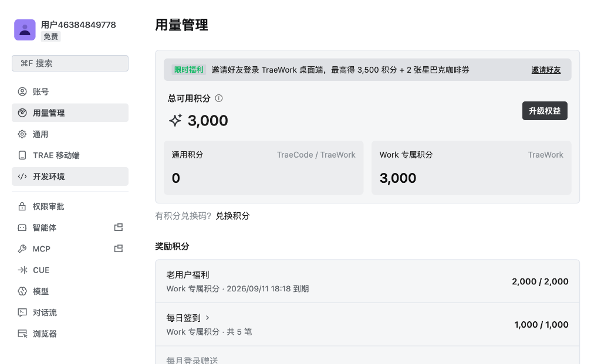
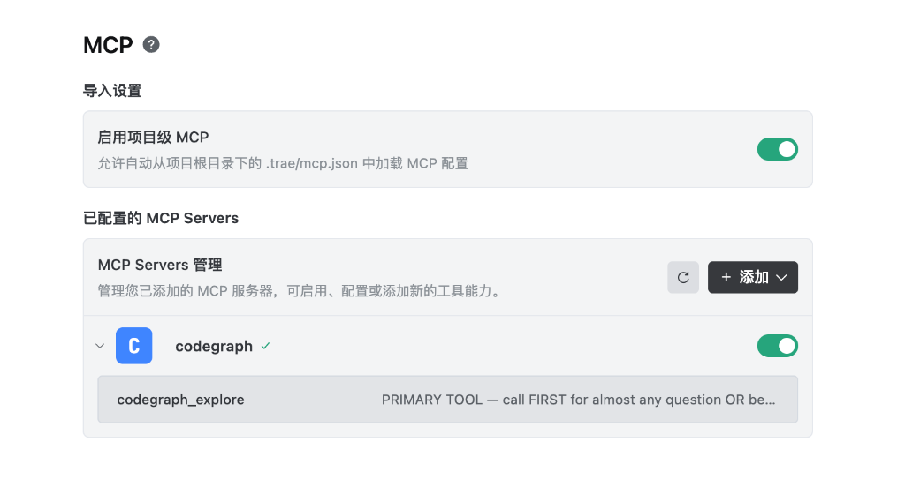

# 6.2 导入已有项目并建立开发基线

接手一个已有项目，像接手一家正在营业的店：先确认现有业务能正常运转，再整理资料、安排新工作。本节完成博客项目导入、依赖安装和测试基线记录，让 Trae 在已有实现的基础上继续开发。

---

## 项目迁移与上下文建立

如果把我们在第五章中用 OpenCode 构建的代码比作**一支刚刚结束野外拉练的特种作战小队**，那么本次将项目导入 Trae，就相当于**将小队进驻到现代化高科技作战总指挥部**：

<!-- 图表源文件：img/diagrams/02-diagram-01.mmd；视觉风格：Pastel 多巴胺 -->
<p align="center">
  <a href="img/diagrams/02-diagram-01.svg">
    
  </a>
</p>

- 🗺️ **CodeGraph MCP**：就像是**基地的项目地图**。它把整个博客系统的路由（Router）、数据模型（Model）、输入校验（Schema）以及数据库连接（Database）的关系绘制成一张拓扑网，让 AI 不需要每次把所有代码从头读到尾，就能定位相关逻辑；
- 📋 **OpenSpec + `reference/` 归档**：就像是**战役任务书的归档与立项机制**。把上一阶段已经完成验收的 4 份文档移入 `reference/` 作为参考资料，保持当前 `docs/` 纯净，让 Trae Agent 能够一眼看清“什么是已经做完的既有资产，什么是接下来要迭代的全新需求”；
- **`AGENTS.md` + `.trae/rules/` 模块化规则**：`AGENTS.md` 保存项目共同约定，前端、后端等细化规则按任务加载，避免把无关说明全部塞进同一次上下文；
- ⚡ **`uv` 快速包管理**：就像是**统一的工具箱**，告别传统 pip 慢吞吞的下载和容易冲突的环境。

***

## 项目工程迁移与规格文档归档

### 1. 区分已验收资产：新建 `reference/` 目录与文档归档

在第五章的实战中，我们通过 OpenCode 驱动完成了博客系统的从 0 到 1 搭建，并在 `docs/` 目录下沉淀了 4 份阶段演进文档（`phase_01` 到 `phase_04`）。

```
💡 为什么不能直接把这 4 个文档继续留在 docs/ 下？
在真实的工程二次开发中，这 4 份文档代表“已经验收交付的上一期历史规格”。
如果直接堆在 docs/ 根目录下，当我们在第六章让 Trae 启动新一轮迭代时，AI Agent
容易把历史阶段的“待办任务”与新阶段的“当前任务”混淆，导致上下文污染！
```

因此，我们进行清晰的资产隔离与整理：
1. 在项目目录下新建 **`reference/`** 目录；
2. 将已验收的 4 份旧阶段文档（`phase_01` ~ `phase_04`）移入 `reference/` 作为历史技术参考；
3. 清除 `docs/` 目录下的旧 `README.md` 等占位文件，让 `docs/` 保持清爽，专供本章即将开启的新阶段演进蓝图使用。

### 2. 迁移后的工程目录结构

经过整理后，第六章的配套工程目录 `project_01_个人博客系统二次开发/` 结构如下：

```bash
# 查看项目目录结构
06_Trae实战/
├── agents.md                                     # Trae 章节全局协作规范与红线清单
├── img/                                          # 本章节高清实战配图
├── project_01_个人博客系统二次开发/
│   ├── .traerules                                # Trae 专属项目规则大脑
│   ├── .trae/                                    # Trae 专属配置目录
│   │   ├── commands/                             # 快捷命令配置
│   │   ├── rules/                                # 🎯 按需注入的项目级规则（前端/后端/通用）
│   │   │   ├── frontend.md
│   │   │   ├── backend.md
│   │   │   └── general.md
│   │   └── skills/                               # 智能体可调用的能力技能包
│   ├── reference/                                # 📦 已验收历史规格归档区（区分历史与新迭代）
│   │   ├── phase_01_规格定义与API契约.md
│   │   ├── phase_02_后端工程与数据持久化.md
│   │   ├── phase_03_响应式前端与Markdown引擎.md
│   │   └── phase_04_全链路联调与验收交付.md
│   ├── docs/                                     # 📝 新迭代阶段演进蓝图存放区（保持纯净）
│   ├── pyproject.toml                            # uv 依赖声明文件
│   ├── uv.lock                                   # 锁定的确定性依赖版本
│   ├── database.py                               # SQLite 引擎与 Session 依赖
│   ├── models.py                                 # SQLAlchemy ORM 数据模型
│   ├── schemas.py                                # Pydantic 数据传输模型
│   ├── main.py                                   # FastAPI 路由与静态服务入口
│   ├── index.html                                # 单文件前端与 Markdown 渲染器
│   └── test_main.py                              # pytest 自动化回归测试套件
```

### 3. 在 Trae 中打开工程
1. 启动 **Trae** 客户端；
2. 点击顶部菜单栏的 **File ⮕ Open Folder...（文件 ⮕ 打开文件夹）**；
3. 选择并打开 `06_Trae实战/project_01_个人博客系统二次开发/` 目录；
4. 此时，左侧资源管理器将完整展现项目的文件层级，右侧将自动加载 Trae Agent 交互侧边栏。

### 4. 安装依赖并验证工程基线
得益于 `uv` 的快速能力，我们无需繁琐地手动创建 `venv`。在 Trae 底部打开终端（快捷键 **`Ctrl + ~`** 或 **`⌘ + ~`**），直接运行以下命令：

```bash
# 1. 同步并安装项目依赖
uv sync

# 2. 运行自动化测试套件，确认上一章遗留功能 100% 绿灯健康！
uv run pytest -v
```

如果看到所有测试用例均为绿色通过（`PASSED`），说明我们的已有测试覆盖的功能通过了检查。

```bash
# 3. 启动本地开发服务器进行预览
uv run uvicorn main:app --reload --port 8000
```
在浏览器访问 `http://127.0.0.1:8000`，即可看到我们熟悉的玻璃拟态暗黑风个人博客。

> ⚡ **为什么 `uv` 能快到“秒级”？（背后原理）**
> 传统 `pip` 装依赖慢，是因为它每次都去远程索引重新解析依赖树、逐包下载。而 `uv` 采用三大“提速实现方法”：
> 1. **全局缓存复用（Global Cache）**：同一份包只在本地缓存一份，可在适用时复用缓存，减少重复下载；
> 2. **超并行下载 + 硬链接**：并发拉取所有依赖包，并用文件系统硬链接瞬间“复制”进虚拟环境；
> 3. **锁定文件（uv.lock）**：记录依赖版本与校验信息，减少不同设备安装结果的差异。操作系统、Python 版本和外部服务仍可能影响运行结果。
>
> 缓存好比提前备料，能减少重复下载。pip 也有缓存机制，实际安装速度还受网络、依赖版本和是否需要编译影响。

***

## 在 Trae 中建立智能体上下文：OpenSpec、模块化 Rules 与 CodeGraph MCP

为了让 Trae 的 AI 能够拥有“上帝视角”，在后续的二次开发中不写错文件名、不破坏已有 API 契约，我们需要完成完整的上下文基建配置。

### 1. 跨 Agent 适配必备动作：`openspec init`

在前面的章节中，我们可能使用的是 OpenCode 或其他 CLI 终端。更换 Agent 工具后，应先在项目根目录检查 OpenSpec 是否已经为当前工具生成所需配置；只有缺少对应配置时才重新执行 `openspec init`，并查看命令产生的差异。

```bash
# 在项目根目录下执行初始化
openspec init
```

在终端弹出的工具适配选择列表中（`Select tools to set up`），使用方向键定位并按空格键选中 **`[x] Trae`**，最后按回车确认：



> 💡 **原理解析**：执行该操作后，OpenSpec 会针对 Trae 的工作机制生成适配的 `.trae/` 目录与 Agent Skills 规则，使 Trae Agent 能够精准识别 OpenSpec 蓝图语法与执行流程。

---

### 2. 规则架构升级：全局 `AGENTS.md` 与按需模块化 `.trae/rules/`

在开启实战前，我们需要在 Trae 的设置中把 **`AGENTS.md`** 包含进上下文，同时在项目内配置**别（Project-Level）的专属细化规则**。

#### 为什么不把所有规则都写进一个 `AGENTS.md` 中？
- **避免上下文臃肿**：单文件过长会大量占用大模型的有效上下文窗口（Context Window），白白消耗宝贵的 Tokens；
- **消除无效干扰**：写前端代码时，AI 不需要反复阅读后端的数据库迁移与加密规则；写后端接口时，AI 也不需要关注前端 CSS 样式类名。
- **按需精准注入**：将规则按职责切分到 `.trae/rules/` 下，AI Agent 在执行具体领域任务时只载入对应规则，既省 Token 又极大地提升了执行准确率。

#### 步骤 1：在 Trae 中开启 `AGENTS.md` 包含开关
进入 Trae 设置中心 ⮕ 点击左侧 **“规则与记忆”** ⮕ 在导入设置中开启 **“将 AGENTS.md 包含在上下文中”**：



#### 步骤 2：在项目 `.trae/rules/` 下建立三大专属规则文件
针对我们当前的博客系统二次开发，我们在 `.trae/rules/` 目录下建立 3 个规则文件（如下图所示）：



1. **`general.md`（通用规则）**：约束全流程的 CodeGraph 优先查询、OpenSpec 规格推进与依赖管理；
2. **`frontend.md`（前端规则）**：约束单文件 HTML5 + TailwindCSS 玻璃拟态规范、禁止 npm 构建链，并定义了允许调用的前端 Skills 技能包；
3. **`backend.md`（后端规则）**：约束 FastAPI 分层、RESTful 语义规范、分页标准、Bcrypt/JWT 安全守卫与 ATDD 测试红线。

> 💡 **未来扩展提示**：随着工程的进一步推进，如果后续需要引入 Git 版本协作，我们可以随时在该目录下追加 `git.md`；如果要部署到云端服务器，也可以追加 `remote_deploy.md`，模块化解耦非常轻量灵活。

#### 规则源码参考（同学们可在此基础上自行迭代扩充）：

**1. 全局纪律红线清单：`agents.md`**

先看项目目录速览（红线文件开头附带的一行注释）：

```bash
project_01_个人博客系统二次开发/
├── .traerules          # Trae 项目专属规则大脑（技术栈 + 二次开发守则）
├── .trae/              # OpenSpec 为 Trae 生成的智能体配置（skills + commands + rules）
├── openspec/           # 规格演进制品：specs 主规格 + changes 变更
├── reference/          # 已验收历史规格归档区（区分历史资产与新迭代规格）
├── pyproject.toml      # uv 依赖声明文件
├── uv.lock             # 锁定的确定性依赖版本
├── database.py         # SQLite 引擎、Session 与 get_db 依赖
├── models.py           # SQLAlchemy ORM 数据模型（Post/User/Comment/Like）
├── schemas.py          # Pydantic V2 请求/响应 DTO
├── main.py             # FastAPI 路由、鉴权守卫、静态托管与 CORS 入口
├── index.html          # 单文件前端（TailwindCSS + Marked.js，玻璃拟态）
└── test_main.py        # pytest 自动化回归测试套件
```

再看严格禁止清单（红线）源码：

```markdown
# AGENTS.md（Trae 章节 · 纪律红线）

> 本文件只收录严格禁止做的事（红线清单）与项目目录速览。正向开发规范见项目 [.trae/rules/](./project_01_个人博客系统二次开发/.trae/rules/) 与 [.traerules](./project_01_个人博客系统二次开发/.traerules)。
> 📌 阶段开发完成后须同步更新 agents.md 与 `.trae/rules/`——每个阶段开始前都站在已开发好的基础上推进。

---

## 二、严格禁止清单（红线）

1. 🛑 **严禁私自提交**：未经用户明确指令，绝不执行 `git commit` / `git push`；
2. 🛡️ **严禁明文密码**：用户密码必须 bcrypt 哈希，严禁明文存储；鉴权接口严禁绕过 JWT Token 校验；
3. 🧪 **严禁伪造绿灯**：所有接口必须真实跑通 `uv run pytest -q`，禁止跳过验证、伪造测试结果；
4. ⛔ **严禁跳阶段**：禁止跨阶段一次性混杂开发，必须按 OpenSpec 阶段规划逐阶段闭环；
5. ⛔ **严禁手操依赖**：禁止手动 pip / venv，依赖一律 `uv` 管理；
6. ⛔ **严禁混淆归档**：禁止擅动 `reference/` 已验收资产与既有 API 契约；
7. ⛔ **严禁破层开发**：禁止混淆 models / schemas / database / main / index.html 的分层职责；
8. ⛔ **严禁泄露密钥**：API Key / 密钥 / 私有域名 100% 脱敏，`*.db` 等产物必须加入 `.gitignore`；
9. ⛔ **严禁虚构信息**：禁止虚构官方链接、技术细节与测试结论；
10. ⛔ **严禁越权写码**：propose / 规划阶段禁止写业务代码，explore 阶段只读不写。
```

---

**2. 通用规则：`.trae/rules/general.md`**

```markdown
# 通用规则（Common Rules：CodeGraph + OpenSpec + uv）

> 适用：`project_01_个人博客系统二次开发/` 全链路二次开发通用流程。

## ✅ 遵循规范（Do）

- **CodeGraph 查询先行**：动手改代码前先调用 `mcp_codegraph` 的 `codegraph_explore`（`query` 传符号/文件名/问题，`projectPath` 传项目绝对路径）；命中符号即视为已读；大型重构前先建立图谱索引；
- **OpenSpec 规格驱动**：按阶段开发，一个阶段一个完整闭环：`/opsx-explore` 探索 → `/opsx-propose` 生成四件套（proposal / spec / design / tasks）→ `/opsx-apply` 实现+验收 → `/opsx-sync` 合并 delta 规格 → `/opsx-archive` 归档（先 `openspec validate`）；
- **文档同步**：每个阶段开发完成后，同步更新 agents.md 与 `.trae/rules/`（frontend / backend / general，含项目目录、文件清单与红线）——每个阶段开始前都是站在已开发好的基础上推进；
- **uv 管理依赖**：`uv sync` / `uv run uvicorn main:app --reload --port 8000` / `uv run pytest -q` / `uv add <pkg>`；
- **Trae 工作流**：利用可视 Diff 审查与单文件精准撤销；复杂调试与自动化测试阶段可切换 Solo 模式自主闭环。

## 🚫 红线禁令（Don't）

- 禁止跳阶段、跨阶段一次性混杂开发；
- 禁止手写 pip / venv 管理依赖；
- 禁止混淆 `reference/` 已验收资产与当前 `openspec/specs` 新迭代规格；
- 禁止盲目全库搜索与重复 Read；
- 禁止在 propose / 规划阶段写业务代码，explore 阶段只读不写。
```

---

**3. 前端规则：`.trae/rules/frontend.md`**

```markdown
# 前端规则（Frontend Rules）

> 适用：`project_01_个人博客系统二次开发/` 单文件 HTML5 + TailwindCSS（CDN）+ Marked.js + 原生现代 JS，零 npm 构建链。

## ✅ 遵循规范（Do）

- 单文件 `index.html`，公共 CDN 引入 TailwindCSS / Marked.js / Lucide，双击/静态服务即跑；
- 保持深色玻璃拟态质感（`bg-white/5 backdrop-blur-md border-white/10`）+ 渐变强调色 + 悬浮微交互 + 移动优先响应式；
- 对接后端统一 `fetch` + `baseURL` 封装（相对 `/api`）；
- 用 `localStorage` 持久化前端状态（Token、偏好设置等）；
- 新增页面/组件前，先查 `.trae/skills/` 技能包按需加载，再读对应 `SKILL.md` 执行：

| 技能                 | 用途                     | 触发场景      |
| ------------------ | ---------------------- | --------- |
| tailwind-ui-master | UI 规范（暗黑 / 玻璃拟态 / 微交互） | 前端样式      |
| single-file-app    | 单文件 HTML 骨架（CDN + 内联 JS） | 页面/弹窗搭建   |
| simplify           | 代码精简 / 去死代码             | 重构        |

- 完成后必须真实实测（点击 / 输入 / 查 console / 截图），并结合后端 `pytest` 联调。

## 🚫 红线禁令（Don't）

- 禁止 npm install 与任何前端构建链；
- 禁止破坏既有玻璃拟态视觉风格与既有交互习惯；
- 禁止硬编码后端地址、绕过 CORS 排查；
- 禁止「写完即交付」——未真实实测不得交付。
```

---

**4. 后端规则：`.trae/rules/backend.md`**

```markdown
# 后端规则（Backend Rules）

> 适用：`project_01_个人博客系统二次开发/` FastAPI + uvicorn + SQLite（`blog.db`）+ SQLAlchemy 2.0（Mapped 语法）+ Pydantic V2，依赖一律 `uv` 管理。

## ✅ 遵循规范（Do）

- 分层清晰：`models.py`（ORM 表模型）/ `schemas.py`（Pydantic DTO）/ `database.py`（引擎与 `get_db`）/ `main.py`（路由、鉴权守卫、静态托管、CORS）；
- RESTful：资源复数名词（`/api/posts`、`/api/comments`），语义化状态码，统一错误格式 `{"detail": "..."}`，Pydantic 校验请求体；
- 列表接口参数化分页（`Page` & `PageSize`），返回 `items` + `total` + `page` + `page_size` 元信息；
- 安全：密码一律 bcrypt 哈希存储；JWT 颁发与验证闭环；受保护接口（增删改）用 `Depends` 权限守卫校验 Token；
- 点赞/计数类接口做幂等去重防刷；
- 新增或改造接口先写 `pytest` + TestClient 验收测试（正常 / 异常 / 未授权状态码），红灯后再编码，`uv run pytest -q` 全绿后交付。

## 🚫 红线禁令（Don't）

- 禁止明文存储密码与 Token；
- 禁止绕过 JWT 校验暴露受保护接口；
- 禁止破坏既有 API 契约与分层职责；
- 禁止跳过测试伪造绿灯。
```

---

### 3. 配置 CodeGraph MCP 语义图谱服务

除了规则文件外，Trae 原生支持 **MCP（Model Context Protocol，模型上下文协议）**。我们可以将 **CodeGraph** 作为 MCP 服务接入 Trae，为 AI 赋予全库代码符号依赖查询的能力。

#### 步骤 1：打开 Trae 设置面板与 MCP 入口
在 Trae 左侧或用户头像区域点击设置图标，进入设置中心，在左侧导航栏找到 **MCP** 选项：



#### 步骤 2：添加 CodeGraph MCP 服务配置
在 **MCP Servers 管理** 区域，点击右上角的 **`+ 添加`（➕ 号）** 按钮，在弹出的 JSON 编辑框中填入以下配置：

```json
{
  "mcpServers": {
    "codegraph": {
      "command": "codegraph",
      "args": [
        "serve",
        "--mcp"
      ]
    }
  }
}
```

保存后，Trae 会自动启动并连接 `codegraph` 服务，并成功加载其内置工具能力（如 `codegraph_explore`）：



#### 为什么 CodeGraph MCP 是二次开发的工具？
- **优先调用的第一工具（PRIMARY TOOL）**：正如 Trae 工具描述所注，在 Agent 回答复杂架构问题或动手修改代码前，它会**首选调用 `codegraph_explore`** 扫描代码调用图谱；
- **全息感知调用链**：当我们要求 AI “给文章表增加一个作者关联”时，AI 能够通过 CodeGraph 定位问题：
  `Post (models.py) ➔ PostCreate/PostResponse (schemas.py) ➔ create_post (main.py) ➔ index.html` 这一整条调用链路，绝不丢三落四。

#### 原理说明：CodeGraph 是如何给 AI 画“代码地图”的？

CodeGraph 是一款开源的 **代码知识图谱（Codebase Knowledge Graph）** 工具，它的核心思想是：**在 AI 开始干活之前，先把整个代码库的地形勘察好**。工作链路如下：

<!-- 图表源文件：img/diagrams/02-diagram-02.mmd；视觉风格：GitHub Dark -->
<p align="center">
  <a href="img/diagrams/02-diagram-02.svg">
    
  </a>
</p>

- **1. 建图（Build）**：用 `tree-sitter` 语法解析器把 Python / JS / TS / Go 等几十种语言的源码解析成**抽象语法树（AST）**，再抽取其中的类、函数、变量与**调用关系（Call Graph）**，存入一张可查询的本地知识图谱（完全离线、无需 Docker、无需云服务）；
- **2. 服务（Serve）**：通过 `codegraph serve --mcp` 把图谱暴露成 **MCP Server**，AI 只需调用工具即可查询图谱；
- **3. 查询（Query）**：AI 按需调用 `codegraph_explore`、`codegraph_trace`、`codegraph_impact` 等工具，**一次调用拿到相关符号与调用链，零文件扫描**。

> 🚀 **实测数据（官方 & 社区基准）**：相比“靠 AI 反复 Read 文件 + grep 搜索”的传统探索方式，使用 CodeGraph 后 **Token 消耗降低约 10 倍、工具调用次数减少约 2 倍**，回答质量几乎持平。这就是为什么我们在 `.trae/rules/general.md` 里把 **“CodeGraph 查询先行”** 列为第一条 Do 规范。

#### 顺带搞懂：MCP（模型上下文协议）到底是什么？

MCP（Model Context Protocol）是 Anthropic 提出的**开放标准协议**，作用是给 AI 搭一座“通往外部世界的桥”。它把 AI 当作**客户端（Client）**，把 CodeGraph、Figma、数据库、GitHub 等外部能力包装成**服务端（Server）**，AI 通过统一接口调用：

- 没有 MCP：编程工具仍可能通过内置能力读文件或执行命令；MCP 提供的是一种统一连接外部工具的方式。
- 有了 MCP：AI 能像人一样**操作文件系统、读写数据库、调用设计稿解析器、执行终端命令**，从一个“聊天机器人”升级为“真能干活的通用助手”。

> 💡 你现在配置的 CodeGraph MCP，正是让 Trae Agent 拥有“代码全库上帝视角”的关键一环。关于 MCP 的更多细节，我们会在《02_概念扫盲》章节中系统展开。

***

## Trae Code 新手必装扩展推荐（幸福感倍增）

很多同学是第一次从纯文本编辑器或终端迈入真正的现代 IDE（VSCode / Trae Code）。打开左侧的 **Extensions（扩展市场，快捷键 `Ctrl+Shift+X` / `⌘+Shift+X`）**，面对成千上万的插件可能不知所措。

这里特地为大家精选了 **5 款提升 10 倍开发幸福感的扩展**，强烈建议新手同学点击安装：

<!-- 图表源文件：img/diagrams/02-diagram-03.mmd；视觉风格：Linear 紫色科技感 -->
<p align="center">
  <a href="img/diagrams/02-diagram-03.svg">
    
  </a>
</p>

| 插件名称 | 核心功能与使用场景 | 为什么强烈推荐？ |
| :--- | :--- | :--- |
| **`Live Server`** | 启动一个具备实时热重载（Live Reload）的本地轻量静态网页服务器。 | 修改了 `index.html` 或样式后，按 `Ctrl+S` 保存，浏览器页面**无需手动按 F5 即刻自动刷新**，写前端的工具。 |
| **`Open in Browser`** | 在 HTML 文件编辑区右键，直接呼出 `Open in Default Browser`。 | 省去每次去文件夹找文件、或者在浏览器地址栏手动粘贴长路径的繁琐。 |
| **`Code Runner`** | 选中任意一段代码（Python/JS/Shell 等），按 `Ctrl+Alt+N`（macOS 为 `⌃⌥N`）快速运行并在输出面板查看打印结果。 | 调试一个简单的加密函数或正则匹配时，无需打开终端反复敲命令，随写随跑。 |
| **`Prettier`** | 业界最通用的前端与代码格式化工具。 | 配合设置中的 `Format On Save`（保存时自动格式化），瞬间把杂乱缩进对齐得整整齐齐。 |
| **`Chinese (Simplified)`** | 适用于 VSCode / Trae Code 的简体中文语言包。 | 将所有菜单、设置项与快捷键提示全面汉化，告别生僻英文困扰。 |
| **`Python` (Microsoft)** | Python 官方全套开发支持插件。 | 带来的 Python 变量类型推导、代码跳转（Go to Definition）与智能补全。 |

***

## 课后动手大作业：探索与规划你的专属新特性

开始下一节前，可以完成下面三项准备：

### 任务一：Trae Code 专属工作台个性化配置
1. 安装完成上述推荐中的 2~3 款扩展（如 `Live Server`、`Code Runner`、`Prettier`）；
2. 尝试在 Trae Code 中右键 `index.html` 并用浏览器打开，或者在 `test_main.py` 里用 Code Runner 跑一段测试，感受现代 IDE 带来的行云流水。

### 任务二：脑力激荡 —— 为博客系统构思 3 个你最想增加的“功能”
- 发挥你的产品经理与全栈架构师思维：如果这个博客是你未来的个人主页与技术影响力阵地，你最希望给它增添什么能力？
- 💭 *提示：如果一时没有特别的想法，也完全不用焦虑。可以直接跟随我们后续的演进路线：*
  1. **阶段 1：用户注册登录与 JWT 权限隔离系统**；
  2. **阶段 2：评论楼层与点赞互动系统 + 后端分页重构**；
  3. **阶段 3：AI 智能摘要提炼 + 智能自动打标**。

### 任务三：利用 AI 完成 3 个功能的深度调研与落地规划（重点。）
- **关键技巧提示**：在向 AI（如 Trae Agent / ChatGPT / Claude / DeepSeek）请教功能实现方案时，**务必记得开启大模型的「深度思考（Reasoning / Think）」和「联网搜索（Web Search）」开关**。
- 让 AI 针对你构思的 3 个功能，输出一份结构化的设计蓝图：
  - 需要新增什么数据库表结构（Models）？
  - 需要提供哪些 RESTful API 接口（路由、请求体、响应体）？
  - 前端界面应该如何布局呈现？
- 期待看到同学们充满创意的专属特性规划。

***

## 常见踩坑与排查方法（排查顺序）

| 症状 | 可能原因 | 对症下药 |
| :--- | :--- | :--- |
| **`uv sync` 报 SSL / 网络错误** | 网络波动或国内源访问慢 | 使用国内镜像：`UV_DEFAULT_INDEX=https://mirrors.aliyun.com/pypi/simple/`（或清华源）后重新执行 |
| **`codegraph: command not found`** | CodeGraph 未安装或未加入 PATH | 参考其官方 GitHub（[colbymchenry/codegraph](https://github.com/colbymchenry/codegraph)）用安装器一键安装，重启 Trae 后再配置 MCP |
| **MCP 服务器显示连接失败** | 配置 JSON 路径写错 / 服务未启动 | 先在终端手动运行 `codegraph serve --mcp` 验证能否启动，再回到 Trae MCP 设置中检查 command/args |
| **AI 一直读不到新加的文件** | CodeGraph 图谱未增量更新 | 在项目根目录重新执行 `codegraph build` 重建索引，或让 AI 调用 `codegraph_status` 查看索引状态 |
| **`.env` 环境变量不生效** | 项目没有重启 / 未安装 python-dotenv | 确认 `uv add python-dotenv` 已装、`load_dotenv()` 已调用，并**重启 uvicorn** |
| **打开文件夹后左侧没有文件树** | 打开的是上级目录而非项目根目录 | 确认打开的路径是 `project_01_个人博客系统二次开发/`（含 `pyproject.toml` 的那一层） |

***

## 给新会话一份简短的项目交接

交接时把整个文件柜搬过去，接手的人未必更快找到重点。给 AI 的项目背景也应先说明当前状态，再提供对应文件。

一份可用的交接说明应包含：已经能运行的功能、这次要做的改动、不能改变的接口、启动与测试方式，以及当前已知问题。历史方案可以保留引用，但应区分已实施内容和暂未采用的建议。

建议导入后先记录一次基线：依赖能否同步、测试是否通过、页面能否读取已有文章。如果基线已经失败，先定位原因；否则后面很难分清问题是迁移造成的还是新功能引入的。

| 文件类型 | 交接时的处理方式 |
| --- | --- |
| 当前代码和有效规格 | 作为判断现有行为的依据 |
| 已完成阶段的设计记录 | 用来解释历史选择，不直接当作新任务 |
| 新阶段计划 | 写明本次范围与验收条件 |
| 密钥和本地数据 | 按环境单独配置，不作为普通文档传递 |

规则文件是否生效，应通过实际行为确认：让工具指出采用了哪些项目约定，并对照文件检查。CodeGraph 能帮助定位调用关系，但未建立索引时无需为阅读几份文档强行安装；已有索引的项目则要确认它对应当前代码。

## 导入项目当天保存一份基线记录

基线记录不必很长，但要能回答“改动前是什么状态”。建议写下当前分支和未提交修改、依赖同步结果、测试结果、数据库文件位置、启动端口，以及页面能否读取一篇已有文章。后续出现异常时，可以逐项对照。

文档也要区分当前说明和历史记录。README 的启动命令通常应反映当前状态；阶段计划和归档规格说明过去为什么这样设计。两者冲突时，先以实际代码和可运行结果为依据，再修正文档，不能让 Agent 从一份旧计划直接推断现状。

若导入时测试已经失败，不要急着开始新功能。先保存错误信息，并判断是依赖、环境变量、数据文件还是代码本身的问题。只有知道哪些失败原本就存在，后面的验证结果才有意义。

---

## 本节回顾

项目导入后的第一份成果是可信的运行基线和简短交接说明。有了这两项，后续出现问题才容易判断影响来自哪里。

继续阅读：[6.3 用户登录与操作权限](./03_阶段一实战：用户认证与JWT权限隔离系统.md)。
