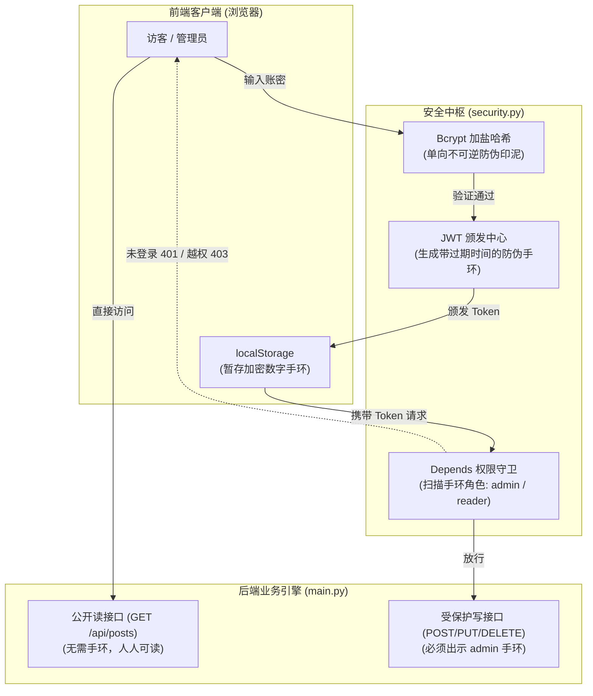
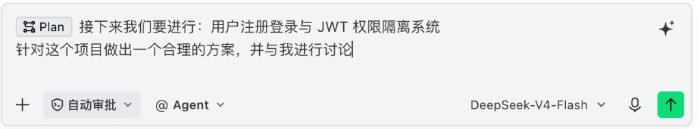
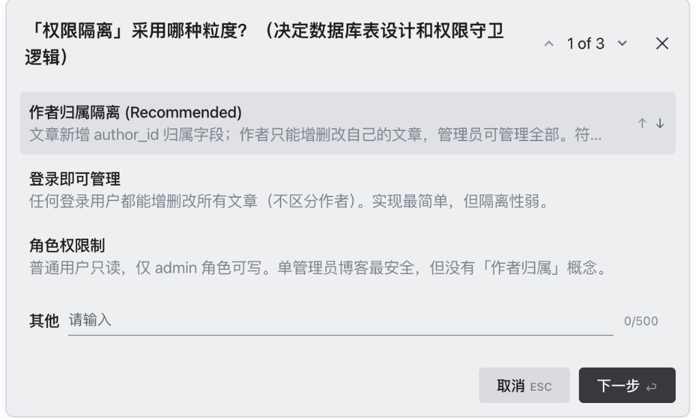
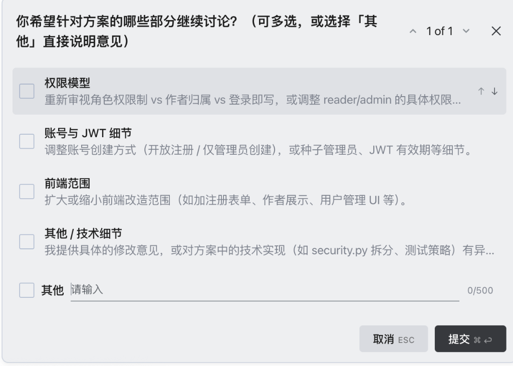
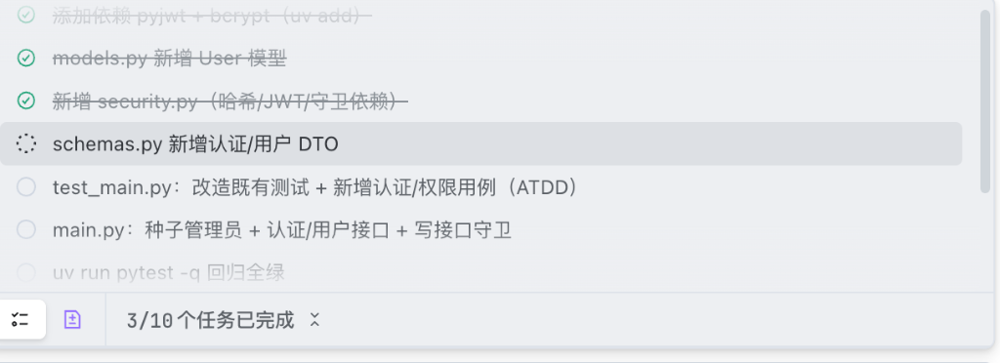
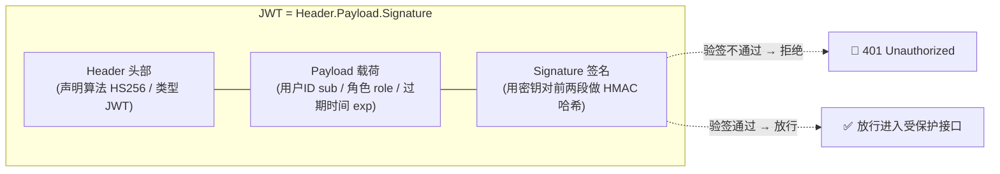
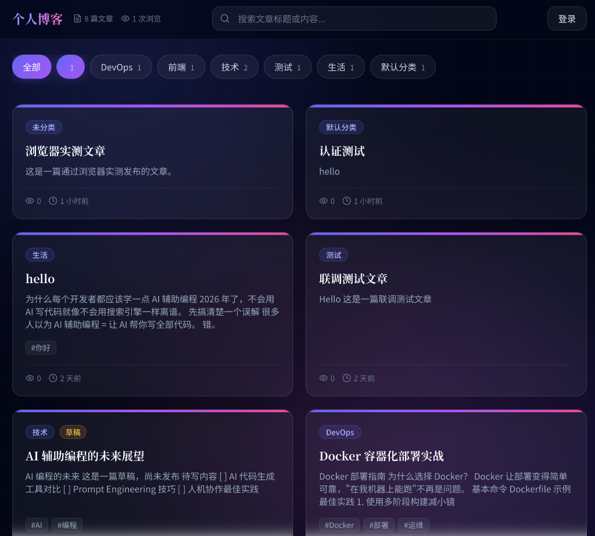
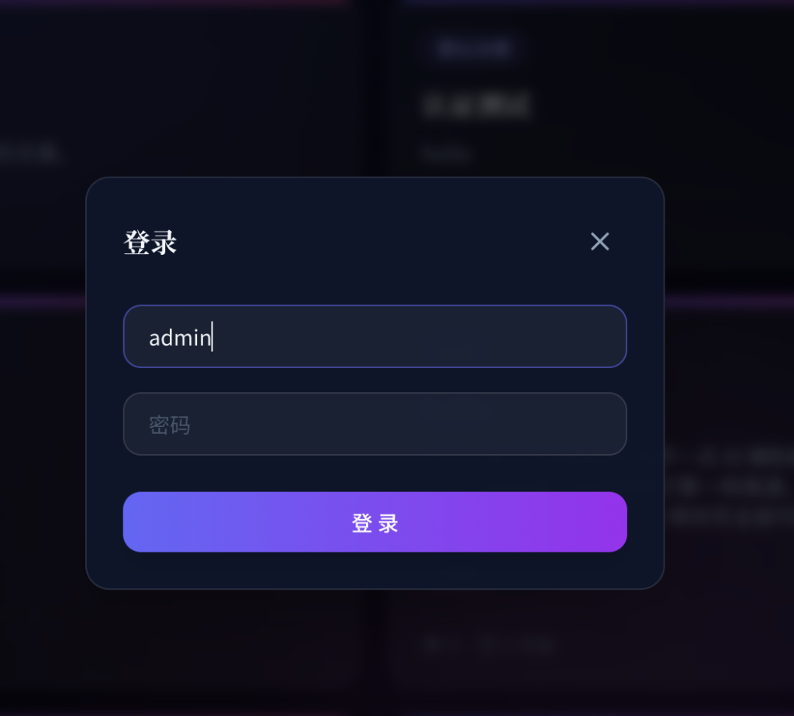
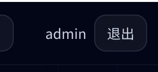
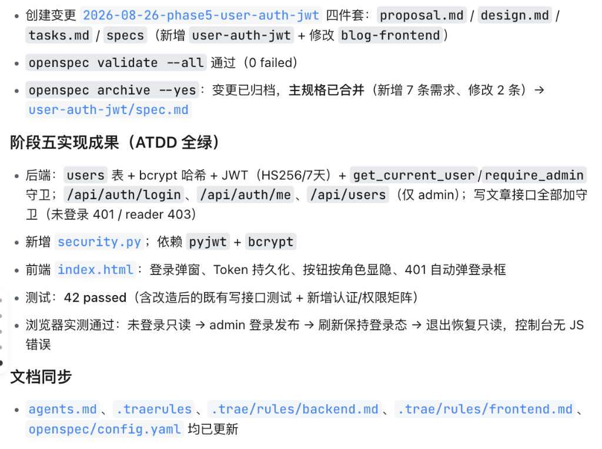

# 6.3 阶段一实战：用户认证与 JWT 权限隔离系统

> **本节导读**：在前面的小节中，我们搭建好了 Trae 的作战指挥部与规则上下文网络。从本节开始，我们将正式打响已有博客系统二次开发的第一枪！我们将体验全新的 **Plan 规划模式**，以“指挥官”的心智与 AI 开展交互式方案讨论，选定最具性价比的**最小改造方案**，并放手让 Agent 自动推进编码与 ATDD 自动化测试，最终完成用户登录、密码哈希与 JWT 权限隔离的完美交付！

***

## 💡 一、生活化大比喻：门禁卡、防伪手环与权限守卫

在给已有博客系统引入用户认证前，我们先通过生活中的生动比喻理解核心机制：



- 🔐 **Bcrypt 加盐哈希**：就像是**特制的单向不可逆防伪印泥**。哪怕数据库被黑客不小心偷走，他们看到的也只是一串复杂的乱码哈希，绝不可能反推算出原始密码；
- 🎟️ **JWT（JSON Web Token）**：就像是游乐场的**加密防伪数字手环**。用户登录成功后，后端发给前端一个带有时效性（7天有效）和角色信息（`role: admin`）的 Token。之后前端每次发起请求都戴着手环，服务端不用每次查库验证密码，直接验算签名即可秒级放行；
- 🛡️ **`Depends`** **权限守卫**：就像是**每个贵宾通道入口处的安保人员**。读文章所有人免费开放；想要写文章、改文章或删文章？安保人员会立刻扫你的手环，不是 `admin` 角色直接无情拦截并返回 403 越权！

***

## 🧠 二、Plan 模式驱动：以“指挥官”心智与 AI 讨论决策

在现代 Vibe Coding 开发范式中，最忌讳的就是“一股脑让 AI 瞎写”。真正的高手懂得**在动第一行代码前，先用 Plan 模式与 AI 对齐方案与边界**。

```
😎 指挥官核心心智：
“在这次实战中，我们是指挥官，负责把控方向与最终拍板决策；
不用担心选错会做坏项目，那是员工（Agent）该考虑自愈的事情（狗头）！
对于已有系统二次开发，核心原则永远是 —— 最小改造成本，最大产出效益！”
```

### 1. 启动 Plan 模式并输入意图 Prompt

在 Trae 对话框中切换到 **Plan 模式**，输入我们的宏观需求，要求 AI 针对现有项目给出合理方案并展开讨论：

```
[Plan] 接下来我们要进行：用户注册登录与 JWT 权限隔离系统
针对这个项目做出一个合理的方向，并与我进行讨论
```



### 2. 交互式方案讨论与决策树选择

AI 会深入阅读项目现有的 `models.py`、`main.py` 和 `test_main.py`，并主动向我们弹出交互式的决策问询：

#### 决策一：权限隔离采用哪种粒度？

Trae 会列出当前系统的 3 种可选方案：

1. **作者归属隔离**：文章新增 `author_id`，作者只能改自己的，管理员管全部（改造面较大）；
2. **登录即可管理**：任何登录用户都能增删改所有文章（隔离性弱）；
3. **角色权限制**：普通用户只读，仅 `admin` 角色可写（最适合单人/团队博客，改造成本最小）。



👉 **指挥官决策**：选择 **“角色权限制”**！遵循**最小改造原则**，既有的 `Post` 表结构完全无需变动，核心开发重心集中在登录鉴权与守卫拦截上。

#### 决策二：方案细节确认

Trae 会继续确认账号创建方式与前端改造范围：



👉 **指挥官决策**：

- **账号来源**：采用系统启动时自动种子化生成首个超级管理员（`admin/admin123`），不开放公开注册接口，杜绝恶意注册；
- **前端范围**：最小化轻量改造，仅增加登录弹窗、Token 存入 `localStorage`、根据当前角色控制写文章/编辑/删除按钮的显隐即可。

### 3. 方案落盘与文档归档

讨论达成一致后，AI 会自动输出一份结构极其严密的实施蓝图。**此时我们把这份计划归档保存至** **`docs/phase05_用户注册登录与JWT权限隔离系统.md`**，作为本阶段全链路执行的标准指引！

***

## ⚙️ 三、Agent 自动推进与核心代码全景剖析

方案落盘后，剩下的繁琐编码与调试任务就可以全权交由 Trae Agent 自动推进了。我们只需泡一杯咖啡，坐在屏幕前静静看着任务进度条一格格走满！

### 1. 任务清单自动化执行

Trae Agent 会依据方案自动建立 10 项清晰的 Task 清单，并按照 **ATDD（验收测试驱动开发）** 的节奏依次推进：



***

### 2. 本阶段新增与改造代码深度剖析

#### 🗄️ ① 数据模型层：`models.py`（新增 `User` 表）

我们在 `models.py` 中新增了轻量且安全的 `User` 表，维持现有的 `Post` 表结构完全不变（最小改造成本）：

```python
class User(Base):
    __tablename__ = "users"

    id: Mapped[int] = mapped_column(Integer, primary_key=True, autoincrement=True)
    username: Mapped[str] = mapped_column(
        String(50), unique=True, nullable=False, index=True
    )
    password_hash: Mapped[str] = mapped_column(String(128), nullable=False)  # 严格只存 bcrypt 哈希
    role: Mapped[str] = mapped_column(String(20), default="reader")           # admin | reader
    created_at: Mapped[datetime] = mapped_column(default=datetime.now)
```

#### 🛡️ ② 安全与认证中枢：`security.py`（独立解耦模块）

为了不让 `main.py` 变成几千行屎山，我们将密码加密、JWT 颁发与 FastAPI 依赖守卫全部封装在独立的 `security.py` 中：

```python
"""认证安全模块：密码哈希 / JWT 颁发校验 / 权限守卫依赖"""
import os
from datetime import datetime, timedelta, timezone
import bcrypt
import jwt
from fastapi import Depends, HTTPException, status
from fastapi.security import OAuth2PasswordBearer
from sqlalchemy.orm import Session
import database
from models import User

# JWT 密钥与配置（支持环境变量注入）
SECRET_KEY = os.getenv("BLOG_SECRET_KEY", "dev-secret-change-me-in-production")
ALGORITHM = "HS256"
ACCESS_TOKEN_EXPIRE_MINUTES = 7 * 24 * 60  # Token 7 天有效

ADMIN_USERNAME = os.getenv("BLOG_ADMIN_USERNAME", "admin")
ADMIN_PASSWORD = os.getenv("BLOG_ADMIN_PASSWORD", "admin123")

oauth2_scheme = OAuth2PasswordBearer(tokenUrl="/api/auth/login")

def hash_password(raw: str) -> str:
    """bcrypt 哈希加盐：单向加密"""
    return bcrypt.hashpw(raw.encode("utf-8"), bcrypt.gensalt()).decode("utf-8")

def verify_password(raw: str, hashed: str) -> bool:
    """校验明文密码与 bcrypt 哈希是否匹配"""
    return bcrypt.checkpw(raw.encode("utf-8"), hashed.encode("utf-8"))

def create_access_token(user: User) -> str:
    """颁发加密防伪数字手环（JWT）"""
    payload = {
        "sub": str(user.id),
        "role": user.role,
        "exp": datetime.now(timezone.utc) + timedelta(minutes=ACCESS_TOKEN_EXPIRE_MINUTES),
    }
    return jwt.encode(payload, SECRET_KEY, algorithm=ALGORITHM)

def get_current_user(token: str = Depends(oauth2_scheme), db: Session = Depends(database.get_db)) -> User:
    """依赖守卫：解析 Bearer Token 并获取当前用户（无效/过期抛出 401）"""
    credentials_exception = HTTPException(
        status_code=status.HTTP_401_UNAUTHORIZED,
        detail="无效的登录凭证",
        headers={"WWW-Authenticate": "Bearer"},
    )
    try:
        payload = jwt.decode(token, SECRET_KEY, algorithms=[ALGORITHM])
        user_id = int(payload.get("sub"))
    except (jwt.PyJWTError, TypeError, ValueError):
        raise credentials_exception
    user = db.query(User).filter(User.id == user_id).first()
    if not user:
        raise credentials_exception
    return user

def require_admin(current_user: User = Depends(get_current_user)) -> User:
    """仅管理员可通行的守卫（非 admin 抛出 403 Forbidden）"""
    if current_user.role != "admin":
        raise HTTPException(status_code=status.HTTP_403_FORBIDDEN, detail="需要管理员权限")
    return current_user
```

#### 📋 ③ 数据契约层：`schemas.py`（新增 DTO）

新增了请求入参校验与响应出参模型。**切记：`UserResponse`** **绝不能包含** **`password_hash`！**

```python
class LoginRequest(BaseModel):
    username: str = Field(..., min_length=1, max_length=50)
    password: str = Field(..., min_length=1, max_length=128)

class UserBrief(BaseModel):
    id: int; username: str; role: str

class TokenResponse(BaseModel):
    access_token: str
    token_type: str = "bearer"
    user: UserBrief

class UserResponse(BaseModel):
    id: int; username: str; role: str; created_at: datetime
    model_config = {"from_attributes": True}
```

#### 🚀 ④ 后端路由与种子管理：`main.py`

在 `main.py` 中新增了自动种子化管理员、登录认证路由，并在所有写操作接口挂载 `security.require_admin` 守卫：

```python
def seed_admin(db: Session):
    """首次建库时自动初始化种子管理员 admin/admin123"""
    if db.query(User).filter(User.username == security.ADMIN_USERNAME).first():
        return
    db.add(User(username=security.ADMIN_USERNAME, password_hash=security.hash_password(security.ADMIN_PASSWORD), role="admin"))
    db.commit()

@asynccontextmanager
async def lifespan(app: FastAPI):
    Base.metadata.create_all(bind=database.engine)
    with database.SessionLocal() as db:
        seed_admin(db)
    yield

# 登录接口
@app.post("/api/auth/login", response_model=TokenResponse)
def login(login_in: LoginRequest, db: Session = Depends(database.get_db)):
    user = db.query(User).filter(User.username == login_in.username).first()
    if not user or not security.verify_password(login_in.password, user.password_hash):
        raise HTTPException(status_code=401, detail="用户名或密码错误")
    return TokenResponse(access_token=security.create_access_token(user), user=UserBrief(id=user.id, username=user.username, role=user.role))

# 写文章（加挂 require_admin 守卫，未登录 401 / 越权 403）
@app.post("/api/posts", response_model=PostResponse, status_code=201)
def create_post(post_in: PostCreate, db: Session = Depends(database.get_db), _: User = Depends(security.require_admin)):
    post = Post(**post_in.model_dump())
    db.add(post); db.commit(); db.refresh(post)
    return post
```

#### 🎨 ⑤ 单文件前端轻量改造：`index.html`（简要介绍）

前端保持单文件纯静态（零 npm 构建链）架构，仅进行了 3 处微创级改造：

1. **状态本地持久化**：使用 `localStorage` 存取 `blog_token` 与 `blog_user`；
2. **UI 按权限动态渲染（`updateAuthUI`）**：
   - 未登录状态：顶部显示「登录」按钮，隐藏「写文章」按钮，文章卡片只读（隐藏编辑与删除按钮）；
   - 管理员登录后：顶部显示 `admin` 账号与「退出」按钮，点亮「写文章」按钮与卡片操作；
3. **`apiFetch`** **拦截器与 401 自愈**：
   - 每次网络请求自动在 Header 中添加 `Authorization: Bearer <token>`；
   - 若接口返回 `401 Unauthorized`，自动清除本地凭证并唤起登录模态框。

***

## 🧠 三点五、安全机制底层原理深挖（知其然，更知其所以然）

### 1. 🪪 JWT 的“三段式”结构：为什么改一个字节都会被识破？

JWT 本质上是一串被 `.` 分成三段的 Base64 字符串：**`Header.Payload.Signature`**（形如 `eyJhbGciOiJIUzI1NiJ9.eyJzdWIiOiIxIn0.xxxx`）。



- **Header（头部）**：声明令牌类型（JWT）与签名算法（HS256）；
- **Payload（载荷）**：存放“声明”，比如我们的 `sub`（用户 ID）、`role`（角色）与 `exp`（过期时间）。**注意：Payload 只是 Base64 编码，并没有加密，任何人都能解码看到内容**，所以严禁把密码等敏感信息塞进去；
- **Signature（签名）**：把 `Header + Payload` 拼起来，用**只有服务端知道的密钥（SECRET\_KEY）** 做 HMAC-SHA256 哈希。任何人都能“读”前两段，但**没有密钥就改不了**——因为你一旦篡改 Payload 里的 `role`，签名就立刻对不上，服务端验签时直接判 401！

> 🧠 **一句话理解**：JWT 就像一张**带防伪钢印（签名）的会员卡**。卡面信息（角色、有效期）人人都能看，但只有店家（服务端）用私藏印章盖出来的钢印才有效；你敢拿记号笔涂改“普通会员”为“至尊会员”，钢印就对不上，门卫直接把你拦下。

***

### 2. 🔐 Bcrypt 为什么是“单向不可逆”的？为何不用 MD5 / SHA256？

如果密码用 MD5 / SHA256 这种普通哈希存储，黑客可以用**彩虹表**（预计算好的海量“明文→哈希”对照表）秒级反查。而 Bcrypt 专门为密码设计，有两大杀手锏：

1. **随机加盐（Salt）**：每次加密都生成一个随机盐值拼进密码再哈希，导致**同一个密码每次生成的哈希都不同**，彩虹表彻底失效；
2. **刻意慢（Work Factor 成本因子）**：Bcrypt 会循环迭代成千上万次，单次验证就要几十毫秒。对你来说只是“卡顿一下”，但黑客用 GPU 暴力穷举时，速度被拖慢几个数量级，直接劝退。

> ⚙️ 例如 `bcrypt.gensalt()` 默认成本因子 12，即执行 2¹² = 4096 轮迭代；你还可以通过参数调高成本因子，让密码“更难啃”。**这就是为什么本阶段红线里明确写着：密码必须 bcrypt 哈希，严禁明文/MD5 存储！**

***

### 3. 🧩 `OAuth2PasswordBearer` 与 `Depends`：FastAPI 依赖注入的魔力

很多同学第一次看到 `Depends(security.require_admin)` 可能一头雾水，其实它是 FastAPI 最优雅的“插销式”鉴权：

- **`OAuth2PasswordBearer(tokenUrl="/api/auth/login")`**：它本身不校验任何东西，只负责在请求到达路由函数前，**自动从 HTTP 请求的** **`Authorization: Bearer <token>`** **头里提取 Token 字符串**；
- **`get_current_user`**：拿到 Token 后调用 `jwt.decode` 验签、解析出 `user_id`，再查库返回 `User` 对象；Token 无效/过期则抛 401；
- **`require_admin`**：在 `get_current_user` 基础上，再检查 `role != "admin"` 则抛 403；
- **`Depends(...)`** **依赖注入**：把这些“检查逻辑”声明成路由的依赖项，FastAPI 会在**每个请求进入路由函数前自动执行依赖链**——这就像进贵宾厅要过的一道道安检门，路由函数本身只用关心业务，完全不用写重复的鉴权代码！

> 💡 **依赖链**：`POST /api/posts` 请求 → `Depends(require_admin)` → `Depends(get_current_user)` → `Depends(oauth2_scheme)` 提取 Token → 验签 → 查库 → 校验角色 → 通过后路由函数才开始干活。

***

### 4. 🛡️ 生产环境安全最佳实践 Checklist（对标工业级）

| 检查项           | 本阶段落地                     | 生产环境更严要求                             |
| :------------ | :------------------------ | :----------------------------------- |
| **密码存储**      | bcrypt 加盐哈希，绝不存明文         | 提高成本因子；必要时上 Argon2id                 |
| **Token 密钥**  | 环境变量 `BLOG_SECRET_KEY` 注入 | 使用强随机密钥（≥32 字节），严禁硬编码与提交 Git         |
| **Token 有效期** | 7 天长效 Token               | 缩短有效期 + 引入 Refresh Token（刷新令牌）轮换机制   |
| **传输安全**      | 本地开发 HTTP                 | 生产必须 HTTPS（否则 Token 会被中间人窃取）         |
| **越权防护**      | `Depends` 守卫 + 角色校验       | 全接口逐一测试 401 / 403 矩阵；接口最小权限原则        |
| **登录爆破**      | ——                        | 引入登录失败次数限制 + 验证码 / 限流（Rate Limiting） |

> 🎯 **给进阶同学的小作业**：尝试为博客系统追加“登录失败 5 次锁 15 分钟”的防爆破逻辑（可用 SQLite 记录失败次数），再补 2\~3 个 pytest 用例验证它——这也是面试官非常爱考的高频点！

***

## 🖼️ 四、浏览器全链路实测效果

在启动本地服务器（`uv run uvicorn main:app --reload --port 8000`）后，我们通过浏览器体验丝滑的权限流转：

### 1. 未登录状态（纯净只读主页）

首次打开页面，右上角展示「登录」按钮，全站文章正常公开浏览，**未登录状态下无法编辑和新增文章**（“写文章”按钮与每篇文章卡片上的“编辑/删除”按钮均被安全隐藏）：



### 2. 点击唤起暗黑玻璃拟态登录弹窗

点击「登录」按钮，弹出高颜值的玻璃拟态登录模态框，输入默认超级管理员账密 `admin / admin123`：



### 3. 登录成功态（权限全开）

登录成功后，顶部右上角展示当前登录身份 `admin` 与「退出」按钮，写文章与操作按钮全部点亮，刷新页面依然保持登录状态：



***

## 🧪 五、ATDD 全绿验收与规格归档

在 Agent 完成编码后，自动化验收套件与 OpenSpec 规范顺利收尾：



1. **🧪 自动化回归测试（42 passed 全部通过）**：
   - 运行 `uv run pytest -v`，覆盖登录成功/失败、Token 过期、401 拦截、403 越权、种子管理员自愈等全套用例，测试通过率 100%！
2. **📋 OpenSpec 规格校验与归档**：
   - 执行 `openspec validate --all` 校验 0 failed；
   - 执行 `openspec archive --yes` 自动将变更合并入主规格 `specs/user-auth-jwt/spec.md`；
   - 同步更新 `agents.md`、`.traerules`、`.trae/rules/backend.md` 等规则大脑。

***

## 🚀 六、小结与指挥官复盘心得

在本次实战中，我们完整走通了基于 Trae 的第一次生产级二次开发迭代：

| 维度       | 传统手写开发                   | 现代化 Vibe Coding (Trae Plan + Agent)  |
| :------- | :----------------------- | :----------------------------------- |
| **需求构思** | 容易陷入局部细节，反复推翻表设计         | **Plan 模式交互对齐**，在编码前先锁定边界与最小改造成本     |
| **编码过程** | 手动写 model、写鉴权、改路由，容易漏写守卫 | **Agent 自动化执行**，自测自修，分层清晰且遵循红线       |
| **测试验证** | 经常偷懒不写测试，上线全是 Bug        | **ATDD 严格全绿**，42 个回归用例保驾护航           |
| **资产沉淀** | 没有文档，代码即屎山               | **OpenSpec 自动归档 + 规则同步**，为下一阶段奠定坚实地基 |

在下一小节 **[6.4 阶段二实战：评论与点赞社交系统 + 接口分页重构](./04_阶段二实战：评论点赞系统与接口分页重构.md)** 中，我们将继续以指挥官的姿态，为博客引入生动有趣的读者评论互动、点赞防刷与高性能数据库分页！
