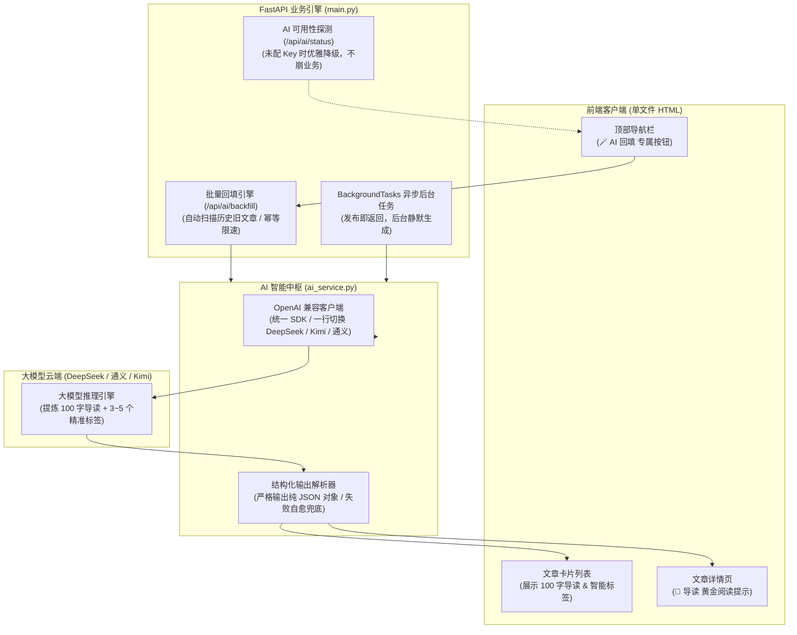
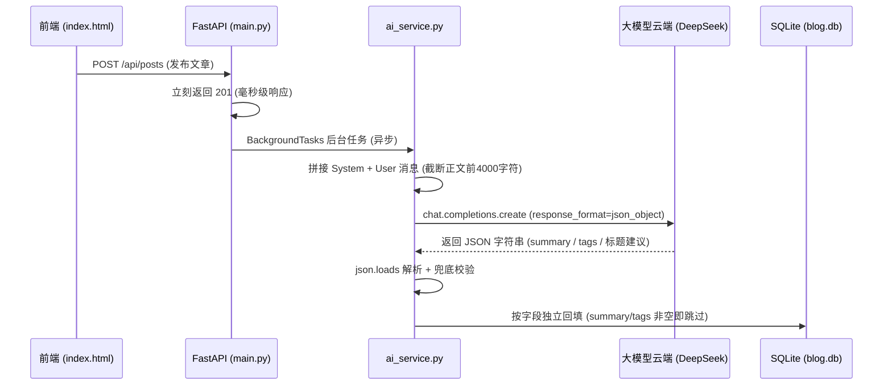
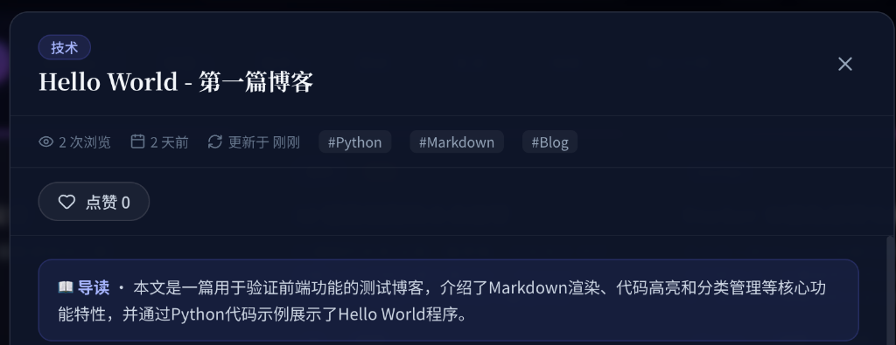
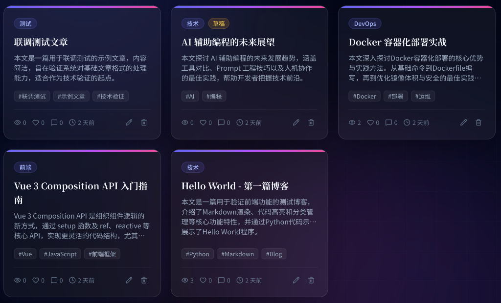
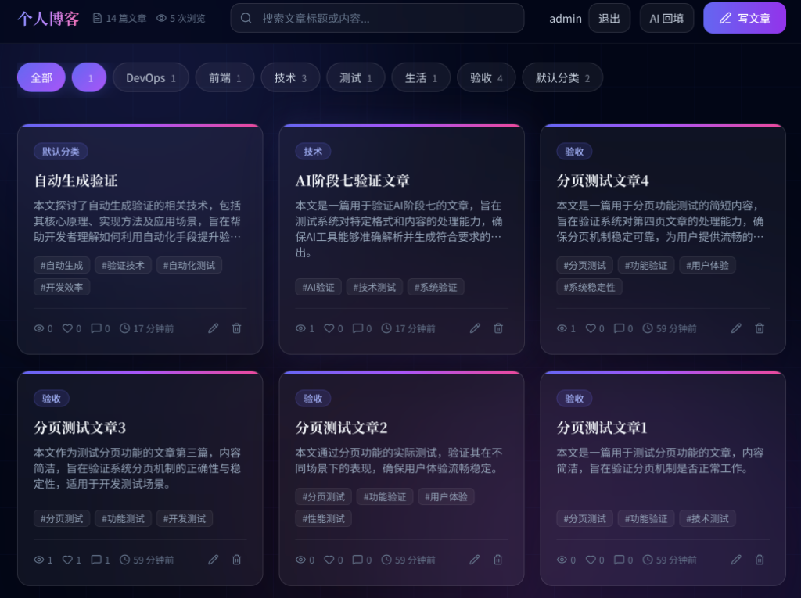
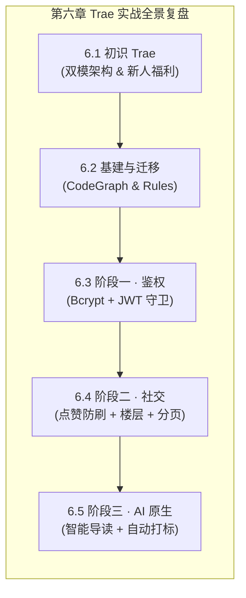

# 6.5 阶段三实战：AI 原生赋能（智能摘要提炼与自动打标）

> **本节导读**：在前面的两个阶段中，我们成功完成了用户鉴权体系与社交分页重构。在本节中，我们将为博客系统注入最前沿的 **AI 原生（AI-Native）超能力** —— 接入大模型 API，实现文章 100 字黄金导读自动提炼、内容感知自动打标与存量历史文章一键批量回填！同时，我们将贯彻\*\*“先列计划到 `docs/` 再做 OpenSpec 规格演进”\*\*的高效工程心智，为整个第六章的二次开发实战画上圆满的句号！

***

## 💡 一、生活化大比喻：智能导读与灵感副驾

在将大模型接入博客前，我们先通过通俗的生活场景理解这套 AI 原生架构：



- 📖 **100 字导读摘要**：就像是**专业的报刊特约主编**。读者面对几千字的长文不用逐字通读，AI 主编一秒提炼出吸引读者的百字黄金导读，快速抓住核心亮点；
- 🏷️ **内容感知自动打标**：就像是**图书馆的智能分类标签机**。根据文章的技术栈与内容主题，自动打上 `#Python #Markdown #Blog` 等精准标签，便于全站聚合检索；
- 🪄 **存量批量回填（Backfill）**：就像是**数字档案馆的历史文献翻新机器人**。面对此前已经发布的几十篇旧文章，无需人工一篇篇点开编辑，点击一次「AI 回填」，后台自动逐篇补齐导读与标签；
- 🛡️ **优雅降级（Graceful Degradation）**：如果暂时没有配置 API Key，博客的所有核心功能（发布、编辑、浏览、评论、点赞）依然 100% 正常运转，绝不因 AI 服务不可用而导致系统崩溃！

***

## 📋 二、实战开发流程：计划先行与 OpenSpec 驱动

在开启本阶段前，我们先分享一个非常关键的工程开发习惯：

```
💡 核心开发心智 —— 计划先行：
在真实团队与个人开发中，强烈建议大家：
“先列一份详细的计划文档到 docs/ 目录下，再围绕计划文档开展 OpenSpec 规格演进！”

这样做有两大核心优势：
1. 思考更沉着：在动代码前先与 AI 充分讨论边界、异常处理与降级策略；
2. 方便版本回溯与 Git 回滚：所有的设计决策白纸黑字留档，后续追溯一目了然！
（注：本教程到现在一直保持纯净本地改动未提交，同学们不用着急，下一章我们将正式系统性引入 Git 版本控制！）
```

***

### 1. 向 AI 发送意图 Prompt

在 Trae 对话框中输入以下指令，与 AI 展开方案规划：

```
列计划文档关于：AI 原生赋能（智能摘要提炼与自动打标）
放在docs/下，有什么模糊的地方可以和我讨论。
```

AI 会深入分析当前工程代码，并在 `docs/` 目录下生成完整的实施蓝图：[`docs/phase07_AI智能摘要提炼与自动打标.md`](file:///Users/cheng/Desktop/vibe_coding/06_Trae%E5%AE%9E%E6%88%98/project_01_%E4%B8%AA%E4%BA%BA%E5%8D%9A%E5%AE%A2%E7%B3%BB%E7%BB%9F%E4%BA%8C%E6%AC%A1%E5%BC%80%E5%8F%91/docs/phase07_AI%E6%99%BA%E8%83%BD%E6%91%98%E8%A6%81%E6%8F%90%E7%82%BC%E4%B8%8E%E8%87%AA%E5%8A%A8%E6%89%93%E6%A0%87.md)。

***

### 2. 关键决策锁定

- **统一客户端**：采用标准的 `openai` Python SDK，配合 `base_url` 一行切换大模型供应商（默认推荐性价比极高的 DeepSeek：`https://api.deepseek.com`）；
- **人工输入优先原则**：发布或更新文章时，如果作者已经手动输入了摘要或标签，AI **绝不强行覆盖**；仅在字段为空时进行自动补齐；
- **异步后台执行**：发布文章时采用 FastAPI 的 `BackgroundTasks` 异步处理，前端发文毫秒级响应，无需等待大模型生成完毕。

***

### 3. 环境变量配置（重要步骤！）

为了保护敏感密钥不被泄露，项目严格遵守\*\*“API Key 100% 环境变量注入”\*\*红线：

在 `project_01_个人博客系统二次开发/` 根目录下，参考 `.env.example` 创建 **`.env`** 文件，并填入你自己的大模型凭据：

```ini
# .env 配置文件
LLM_API_KEY=sk-your-actual-api-key-here
LLM_BASE_URL=https://api.deepseek.com
LLM_MODEL=deepseek-chat
```

> ⚠️ **关键操作提示**：
> 配置文件填写完成后，**务必重新启动项目服务器**（在终端按 `Ctrl+C` 停止后重新运行 `uv run uvicorn main:app --reload --port 8000`），让最新的环境变量加载生效！

***

## 💻 三、核心架构与落地代码全景拆解

### 1. 🗄️ ORM 模型层：`models.py`（为 `Post` 增加 `summary` 字段）

```python
class Post(Base):
    __tablename__ = "posts"

    id: Mapped[int] = mapped_column(Integer, primary_key=True, autoincrement=True)
    title: Mapped[str] = mapped_column(String(200), nullable=False)
    content: Mapped[str] = mapped_column(Text, nullable=False)
    summary: Mapped[str] = mapped_column(Text, default="")  # 🤖 AI 生成的 100 字导读
    category: Mapped[str] = mapped_column(String(50), default="默认分类")
    tags: Mapped[str] = mapped_column(String(200), default="")
    status: Mapped[str] = mapped_column(String(20), default="published")
    views: Mapped[int] = mapped_column(Integer, default=0)
    created_at: Mapped[datetime] = mapped_column(default=datetime.now)
    updated_at: Mapped[datetime] = mapped_column(default=datetime.now, onupdate=datetime.now)
```

***

### 2. 🤖 独立 AI 模块：`ai_service.py`（结构化输出与解析）

```python
"""AI 智能中枢模块：OpenAI 兼容客户端与结构化生成"""
import json
import os
from openai import OpenAI

LLM_API_KEY = os.getenv("LLM_API_KEY", "")
LLM_BASE_URL = os.getenv("LLM_BASE_URL", "https://api.deepseek.com")
LLM_MODEL = os.getenv("LLM_MODEL", "deepseek-chat")

_client: OpenAI | None = None

def ai_enabled() -> bool:
    """判断是否配置了 API Key"""
    return bool(LLM_API_KEY)

def get_client() -> OpenAI:
    global _client
    if _client is None:
        _client = OpenAI(api_key=LLM_API_KEY, base_url=LLM_BASE_URL)
    return _client

def generate_all(title: str, content: str, category: str = "") -> dict:
    """调用大模型，严格输出 JSON 结构化数据"""
    system = (
        "你是中文技术博客的编辑助手。严格只输出 JSON 对象，不要输出任何解释或 Markdown。"
        "字段说明："
        "summary：根据正文提炼约 100 字的中文导读（吸引读者、点明主旨，不含 HTML）；"
        "tags：根据正文内容提取 3~5 个标签，放入字符串数组；"
        "title_suggestion：一个更吸引人的标题建议；"
        "category_suggestion：一个合适的分类名建议。"
    )
    user = f"标题：{title}\n现有分类：{category}\n正文：\n{content[:4000]}"
    
    resp = get_client().chat.completions.create(
        model=LLM_MODEL,
        messages=[{"role": "system", "content": system}, {"role": "user", "content": user}],
        response_format={"type": "json_object"},
        temperature=0.4,
    )
    return json.loads(resp.choices[0].message.content)
```

***

### 3. 🚀 业务路由与后台任务：`main.py`

```python
from fastapi import BackgroundTasks
from dotenv import load_dotenv
import ai_service

# 加载 .env 环境变量
load_dotenv()

def _auto_enrich_post(post_id: int):
    """后台异步任务：自动补齐文章的导读与标签（尊重人工已有输入）"""
    with database.SessionLocal() as db:
        post = db.query(Post).filter(Post.id == post_id).first()
        if not post: return
        try:
            res = ai_service.generate_all(post.title, post.content, post.category)
            if not post.summary and res.get("summary"):
                post.summary = res["summary"]
            if not post.tags and res.get("tags"):
                post.tags = ",".join(res["tags"])
            db.commit()
        except Exception as e:
            print(f"[AI 异步生成失败] 文章 {post_id}: {e}")

# 批量回填历史旧文章
@app.post("/api/ai/backfill", response_model=BackfillResponse)
def backfill_ai(
    limit: int = Query(50, ge=1, le=200),
    db: Session = Depends(database.get_db),
    _: User = Depends(security.require_admin),
):
    if not ai_service.ai_enabled():
        raise HTTPException(status_code=503, detail="未配置 LLM API Key，AI 服务不可用")
    posts = db.query(Post).filter(Post.summary == "").limit(limit).all()
    updated, failed = 0, 0
    for p in posts:
        try:
            res = ai_service.generate_all(p.title, p.content, p.category)
            if res.get("summary"): p.summary = res["summary"]
            if not p.tags and res.get("tags"): p.tags = ",".join(res["tags"])
            db.commit()
            updated += 1
        except Exception:
            failed += 1
    return BackfillResponse(total=len(posts), processed=len(posts), updated=updated, failed=failed)
```

***

## 🧠 三点五、AI 原生能力底层原理深挖

### 1. 🧬 一次 LLM 调用的完整链路：从请求到 JSON 落库



- **请求侧**：把“系统指令（System，定义角色与输出规则）”和“用户内容（User，贴入文章标题与正文）”组成消息数组发给大模型；
- **关键参数**：`temperature=0.4` 让输出更收敛稳定（数值越低越保守、越高越发散）；`response_format={"type":"json_object"}` 强制模型只输出合法 JSON 对象；
- **响应侧**：拿到模型返回的文本后用 `json.loads` 解析成 Python 字典，再按字段回填数据库。

---

### 2. 🎯 为什么必须“结构化输出 + 解析兜底”？（红线第 16 条的精髓）

大模型本质是“概率预测下一个字”的机器，**它并不保证每次输出都是合法 JSON**——可能多一句解释、可能漏一个逗号、可能字段名拼错。所以工业级做法是“双保险”：

1. **软约束**：`response_format={"type":"json_object"}` 从源头大幅提高“输出纯 JSON”的概率；
2. **硬兜底**：`json.loads` 解析失败时捕获异常，不把脏数据写进数据库（本项目中 `generate_all` 若抛错，会被上层 `try/except` 捕获并记录，绝不拖垮发布/浏览主流程）。

> 🧠 **一句话理解**：模型输出是“野马”，`response_format` 是缰绳，解析兜底是“驯马师手里的备用绳索”——缰绳断了还有绳索兜住，绝不会让野马撒欢把系统踩坏！

---

### 3. ⚖️ 同步调用 vs 异步后台任务（BackgroundTasks）——为什么要“先返回后干活”？

| 维度 | 同步调用（边等边响） | 异步后台任务（先返回后干活） |
| :--- | :--- | :--- |
| **用户体感** | 点“发布”后卡住等待大模型生成（可能 5~20 秒） | 发布毫秒级返回，生成在后台悄悄进行 |
| **系统吞吐** | 请求长时间占用连接，并发稍高就超时 | 连接迅速释放，高并发无忧 |
| **实现方式** | 在路由函数里直接调 `generate_all` | 用 FastAPI 的 `BackgroundTasks` 把生成函数挂到后台执行 |
| **适用场景** | 必须立刻返回 AI 结果（如在线问答） | AI 辅助增强、批量回填等“可后补”任务 |

> 💡 我们的博客发布文章属于**用户核心主流程**，绝不能因为 AI 慢而卡住发布，因此果断选择**异步后台任务**；而批量回填接口（`/api/ai/backfill`）属于显式触发、逐篇处理，则采用同步循环 + 失败计数的方式，逻辑更直观可控。

---

### 4. 🛡️ 优雅降级（Graceful Degradation）：AI 挂了，博客也不能瘫

我们在 `ai_service.py` 中通过 `ai_enabled()` 判断是否配置了 API Key，并在所有 AI 接口中做了**“未配置 / 调用失败 → 按约定返回 503/502”**的处理：

- 未配置 Key：`/api/ai/backfill` 直接返回 `503 未配置 LLM API Key`；
- 调用失败：后台任务捕获异常仅打印日志，**不影响**文章的发布、浏览、评论、点赞等全部主流程。

> 🧠 **心智模型**：AI 能力就像餐厅的**“隐藏菜单”**——有食材（Key）就给你现做，没食材就礼貌回绝（503），但绝不影响你正常点餐（博客主流程）。这就是**“AI 是增强项，不是依赖项”**的工程哲学。

---

### 5. 💰 成本与性能控制三板斧（为什么正文要 `content[:4000]`）

1. **上下文截断**：只把正文前 4000 字符发给模型——提炼导读与打标根本不需要读完全文，大幅省 Token；
2. **单次复用**：`generate_all` 一次调用同时产出摘要 + 标签 + 标题建议 + 分类建议（**4 个能力一次请求**），而不是拆成 4 次调用，成本降低约 75%；
3. **批量限速与幂等**：批量回填接口默认 `limit=50`（上限 200），避免一次打爆 API 配额；且只处理 `summary == ""` 的文章，绝不重复生成（天然幂等）。

> 💡 **通用经验法则**：任何 AI 功能的落地都要先问自己三句话——**“信息够吗？（截断策略）”、“一次能干完吗？（合并请求）”、“失败怎么办？（降级/兜底）”**。

***

## 🏆 四、终极验收与高光效果展示

项目重启后，我们进入浏览器进行全方位的终极验收体验：

### 1. 顶部导航专属「🪄 AI 回填」按钮

登录 `admin` 账号后，顶部导航栏在「写文章」按钮左侧多出了一个精致的 **`🪄 AI 回填`** 操作按钮：


点击该按钮后，系统会自动调用 `/api/ai/backfill` 接口，毫秒级为全站所有未生成导读的历史文章完成批量补全，并弹出成功 Toast 提示！

***

### 2. 文章详情页高光「📖 导读」卡片

点开任意一篇文章（如 `Hello World - 第一篇博客`），在正文内容上方赫然呈现出暗黑深蓝质感的 **「📖 导读」卡片**：



> **导读实测效果**：
> *“📖 导读 · 本文是一篇用于验证前端功能的测试博客，介绍了Markdown渲染、代码高亮和分类管理等核心功能特性，并通过Python代码示例展示了Hello World程序。”* —— 概括极度精炼准确！

***

### 3. 首页卡片智能摘要与多维标签全景

回到首页，每张文章卡片不仅拥有精简的 100 字导读，更被整齐打上了 3\~5 个精准的 AI 标签（如 `#Docker #部署 #运维`、`#Vue #JavaScript #前端框架`、`#AI #编程` 等）：



***

### 4. 博客系统全貌终极大合影（14 篇文章完美交付）

至此，我们的全栈个人博客系统完成了从无到有、从简单单表到拥有 **用户鉴权 + 角色隔离 + 防刷点赞 + 楼层评论 + 性能分页 + AI 原生导读打标** 的现代化全功能蜕变：



***

## 🎉 五、第六章全章圆满完结

经过六个小节的沉浸式实战，我们完整走通了基于 **Trae** 的生产级项目二次开发全流程：



1. **从零认知到 IDE 老法师**：掌握了 Trae Work 与 Trae Code 的双模差异，学会了利用可视化 Diff 审查与单文件精准撤销；
2. **规范驱动与工程上下文**：深刻理解了 `openspec init`、CodeGraph 代码图谱与模块化 `.trae/rules/` 在工程中的降维打击能力；
3. **两大核心工作流游刃有余**：
   - 需要精细化讨论架构设计时 ➔ 熟练运用 **Plan 模式**；
   - 面对确定性批量重构时 ➔ 放手让 **SOLO 模式** 自主闭环自测自修；
4. **高质量代码与 ATDD** ：全套 71+ 个自动化测试用例全绿通过，分层严密，绝无安全漏洞与屎山代码！

> 🌟 **写在最后**：
> **本项目到此已经正式完结了！** 恭喜每一位坚持敲到这里的同学！从最初的一个极简原型，到如今兼具工业级安全、社交互动与 AI 超能力的现代化全栈博客，你已经真正掌握了 Vibe Coding 的核心心智。
>
> 期待同学们的专属个性化作品！在下一章中，我们将正式迈入团队协作、Git 工作流与更高阶的多智能体编排世界！我们下一章见！🚀

