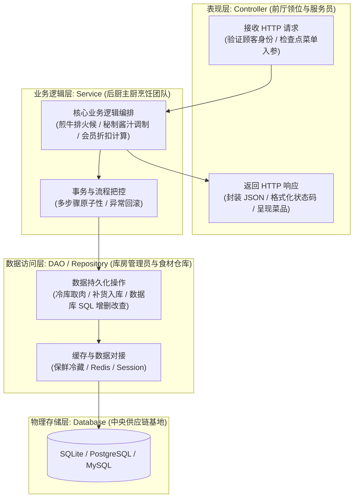
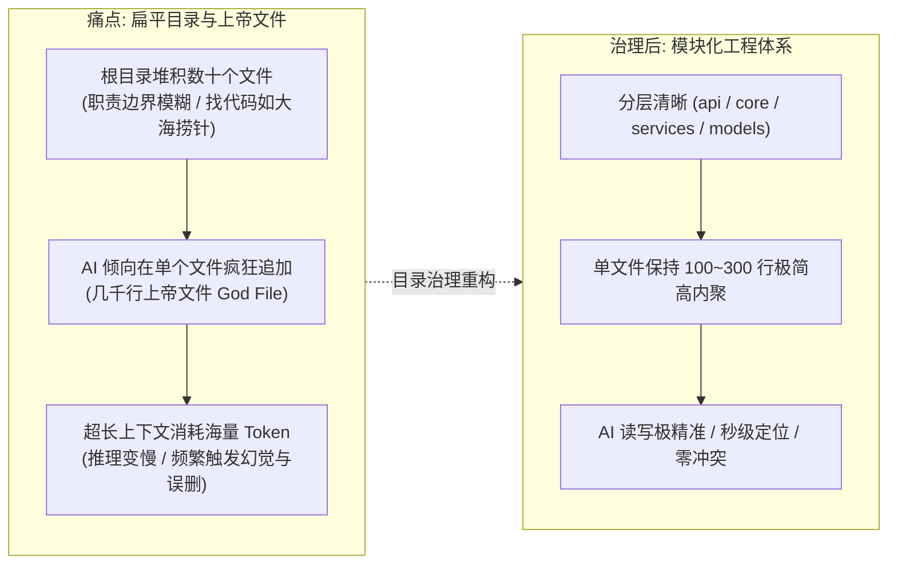
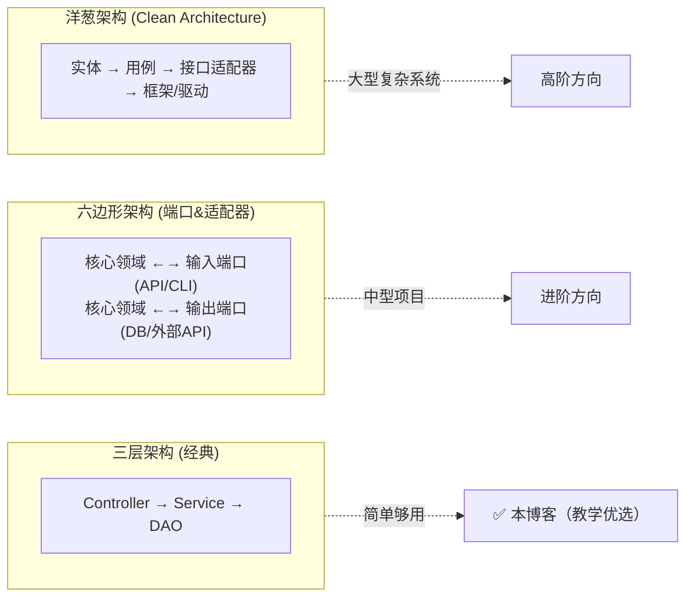
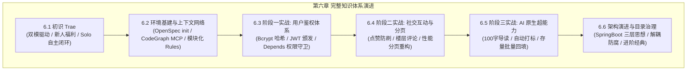

# 6.6 架构演进与目录治理：从 SpringBoot 三层架构到现代化全栈解耦

> **本节导读**：在前面的小节中，我们完成了博客系统从用户鉴权、防刷点赞、楼层评论、高性能分页，到 AI 原生导读打标的全部功能。然而，当一个项目的功能越来越多时，如果我们把所有代码依然平铺在根目录下，项目很快就会演变成难以维护的“代码泥潭”。本节我们将从经典软件工程的 **SpringBoot 三层架构** 讲起，深度剖析为什么必须进行**目录治理（Directory Governance）**，揭秘 AI Agent 天生的“单文件偷懒劣根性”，并给出贴合企业级实战的现代化全栈解耦重构方案与进阶学习宝典！

***

## 💡 一、生活化大比喻：SpringBoot 三层架构的工程美学

在企业级后端开发（尤其是 Java / Spring 生态）中，最经典、最经受得住数十年考验的设计范式莫过于 **Controller-Service-DAO/Repository 三层架构**。

我们用一个**高档米其林餐厅的运转流程**来形象理解三层架构的核心精髓：



### 🍽️ 餐厅角色深度对照：

1. **表现层 ——** **`Controller`（前厅服务员）**：
   - **职责单一**：只负责微笑迎宾、校验顾客菜单有没有漏填（参数校验与 DTO 转换）、收银与递送餐品（返回响应体与状态码）；
   - **绝不下厨**：服务员绝不能亲自跑到后厨切肉炒菜！如果 Controller 里写满了数据库查询与复杂计算，前厅就会乱成一锅粥。
2. **业务逻辑层 ——** **`Service`（后厨主厨）**：
   - **核心灵魂**：专注业务流程编排（比如发文章时先检查敏感词、再扣减配额、再调用 AI 异步生成导读）；
   - **不问出处**：主厨只管把菜做好，他不关心这份订单是来自堂食客人（Web 端）、外卖骑手（移动端 App）还是电话预定（第三方 API 调用）。
3. **数据访问层 ——** **`DAO / Repository`（食材仓库管理员）**：
   - **专司存取**：只负责按照主厨的指令去冷库（数据库）拿取或存放指定 ID 的食材；
   - **不问用途**：库管员绝不关心这块牛排是要做成全熟还是七分熟，保证存取高效、无脏数据即可。

> 🌟 **软件工程第一性原理**：三层架构的核心在于 **关注点分离（Separation of Concerns）** 与 **单一职责原则（Single Responsibility Principle, SRP）**。层与层之间通过清晰的接口契约通信，杜绝越俎代庖！

***

## 🌪️ 二、为什么要进行目录治理？（痛点直击与 AI 劣根性剖析）

在刚才的博客开发中，为了让初学者在单屏内快速看清全貌，我们采用了相对扁平的目录（`main.py`、`models.py`、`schemas.py`、`security.py`、`ai_service.py` 全部放在工程根目录下）。

但一旦项目继续演进，这种扁平结构就会暴露出极其致命的痛点：



### 1. 痛点一：根目录“扁平大杂烩”，工程职责混乱

- 当模块从 1 个增加到 10 个（文章、用户、评论、点赞、AI、支付、搜索、通知、埋点...），根目录下会瞬间堆满上百个文件；
- 开发者很难一眼看出“哪些是给前端调用的接口路由，哪些是核心底层安全配置，哪些是纯粹的业务算法”，团队协作时极易产生 Git 代码合并冲突（Merge Conflicts）。

### 2. 痛点二：直击 AI Agent 的“单文件偷懒劣根性”与 Token 吞噬陷阱 ⚠️

在日常使用 AI 编程（无论是 Cursor、Trae、Claude Code 还是 OpenCode）时，所有开发者都会遇到一个非常经典的现象：

- **AI 天生喜欢“单文件偷懒”**：当你让 AI “新增一个点赞接口”时，如果项目没有强制分层规范，AI 会本能地把点赞的数据模型、Pydantic 校验、权限判断、数据库查询甚至前端 HTML 模板**一口气全塞进** **`main.py`** **末尾**！
- **“上帝文件（God File）”的诞生**：不知不觉中，`main.py` 膨胀到了 3000\~5000 行代码，变成了一个无所不能但谁也看不懂的巨无霸；
- **致命反噬 —— 上下文超载与频繁幻觉**：
  1. AI 每次想要修改其中一个微小功能，都必须把整个几千行的文件从头读到尾，**白白消耗大量 Tokens，响应速度越来越慢**；
  2. 超出模型注意力聚焦范围后，AI 极易在生成代码时**误删掉文件其他区域的关键逻辑**，导致“按下葫芦浮起瓢”，修一个 Bug 引入三个新 Bug！

### 3. 痛点三：软件工程的可测试性与并行开发

- 在扁平结构下，业务逻辑和数据库查询死死纠缠在路由函数里，想要对复杂的点赞防刷或批量回填算法写单元测试，必须每次都启动真实的数据库和 HTTP 服务；
- 治理后将业务抽离至 `services/`，我们可以轻松对业务逻辑进行纯粹的单元测试（Mock 掉底层网络与 IO），**测试执行速度提升 100 倍**，且不同工程师可以同时独立开发各自的 Service！

***

## 📐 三、当前博客系统的目录治理重构建议方案

针对我们当前打磨好的全栈个人博客系统，我们推荐一套完全契合 **FastAPI 官方生产级最佳实践** 与 **经典三层解耦思想** 的现代化工程目录治理蓝图（这样是不是工程性就来了，让你的ai给你拆分一下吧！）：

```
project_01_个人博客系统二次开发/
├── backend/                              # 🐍 后端工程化主目录
│   ├── app/                              # 核心应用源码
│   │   ├── api/                          # 🚪 表现层 (Controller / Routers)
│   │   │   ├── v1/                       # API 版本控制 (便于未来平滑升级)
│   │   │   │   ├── auth.py               # 用户登录鉴权、Token 颁发
│   │   │   │   ├── posts.py              # 文章增删改查、参数化分页
│   │   │   │   ├── comments.py           # 楼层评论发表、权限删除
│   │   │   │   ├── likes.py              # 点赞防刷、取消点赞
│   │   │   │   └── ai.py                 # AI 导读提炼、批量回填接口
│   │   │   └── api.py                    # 集中聚合注册所有子路由
│   │   ├── core/                         # 🛡️ 核心基建与基础配置
│   │   │   ├── config.py                 # Pydantic BaseSettings 强类型配置
│   │   │   ├── security.py               # Bcrypt 哈希算法、JWT 签发与权限守卫
│   │   │   └── database.py               # SQLAlchemy 连接池引擎与 SessionLocal
│   │   ├── models/                       # 🗄️ 数据持久层实体模型 (ORM Entities)
│   │   │   ├── user.py                   # User 数据表定义
│   │   │   ├── post.py                   # Post 数据表定义
│   │   │   ├── comment.py                # Comment 数据表定义
│   │   │   └── like.py                   # Like 数据表定义 (含复合唯一索引)
│   │   ├── schemas/                      # 📋 数据契约传输层 (Pydantic DTOs)
│   │   │   ├── user.py                   # 用户相关请求与响应 DTO
│   │   │   ├── post.py                   # 文章相关请求与分页 DTO
│   │   │   ├── comment.py                # 评论入参与楼层出参 DTO
│   │   │   └── ai.py                     # AI 结构化输出校验 DTO
│   │   ├── services/                     # 👨‍🍳 业务逻辑服务层 (Business Logic)
│   │   │   ├── post_service.py           # 复杂文章分页过滤、批量聚合统计
│   │   │   ├── social_service.py         # 幂等点赞计算、楼层排序与级联删除
│   │   │   └── ai_service.py             # 大模型 OpenAI 客户端与 JSON 解析
│   │   └── main.py                       # 🚀 应用装配总入口 (Lifespan、CORS、中间件挂载)
│   ├── tests/                            # 🧪 现代化自动化测试矩阵 (ATDD)
│   │   ├── conftest.py                   # 全局 TestClient Fixture 与内存测试库
│   │   ├── test_auth.py                  # 鉴权安全专项测试套件
│   │   ├── test_posts.py                 # 文章 CRUD 与分页专项测试
│   │   ├── test_social.py                # 社交点赞防刷与楼层专项测试
│   │   └── test_ai.py                    # AI 导读与批量回填 Mock 测试
│   ├── pyproject.toml                    # uv 依赖管理声明
│   ├── uv.lock                           # 依赖锁版本
│   └── .env.example                      # 环境变量脱敏示例模版
│
├── frontend/                             # 🎨 前端工程化目录
│   ├── public/                           # 静态资源 (图标、Favicon)
│   └── index.html                        # 单文件高颜值玻璃拟态前端
│
├── docs/                                 # 📝 演进蓝图与设计计划 (计划先行留档)
├── reference/                            # 📦 历史已验收规格归档区 (上下文物理隔离)
├── .trae/                                # 🤖 Trae 专属智能体大脑与规则
│   ├── rules/
│   │   ├── backend.md                    # 后端开发红线与分层规范
│   │   ├── frontend.md                   # 前端样式与 Skills 调度规范
│   │   └── general.md                    # CodeGraph 先行与通用规范
│   └── skills/                           # 专属技能工具包
└── agents.md / .traerules                # 全局最高军纪与纪律红线
```

### 💡 治理后的四大质变提升：

1. **单文件代码极其精简**：每个 Python 文件控制在 50\~150 行之间，职责无比纯粹；
2. **AI 理解效率飞跃**：当需要修复评论相关 Bug 时，Trae Agent 配合 CodeGraph 只需读取 `api/v1/comments.py`、`models/comment.py` 和 `services/social_service.py` 3 个小文件，**消耗 Token 减少 80%，响应速度提升 3 倍**！
3. **路由版本平滑演进**：引入 `api/v1/` 命名空间，未来升级 v2 接口时绝不影响线上既有调用方；
4. **前后端完全解耦**：前端既可以维持当前的轻量级单文件 `index.html`，未来也可以无缝平移重构成 Vue 3 / React / Next.js 独立工程！

***

## 📚 四、目录治理进阶宝典：经典著作、权威规范与 AI Skills

为了帮助同学们从“写代码的小工”蜕变成为“懂架构的系统级工程师”，我们精选了软件工程领域数十年沉淀的权威著作与前沿 Agent 治理技能：

### 1. 📖 必读传世经典著作推荐

| 著作名称                               | 核心作者                         | 为什么强烈推荐？                                                                                                     |
| :--------------------------------- | :--------------------------- | :----------------------------------------------------------------------------------------------------------- |
| **《代码整洁之道》(Clean Code)**           | Robert C. Martin (Uncle Bob) | 软件工程领域的“圣经”。深入讲解了函数短小、单一职责、有意义的命名与消除重复代码（DRY），是每一位优秀程序员的案头必备。                                                |
| **《整洁架构》(Clean Architecture)**     | Robert C. Martin (Uncle Bob) | 系统讲解了依赖倒置原则（Dependency Inversion Rule）与架构边界划分。教你如何让核心业务逻辑独立于 UI、框架、数据库和外部工具，构建具有超长生命周期的弹性系统。                 |
| **《企业应用架构模式》(PoEAA)**              | Martin Fowler                | 软件架构大师 Martin Fowler 的巅峰之作。系统性梳理了三层架构、数据映射器（Data Mapper）、事务脚本（Transaction Script）与领域模型（Domain Model）的权威选型依据。 |
| **《领域驱动设计》(Domain-Driven Design)** | Eric Evans                   | 复杂大型软件工程的终极武器。讲解如何将系统按业务领域（Domain）划分为限界上下文（Bounded Context），指导微服务与微模块的目录拆分。                                  |

***

### 2. 🔗 权威官方规范与开源参考

- **FastAPI 官方生产级全栈项目模板**：[fastapi/full-stack-fastapi-template (GitHub)](https://github.com/fastapi/full-stack-fastapi-template) —— 官方出品的黄金架构标准，涵盖分层、Alembic 迁移、Docker 编排与安全基准；
- **Martin Fowler 架构专栏**：[martinfowler.com/architecture/](https://martinfowler.com/architecture/) —— 深入剖析分层架构（Layered Architecture）的演进与边界设计；
- **FastAPI 复杂应用拆分官方指南**：[FastAPI Bigger Applications 指南](https://fastapi.tiangolo.com/tutorial/bigger-applications/) —— 官方教学如何使用 `APIRouter` 进行多文件组织与依赖注入。

***

### 3. 🤖 赋能 AI Agent 的目录治理 Skills 与实战 Prompt 模板

在日常 Vibe Coding 开发中，我们可以给 Trae Agent 注入专门的\*\*“反上帝文件守卫”**规则与**“架构重构”\*\*技能，让 AI 主动守护清晰的工程目录！

#### 🛠️ 推荐给 AI 的守卫 Prompt 模板：

```markdown
# 架构守卫与重构 Prompt 指令
角色：你是一位资深软件架构师，精通 Clean Architecture 与 FastAPI 三层架构。
任务：请审查当前项目代码并进行目录治理重构：
1. 严格遵守单一职责原则，禁止在单个文件中杂糅路由、业务逻辑与数据库查询；
2. 将 models、schemas、services、routers 独立拆解到对应分层子目录；
3. 确保所有文件保持在 200 行以内高内聚结构；
4. 重构过程中严格遵守 ATDD 守卫，确保既有 pytest 测试用例 100% 绿灯通过！
```

***

## 🧭 四点五、架构思想升华：SOLID 原则、前沿架构流派与“坏味道”检测

### 1. 📏 SOLID 五大设计原则（面试必背 · 架构的“宪法”）

| 原则    | 全称           | 生活化比喻                   | 在我们项目中的体现                                                                       |
| :---- | :----------- | :---------------------- | :------------------------------------------------------------------------------ |
| **S** | 单一职责原则 (SRP) | 一个厨师只负责一道菜，不身兼采购+洗碗+收银  | 路由（main.py）、模型（models.py）、校验（schemas.py）、安全（security.py）、AI（ai\_service.py）各司其职 |
| **O** | 开闭原则 (OCP)   | 餐厅加新菜只加菜单，不用重装修厨房       | 新增评论/点赞接口无需改动既有文章接口，向后兼容扩展                                                      |
| **L** | 里氏替换原则 (LSP) | 换一个牌子的叉车，操作方式不能变        | 模型替换（如换 ORM）时，上层调用契约保持稳定                                                        |
| **I** | 接口隔离原则 (ISP) | 顾客只需要一张菜单，而不是一本《餐厅经营大全》 | 按 `LoginRequest` / `PostCreate` / `CommentCreate` 拆分细粒度 DTO                     |
| **D** | 依赖倒置原则 (DIP) | 主厨依赖“菜谱规范”，而不是依赖某个特定供应商 | 路由依赖 `Depends` 抽象守卫，而不是在函数里硬编码鉴权逻辑                                              |

> 🧠 **为什么 Vibe Coding 时代 SOLID 更重要？** 因为 AI 会“忠实执行”你的代码结构暗示——你把文件拆得职责清晰，AI 就知道去哪找、往哪改；你把一堆逻辑糊在一个 5000 行的“上帝文件”里，AI 就会继续往里面疯狂追加，直到把项目糊成屎山。**目录即契约，结构即规范！**

***

### 2. 🗺️ 三层架构 vs 六边形架构 vs 洋葱架构（架构流派全景）



- **三层架构（Controller-Service-DAO）**：我们本章的“主教练”。够用、直观、团队共识度高，是**大多数中小型项目的黄金起点**；
- **六边形架构（Hexagonal / Ports & Adapters）**：把核心业务放在“六边形中心”，周边用“端口（接口）”连接数据库、UI 等外部适配器。核心业务与外部世界彻底解耦，更换数据库/框架如换插座一样轻松；
- **洋葱架构（Clean Architecture）**：Robert Martin 在《Clean Architecture》中提出的升级版。依赖方向永远“从外向内”——框架、数据库、UI 是最外层，可随时替换；核心实体与用例在最内层，永不依赖外部细节。

> 💡 **演进路线建议**：**先熟练三层架构 → 再理解六边形 → 最后掌握 Clean Architecture**。本教程采用三层 + 模块化目录，已经为未来的架构升级铺好了“换层不换芯”的路径。

***

### 3. 🚨 “坏味道”自测清单：你的项目需要目录治理了吗？

| 检测信号                                 | 危险程度  | 应对建议                            |
| :----------------------------------- | :---- | :------------------------------ |
| 单个 `.py` 文件超过 **500 行**              | 🔴 高危 | 立即拆分：路由与业务逻辑分离                  |
| 同一文件里同时出现 `@app.post`、SQL 查询、前端 HTML | 🔴 高危 | 三层职责混装，按 api/services/models 拆分 |
| 新建一个功能要改 5+ 个不相关文件                   | 🟡 中危 | 关注点耦合，考虑引入 Service 层收拢          |
| 测试用例需要启动完整数据库和 HTTP 服务               | 🟡 中危 | 业务逻辑抽离到 services 后可纯单元测试        |
| 代码复制粘贴现象频发                           | 🟡 中危 | 提取公共函数/基类（DRY）                  |
| 一个文件里堆着 10+ 个 `import` 且互相无关联        | 🟢 观察 | 职责开始发散，规划拆分                     |

***

### 4. 🛠️ 目录治理实操六步法（照着做，今天就能重构你的项目）

1. **先备份基线**：跑一次 `uv run pytest -q` 全绿存档，作为重构的“安全垫”；
2. **画依赖图**：让 AI 用 CodeGraph `codegraph_explore` 输出当前模块调用关系，理清谁依赖谁；
3. **从外到内拆**：先建 `backend/app/api/v1/`（路由层）→ 再拆 `services/`（业务层）→ 再拆 `models/`、`schemas/`（数据契约层）；
4. **一次只动一层**：每完成一层拆分立即跑测试，保持“始终绿灯”状态，避免大爆炸式重构；
5. **让 AI 打辅助**：把本章“架构守卫 Prompt”发给 Trae，让它按规范拆分，你只需在 Diff 视图审查；
6. **沉淀资产**：重构完成后同步更新 `agents.md`、`.trae/rules/` 与 `docs/`，把新目录结构写进“规则大脑”，让未来的 AI 都知道往哪放代码。

> 🎯 **本章终极彩蛋作业**：用 Trae 把当前博客工程按第三节的现代化目录蓝图做一次“目录治理重构”，保证 95 个 pytest 用例全程绿灯，然后把你的重构心得分享到社区！

***

## 🚀 五、第六章全章圆满大收官

至此，**《Vibe Coding 极速通关》第六章：Trae 实战** 的全部内容已经圆满交付！



