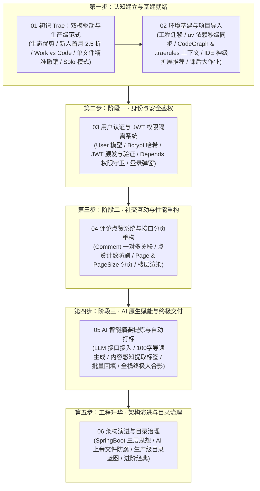

# 🚀 第六章：Trae 实战 —— 原生双模驱动与已有项目生产级二次开发

欢迎来到 **《Vibe Coding 极速通关》第六章：Trae 实战**！

在第五章中，我们体验了基于开源终端与多专家协同的 OpenCode 开发流，并落地了一套极简的全栈个人博客系统。而在本章，我们将聚焦当前最火爆、性价比极高且兼具跨端控制与编译器精准掌控力的新一代 AI IDE —— **Trae**！

> 💡 **打破“从零做玩具”的思维定式**：在企业日常开发中，极少有人天天从零搭建脚手架（“纯牛马全栈，说你呢”）。大部分真实任务要么是对已有遗留项目进行优化重构，要么是负责其中几个独立模块的开发。因此，本章我们将直接把第五章打磨好的**个人博客系统**导入 Trae 中，展开贴近工业级真实的“二次开发与演进实战”！

***

## 🌟 为什么说 Trae 是当前性价比与生产力的王道之选？

[Trae](https://www.trae.ai) 是由字节跳动推出的原生 AI 编程与工作流平台。它在继承 VSCode 强大生态的同时，带来了诸多革新性的生产力飞跃：

1. **双模引擎随心切（Work & Code）**：
   - **Trae Work**：不仅能写代码，还能做办公自动化、浏览器爬取与应用调度；
   - **Trae Code**：原汁原味的 VSCode 编译器体验，右侧专属 Agent 面板，支持精确到单文件的代码 Diff 审查与一键撤销。
2. **手机端跨设备远程操控**：
   - 手机端一键派发任务，桌面端防休眠持续推进，通勤路上也能享受 Vibe 心流；
3. **王牌 Solo 模式（自主 Agent 闭环）**：
   - 类似 Codex 的 Goal 模式，具备自主任务拆解、多轮推进执行、耗时看板与自省修复能力；
4. **超值新人福利与低成本试错**：
   - 每日签到免费领取可用额度，新人首月 Coding Plan 直接 2.5 折，真正为开发者省钱！

***

## 🧭 第六章全景知识图谱

***

## 📑 章节目录导航

点击下方链接逐一阅读各小节的保姆级图文教程与深度剖析：

1. **[6.1 初识 Trae：双模驱动、新人福利与生产级 IDE 新范式](./01_初识Trae：双模驱动、新人福利与生产级IDE新范式.md)**
   - 深入剖析为什么选 Trae 以及新人专属福利（每日签到领额度、2026 积分制资费速览、首月 2.5 折 Coding Plan）；
   - 生动拆解 Trae Work（全能调度管家）与 Trae Code（高精密数字化手术台）的双模架构，并带你认识 2026 年全新独立的 TraeWork 三端（网页/桌面/移动）AI 原生工作台；
   - 揭秘 IDE 编译器相比纯终端的核心优势：可视化 Diff 审查与单文件精准撤销，以及 CUE 仓库级智能补全、内置 Git 与智能代码审查、隐私模式与沙箱安全；
   - 领略王牌 Solo 模式的任务拆解、耗时看板、自主自省闭环，并掌握其内置的 Plan 模式 / Spec 模式、多任务并行与多智能体编排；
   - 阐明为什么本章采用“已有项目二次开发”而非从零做玩具的实战心智，附高频疑问 FAQ 速答。
2. **[6.2 环境基建与项目导入：在 Trae 中建立上下文与依赖安装](./02_环境基建与项目导入：在Trae中建立上下文与依赖安装.md)**
   - 项目工程无缝迁移（从 OpenCode 到 Trae）；
   - 历史已验收规格归档（新建 `reference/` 目录隔离已完成资产与新迭代规格）；
   - 跨 Agent 适配必备动作（`openspec init` 重新初始化为 Trae 适配）；
   - `uv` 极速依赖同步与测试基线验证（确保已有功能 100% 绿灯）+ **uv 秒级提速三大原理深挖**；
   - 注入 `AGENTS.md` 全局红线与模块化 `.trae/rules/`（按需省 Token），并配置 CodeGraph MCP 语义图谱协议 + **CodeGraph 建图/服务/查询三阶段原理与 MCP 协议科普**；
   - 针对初次使用 IDE 同学的 5 大新手神级扩展推荐（Live Server、Code Runner 等）；
   - 课后探索大作业（个性化配置、3 大杀手级功能脑暴与利用 AI 深度思考联网调研）；
   - **新增常见踩坑与排障锦囊**（uv 镜像源、CodeGraph 未安装、MCP 连接失败等 6 大高频问题对症下药）。
3. **[6.3 阶段一实战：用户认证与 JWT 权限隔离系统](./03_阶段一实战：用户认证与JWT权限隔离系统.md)**
   - 指挥官心智与 Plan 模式：用最小改造成本做高性价比方案决策；
   - 交互式决策树：角色权限制（reader 只读 / admin 可写）与启动种子管理员；
   - 实施蓝图落盘：保存阶段演进计划至 `docs/` 目录供 Agent 追溯；
   - Agent 自动推进 10 项 Task 清单（Bcrypt 加盐哈希 + JWT + 权限守卫）；
   - ATDD 验收测试驱动（42 个 pytest 用例 100% 绿灯通关）与 OpenSpec 自动归档；
   - **新增安全机制底层深挖**：JWT 三段式防篡改原理、Bcrypt 加盐慢哈希原理、OAuth2PasswordBearer 与 Depends 依赖注入链路、生产环境安全 Checklist 与防爆破进阶作业。
4. **[6.4 阶段二实战：评论与点赞社交系统 + 接口分页重构](./04_阶段二实战：评论点赞系统与接口分页重构.md)**
   - 切换 Trae 王牌 SOLO 模式：全自动闭环作战与端到端交付；
   - 宏观意图派发与规划落盘（`docs/phase06_评论点赞系统与接口分页重构.md`）；
   - 点赞防刷幂等设计（`UniqueConstraint`）与楼层评论升序渲染；
   - 接口分页重构（`Page & PageSize`）与批量聚合统计（告别 N+1 查询）；
   - 常见长链路机制解析（模型思考上限熔断与一键「继续」）；
   - Trae 内置浏览器全自动 UI 实测与 71 个 pytest 用例全绿通关；
   - 深度复盘：为什么 ATDD 与 OpenSpec 能够主动缩短模式差距（多智能体与混沌测试赋能）；
   - **新增面试高频考点深挖**：Offset / Cursor / Keyset 三种分页方案对比、N+1 问题与 `IN+GROUP BY` 根治原理、点赞幂等本质、级联删除与 XSS `escapeHtml` 三层防线。
5. **[6.5 阶段三实战：AI 原生赋能（智能摘要提炼与自动打标）](./05_阶段三实战：AI原生赋能智能摘要与自动打标.md)**
   - 计划先行心智（先列计划到 `docs/`，再做 OpenSpec 规格演进，方便后续 Git 回滚）；
   - OpenAI 兼容 API 接入（`openai` SDK + 一行切换 DeepSeek / 通义 / Kimi 等）；
   - 100 字黄金导读提炼与内容感知自动打标；
   - 异步后台生成（`BackgroundTasks`）与人工优先绝不强行覆盖机制；
   - 环境变量 `.env` 配置与项目重启；
   - 顶部导航「🪄 AI 回填」批量回填历史文章与全站终极验收大合影；
   - **新增 AI 原生能力底层深挖**：LLM 调用完整时序链路、`response_format` 结构化输出 + 解析兜底、同步 vs 异步后台任务对比、优雅降级心智模型、Token 成本控制三板斧。
6. **[6.6 架构演进与目录治理：从 SpringBoot 三层架构到现代化全栈解耦](./06_架构演进与目录治理：从SpringBoot三层架构到现代化全栈解耦.md)**
   - 经典 SpringBoot 三层架构（Controller-Service-DAO）的西餐厅运转大比喻；
   - 为什么要进行目录治理：直击根目录堆叠痛点与 AI Agent 的“单文件偷懒劣根性”；
   - 现代化全栈个人博客工程目录治理推荐重构蓝图（api / core / models / schemas / services）；
   - 进阶宝典：传世经典著作（《Clean Code》《Clean Architecture》《PoEAA》《DDD》）与 AI 治理 Skills / Prompt 模板；
   - **新增架构思想升华**：SOLID 五大原则对照表、三层/六边形/洋葱三大架构流派全景对比、项目“坏味道”自测清单与目录治理实操六步法。

***

## 📂 配套资源与目录

- **[agents.md](./agents.md)**：本章节 Trae 专属规则与协作指南；
- **[img/](./img/)**：本章节高清实战配图与架构图解；
- **[project_01_个人博客系统二次开发/](./project_01_个人博客系统二次开发/)**：本章节配套全栈二次开发工程源码。

***

## 🔗 官方权威与学习资源

- **Trae 官方网站**：<https://www.trae.ai>
- **Trae 官方中文社区/文档**：<https://trae.cn/>
- **VSCode 官方扩展与生态**：<https://code.visualstudio.com/>
