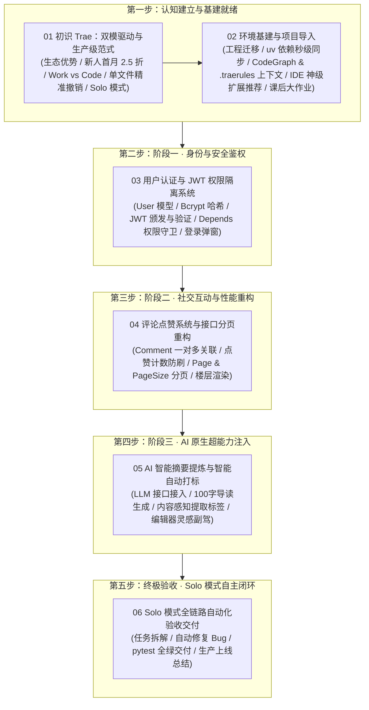

# 🚀 第六章：Trae 实战 —— 原生双模驱动与已有项目生产级二次开发

欢迎来到 **《Vibe Coding 极速通关》第六章：Trae 实战**！

在第五章中，我们体验了基于开源终端与多专家协同的 OpenCode 开发流，并落地了一套极简的全栈个人博客系统。而在本章，我们将聚焦当前最火爆、性价比极高且兼具跨端控制与编译器精准掌控力的新一代 AI IDE —— **Trae**！

> 💡 **打破“从零做玩具”的思维定式**：在企业日常开发中，极少有人天天从零搭建脚手架（“纯牛马全栈，说你呢”）。大部分真实任务要么是对已有遗留项目进行优化重构，要么是负责其中几个独立模块的开发。因此，本章我们将直接把第五章打磨好的**个人博客系统**导入 Trae 中，展开贴近工业级真实的“二次开发与演进实战”！

***

## 🌟 为什么说 Trae 是当前性价比与生产力的王道之选？

[Trae](https://www.trae.ai) 是由字节跳动推出的原生 AI 编程与工作流平台。它在继承 VSCode 强大生态的同时，带来了诸多革新性的生产力飞跃：

1. **双模引擎随心切（Work & Code）**：
   - **Trae Work**：不仅能写代码，还能做办公自动化、浏览器爬取与应用调度；
   - **Trae Code**：原汁原味的 VSCode 编译器体验，右侧专属 Agent 面板，支持精确到单文件的代码 Diff 审查与一键撤销。
2. **手机端跨设备远程操控**：
   - 手机端一键派发任务，桌面端防休眠持续推进，通勤路上也能享受 Vibe 心流；
3. **王牌 Solo 模式（自主 Agent 闭环）**：
   - 类似 Codex 的 Goal 模式，具备自主任务拆解、多轮推进执行、耗时看板与自省修复能力；
4. **超值新人福利与低成本试错**：
   - 每日签到免费领取可用额度，新人首月 Coding Plan 直接 2.5 折，真正为开发者省钱！

***

## 🧭 第六章全景知识图谱

***

## 📑 章节目录导航

点击下方链接逐一阅读各小节的保姆级图文教程与深度剖析：

1. **[6.1 初识 Trae：双模驱动、新人福利与生产级 IDE 新范式](./01_初识Trae：双模驱动、新人福利与生产级IDE新范式.md)**
   - 深入剖析为什么选 Trae 以及新人专属福利（每日签到领额度、首月 2.5 折 Coding Plan）；
   - 生动拆解 Trae Work（全能调度管家）与 Trae Code（高精密数字化手术台）的双模架构；
   - 揭秘 IDE 编译器相比纯终端的核心优势：可视化 Diff 审查与单文件精准撤销；
   - 领略王牌 Solo 模式的任务拆解、耗时看板与自主自省闭环；
   - 阐明为什么本章采用“已有项目二次开发”而非从零做玩具的实战心智。
2. **[6.2 环境基建与项目导入：在 Trae 中建立上下文与依赖安装](./02_环境基建与项目导入：在Trae中建立上下文与依赖安装.md)**
   - 项目工程无缝迁移（从 OpenCode 到 Trae）；
   - `uv` 极速依赖同步与测试基线验证（确保已有功能 100% 绿灯）；
   - 注入 Trae 专属规则大脑（`.traerules`）与 CodeGraph 语义图谱；
   - 针对初次使用 IDE 同学的 5 大新手神级扩展推荐（Live Server、Code Runner 等）；
   - 课后探索大作业（个性化配置、3 大杀手级功能脑暴与利用 AI 深度思考联网调研）。
3. **6.3 阶段一实战：用户认证与 JWT 权限隔离系统（火热更新中）**
4. **6.4 阶段二实战：评论与点赞社交系统 + 接口分页重构（火热更新中）**
5. **6.5 阶段三实战：AI 原生赋能（智能摘要提炼与自动打标）（火热更新中）**
6. **6.6 Solo 模式终极验收：全链路自动化测试与生产级交付（火热更新中）**

***

## 📂 配套资源与目录

- **[agents.md](./agents.md)**：本章节 Trae 专属规则与协作指南；
- **[img/](./img/)**：本章节高清实战配图与架构图解；
- **[project_01_个人博客系统二次开发/](./project_01_个人博客系统二次开发/)**：本章节配套全栈二次开发工程源码。

***

## 🔗 官方权威与学习资源

- **Trae 官方网站**：<https://www.trae.ai>
- **Trae 官方中文社区/文档**：<https://trae.cn/>
- **VSCode 官方扩展与生态**：<https://code.visualstudio.com/>
