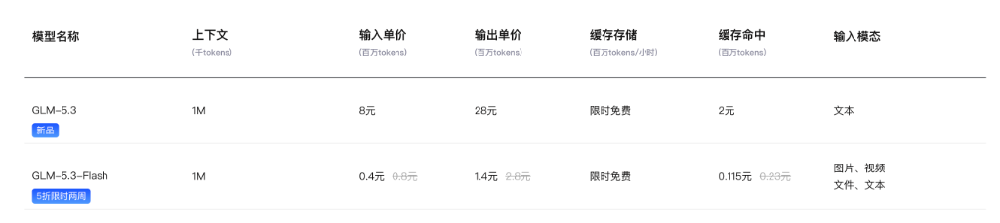
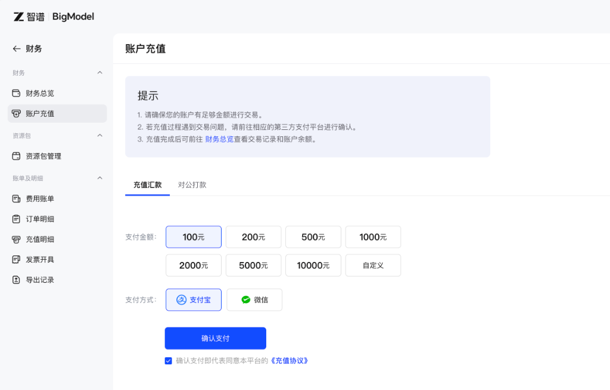
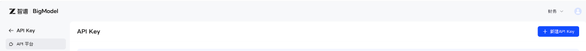

# 8.1 环境基建与模型接入：智谱 BigModel API 与原生客户端封装

> 本节先完成最基础的模型连接，并把请求、鉴权、超时、重试和降级这些运行条件放到可检查的代码中。

***

## 🧠 为什么手搓？为什么选择智谱 BigModel + GLM？

学习现代 AI 编程时，许多初学者会直接使用 LangChain、LlamaIndex 等框架。框架可以节省大量连接工作，但如果还不了解请求怎样发出、结果怎样返回，遇到鉴权、限流或协议错误时就很难判断问题发生在哪一层。

因此，本章先用较少的封装搭出 Agent。我们会查看发给模型的 JSON 数据，记录响应和错误，再逐步加入工具调用与运行循环。

<!-- 图表源文件：img/diagrams/01-diagram-01.mmd；视觉风格：Notion 简洁 -->
<p align="center">
  <a href="img/diagrams/01-diagram-01.svg">
    
  </a>
</p>

### 为什么底座大模型选用「智谱 BigModel + GLM」？

本章用 [智谱 BigModel](https://open.bigmodel.cn/) 作为教学示例，主要有三个原因：它提供公开的 API 文档；示例可以通过 OpenAI Python 客户端调用兼容接口；读者可以把 `base_url`、密钥和模型名替换为其他供应方，观察哪些代码属于通用层，哪些属于厂商差异。

正文中的模型名用于配合仓库代码演示，不代表长期推荐。模型能力、上下文长度和价格都会变化，运行前请在控制台核对当前可用型号和计费说明。后文还会接入第二个供应方，用来说明降级流程；这是一种教学设计，不等于接入两个模型就具备高可用能力。


## 🔑 智谱 BigModel 接入准备与密钥安全

在写代码之前，我们需要准备好接入凭证。只需简单三步：

### 1. 确认可用额度
访问 [智谱 BigModel 控制台](https://open.bigmodel.cn/)，查看账户的当前额度、模型权限与计费方式。调试时设置调用上限，并从最小请求开始，避免因循环或重试产生意外费用。



### 2. 创建 API Key
1. 进入 [智谱控制台 API Key 管理页面](https://bigmodel.cn/usercenter/proj-mgmt/apikeys)；
2. 点击右上角的 **「+ 新建 API Key」** 按钮；
3. 随便起一个好记的名字（例如 `my-vibe-agent`），点击确认；
4. **核心重点**：复制生成的 API Key（格式形如 `xxxxxxxxxxxxxxxx.yyyyyyyyyyyyyyyy`），务必妥善保存在本地备忘录中，切勿随意外传！



### 3. 配置环境与安全防泄露（对照官方文档，看懂每一项）
严禁将 API Key 直接硬编码在 Python 代码中！一旦误将带 Key 的代码提交到 GitHub，可能会被自动化爬虫盗刷。

我们通过 `.env` 环境变量来规范隔离密钥。在动手写配置之前，先花 1 分钟对照智谱官方 [API 快速开始文档](https://docs.bigmodel.cn/cn/api/introduction)，搞懂三个关键点——这也是"教学生如何配置"的标准姿势：

1. **API 端点（Base URL）**：智谱开放平台的通用 API 端点是 `https://open.bigmodel.cn/api/paas/v4`，我们在 `.env` 里写成 `https://open.bigmodel.cn/api/paas/v4/`（末尾加斜杠，是为了让底层 `openai` SDK 拼接 `/chat/completions` 时不出错）；
2. **身份验证（Bearer）**：开放平台使用标准 HTTP Bearer 认证，即请求头携带 `Authorization: Bearer YOUR_API_KEY`——这正是 SDK 里 `api_key` 参数背后的底层本质；
3. **模型名称（model）**：在请求体 `"model"` 字段填 `glm-5.3-flash` 或 `glm-5.3`，服务端据此路由到对应模型。

如果你不确定具体的参数格式，也可以参考官方 [结构化输出指南](https://docs.bigmodel.cn/cn/guide/capabilities/struct-output) 与 [Python SDK 指南](https://docs.bigmodel.cn/cn/guide/develop/python/introduction)，甚至**直接把 API 文档链接和你的需求发给 AI（如 ChatGPT、Claude、Cursor），让 AI 帮你一键生成配置文件**！

在项目目录中安装基础依赖：
```bash
pip install openai python-dotenv rich
```

在 `08_手搓Agent/code/` 目录下创建 `.env` 文件：
```ini
# ========================================================
# 🚀 智谱 BigModel (Zhipu AI) GLM 系列大模型服务配置
# 控制台地址: https://open.bigmodel.cn/
# API 文档: https://docs.bigmodel.cn/cn/api/introduction
# ========================================================

# 1. 智谱 API Key (从控制台新建并复制)
ZHIPU_API_KEY=your_zhipu_api_key_here

# 2. 智谱 OpenAI 兼容网关 Base URL (官方 API 端点, 末尾斜杠供 SDK 拼接)
ZHIPU_BASE_URL=https://open.bigmodel.cn/api/paas/v4/

# 3. 默认主力模型名称 (推荐极速高性价比的 glm-5.3-flash)
ZHIPU_MODEL=glm-5.3-flash

# 4. 智谱旗舰模型 (复杂推理可手动切换, 非灾备默认)
ZHIPU_FALLBACK_MODEL=glm-5.3

# ========================================================
# 🌋 火山方舟 (Volcano Ark) DeepSeek-V4-Flash 跨厂商灾备引擎
# 快速入门: https://www.volcengine.com/docs/82379/1399008
# API Key: https://console.volcengine.com/ark/region:cn-beijing/apiKey
# ========================================================

# 5. 火山方舟 API Key (以 ark 开头, 开通 deepseek-v4-flash 后创建)
ARK_API_KEY=your_ark_api_key_here

# 6. 火山方舟 OpenAI 兼容数据面 Base URL (固定地址)
ARK_BASE_URL=https://ark.cn-beijing.volces.com/api/v3

# 7. 默认灾备模型名称 (DeepSeek-V4-Flash, 1M 上下文、超低成本)
ARK_FALLBACK_MODEL=deepseek-v4-flash

# ========================================================
# ⏱️ 请求超时与高可用配置
# ========================================================
# 8. 单次请求超时时间 (秒)
TIMEOUT_SECONDS=60
```

并在 `.gitignore` 中确保 `.env` 已被添加：
```gitignore
.env
__pycache__/
*.pyc
```

### 4. 开通火山方舟灾备引擎（备用大脑的"通电"）
为了演示主模型出现网络抖动或超时后的处理方式，我们再接入一个备用服务——**火山方舟的 `deepseek-v4-flash`**，实现跨供应方降级。配置分为三步：

1. 注册并登录 [火山引擎控制台](https://console.volcengine.com/ark/)，进入**火山方舟**；
2. 在 [开通管理页面](https://console.volcengine.com/ark/region:cn-beijing/openManagement) 中开通 `deepseek-v4-flash` 模型服务（新用户通常有免费额度）；
3. 在 [API Key 管理页面](https://console.volcengine.com/ark/region:cn-beijing/apiKey) 创建专属 API Key（**以 `ark` 开头**），填入 `.env` 的 `ARK_API_KEY`。

> 📖 完整接入步骤参考火山方舟官方 [快速入门](https://www.volcengine.com/docs/82379/1399008) 与 [兼容 OpenAI SDK 文档](https://www.volcengine.com/docs/82379/1330626)。

***

## 📐 原生客户端架构与数据流设计

我们设计的原生客户端不仅要能发送普通文本，还要原生支持现代 Agent 的五项核心能力：
1. **流式打字机输出（Streaming Token）**：让终端像打字机一样逐字实时显示，极大提升人机交互体验；
2. **结构化与工具调用支持（Function Calling & Struct Output）**：原生透传 JSON Schema，并通过 `response_format={"type": "json_object"}` 开启结构化输出，配合智谱官方的 [结构化输出能力](https://docs.bigmodel.cn/cn/guide/capabilities/struct-output)，让模型稳定吐出符合预期的工具调用指令与严格 JSON；
3. **思考模式与思考等级（Thinking & Reasoning Effort）**：GLM-5.3 系列默认开启深度思考，通过 `thinking={"type": "enabled"}` 与 `reasoning_effort`（low / high / max）动态控制"用脑程度"，参考官方 [深度思考文档](https://docs.bigmodel.cn/cn/guide/capabilities/thinking)；
4. **Token 统计与上下文缓存命中率（Usage & Cache Hit Rate）**：每次调用自动解析 `usage` 得到输入/输出/总 token，并读取 `prompt_tokens_details.cached_tokens` 计算缓存命中率——智谱上下文缓存自动隐式生效，命中按更低价格计费，参考官方 [上下文缓存文档](https://docs.bigmodel.cn/cn/guide/capabilities/cache)；
5. **跨厂商双引擎自动灾备与降级（Auto Fallback）**：主力引擎使用智谱 `glm-5.3-flash`，当它遇到网络抖动或超时时，自动切换到火山方舟 `deepseek-v4-flash` 灾备引擎重试。**注意：这是两家不同厂商，Base URL 与 API Key 都不同，所以必须维护两个独立的客户端实例**，绝不能只改一个 `model` 字段就完事——否则就是"拿智谱的钥匙去开方舟的门"，必然报错。

<!-- 图表源文件：img/diagrams/01-diagram-02.mmd；视觉风格：GitHub Dark -->
<p align="center">
  <a href="img/diagrams/01-diagram-02.svg">
    
  </a>
</p>

***

## 💻 手搓实战：封装 `ZhipuGLMClient`

下面我们编写一个干净、健壮且生产可用的原生客户端模块 `zhipu_client.py`（也可以直接命名为 `s01_env_setup.py`）：

```python
# 08_手搓Agent/code/zhipu_client.py
import os
from typing import Generator, Dict, Any, List, Optional
from openai import OpenAI
from dotenv import load_dotenv
from rich.console import Console

# 加载 .env 环境变量
load_dotenv()

console = Console()

class ZhipuGLMClient:
    """🚀 双引擎高可用客户端封装器：主力智谱 GLM-5.3-Flash + 火山方舟 DeepSeek-V4-Flash 灾备

    底层基于 OpenAI 官方 SDK 规范：
      - 主力引擎: 直连智谱开放平台 (ZHIPU_BASE_URL)
      - 灾备引擎: 直连火山方舟 (ARK_BASE_URL)，跨厂商无缝降级
    """
    def __init__(
        self,
        api_key: Optional[str] = None,
        base_url: Optional[str] = None,
        default_model: Optional[str] = None,
        fallback_api_key: Optional[str] = None,
        fallback_base_url: Optional[str] = None,
        fallback_model: Optional[str] = None,
        timeout: float = 60.0,
    ):
        # —— 主力引擎配置（智谱 BigModel）——
        self.api_key = api_key or os.getenv("ZHIPU_API_KEY")
        self.base_url = base_url or os.getenv("ZHIPU_BASE_URL", "https://open.bigmodel.cn/api/paas/v4/")
        self.default_model = default_model or os.getenv("ZHIPU_MODEL", "glm-5.3-flash")

        # —— 灾备引擎配置（火山方舟 DeepSeek-V4-Flash）——
        self.fallback_api_key = fallback_api_key or os.getenv("ARK_API_KEY") or self.api_key
        self.fallback_base_url = fallback_base_url or os.getenv("ARK_BASE_URL", "https://ark.cn-beijing.volces.com/api/v3")
        self.fallback_model = fallback_model or os.getenv("ARK_FALLBACK_MODEL") or os.getenv("ZHIPU_FALLBACK_MODEL") or "deepseek-v4-flash"
        self.timeout = float(timeout or os.getenv("TIMEOUT_SECONDS", "60"))

        if not self.api_key:
            raise ValueError(
                "❌ 未检测到 ZHIPU_API_KEY！\n"
                "请先前往 https://open.bigmodel.cn/ 注册并创建 API Key，\n"
                "然后在 .env 文件中配置 ZHIPU_API_KEY=your_key_here。"
            )

        # 初始化基于标准 OpenAI 协议的两个底层 Client（两家厂商各一个）
        self.client = OpenAI(
            api_key=self.api_key,
            base_url=self.base_url,
            timeout=self.timeout,
            max_retries=2, # 自动退避重试 2 次
        )
        self.fallback_client = OpenAI(
            api_key=self.fallback_api_key,
            base_url=self.fallback_base_url,
            timeout=self.timeout,
            max_retries=2,
        )

    @staticmethod
    def parse_usage(response) -> Dict[str, Any]:
        """🧮 解析响应 usage：token 消耗 + 上下文缓存命中统计"""
        usage = getattr(response, "usage", None)
        if usage is None:
            return {}
        prompt = getattr(usage, "prompt_tokens", 0) or 0
        completion = getattr(usage, "completion_tokens", 0) or 0
        total = getattr(usage, "total_tokens", 0) or 0
        cached = 0
        details = getattr(usage, "prompt_tokens_details", None)
        if details:
            cached = getattr(details, "cached_tokens", 0) or 0
        return {
            "prompt_tokens": prompt,
            "completion_tokens": completion,
            "total_tokens": total,
            "cached_tokens": cached,
            "cache_hit_rate": round(cached / prompt * 100, 2) if prompt else 0.0,
        }

    def _log_usage(self, response, model: str):
        """🪵 打印 token 消耗与缓存命中率"""
        u = self.parse_usage(response)
        if not u:
            return
        console.print(
            f"[bold magenta]📊 Token 消耗 [{model}] 输入 {u['prompt_tokens']} / "
            f"输出 {u['completion_tokens']} / 总计 {u['total_tokens']}[/bold magenta] "
            f"[dim]缓存命中 {u['cached_tokens']}（命中率 {u['cache_hit_rate']}%）[/dim]"
        )

    def chat(
        self,
        messages: List[Dict[str, Any]],
        model: Optional[str] = None,
        temperature: float = 0.6,
        tools: Optional[List[Dict[str, Any]]] = None,
        tool_choice: Optional[str] = "auto",
        response_format: Optional[Dict[str, Any]] = None,
        thinking: Optional[Dict[str, Any]] = None,
        reasoning_effort: Optional[str] = None,
        show_usage: bool = True,
    ) -> Any:
        """💬 标准同步对话（支持工具调用 / 结构化输出 / 思考模式 / Token 统计 + 跨厂商自动降级）"""
        target_model = model or self.default_model
        kwargs: Dict[str, Any] = {
            "model": target_model,
            "messages": messages,
            "temperature": temperature,
        }
        if tools:
            kwargs["tools"] = tools
            kwargs["tool_choice"] = tool_choice
        if response_format:
            kwargs["response_format"] = response_format            # 结构化输出 JSON 模式
        extra_body: Dict[str, Any] = {}
        if thinking is not None:
            extra_body["thinking"] = thinking                      # 思考模式: {"type": "enabled"}
        if reasoning_effort:
            extra_body["reasoning_effort"] = reasoning_effort      # 思考等级: low / high / max
        if extra_body:
            kwargs["extra_body"] = extra_body                      # GLM 专属参数需走 extra_body

        try:
            resp = self.client.chat.completions.create(**kwargs)
            if show_usage:
                self._log_usage(resp, target_model)
            return resp
        except Exception as e:
            console.print(f"[bold yellow]⚠️ 主力引擎 {target_model} 调用异常: {e}[/bold yellow]")
            if self.fallback_model != target_model:
                console.print(f"[bold cyan]🔄 正在自动降级至火山方舟灾备引擎 {self.fallback_model}...[/bold cyan]")
                kwargs["model"] = self.fallback_model
                resp = self.fallback_client.chat.completions.create(**kwargs)
                if show_usage:
                    self._log_usage(resp, self.fallback_model)
                return resp
            raise e

    def chat_stream(
        self,
        messages: List[Dict[str, Any]],
        model: Optional[str] = None,
        temperature: float = 0.6,
        thinking: Optional[Dict[str, Any]] = None,
        reasoning_effort: Optional[str] = None,
        include_usage: bool = True,
    ) -> Generator[str, None, None]:
        """🔤 流式打字机输出（逐字吐出正文，末尾自动打印 Token/缓存统计）"""
        target_model = model or self.default_model
        kwargs: Dict[str, Any] = {
            "model": target_model,
            "messages": messages,
            "temperature": temperature,
            "stream": True,
        }
        extra_body: Dict[str, Any] = {}
        if thinking is not None:
            extra_body["thinking"] = thinking
        if reasoning_effort:
            extra_body["reasoning_effort"] = reasoning_effort
        if extra_body:
            kwargs["extra_body"] = extra_body
        if include_usage:
            kwargs["stream_options"] = {"include_usage": True}     # 让流式末尾 chunk 带回 usage

        try:
            stream = self.client.chat.completions.create(**kwargs)
            for chunk in stream:
                if chunk.choices and chunk.choices[0].delta.content:
                    yield chunk.choices[0].delta.content
                elif include_usage and getattr(chunk, "usage", None):
                    self._log_usage(chunk, target_model)   # 最后一个 chunk 携带 usage
        except Exception as e:
            console.print(f"[bold red]❌ 主力引擎流式响应中断:[/bold red] {e}")
            if self.fallback_model != target_model:
                console.print(f"[bold cyan]🔄 正在切换至火山方舟灾备引擎 {self.fallback_model} 流式输出...[/bold cyan]")
                kwargs["model"] = self.fallback_model
                stream = self.fallback_client.chat.completions.create(**kwargs)
                for chunk in stream:
                    if chunk.choices and chunk.choices[0].delta.content:
                        yield chunk.choices[0].delta.content
                    elif include_usage and getattr(chunk, "usage", None):
                        self._log_usage(chunk, self.fallback_model)
                return
            raise e
```

***

## 🧪 验证与自测：跑通你的第一个原生调用

我们编写一个自测脚本 `test_connection.py`，分别测试**基础同步对话**与**流式打字机效果**：

```python
# 08_手搓Agent/code/test_connection.py
from zhipu_client import ZhipuGLMClient
from rich.console import Console
from rich.panel import Panel
from rich.markdown import Markdown

console = Console()

def test_basic_chat():
    console.print(Panel("[bold green]🧪 测试 1：基础同步对话 (GLM-5.3-Flash)[/bold green]", border_style="green"))
    client = ZhipuGLMClient()
    
    messages = [
        {"role": "system", "content": "你是一个严谨幽默的资深 AI 架构师。"},
        {"role": "user", "content": "用一句话解释什么是 Agent 的第一性原理？"}
    ]
    
    response = client.chat(messages=messages)
    content = response.choices[0].message.content
    console.print(Panel(Markdown(content), title="[bold cyan]智谱 GLM 回复[/bold cyan]", border_style="cyan"))

def test_streaming_chat():
    console.print(Panel("[bold green]🧪 测试 2：流式打字机逐字输出[/bold green]", border_style="green"))
    client = ZhipuGLMClient()
    
    messages = [
        {"role": "system", "content": "你是一个热心耐心的编程导师。"},
        {"role": "user", "content": "请用生动的比喻，向小白解释为什么写代码需要版本控制 (Git)？"}
    ]
    
    console.print("[bold yellow]🤖 Agent 正在思考并逐字作答：[/bold yellow]\n")
    for token in client.chat_stream(messages=messages):
        # 实时逐字输出到终端
        print(token, end="", flush=True)
    print("\n")

if __name__ == "__main__":
    try:
        test_basic_chat()
        test_streaming_chat()
        console.print("[bold green]🎉 智谱 BigModel (GLM-5.3-Flash) 环境联调成功！[/bold green]")
    except Exception as err:
        console.print(f"[bold red]⚠️ 自测遇到问题，请检查 .env 配置:[/bold red] {err}")
```

运行输出效果：
```
╭─ 🧪 测试 1：基础同步对话 (GLM-5.3-Flash) ────────────╮
│ Agent 的第一性原理，就是把“只能说不能做”的大脑模型，     │
│ 通过工具调用、环境反馈与自愈循环，武装成“能看、能干、能排错” │
│ 的完整行动实体。                                     │
╰────────────────────────────────────────────────────╯
```

***

## 🧬 进阶深化：模型无关的 Provider 抽象层（参考 Pi 的 pi-ai）

当你的 Agent 需要在 `glm-5.3-flash`（日常快节奏执行）、`glm-5.3`（高难度规划）、`deepseek` 或其他供应商之间动态切换时，如果每个模型都硬写一套客户端，代码会迅速失控。工业级 Agent 的第一层往往是一个 **模型无关的 Provider 抽象层**——这正是 [Pi Agent](https://github.com/earendil-works/pi) 架构最底层的 `pi-ai`（统一 40+ 家供应商的 LLM 流式 API）的设计精髓：

```python
class ProviderRouter:
    """🔄 模型无关的路由器：按模型名动态切换底层客户端，实现"一处调用、任意模型" """
    def __init__(self):
        self.providers = {}   # 模型名 -> 客户端实例

    def register(self, name: str, client: ZhipuGLMClient):
        self.providers[name] = client

    def chat(self, messages, model_name="glm-5.3-flash", **kw):
        client = self.providers[model_name]
        return client.chat(messages, **kw)   # 上层业务完全不感知底层切换

# 使用示例：在任务流转中按需热切换模型（智谱主力 + 方舟灾备 + 旗舰）
router = ProviderRouter()
router.register("glm-5.3-flash", ZhipuGLMClient(default_model="glm-5.3-flash"))
router.register("glm-5.3", ZhipuGLMClient(default_model="glm-5.3"))
router.register("deepseek-v4-flash", ZhipuGLMClient(
    api_key=os.getenv("ARK_API_KEY"),
    base_url=os.getenv("ARK_BASE_URL"),
    default_model="deepseek-v4-flash",
))
```

- **模型热切换（Model Cycling）**：遇到高难度架构设计任务时使用旗舰模型 `glm-5.3` 深入推演，日常工具调用与快节奏任务切回 `glm-5.3-flash` 省钱提速，智谱不可用时再切到火山方舟 `deepseek-v4-flash` 兜底；
- **重试与退避（Retry & Backoff）**：在客户端内部封装"指数退避 + 随机抖动"重试，避免突发高频请求打满 API 限流；跨厂商降级则是应对"整家厂商故障"的最后一层保险。

***

## 接入成功，需要逐层确认

拿到一段模型回复，只能说明最短链路已经通了。Agent 还依赖工具调用、流式事件、超时和重试，最好把检查拆成四层：先确认环境变量和地址，再确认模型名与权限，然后验证普通对话，最后验证工具调用和流式中断。每次只更改一项配置，错误来自哪一层就会清楚许多。

切换供应商时，还应统一记录请求编号、模型名、耗时和错误类型。密钥只用于鉴权，不应进入日志。降级也不能悄悄发生：若主模型失败后换了另一家模型，结果中应留下记录，否则质量变化很难解释。

## 📝 本节小结与核心收获

1. **看清请求链路**：我们使用 `openai` 客户端连接智谱 BigModel 开放平台，理解了 Base URL、Bearer 鉴权与 `model` 字段的作用；
2. **保留模型替换能力**：型号与价格不写死在业务逻辑中，切换前通过控制台核对当前信息；
3. **跨厂商双引擎灾备**：把火山方舟 `deepseek-v4-flash` 设为默认降级引擎，确立了 `.env` 环境变量防泄露隔离规范，封装了具备**跨厂商自动降级**与流式打字机特性的 `ZhipuGLMClient`。

---

现在，我们的大脑中枢与网络通信已经就绪！下一步，我们将给大脑植入最核心的思考范式——**[8.2 ReAct 思考范式：手写 Thought-Action-Observation 极简闭环](02_ReAct思考范式.md)**！
